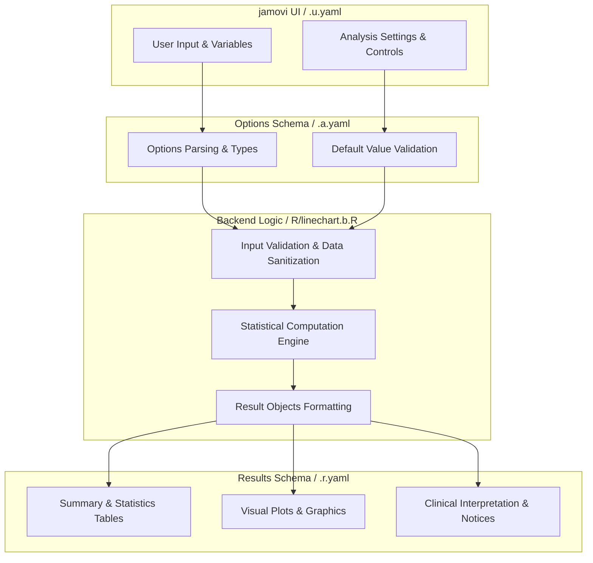
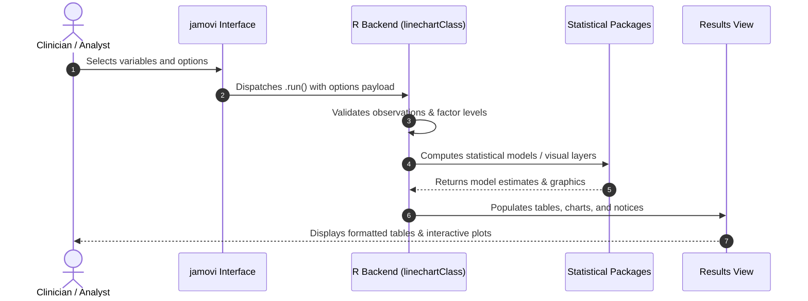

# Line Chart - Developer Documentation

## 1. Overview

- **Function**: `linechart`
- **Title**: Line Chart
- **Module**: `JJStatsPlotT`
- **Files**:
  - `jamovi/linechart.u.yaml` - User Interface Definition
  - `jamovi/linechart.a.yaml` - Options & Schema Definition
  - `jamovi/linechart.r.yaml` - Results Layout & Tables
  - `R/linechart.b.R` - Backend Implementation
- **Summary**: Creates line charts for time series analysis and trend visualization, with support for multiple groups, confidence intervals, and statistical overlays.

## 1a. Changelog

- **Date**: 2026-08-29
- **Summary**: Comprehensive documentation suite created & verified against active schemas and backend implementation.

## 2. Options Reference (`.a.yaml`)

| Option | Type | Default | Description |
| :--- | :--- | :--- | :--- |
| `data` | `Data` | `NULL` |  |
| `xvar` | `Variable` | `NULL` | X-axis Variable |
| `yvar` | `Variable` | `NULL` | Y-axis Variable |
| `groupby` | `Variable` | `NULL` | Group By |
| `confidence` | `Bool` | `FALSE` | Confidence interval |
| `trendline` | `Bool` | `FALSE` | Trend line |
| `points` | `Bool` | `TRUE` | Points |
| `smooth` | `Bool` | `FALSE` | Smooth line |
| `showRefline` | `Bool` | `FALSE` | Reference line |
| `refline` | `Number` | `0` | Reference Line Value |
| `reflineLabel` | `String` | `Reference` | Reference Line Label |
| `colorPalette` | `List` | `default` | Color Palette |
| `theme` | `List` | `default` | Plot Theme |
| `xlabel` | `String` | `` | X-axis Label |
| `ylabel` | `String` | `` | Y-axis Label |
| `title` | `String` | `` | Plot Title |
| `width` | `Integer` | `800` | Plot Width |
| `height` | `Integer` | `600` | Plot Height |

## 3. Results Definition (`.r.yaml`)

| Output ID | Type | Title | Description |
| :--- | :--- | :--- | :--- |
| `todo` | `Html` | `Instructions` |  |
| `naturalSummary` | `Html` | `Summary` |  |
| `summary` | `Table` | `Data Summary` |  |
| `correlation` | `Table` | `Correlation Analysis` |  |
| `assumptions` | `Html` | `Statistical Assumptions & Guidelines` |  |
| `plot` | `Image` | ``Line Chart: {yvar} by {xvar}`` |  |

## 4. Architecture & Data Flow Diagram

```mermaid
flowchart TD
  subgraph UI[jamovi UI / .u.yaml]
    U1[User Input & Variables]
    U2[Analysis Settings & Controls]
  end

  subgraph Opts[Options Schema / .a.yaml]
    O1[Options Parsing & Types]
    O2[Default Value Validation]
  end

  subgraph Backend[Backend Logic / R/linechart.b.R]
    B1[Input Validation & Data Sanitization]
    B2[Statistical Computation Engine]
    B3[Result Objects Formatting]
  end

  subgraph Res[Results Schema / .r.yaml]
    R1[Summary & Statistics Tables]
    R2[Visual Plots & Graphics]
    R3[Clinical Interpretation & Notices]
  end

  U1 --> O1
  U2 --> O2
  O1 --> B1
  O2 --> B1
  B1 --> B2
  B2 --> B3
  B3 --> R1
  B3 --> R2
  B3 --> R3
```

## 5. Execution Sequence

```mermaid
sequenceDiagram
  autonumber
  actor User as Clinician / Analyst
  participant UI as jamovi Interface
  participant Backend as R Backend (linechartClass)
  participant Engine as Statistical Packages
  participant Results as Results View

  User->>UI: Selects variables and options
  UI->>Backend: Dispatches .run() with options payload
  Backend->>Backend: Validates observations & factor levels
  Backend->>Engine: Computes statistical models / visual layers
  Engine-->>Backend: Returns model estimates & graphics
  Backend->>Results: Populates tables, charts, and notices
  Results-->>User: Displays formatted tables & interactive plots
```

## 6. Change Impact & Safety Guidelines

- **Data Filtering**: Ensure observations with missing values are handled gracefully according to analysis options.
- **Formula Conflicts**: Use isolated environment calls or base formula methods when interacting with `ggstatsplot` or formula parsers.
- **Safe Deparsing**: Use `deparse(val)` in syntax generation (`asSource()`) to escape column names with spaces or special symbols.

