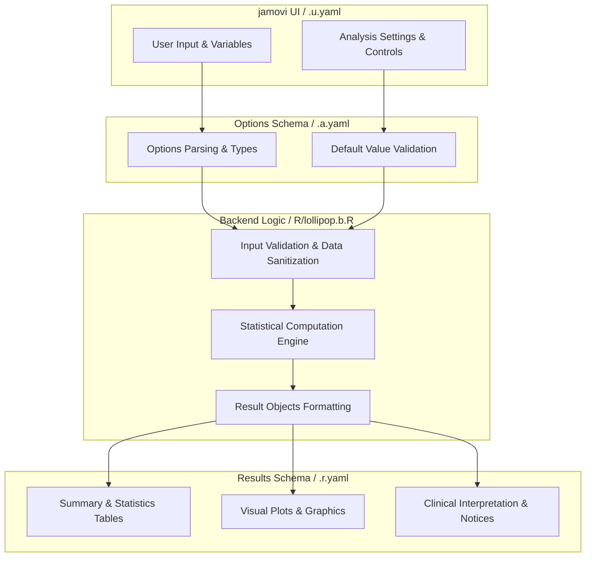
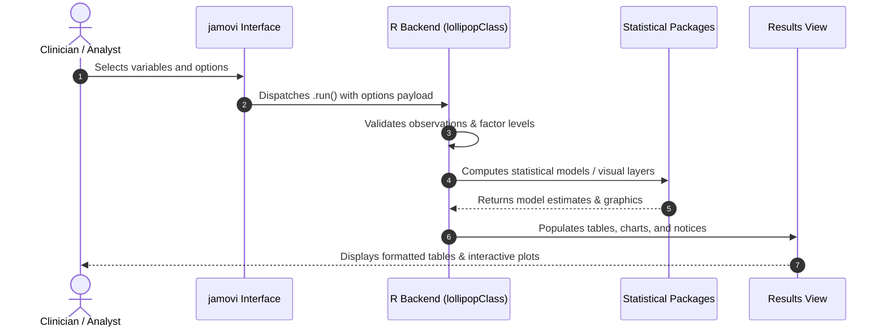

# Lollipop Chart - Developer Documentation

## 1. Overview

- **Function**: `lollipop`
- **Title**: Lollipop Chart
- **Module**: `JJStatsPlotT`
- **Files**:
  - `jamovi/lollipop.u.yaml` - User Interface Definition
  - `jamovi/lollipop.a.yaml` - Options & Schema Definition
  - `jamovi/lollipop.r.yaml` - Results Layout & Tables
  - `R/lollipop.b.R` - Backend Implementation
- **Summary**: Creates lollipop charts for categorical data visualization following R Graph Gallery best practices, with emphasis on clinical applications like patient timelines, treatment outcomes, and biomarker comparisons. Uses geom_segment() and geom_point() for optimal visual presentation.

## 1a. Changelog

- **Date**: 2026-08-29
- **Summary**: Comprehensive documentation suite created & verified against active schemas and backend implementation.

## 2. Options Reference (`.a.yaml`)

| Option | Type | Default | Description |
| :--- | :--- | :--- | :--- |
| `data` | `Data` | `NULL` |  |
| `dep` | `Variable` | `NULL` | Dependent Variable |
| `group` | `Variable` | `NULL` | Grouping Variable |
| `useHighlight` | `Bool` | `FALSE` | Use highlight |
| `highlight` | `Level` | `NULL` | Highlight Level |
| `aggregation` | `List` | `none` | Data Aggregation |
| `sortBy` | `List` | `original` | Sort Order |
| `orientation` | `List` | `vertical` | Orientation |
| `showValues` | `Bool` | `FALSE` | Values |
| `showMean` | `Bool` | `FALSE` | Mean line |
| `colorScheme` | `List` | `default` | Color Scheme |
| `theme` | `List` | `default` | Plot Theme |
| `pointSize` | `Number` | `3` | Point Size |
| `lineWidth` | `Number` | `1` | Line Width |
| `lineType` | `List` | `solid` | Line Type |
| `baseline` | `Number` | `0` | Baseline Value |
| `conditionalColor` | `Bool` | `FALSE` | Conditional coloring |
| `colorThreshold` | `Number` | `0` | Color Threshold |
| `xlabel` | `String` | `` | X-axis Label |
| `ylabel` | `String` | `` | Y-axis Label |
| `title` | `String` | `` | Plot Title |
| `width` | `Integer` | `800` | Plot Width |
| `height` | `Integer` | `600` | Plot Height |

## 3. Results Definition (`.r.yaml`)

| Output ID | Type | Title | Description |
| :--- | :--- | :--- | :--- |
| `notices` | `Preformatted` | `Important Information` |  |
| `todo` | `Html` | `Instructions` |  |
| `summary` | `Table` | `Data Summary` |  |
| `plot` | `Image` | ``Lollipop Chart {dep} vs {group}`` |  |

## 4. Architecture & Data Flow Diagram

## 5. Execution Sequence

## 6. Change Impact & Safety Guidelines

- **Data Filtering**: Ensure observations with missing values are handled gracefully according to analysis options.
- **Formula Conflicts**: Use isolated environment calls or base formula methods when interacting with `ggstatsplot` or formula parsers.
- **Safe Deparsing**: Use `deparse(val)` in syntax generation (`asSource()`) to escape column names with spaces or special symbols.

