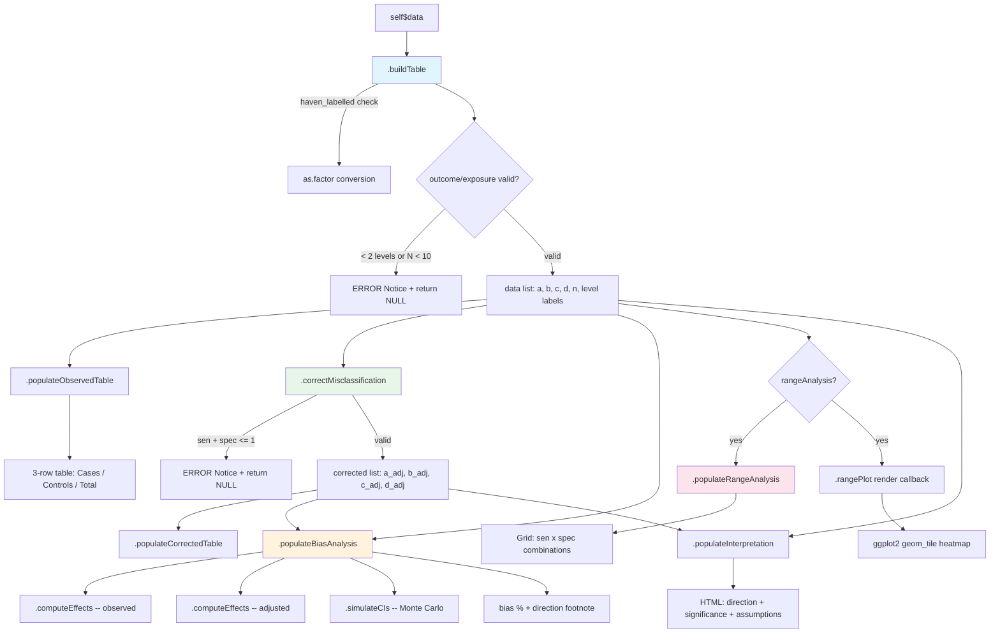
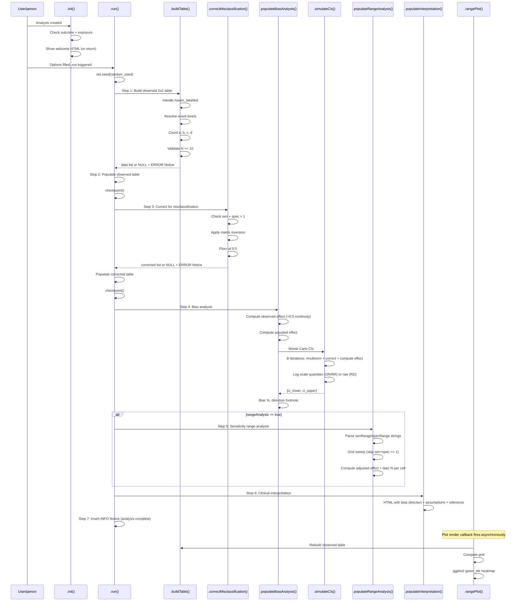

# Misclassification Bias Sensitivity Analysis (`misclassificationbias`) -- Developer Documentation

> **Module:** meddecide (menuGroup: `meddecideT`)
> **Submenu:** Decision Support
> **Version:** 0.0.37
> **Dependencies:** base R + `ggplot2` (no external statistical packages)

---

## 1. Overview

`misclassificationbias` quantifies how classification errors in an exposure or diagnostic test distort observed effect estimates (OR, RR, RD). It applies matrix inversion correction to recover the "true" 2x2 table from observed counts, then uses Monte Carlo multinomial resampling to construct confidence intervals for the bias-adjusted estimate. This is essential for any study relying on subjective classification methods -- Ki-67 visual estimation, morphologic grading, IHC scoring -- where inter-observer variability is a known source of systematic error.

**Capabilities:**

| Feature | Description |
|---|---|
| Observed 2x2 table | Cross-tabulates outcome x exposure with marginals |
| Matrix inversion correction | Recovers true cell counts given classifier sensitivity/specificity |
| Non-differential mode | Same error rates in cases and controls |
| Differential mode | Separate sensitivity/specificity for cases vs controls |
| Effect measures | Odds Ratio, Risk Ratio, Risk Difference |
| Monte Carlo CIs | Multinomial resampling with misclassification correction (1K--100K iterations) |
| Bias percentage | Log-scale (OR/RR) or absolute-scale (RD) quantification |
| Sensitivity range analysis | Grid sweep across user-defined sen/spec values |
| Heatmap plot | Tile plot of adjusted effect across the sen/spec grid |
| Clinical interpretation | HTML report with bias direction, assumptions, and reference |

**File inventory:**

| File | Path | Purpose |
|---|---|---|
| Analysis definition | `jamovi/misclassificationbias.a.yaml` | 17 options, menu placement |
| Results definition | `jamovi/misclassificationbias.r.yaml` | 7 output items |
| UI definition | `jamovi/misclassificationbias.u.yaml` | 4 UI panels |
| Backend | `R/misclassificationbias.b.R` | R6 class, ~515 lines |
| Header (auto) | `R/misclassificationbias.h.R` | Generated from YAML |
| Test data script | `data-raw/create_misclassificationbias_test_data.R` | Creates 2 datasets |
| Test data | `data/misclassbias_ki67.rda` | 200 rows, 4 cols (non-differential) |
| Test data | `data/misclassbias_p53.rda` | 150 rows, 2 cols (differential) |
| Tests | `tests/testthat/test-misclassificationbias.R` | 8 test blocks |

---

## 2. UI Controls to Options Map

The UI (`.u.yaml`) is organized into 4 collapsible panels plus top-level variable selectors.

| UI Panel | Widget Type | Option Name | a.yaml Type |
|---|---|---|---|
| *(top level)* | VariablesListBox | `outcome` | Variable |
| *(top level)* | LevelSelector | `outcomeLevel` | Level |
| *(top level)* | VariablesListBox | `exposure` | Variable |
| *(top level)* | LevelSelector | `exposureLevel` | Level |
| Classification Error Parameters | ComboBox | `misclassType` | List |
| Classification Error Parameters | TextBox | `senExposure` | Number |
| Classification Error Parameters | TextBox | `specExposure` | Number |
| Classification Error Parameters | TextBox | `senExposureCase` | Number |
| Classification Error Parameters | TextBox | `specExposureCase` | Number |
| Classification Error Parameters | TextBox | `senExposureControl` | Number |
| Classification Error Parameters | TextBox | `specExposureControl` | Number |
| Analysis Options | ComboBox | `effectMeasure` | List |
| Sensitivity Range Analysis | CheckBox | `rangeAnalysis` | Bool |
| Sensitivity Range Analysis | TextBox | `senRange` | String |
| Sensitivity Range Analysis | TextBox | `specRange` | String |
| Simulation Options | TextBox | `nSimulations` | Integer |
| Simulation Options | TextBox | `random_seed` | Integer |

**Enable conditions (from `.u.yaml`):**

- `outcomeLevel` enabled when `outcome` is set
- `exposureLevel` enabled when `exposure` is set
- `senExposure`, `specExposure` enabled when `misclassType == 'nondifferential'`
- `senExposureCase`, `specExposureCase`, `senExposureControl`, `specExposureControl` enabled when `misclassType == 'differential'`
- `senRange`, `specRange` enabled when `rangeAnalysis == true`

---

## 3. Options Reference (17 options)

| # | Name | Type | Default | Constraints | Description |
|---|---|---|---|---|---|
| 1 | `data` | Data | -- | -- | Input data frame |
| 2 | `outcome` | Variable | -- | suggested: nominal/ordinal; permitted: factor | Binary outcome (e.g., recurrence, death) |
| 3 | `outcomeLevel` | Level | -- | variable: (outcome) | Level considered the event |
| 4 | `exposure` | Variable | -- | suggested: nominal/ordinal; permitted: factor | Binary classifier subject to misclassification |
| 5 | `exposureLevel` | Level | -- | variable: (exposure) | Level considered positive/exposed |
| 6 | `misclassType` | List | `nondifferential` | nondifferential, differential | Whether error rates differ by outcome group |
| 7 | `senExposure` | Number | 0.85 | [0.01, 1.0] | Classifier sensitivity (non-differential mode) |
| 8 | `specExposure` | Number | 0.90 | [0.01, 1.0] | Classifier specificity (non-differential mode) |
| 9 | `senExposureCase` | Number | 0.85 | [0.01, 1.0] | Sensitivity among cases (differential mode) |
| 10 | `specExposureCase` | Number | 0.90 | [0.01, 1.0] | Specificity among cases (differential mode) |
| 11 | `senExposureControl` | Number | 0.85 | [0.01, 1.0] | Sensitivity among controls (differential mode) |
| 12 | `specExposureControl` | Number | 0.90 | [0.01, 1.0] | Specificity among controls (differential mode) |
| 13 | `effectMeasure` | List | `or` | or, rr, rd | Effect measure to compute and bias-adjust |
| 14 | `rangeAnalysis` | Bool | true | -- | Sweep across sen/spec grid with heatmap |
| 15 | `senRange` | String | `"0.70,0.75,0.80,0.85,0.90,0.95"` | Comma-separated | Sensitivity grid values |
| 16 | `specRange` | String | `"0.70,0.75,0.80,0.85,0.90,0.95"` | Comma-separated | Specificity grid values |
| 17 | `nSimulations` | Integer | 10000 | [1000, 100000] | Monte Carlo iterations for CIs |
| 18 | `random_seed` | Integer | 42 | [1, 999999] | Seed for reproducibility |

---

## 4. Backend Architecture

### 4.1 Private Methods

| Method | Lines (approx) | Called From | Purpose |
|---|---|---|---|
| `.init()` | 15--34 | jamovi engine | Welcome HTML with instructions or early return when variables unset |
| `.run()` | 36--83 | jamovi engine | 7-step orchestration pipeline with checkpoints |
| `.buildTable()` | 88--155 | `.run()` step 1 | Extract columns, handle `haven_labelled`, resolve event levels, build 2x2 counts (a/b/c/d), validate N >= 10 |
| `.correctMisclassification()` | 160--219 | `.run()` step 3 | Matrix inversion correction with `sen + spec > 1` guard; floors cells at 0.5 |
| `.computeEffects()` | 225--230 | multiple | Compute OR, RR, RD from four cell counts |
| `.simulateCIs()` | 235--284 | `.populateBiasAnalysis()` | Monte Carlo: multinomial resample, apply correction per iteration, 2.5/97.5% quantiles on log scale (OR/RR) or raw scale (RD) |
| `.populateObservedTable()` | 289--300 | `.run()` step 2 | 3-row table: Cases, Controls, Total |
| `.populateCorrectedTable()` | 302--308 | `.run()` step 3 | 2-row table with corrected (non-integer) cell counts |
| `.populateBiasAnalysis()` | 310--349 | `.run()` step 4 | Computes observed vs adjusted effect, bias %, calls `.simulateCIs()`, sets direction footnote |
| `.populateRangeAnalysis()` | 352--395 | `.run()` step 5 | Grid of all sen x spec combinations where sen + spec > 1 |
| `.populateInterpretation()` | 397--453 | `.run()` step 6 | HTML report: bias direction, clinical significance, key assumptions, reference |
| `.rangePlot()` | 458--513 | render callback | `ggplot2::geom_tile()` heatmap with diverging color scale and text labels |

### 4.2 How Each Option is Consumed

| Option | Backend usage |
|---|---|
| `outcome` | `.buildTable()` -- extracts column from `self$data`, converts `haven_labelled` |
| `outcomeLevel` | `.buildTable()` -- defines the event row; defaults to 2nd sorted level |
| `exposure` | `.buildTable()` -- extracts classifier column |
| `exposureLevel` | `.buildTable()` -- defines "exposed" column; defaults to 2nd sorted level |
| `misclassType` | `.correctMisclassification()` + `.simulateCIs()` -- switches between shared vs separate error rates |
| `senExposure` | `.correctMisclassification()`, `.simulateCIs()` -- non-differential sensitivity |
| `specExposure` | `.correctMisclassification()`, `.simulateCIs()` -- non-differential specificity |
| `senExposureCase` | `.correctMisclassification()`, `.simulateCIs()` -- differential sensitivity in cases |
| `specExposureCase` | `.correctMisclassification()`, `.simulateCIs()` -- differential specificity in cases |
| `senExposureControl` | `.correctMisclassification()`, `.simulateCIs()` -- differential sensitivity in controls |
| `specExposureControl` | `.correctMisclassification()`, `.simulateCIs()` -- differential specificity in controls |
| `effectMeasure` | `.populateBiasAnalysis()`, `.populateRangeAnalysis()`, `.rangePlot()` -- selects OR/RR/RD |
| `rangeAnalysis` | `.run()` gate -- conditionally calls `.populateRangeAnalysis()` |
| `senRange` | `.populateRangeAnalysis()`, `.rangePlot()` -- parsed via `strsplit(",")` |
| `specRange` | `.populateRangeAnalysis()`, `.rangePlot()` -- parsed via `strsplit(",")` |
| `nSimulations` | `.simulateCIs()` -- loop iteration count |
| `random_seed` | `.run()` -- `set.seed()` at top of pipeline |

### 4.3 Matrix Inversion Correction

The core correction formula (non-differential case):

```
n1 = a + b  (total cases)
a_adj = (a - n1 * (1 - spec)) / (sen + spec - 1)
b_adj = n1 - a_adj
```

This is derived from the misclassification model: if the observed exposure count among cases is `a_obs = a_true * sen + (n1 - a_true) * (1 - spec)`, solving for `a_true` yields the formula above. The denominator `sen + spec - 1` must be positive (i.e., the classifier must do better than random) for the correction to be valid.

For differential misclassification, the same formula is applied separately to cases (using `senExposureCase`/`specExposureCase`) and controls (using `senExposureControl`/`specExposureControl`).

Corrected cells are floored at 0.5 to avoid negative counts from extreme correction parameters.

### 4.4 Monte Carlo Confidence Intervals

1. Resample observed 2x2 table via `rmultinom(1, n, probs)` where `probs = c(a, b, c, d) / n`
2. Add 0.5 continuity correction to each cell
3. Apply the same matrix inversion correction as the point estimate
4. Compute the selected effect measure
5. Repeat `nSimulations` times
6. For OR/RR: take 2.5th and 97.5th percentiles on the **log scale**, then exponentiate
7. For RD: take percentiles on the raw scale
8. Require at least 100 valid simulations; return NA otherwise

### 4.5 Plot State Management

The range plot (`.rangePlot()`) does not use `image$setState()`. Instead, it rebuilds the observed 2x2 table by calling `.buildTable()` directly from the render callback, then computes the grid on-the-fly. This avoids protobuf serialization issues but means the computation runs twice (once in `.run()` for the table, once in the render callback for the plot).

| Plot | State approach | Implementation notes |
|---|---|---|
| `rangeplot` | Stateless (recomputes) | Calls `.buildTable()` + grid sweep; returns `FALSE` to skip when variables unset |

**Render function** receives `(image, ggtheme, theme, ...)` and returns `TRUE` on success, `FALSE` to skip.

---

## 5. Results Definition (7 output items)

| # | Name | Type | Visibility | Columns / Dimensions |
|---|---|---|---|---|
| 1 | `todo` | Html | always | Welcome instructions or error messages |
| 2 | `observedTable` | Table | always | `label` (text), `exposed` (integer), `unexposed` (integer), `total` (integer) |
| 3 | `biasAnalysis` | Table | always | `estimate_type` (text), `observed` (zto), `adjusted` (zto), `ci_lower` (zto, superTitle: 95% CI), `ci_upper` (zto, superTitle: 95% CI), `bias_pct` (zto) |
| 4 | `correctedTable` | Table | always | `label` (text), `exposed` (zto), `unexposed` (zto) |
| 5 | `rangeTable` | Table | `rangeAnalysis` | `sensitivity` (zto), `specificity` (zto), `adjusted_effect` (zto), `bias_pct` (zto) |
| 6 | `rangeplot` | Image | `rangeAnalysis` | 700x500, renderFun: `.rangePlot` |
| 7 | `interpretation` | Html | always | Clinical interpretation with bias direction and assumptions |

### clearWith Dependencies

| Output group | clearWith options |
|---|---|
| `todo`, `observedTable` | `outcome`, `exposure`, `outcomeLevel`, `exposureLevel` |
| `correctedTable` | + `senExposure`, `specExposure`, `senExposureCase`, `specExposureCase`, `senExposureControl`, `specExposureControl`, `misclassType` |
| `biasAnalysis` | all correction params + `effectMeasure`, `nSimulations`, `random_seed` |
| `rangeTable`, `rangeplot` | `outcome`, `exposure`, `outcomeLevel`, `exposureLevel`, `senRange`, `specRange`, `effectMeasure`, `misclassType` |
| `interpretation` | all correction params + `effectMeasure` |

---

## 6. Data Flow Diagram



### Data list structure (returned by `.buildTable()`)

```
list(
  a              = integer  -- cases & exposed
  b              = integer  -- cases & unexposed
  c              = integer  -- controls & exposed
  d              = integer  -- controls & unexposed
  n              = integer  -- total (a + b + c + d)
  outcome_event  = character -- event level label
  outcome_ref    = character -- reference level label
  exposure_pos   = character -- positive/exposed level label
  exposure_neg   = character -- negative/unexposed level label
)
```

### Corrected list structure (returned by `.correctMisclassification()`)

```
list(
  a = numeric  -- corrected cases & exposed (may be non-integer)
  b = numeric  -- corrected cases & unexposed
  c = numeric  -- corrected controls & exposed
  d = numeric  -- corrected controls & unexposed
)
```

---

## 7. Execution Sequence



---

## 8. Notice Catalog

The backend uses `jmvcore::Notice` objects inserted via `self$results$insert()`. There are 5 distinct notices.

| Name | Type | Trigger | Content |
|---|---|---|---|
| `binaryRequired` | ERROR | `.buildTable()`: outcome or exposure has < 2 levels | "Both outcome and exposure must have at least 2 levels. Check your variable selections." |
| `tooFewObs` | ERROR | `.buildTable()`: N < 10 after filtering | "Too few complete observations (N). Need at least 10." |
| `invalidParams` | ERROR | `.correctMisclassification()`: sen + spec <= 1 (non-differential) | "Sensitivity (X) + Specificity (Y) = Z must be > 1 for bias correction to be valid." |
| `invalidDiffParams` | ERROR | `.correctMisclassification()`: sen + spec <= 1 in either group (differential) | "Sensitivity + Specificity must be > 1 in both cases and controls for bias correction to be valid." |
| `analysisComplete` | INFO | End of `.run()` | "Misclassification bias analysis completed: {measure} corrected for {type} misclassification (N=X, Sen=Y, Spec=Z)." |

Additionally, `haven_labelled` vectors are silently converted to factors in `.buildTable()` (no notice emitted).

**Known limitation:** These use `self$results$insert()` with `jmvcore::Notice` objects, which contain function references that may fail protobuf serialization. See `CLAUDE.md` for the migration path to HTML-based notices.

---

## 9. Bias Analysis Methods

### 9.1 Non-Differential Misclassification

Error rates are the same in cases and controls. This is the more common assumption and **always biases ratio measures (OR, RR) toward the null** when both sensitivity and specificity are < 1.

**Correction formula:**
```
a_adj = (a_obs - n_cases * (1 - spec)) / (sen + spec - 1)
b_adj = n_cases - a_adj
c_adj = (c_obs - n_controls * (1 - spec)) / (sen + spec - 1)
d_adj = n_controls - c_adj
```

### 9.2 Differential Misclassification

Error rates differ between cases and controls (e.g., pathologists may be more vigilant when examining known cancer specimens). This can bias the estimate in **either direction** -- toward or away from the null.

Uses `senExposureCase`/`specExposureCase` for the case row and `senExposureControl`/`specExposureControl` for the control row.

### 9.3 Effect Measures

| Measure | Formula | Null value | Bias % formula |
|---|---|---|---|
| Odds Ratio (OR) | `(a * d) / (b * c)` | 1.0 | `(ln(OR_obs) - ln(OR_adj)) / |ln(OR_adj)| * 100` |
| Risk Ratio (RR) | `(a/(a+b)) / (c/(c+d))` | 1.0 | `(ln(RR_obs) - ln(RR_adj)) / |ln(RR_adj)| * 100` |
| Risk Difference (RD) | `a/(a+b) - c/(c+d)` | 0.0 | `(RD_obs - RD_adj) / |RD_adj| * 100` |

A 0.5 continuity correction is added to all cells before computing the observed (crude) effect. Corrected cells are already floored at 0.5 during the matrix inversion step.

### 9.4 Direction of Bias Footnote

For OR/RR, the `biasAnalysis` table includes a footnote:
- If `|ln(obs)| > |ln(adj)|`: "Non-differential misclassification biased the effect TOWARD the null (attenuated)."
- Otherwise: "Misclassification biased the effect AWAY from the null (exaggerated)."

### 9.5 Sensitivity Range Analysis

Parses comma-separated values from `senRange` and `specRange`, creates the Cartesian product, and for each combination where `sen + spec > 1`:
1. Applies the correction formula
2. Computes the adjusted effect measure
3. Computes bias % relative to the observed value

The heatmap uses a diverging blue-white-red color scale centered at the null value (1 for OR/RR, 0 for RD).

---

## 10. Change Impact Guide

| Change | Files to modify | Recompile? | Notes |
|---|---|---|---|
| Add new option | `.a.yaml`, `.u.yaml`, `.b.R` | Yes (`jmvtools::prepare()`) | `.h.R` regenerated |
| Add new output table | `.r.yaml`, `.b.R` | Yes | Add populate method + clearWith |
| Add new effect measure | `.a.yaml` (effectMeasure options), `.b.R` (`.computeEffects()`, all populate methods) | Yes | Update switch statements in 4+ locations |
| Change correction formula | `.b.R` only (`.correctMisclassification()` + `.simulateCIs()`) | No | Must update both methods consistently |
| Add outcome misclassification | `.a.yaml` (new options), `.u.yaml`, `.b.R` (new correction branch) | Yes | Currently only corrects exposure misclassification |
| Add probabilistic bias analysis | `.b.R` (`.simulateCIs()` -- add prior distributions on sen/spec) | No | Currently uses fixed sen/spec per simulation |
| Convert Notices to HTML | `.r.yaml` (add Html item), `.b.R` (replace `insert()`) | Yes | Follow `waterfall.b.R` pattern; see CLAUDE.md |
| Add new plot type (e.g., forest plot) | `.r.yaml` (Image item), `.b.R` (render function) | Yes | |
| Change heatmap color scale | `.b.R` only (`.rangePlot()`) | No | |
| Support > 2 levels | `.b.R` (`.buildTable()` restructure) | No | Would require polytomous correction; significant rework |

---

## 11. Example Usage

### 11.1 From R Console (Non-Differential)

```r
data(misclassbias_ki67, package = "ClinicoPath")

# Ki-67 visual estimation: sen=0.82, spec=0.88
result <- misclassificationbias(
    data = misclassbias_ki67,
    outcome = "recurrence",
    outcomeLevel = "Recurrence",
    exposure = "ki67_grade",
    exposureLevel = "High_Ki67",
    misclassType = "nondifferential",
    senExposure = 0.82,
    specExposure = 0.88,
    effectMeasure = "or",
    nSimulations = 10000
)

# View observed vs corrected
result$observedTable$asDF
result$correctedTable$asDF

# View bias-adjusted OR with Monte Carlo CI
result$biasAnalysis$asDF
```

### 11.2 Differential Misclassification (p53 IHC)

```r
data(misclassbias_p53, package = "ClinicoPath")

# Pathologists better at detecting aberrant p53 in NEC (sen=0.90)
# than in NET G3 (sen=0.85); specificity also differs
result <- misclassificationbias(
    data = misclassbias_p53,
    outcome = "diagnosis",
    outcomeLevel = "PanNEC",
    exposure = "p53_status",
    exposureLevel = "Aberrant",
    misclassType = "differential",
    senExposureCase = 0.90,
    specExposureCase = 0.85,
    senExposureControl = 0.85,
    specExposureControl = 0.90,
    effectMeasure = "or"
)

result$biasAnalysis$asDF
```

### 11.3 Risk Ratio with Range Analysis

```r
data(misclassbias_ki67, package = "ClinicoPath")

result <- misclassificationbias(
    data = misclassbias_ki67,
    outcome = "recurrence",
    outcomeLevel = "Recurrence",
    exposure = "ki67_grade",
    exposureLevel = "High_Ki67",
    effectMeasure = "rr",
    rangeAnalysis = TRUE,
    senRange = "0.60,0.70,0.80,0.90,1.00",
    specRange = "0.60,0.70,0.80,0.90,1.00"
)

# Grid of adjusted RR across sen/spec combinations
result$rangeTable$asDF
```

### 11.4 Minimal Smoke Test

```r
d <- data.frame(
    outcome = factor(c(rep("Alive", 60), rep("Dead", 40))),
    exposure = factor(c(rep("Low", 30), rep("High", 30),
                        rep("Low", 20), rep("High", 20)))
)
result <- misclassificationbias(
    data = d,
    outcome = "outcome",
    outcomeLevel = "Dead",
    exposure = "exposure",
    exposureLevel = "High",
    senExposure = 0.85,
    specExposure = 0.90,
    rangeAnalysis = FALSE,
    nSimulations = 1000
)
result$biasAnalysis$asDF
```

---

## 12. Appendix

### A. Table Schemas

#### observedTable (3 rows)

| label | exposed | unexposed | total |
|---|---|---|---|
| Cases (Recurrence) | 65 | 35 | 100 |
| Controls (No_Recurrence) | 28 | 72 | 100 |
| Total | 93 | 107 | 200 |

#### correctedTable (2 rows)

| label | exposed | unexposed |
|---|---|---|
| Cases | 72.86 | 27.14 |
| Controls | 17.14 | 82.86 |

Note: Corrected cells are non-integer because they represent estimated true counts.

#### biasAnalysis (1 row)

| estimate_type | observed | adjusted | ci_lower | ci_upper | bias_pct |
|---|---|---|---|---|---|
| Odds Ratio | 4.775 | 12.954 | 6.321 | 29.874 | -41.2 |

Negative bias % means the observed effect is attenuated relative to the corrected value.

#### rangeTable (variable rows)

| sensitivity | specificity | adjusted_effect | bias_pct |
|---|---|---|---|
| 0.70 | 0.70 | 18.642 | -54.3 |
| 0.70 | 0.80 | 14.231 | -47.1 |
| ... | ... | ... | ... |
| 0.95 | 0.95 | 5.412 | -5.8 |

### B. Test Dataset Reference

#### `misclassbias_ki67` (200 rows, 4 columns)

Simulates Ki-67 visual estimation inter-observer variability with known misclassification rates (true sen=0.82, spec=0.88).

| Column | Type | Description |
|---|---|---|
| `recurrence` | factor | No_Recurrence / Recurrence (outcome) |
| `ki67_grade` | factor | Low_Ki67 / High_Ki67 (misclassified exposure) |
| `age` | integer | Patient age (~N(62, 12)) |
| `tumor_stage` | factor | I / II / III (35/40/25%) |

#### `misclassbias_p53` (150 rows, 2 columns)

Simulates p53 IHC scoring with differential misclassification between PanNET G3 and PanNEC.

| Column | Type | Description |
|---|---|---|
| `diagnosis` | factor | PanNET_G3 / PanNEC (outcome) |
| `p53_status` | factor | Normal / Aberrant (differentially misclassified exposure) |

### C. References

- Lash TL, Fox MP, Fink AK (2009). *Applying Quantitative Bias Analysis to Epidemiologic Data*. Springer.
- Jurek AM, Greenland S, Maldonado G, Church TR (2005). Proper interpretation of non-differential misclassification effects: expectations vs observations. *Int J Epidemiol*, 34(3):680-7.
- Greenland S (1980). The effect of misclassification in the presence of covariates. *Am J Epidemiol*, 112(4):564-9.
- Fox MP, Lash TL, Greenland S (2005). A method to automate probabilistic sensitivity analyses of misclassified binary variables. *Int J Epidemiol*, 34(6):1370-6.
