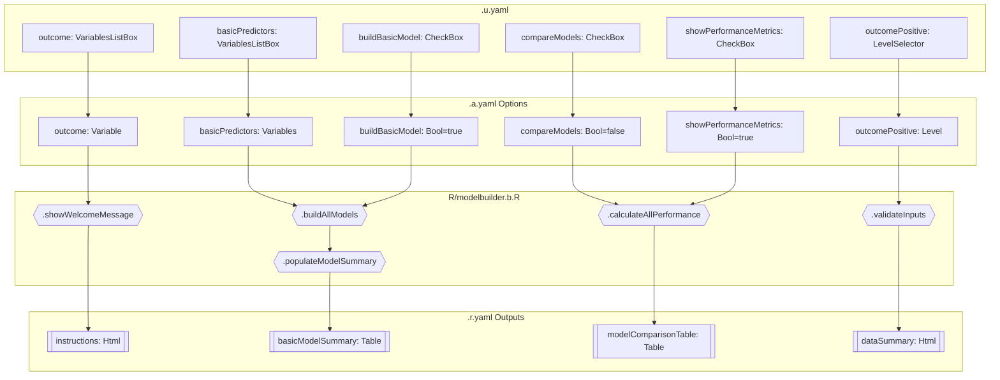
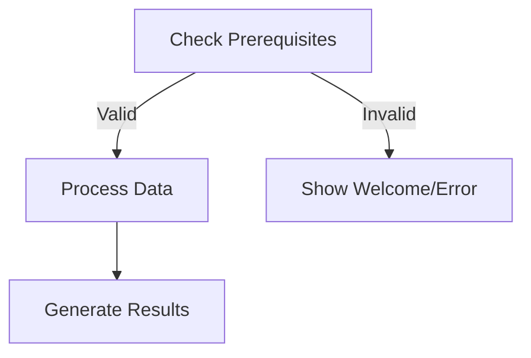
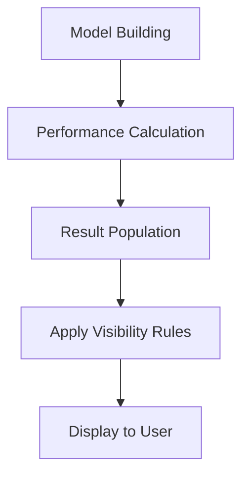
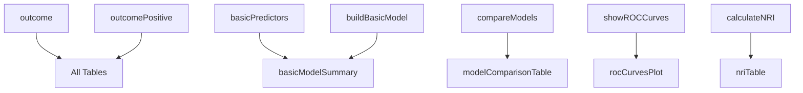

# Jamovi Function Documentation: modelbuilder

## 1. Overview

- **Function**: `modelbuilder`
- **Files**:
  - `jamovi/modelbuilder.u.yaml` — UI
  - `jamovi/modelbuilder.a.yaml` — Options
  - `R/modelbuilder.b.R` — Backend
  - `jamovi/modelbuilder.r.yaml` — Results
- **Summary**: A comprehensive clinical prediction model builder that creates multiple logistic regression models optimized for integration with Decision Curve Analysis. The function supports building up to four different types of models (Basic Clinical, Enhanced Clinical, Biomarker, and Custom) with advanced validation, performance assessment, and clinical interpretation features.

## 2. UI Controls → Options Map

| UI Control | Type | Label | Binds to Option | Defaults & Constraints | Visibility/Enable Rules |
|------------|------|-------|-----------------|------------------------|-------------------------|
| outcome | VariablesListBox | Outcome Variable | outcome | maxItemCount: 1 | Always visible |
| outcomePositive | LevelSelector | Positive Outcome Level | outcomePositive | - | enable: (outcome) |
| basicPredictors | VariablesListBox | Basic Clinical Variables | basicPredictors | - | Always visible |
| enhancedPredictors | VariablesListBox | Enhanced Clinical Variables | enhancedPredictors | - | Always visible |
| biomarkerPredictors | VariablesListBox | Biomarker Variables | biomarkerPredictors | - | Always visible |
| customPredictors | VariablesListBox | Custom Variables | customPredictors | - | Always visible |
| clinicalPreset | ComboBox | Choose a clinical preset | clinicalPreset | default: none | Always visible |
| splitData | CheckBox | Split data for validation | splitData | default: false | Always visible |
| randomSeed | TextBox | Random seed | randomSeed | default: 123, format: number | enable: (splitData) |
| missingDataMethod | ComboBox | Missing data strategy | missingDataMethod | default: complete_cases | Always visible |
| imputationSets | TextBox | Number of imputation sets | imputationSets | default: 5, format: number | enable: (missingDataMethod:multiple_imputation) |
| buildBasicModel | CheckBox | Build basic clinical model | buildBasicModel | default: true | Always visible |
| basicModelName | TextBox | Model display name | basicModelName | default: "basic_model", format: string | enable: (buildBasicModel) |
| buildEnhancedModel | CheckBox | Build enhanced clinical model | buildEnhancedModel | default: false | Always visible |
| enhancedModelName | TextBox | Model display name | enhancedModelName | default: "enhanced_model", format: string | enable: (buildEnhancedModel) |
| buildBiomarkerModel | CheckBox | Build biomarker model | buildBiomarkerModel | default: false | Always visible |
| biomarkerModelName | TextBox | Model display name | biomarkerModelName | default: "biomarker_model", format: string | enable: (buildBiomarkerModel) |
| buildCustomModel | CheckBox | Build custom model | buildCustomModel | default: false | Always visible |
| customModelName | TextBox | Model display name | customModelName | default: "custom_model", format: string | enable: (buildCustomModel) |
| penalizedRegression | CheckBox | Use penalized regression | penalizedRegression | default: false | Always visible |
| penaltyType | ComboBox | Penalty method | penaltyType | default: lasso | enable: (penalizedRegression) |
| transformVariables | CheckBox | Transform continuous variables | transformVariables | default: false | Always visible |
| transformMethod | ComboBox | Transformation type | transformMethod | default: log | enable: (transformVariables) |
| includeInteractions | CheckBox | Include interaction terms | includeInteractions | default: false | Always visible |
| interactionTerms | TextBox | Specific interactions | interactionTerms | default: "", format: string | enable: (includeInteractions) |
| useStepwise | CheckBox | Automatic variable selection | useStepwise | default: false | Always visible |
| stepwiseDirection | ComboBox | Selection method | stepwiseDirection | default: both | enable: (useStepwise) |
| selectionCriterion | ComboBox | Selection criterion | selectionCriterion | default: aic | enable: (useStepwise) |
| crossValidation | CheckBox | Perform k-fold cross-validation | crossValidation | default: false | Always visible |
| cvFolds | TextBox | Number of folds | cvFolds | default: 5, format: number | enable: (crossValidation) |
| bootstrapValidation | CheckBox | Perform bootstrap validation | bootstrapValidation | default: false | Always visible |
| bootstrapReps | TextBox | Bootstrap replications | bootstrapReps | default: 1000, format: number | enable: (bootstrapValidation) |
| calculateNRI | CheckBox | Net Reclassification Index | calculateNRI | default: false | Always visible |
| nriThresholds | TextBox | Risk thresholds | nriThresholds | default: "0.05, 0.10, 0.20", format: string | enable: (calculateNRI) |
| calculateIDI | CheckBox | Integrated Discrimination Index | calculateIDI | default: false | Always visible |
| showModelSummary | CheckBox | Show model coefficients | showModelSummary | default: true | Always visible |
| showPerformanceMetrics | CheckBox | Show performance metrics | showPerformanceMetrics | default: true | Always visible |
| compareModels | CheckBox | Model comparison table | compareModels | default: false | Always visible |
| showROCCurves | CheckBox | ROC curves for discrimination | showROCCurves | default: false | Always visible |
| showCalibrationPlots | CheckBox | Calibration plots | showCalibrationPlots | default: false | Always visible |
| createPredictions | CheckBox | Add predictions to dataset | createPredictions | default: false | Always visible |
| exportForDCA | CheckBox | Prepare for Decision Curve Analysis | exportForDCA | default: false | Always visible |
| generateRiskScore | CheckBox | Generate clinical risk score | generateRiskScore | default: false | Always visible |
| riskScorePoints | ComboBox | Point system complexity | riskScorePoints | default: simple | enable: (generateRiskScore) |

## 3. Options Reference (.a.yaml)

### Core Model Configuration
- **outcome** / Variable / none - Binary outcome variable to predict (disease presence, adverse event occurrence)
- **outcomePositive** / Level / none - Which level represents the positive case
- **clinicalPreset** / List / "none" - Predefined clinical scenarios with optimized settings

### Model Types
- **buildBasicModel** / Bool / true - Build basic clinical model using demographic and primary risk factors
- **buildEnhancedModel** / Bool / false - Build enhanced model with additional clinical variables  
- **buildBiomarkerModel** / Bool / false - Build model incorporating biomarkers or advanced diagnostics
- **buildCustomModel** / Bool / false - Build custom model with user-specified variables

### Variable Selection
- **basicPredictors** / Variables / [] - Variables for basic clinical model (age, sex, primary risk factors)
- **enhancedPredictors** / Variables / [] - Variables for enhanced model (includes basic plus additional)
- **biomarkerPredictors** / Variables / [] - Variables for biomarker model (clinical plus biomarkers)  
- **customPredictors** / Variables / [] - Variables for custom model

### Data Processing
- **splitData** / Bool / false - Split data into training (70%) and validation (30%) sets
- **randomSeed** / Number / 123 - Random seed for reproducibility (1-99999)
- **missingDataMethod** / List / "complete_cases" - Method for handling missing data
- **imputationSets** / Number / 5 - Number of imputation sets (3-20)

### Advanced Modeling
- **penalizedRegression** / Bool / false - Use penalized regression (LASSO/Ridge)
- **penaltyType** / List / "lasso" - Type of penalty (lasso, ridge, elastic_net)
- **transformVariables** / Bool / false - Apply automatic transformations 
- **transformMethod** / List / "log" - Transformation type (log, polynomial, spline)
- **includeInteractions** / Bool / false - Include two-way interactions
- **interactionTerms** / String / "" - Specific interactions (e.g., "age*sex")
- **useStepwise** / Bool / false - Use stepwise variable selection
- **stepwiseDirection** / List / "both" - Direction (both, forward, backward)
- **selectionCriterion** / List / "aic" - Selection criterion (aic, bic)

### Validation Options  
- **crossValidation** / Bool / false - Perform k-fold cross-validation
- **cvFolds** / Number / 5 - Number of CV folds (3-10)
- **bootstrapValidation** / Bool / false - Perform bootstrap validation
- **bootstrapReps** / Number / 1000 - Bootstrap replications (100-5000)

### Output Control
- **showModelSummary** / Bool / true - Display regression coefficients
- **showPerformanceMetrics** / Bool / true - Display AUC, calibration metrics
- **compareModels** / Bool / false - Side-by-side model comparison
- **showROCCurves** / Bool / false - Display ROC curves
- **showCalibrationPlots** / Bool / false - Display calibration plots
- **createPredictions** / Bool / false - Add predicted probabilities to dataset
- **exportForDCA** / Bool / false - Format output for Decision Curve Analysis

### Advanced Metrics
- **calculateNRI** / Bool / false - Calculate Net Reclassification Index
- **nriThresholds** / String / "0.05, 0.10, 0.20" - Risk thresholds for NRI
- **calculateIDI** / Bool / false - Calculate Integrated Discrimination Index
- **generateRiskScore** / Bool / false - Create integer risk score for clinical use
- **riskScorePoints** / List / "simple" - Risk score method (framingham, simple, deciles)

## 4. Backend Usage (.b.R)

### Initialization and Welcome Message
- **Location**: `.init()`, `.showWelcomeMessage()`
- **Logic**: Displays welcome instructions when no outcome selected or no variables specified for enabled models
- **Result Population**: `self$results$instructions$setContent()`

### Data Validation and Preparation
- **Location**: `.validateInputs()`, `.validateAndPrepareData()`
- **Uses**: `outcome`, `outcomePositive`, all predictor variables
- **Logic**: Converts multi-level outcomes to binary, validates sample sizes, checks for missing data
- **Result Population**: `self$results$dataSummary$setContent()`

### Model Building
- **Location**: `.buildAllModels()`
- **Uses**: `buildBasicModel`, `buildEnhancedModel`, `buildBiomarkerModel`, `buildCustomModel`
- **Logic**: Conditionally builds each model type based on enabled flags and available variables
- **Result Population**: Model summary tables via `.populateModelSummary()`

### Performance Calculation  
- **Location**: `.calculateAllPerformance()`
- **Uses**: `showPerformanceMetrics`, `compareModels`
- **Logic**: Calculates AUC, calibration metrics, comparison statistics
- **Result Population**: `self$results$modelComparisonTable`

### Advanced Validation
- **Location**: `.performAllCrossValidation()`, `.performBootstrapValidation()`
- **Uses**: `crossValidation`, `cvFolds`, `bootstrapValidation`, `bootstrapReps`
- **Logic**: Performs robust validation procedures when enabled
- **Result Population**: `self$results$validationResults`

### Advanced Metrics
- **Location**: `.calculateAdvancedMetrics()`
- **Uses**: `calculateNRI`, `calculateIDI`, `nriThresholds`
- **Logic**: Computes model improvement metrics comparing enhanced to basic models
- **Result Population**: `self$results$nriTable`, `self$results$idiTable`

### Data Export and Risk Scores
- **Location**: `.addPredictionsToDataset()`, `.generateAllRiskScores()`
- **Uses**: `createPredictions`, `exportForDCA`, `generateRiskScore`, `riskScorePoints`
- **Logic**: Adds predicted probabilities to dataset, creates clinical risk scores
- **Result Population**: `self$results$riskScoreTable`, `self$results$dcaReadyMessage`

## 5. Results Definition (.r.yaml)

### HTML Outputs
- **instructions** - Instructions and welcome message (Html, always visible)
- **clinicalGuidance** - Clinical best practices guidance (Html, always visible)
- **dataSummary** - Summary of dataset characteristics (Html, always visible)
- **clinicalSummary** - Clinical interpretation summary (Html, always visible)
- **glossary** - Statistical terms for clinicians (Html, always visible)
- **dcaReadyMessage** - Decision Curve Analysis preparation message (Html, visible when createPredictions=true)
- **reportSentences** - Copy-ready report sentences (Html, always visible)
- **exportOptions** - Export options summary (Html, always visible)

### Model Summary Tables
- **basicModelSummary** - Basic Clinical Model coefficients (Table, visible when buildBasicModel && showModelSummary)
- **enhancedModelSummary** - Enhanced Clinical Model coefficients (Table, visible when buildEnhancedModel && showModelSummary)  
- **biomarkerModelSummary** - Biomarker Model coefficients (Table, visible when buildBiomarkerModel && showModelSummary)
- **customModelSummary** - Custom Model coefficients (Table, visible when buildCustomModel && showModelSummary)

**Schema**: term (text), estimate (number), std_error (number), z_value (number), p_value (number), odds_ratio (number), ci_lower (number), ci_upper (number)

### Performance Tables
- **modelComparisonTable** - Model Performance Comparison (Table, visible when compareModels && showPerformanceMetrics)
**Schema**: model (text), n_predictors (integer), auc_training (number), auc_validation (number), calibration_slope (number), calibration_intercept (number), brier_score (number), log_likelihood (number), aic (number), bic (number)

- **validationResults** - Cross-Validation Results (Table, visible when crossValidation)
**Schema**: model (text), cv_auc_mean (number), cv_auc_sd (number), cv_calibration_slope (number), cv_brier_score (number), optimism (number)

- **nriTable** - Net Reclassification Index (Table, visible when calculateNRI)
**Schema**: comparison (text), nri_events (number), nri_non_events (number), nri_overall (number), nri_p_value (number)

- **idiTable** - Integrated Discrimination Index (Table, visible when calculateIDI)
**Schema**: comparison (text), idi (number), idi_p_value (number), discrimination_slope_new (number), discrimination_slope_old (number)

- **riskScoreTable** - Clinical Risk Score (Table, visible when generateRiskScore)
**Schema**: variable (text), category (text), points (integer), coefficient (number), interpretation (text)

### Plot Outputs
- **rocCurvesPlot** - ROC Curves Comparison (Image 600x450, visible when showROCCurves)
- **calibrationPlotsArray** - Calibration Plots (Array of Images 500x400, visible when showCalibrationPlots)
- **modelComparisonPlot** - Model Performance Comparison (Image 700x500, visible when compareModels)
- **validationPlot** - Cross-Validation Results (Image 600x450, visible when crossValidation || bootstrapValidation)

### DCA Integration
- **dcaPreparationSummary** - Decision Curve Analysis Preparation (Html, visible when exportForDCA)

## 6. Data Flow Diagram (UI → Options → Backend → Results)



## 7. Execution Sequence (User Action → Results)

### User Input Flow


### Decision Logic



### Result Processing



**Step-by-step execution flow:**

1. **User interacts with UI controls** → Variable selection, model type enablement, option configuration
2. **Backend validation** → `.showWelcomeMessage()` checks prerequisites, displays instructions if incomplete
3. **Data preparation** → `.validateAndPrepareData()` handles missing data, converts multi-level outcomes to binary
4. **Model building** → `.buildAllModels()` creates logistic regression models based on enabled types
5. **Performance assessment** → `.calculateAllPerformance()` computes AUC, calibration, comparison metrics
6. **Advanced validation** → Cross-validation and bootstrap procedures if enabled
7. **Results population** → Updates result objects based on visibility conditions
8. **Display application** → Shows tables, plots, and HTML content per user selections

### Dependency Graph



## 8. Change Impact Guide

### Key Option Changes

**outcome/outcomePositive**
- **If changed**: All models recalculate, all performance metrics update, all tables clear
- **Common pitfalls**: Multi-level outcomes require specifying positive level, missing outcome data causes zero events
- **Recommended defaults**: Binary variables preferred, ensure adequate event rate (>10 events per predictor)

**Model building options (buildBasicModel, etc.)**
- **If changed**: Corresponding model tables show/hide, comparison metrics recalculate
- **Common pitfalls**: Enabling model without selecting variables shows empty results
- **Recommended defaults**: Start with basic model, add complexity gradually

**compareModels**  
- **If changed**: Model comparison table and plots show/hide, requires multiple models enabled
- **Performance implications**: Minimal - only affects display, not computation
- **Recommended defaults**: Enable when building multiple models for comparison

**crossValidation/bootstrapValidation**
- **If changed**: Significant computational overhead, validation tables/plots appear
- **Performance implications**: High - can increase analysis time 5-10x
- **Recommended defaults**: Enable for final model validation, not exploratory analysis

**createPredictions/exportForDCA**
- **If changed**: Adds predicted probability columns to dataset
- **Common pitfalls**: Large datasets may experience memory issues
- **Recommended defaults**: Enable only when needed for subsequent Decision Curve Analysis

## 9. Example Usage

### Example Dataset Requirements
- **Binary outcome variable** (e.g., disease_status with levels "Present"/"Absent")
- **Mixed predictor variables** (continuous: age, bmi; categorical: sex, stage)
- **Minimum sample size**: 50+ observations, 10+ events per predictor
- **Missing data handling**: <20% missing preferred for stable results

### Example Option Payload
```yaml
outcome: disease_status
outcomePositive: Present
basicPredictors: [age, sex, bmi]
buildBasicModel: true
buildBiomarkerModel: true
biomarkerPredictors: [age, sex, bmi, biomarker_A, biomarker_B]
splitData: true
compareModels: true
showPerformanceMetrics: true
crossValidation: true
cvFolds: 5
```

### Expected Outputs
- **Basic Clinical Model table** with coefficients, odds ratios, confidence intervals
- **Biomarker Model table** with enhanced variable set
- **Model Comparison table** showing AUC, calibration metrics for both models
- **Cross-Validation Results** with optimism-corrected performance estimates
- **Clinical Guidance** with sample size recommendations and interpretation tips

## 10. Appendix (Schemas & Snippets)

### Model Summary Table Schema
```yaml
columns:
  - name: term (text) - Variable name
  - name: estimate (number) - Regression coefficient  
  - name: std_error (number) - Standard error
  - name: z_value (number) - Z-statistic
  - name: p_value (number) - P-value
  - name: odds_ratio (number) - Odds ratio
  - name: ci_lower (number) - 95% CI lower bound
  - name: ci_upper (number) - 95% CI upper bound
```

### Performance Comparison Schema
```yaml  
columns:
  - name: model (text) - Model name
  - name: n_predictors (integer) - Number of variables
  - name: auc_training (number) - Training AUC
  - name: auc_validation (number) - Validation AUC
  - name: calibration_slope (number) - Calibration slope
  - name: calibration_intercept (number) - Calibration intercept  
  - name: brier_score (number) - Brier score
  - name: log_likelihood (number) - Log-likelihood
  - name: aic (number) - AIC value
  - name: bic (number) - BIC value
```

### Key Code Snippets

**Option Access Pattern**:
```r
outcome_var <- self$options$outcome
outcome_positive <- self$options$outcomePositive
basic_predictors <- self$options$basicPredictors
```

**Result Population Pattern**:
```r
self$results$basicModelSummary$setRow(rowNo=1, values=list(
    term="age", 
    estimate=0.05, 
    std_error=0.01,
    p_value=0.001
))
```

**Conditional Logic Pattern**:
```r
if (self$options$buildBasicModel && length(self$options$basicPredictors) > 0) {
    # Build and populate basic model
    private$.buildModel("basic", basic_predictors)
}
```