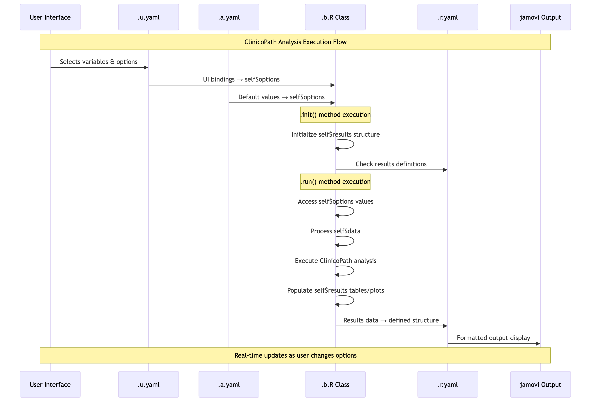
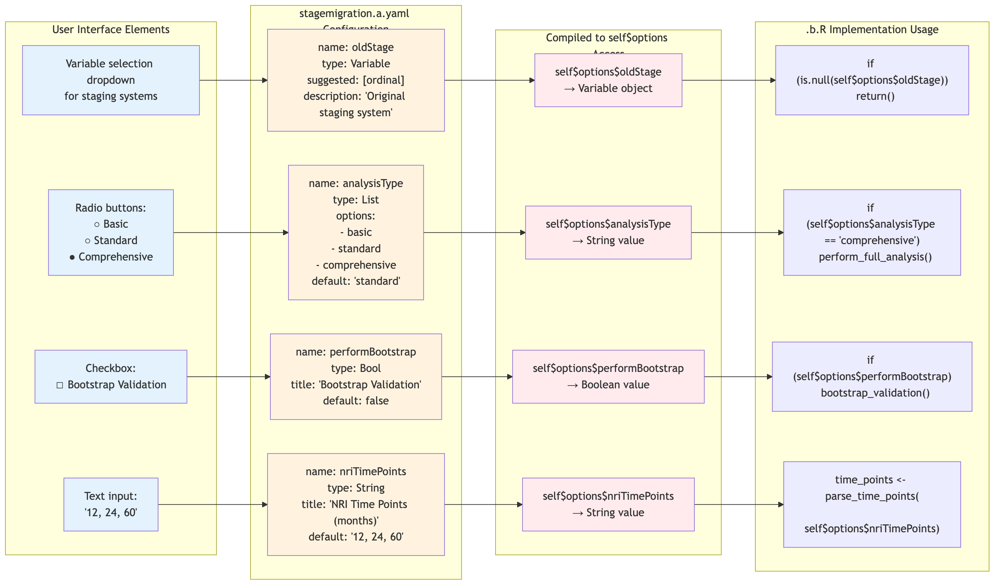

```{r, include = FALSE}
knitr::opts_chunk$set(
  echo = TRUE,
  eval = FALSE,
  collapse = TRUE,
  comment = "#>"
)
```


# ClinicoPath Module Development Guide

This comprehensive guide provides instructions for developing and maintaining the ClinicoPath jamovi module for clinicopathological research analysis.

> **📝 Development Focus**: This guide focuses specifically on ClinicoPath module development. Generic jamovi tutorial content and examples using non-ClinicoPath datasets have been preserved in commented sections for reference.

> **🎯 Target Audience**: R developers, statistical analysts, and researchers working with jamovi module development for clinical and pathological data analysis.

## Guide Overview

1. **[Prerequisites & Quick Setup](#prerequisites--quick-setup)** - Development environment setup
2. **[Advanced Development Patterns](#advanced-development-patterns--best-practices)** - Production-ready patterns
3. **[Data Flow Architecture](#clinicopath-data-flow-architecture)** - Understanding the module architecture
4. **[Developer Tips & Production Patterns](#developer-tips--production-patterns)** - Best practices and patterns
5. **[Common Pitfalls & Solutions](#common-pitfalls--solutions)** - Troubleshooting guide
6. **[Production Deployment](#production-deployment-workflow)** - Release and deployment
7. **[File Architecture Deep Dives](#file-architecture-deep-dives)** - Detailed file format guides
   - [.b.R Backend Implementation](#br-function-architecture-deep-dive)
   - [.a.yaml Analysis Definition](#ayaml-analysis-definition-complete-architecture-guide)
   - [.r.yaml Results Definition](#ryaml-results-definition-architecture)
   - [.u.yaml User Interface](#uyaml-user-interface-definition-architecture)
8. **[Reference Materials](#reference-materials)** - Additional resources and examples
9. **[Legacy Code Examples](#legacy-code-examples)** - Historical implementations for reference

## Prerequisites & Quick Setup

<!-- Generic jamovi setup - commented out for ClinicoPath-specific focus
Official documentation is here: https://dev.jamovi.org/

- Use `R >= 4.5.0`
- Install jamovi from: https://www.jamovi.org/download.html 
- Install jmvtools package with:
```r
install.packages('node', repos='https://repo.jamovi.org')
install.packages('jmvtools', repos=c('https://repo.jamovi.org', 'https://cran.r-project.org'))
```
-->

### ClinicoPath Development Setup

- Fork and clone this repository: https://github.com/sbalci/ClinicoPathJamoviModule
- Navigate to the cloned directory in R
- Run `jmvtools::install()` to build and install the module
- This produces `ClinicoPath.jmo` and installs to jamovi
- The module follows R package structure with additional `jamovi/` folder

### Key Development Areas

#### **Core Analysis Modules**
- **Stage Migration Analysis**: `R/stagemigration.b.R` - Advanced TNM staging validation with bootstrap and cross-validation
- **Survival Analysis**: `R/survival.b.R` - Comprehensive survival analysis with Kaplan-Meier and Cox regression
- **Decision Analysis**: `R/decisiongraph.b.R` - Medical decision trees and Markov chain models
- **Descriptive Analysis**: Cross tables, descriptive statistics, and data checking tools
- **Statistical Plots**: JJStatsPlot integration for publication-ready visualizations

#### **Configuration & Distribution**  
- **Module Configuration**: `_updateModules_config.yaml` - Controls distribution to sub-modules
- **Version Management**: Update `DESCRIPTION` and `NEWS.md` for version changes
- **Documentation**: Function documentation follows roxygen2 standards

#### **jamovi Integration**
- **Analysis Definitions**: `.a.yaml` files define parameters and options
- **UI Definitions**: `.u.yaml` files define user interface layout  
- **Results Definitions**: `.r.yaml` files define output tables and plots
- **Backend Implementation**: `.b.R` files contain the R6 class analysis logic

<!-- 
Generic tutorial content commented out:
- Just edit the `tangram::` code
https://dev.jamovi.org/tuts0104-implementing-an-analysis.html
https://dev.jamovi.org/tuts0105-debugging-an-analysis.html
- In DESCRIPTION file change `spgarbet/tangram@0.3.2` to the version you want to test
-->

---

# Core Development Guide

This section covers the essential development workflows, patterns, and best practices for ClinicoPath module development.

---

## 🏗️ Advanced Development Patterns & Best Practices

### Enhanced Module Distribution System

This project uses a sophisticated module distribution system with the following features:

```r
# Use the enhanced update system
Rscript _updateModules_enhanced.R

# Configuration-driven development
# Edit updateModules_config.yaml for module settings
```

**Key Features**:
- ✅ **Automated testing** and validation
- ✅ **Backup and rollback** capabilities  
- ✅ **Multi-module distribution** to specialized repos
- ✅ **Configuration management** via YAML
- ✅ **Security validation** and integrity checks

### ClinicoPath Development Workflow

```r
# ClinicoPath-specific development cycle
clinicopath_development <- function() {
    
    # 1. Modify existing analysis or create new one
    # For existing: Edit R/stagemigration.b.R, R/survival.b.R, etc.
    # For new: jmvtools::addAnalysis(name='newanalysis', title='New Analysis')
    
    # 2. Update implementation files
    # R/newanalysis.b.R - Main R6 class with .init(), .run() methods
    # jamovi/newanalysis.a.yaml - Analysis options and parameters
    # jamovi/newanalysis.u.yaml - User interface layout
    # jamovi/newanalysis.r.yaml - Results tables and plots
    
    # 3. ClinicoPath enhanced build process
    jmvtools::prepare()           # Generate .h.R files from .yaml
    devtools::document()          # Update .Rd files
    jmvtools::prepare()           # Critical: run twice for complex modules like stagemigration
    devtools::document()          # Ensure all documentation is current
    
    # 4. Test and validate
    devtools::test()              # Run unit tests if available
    jmvtools::install()           # Build .jmo and install to jamovi
    
    # 5. Update module configurations and documentation
    # Edit _updateModules_config.yaml if new files added
    # Update DESCRIPTION version if needed
    # Update NEWS.md for significant changes
    
    # 6. Distribute to sub-modules (ClinicoPath-specific)
    system("Rscript _updateModules.R")  # Distribute to specialized repos
}
```

---

## 🔄 ClinicoPath Data Flow Architecture

> **📋 Note on Diagrams**: 
> - **Mermaid Source Files**: All diagram source code is available in `vignettes/*.mmd` files
> - **For Rendering**: Use [mermaid.live](https://mermaid.live), GitHub preview, or mermaid CLI
> - **See**: `vignettes/MERMAID_DIAGRAMS_README.md` for detailed rendering instructions

### Overall Module Data Flow

The ClinicoPath module follows a sophisticated data flow pattern that integrates user input, analysis processing, and result presentation:


*Source: `vignettes/01-overall-data-flow.mmd`*

### jamovi 4-File Architecture Interaction

The ClinicoPath module uses jamovi's 4-file architecture with specific data flow between components:


*Source: `vignettes/02-jamovi-4file-architecture.mmd`*

### Detailed Component Interaction Flow

This diagram shows how `self$options` and `self$results` interact between the key files:



*Source: `vignettes/03-component-interaction-sequence.mmd`*

### ClinicoPath-Specific Data Processing Flow

For complex analyses like `stagemigration`, the data flow includes multiple stages:

#### Simplified Text Flow:

```
Input Processing:
User Data → Data Validation → Variable Type Checking → Missing Data Handling

Analysis Configuration:
self$options$analysisType → {
  - basic: Basic Migration Analysis
  - standard: Standard + C-index Analysis  
  - comprehensive: Full Analysis Suite
  - publication: Publication Ready Output
}

Core Analysis Engine:
Migration Matrix → Statistical Tests → C-index → Bootstrap → Cross-validation → Decision Curves
              ↘ Multivariable Analysis → Model Selection → Interaction Tests → Personalized Risk

Results Generation:
Migration Tables → Statistical Summaries → Diagnostic Plots → Clinical Interpretations → self$results
```

#### Detailed Data Processing Flow:


*Source: `vignettes/04-stagemigration-data-processing.mmd`*

---

## 💡 Developer Tips & Production Patterns

### 1. **Error Handling & User Experience**

```r
.run = function() {
    # Always validate inputs first
    if (is.null(self$options$dependent)) {
        self$results$instructions$setContent(
            "Please select a dependent variable to continue."
        )
        return()
    }
    
    # Graceful error handling
    tryCatch({
        # Your analysis code here
    }, error = function(e) {
        self$results$instructions$setContent(
            paste("Analysis failed:", e$message)
        )
        return()
    })
}
```

### 2. **Performance Optimization with Checkpoints**

```r
.run = function() {
    # Use checkpoints for long operations
    for (i in seq_along(large_dataset)) {
        # Check for user interruption every 100 iterations
        if (i %% 100 == 0) {
            private$.checkpoint()
        }
        
        # Process data...
    }
}
```

### 3. **Dynamic UI Patterns**

```r
.init = function() {
    # Dynamic variable selection based on data types
    continuous_vars <- self$data %>%
        select_if(is.numeric) %>%
        names()
    
    # Update UI options programmatically
    self$results$instructions$setContent(
        paste("Available continuous variables:", 
              paste(continuous_vars, collapse = ", "))
    )
}
```

### 4. **Advanced Configuration Management**

The project uses `updateModules_config.yaml` for sophisticated module management:

```yaml
# Example configuration
modules:
  mymodule:
    enabled: true
    directory: "/path/to/submodule"
    menuGroup_pattern: "menuGroup: MyModule$"
    
    data_files:
      - "example_data.rda"
      - "test_data.csv"
    
    vignette_files:
      - "introduction.Rmd"
      - "advanced_usage.Rmd"
    
    test_files:
      - "test-mymodule.R"
```

### 5. **Debugging Techniques**

```r
# 1. Use browser() for interactive debugging
.run = function() {
    browser()  # Pauses execution for inspection
    # Your code here
}

# 2. Log intermediate results
.run = function() {
    message("Starting analysis with ", nrow(self$data), " observations")
    
    # Analysis steps with logging
    result1 <- step1(self$data)
    message("Step 1 completed, result has ", nrow(result1), " rows")
}

# 3. Use conditional debugging
.run = function() {
    if (self$options$debug_mode) {
        # Detailed debugging information
        str(self$data)
        str(self$options)
    }
}
```

---

## 🚨 Common Pitfalls & Solutions

### 1. **Module Not Loading**
```r
# Always clean and rebuild
jmvtools::prepare()
devtools::clean_dll()
devtools::document()
jmvtools::install()
```

### 2. **UI Not Updating**
```r
# Clear jamovi cache
# Close jamovi completely
# Reinstall module
jmvtools::install()
```

### 3. **Data Type Issues**
```r
# Explicit type conversion
numeric_var <- jmvcore::toNumeric(data[[var_name]])
factor_var <- as.factor(data[[var_name]])
```

### 4. **Memory Management for Large Datasets**
```r
.run = function() {
    # Process data in chunks
    chunk_size <- 1000
    results <- list()
    
    for (i in seq(1, nrow(data), chunk_size)) {
        chunk <- data[i:min(i + chunk_size - 1, nrow(data)), ]
        results[[length(results) + 1]] <- process_chunk(chunk)
        
        # Clean up memory
        gc()
        
        # Checkpoint for user interruption
        private$.checkpoint()
    }
}
```

---

## 🎯 Production Deployment Workflow

### Quality Assurance Checklist

- [ ] All tests pass (`devtools::test()`)
- [ ] Documentation is complete and accurate
- [ ] Examples work with provided datasets
- [ ] Error messages are user-friendly
- [ ] Performance is acceptable for typical datasets
- [ ] UI is intuitive and follows jamovi conventions
- [ ] Module builds without warnings
- [ ] Memory usage is reasonable

### Module Distribution Commands

```r
# 1. Prepare for distribution
jmvtools::prepare()
devtools::document()
devtools::test()

# 2. Update module configurations
# Edit updateModules_config.yaml

# 3. Distribute to submodules
system("Rscript _updateModules_enhanced.R")

# 4. Commit changes
system("git add .")
system("git commit -m 'Update modules for release'")
system("git push")
```

---

## 📚 Documentation Best Practices

### When Adding New Data and Vignettes

**Important**: When generating new example data and vignettes, always add them to the appropriate place in `updateModules_config.yaml`:

```yaml
modules:
  mymodule:
    data_files:
      - "new_example_data.rda"    # Add here
    
    vignette_files:
      - "new_comprehensive_guide.qmd"  # Add here
    
    test_files:
      - "test-new-function.R"    # Add here
```

This ensures your new files are distributed to submodules during the build process.

### Comprehensive Documentation Pattern

```r
#' Advanced Statistical Analysis
#'
#' @description
#' Performs comprehensive statistical analysis with modern methods
#' and publication-ready output.
#'
#' @details
#' This function implements state-of-the-art statistical methods with
#' proper error handling and user-friendly output.
#'
#' @examples
#' \dontrun{
#' # Basic usage
#' result <- advanced_analysis(
#'     data = mtcars,
#'     dependent = "mpg",
#'     covariates = c("hp", "wt")
#' )
#' }
#'
#' @export
advanced_analysis <- function(data, dependent, covariates, method = "standard") {
    # Implementation here
}
```

---

---

# File Architecture Deep Dives

This section provides comprehensive guides for each of the four jamovi file types that make up an analysis module.

---

## 🏛️ .b.R Function Architecture Deep Dive

### Understanding the jamovi R6 Class Structure

Every jamovi analysis is implemented as an R6 class in a `.b.R` file that inherits from an auto-generated base class. 

#### ClinicoPath Component Interaction Flow

The following diagram shows how ClinicoPath analyses like `stagemigration` flow from configuration to results:


*Source: `vignettes/05-stagemigration-component-flow.mmd`*

#### Detailed self$options ↔ self$results Interaction


*Source: `vignettes/06-stagemigration-detailed-interaction.mmd`*

Here's the complete anatomy:

```r
# Standard jamovi analysis structure
myanalysisClass <- if (requireNamespace('jmvcore'))
    R6::R6Class(
        "myanalysisClass",
        inherit = myanalysisBase,  # Auto-generated from .yaml files
        private = list(
            .init = function() { },        # Initialize UI and state
            .run = function() { },         # Main analysis logic
            .plot = function(image, ...) { }, # Plot generation
            .getData = function() { },     # Data preprocessing (optional)
            .labelData = function() { }    # Label management (optional)
        )
    )
```

### Core Function Patterns & Lifecycle

#### 1. **`.init()` - Initialization & UI Setup**

This function runs when the analysis is first created or options change:

```r
.init = function() {
    # Dynamic UI sizing based on data
    deplen <- length(self$options$dep)
    self$results$plot$setSize(650, deplen * 450)
    
    # Conditional visibility of results elements
    if (self$options$advanced_options) {
        self$results$advanced_table$setVisible(TRUE)
    } else {
        self$results$advanced_table$setVisible(FALSE)
    }
    
    # Data-driven UI updates
    if (!is.null(self$options$grvar)) {
        mydata <- self$data
        grvar <- self$options$grvar
        num_levels <- nlevels(as.factor(mydata[[grvar]]))
        self$results$plot2$setSize(num_levels * 650, deplen * 450)
    }
}
```

**Key Patterns:**
- 🎯 **Dynamic sizing**: Adjust plot dimensions based on data
- 🔄 **Conditional visibility**: Show/hide UI elements based on options
- 📊 **Data-responsive UI**: Adapt interface to data characteristics

#### 2. **`.run()` - Main Analysis Logic**

The heart of every jamovi analysis with sophisticated error handling:

```r
.run = function() {
    # 1. Input Validation
    if (is.null(self$options$dep) || is.null(self$options$group)) {
        # User guidance with rich HTML
        todo <- glue::glue("
            <br>Welcome to ClinicoPath
            <br><br>
            This tool will help you generate [Analysis Name].
            <br><br>
            Please select:
            <ul>
            <li>Dependent variable</li>
            <li>Grouping variable</li>
            </ul>
            <br>See documentation: <a href='...' target='_blank'>link</a>
            <br><hr>
        ")
        self$results$todo$setContent(todo)
        return()
    }
    
    # 2. Data Validation
    if (nrow(self$data) == 0) {
        stop('Data contains no (complete) rows')
    }
    
    # 3. Progress Updates for Long Operations
    self$results$todo$setContent("Processing analysis...")
    
    # 4. Main Analysis with Checkpoints
    for (i in seq_along(large_operation)) {
        if (i %% 100 == 0) {
            private$.checkpoint()  # Allow user interruption
        }
        # Analysis steps...
    }
    
    # 5. Results Population
    self$results$main_table$setContent(analysis_results)
    self$results$plot$setState(plot_data)
}
```

**Key Patterns:**
- ✅ **Progressive validation**: Check inputs, then data, then proceed
- 📝 **Rich user guidance**: HTML instructions with links and formatting
- ⏱️ **Checkpoint integration**: Allow user interruption for long operations
- 🔄 **State management**: Proper data flow to plots and tables

#### 3. **`.plot()` - Advanced Plot Generation**

Sophisticated plot generation with state management:

```r
.plot = function(image, ggtheme, theme, ...) {
    # 1. Validation
    if (is.null(self$options$dep) || is.null(self$options$group)) {
        return()
    }
    
    # 2. Retrieve plot data from state
    plotData <- image$state
    if (is.null(plotData)) {
        return()
    }
    
    # 3. Theme handling
    ggtheme <- private$.ggtheme()
    theme_options <- private$.themeOptions()
    
    # 4. Plot generation with error handling
    tryCatch({
        p <- ggplot2::ggplot(plotData, aes(x = x, y = y)) +
            geom_point() +
            ggtheme +
            theme_options +
            labs(
                title = self$options$title,
                subtitle = paste("n =", nrow(plotData)),
                caption = "Generated by ClinicoPath"
            )
        
        # 5. Print and return
        print(p)
        TRUE
        
    }, error = function(e) {
        stop("Plot generation failed: ", e$message)
    })
}
```

#### 4. **`.getData()` - Data Preprocessing Pipeline**

Sophisticated data preprocessing with label management:

```r
.getData = function() {
    # 1. Get raw data
    mydata <- self$data
    mydata$row_names <- rownames(mydata)
    
    # 2. Preserve original labels
    original_names <- names(mydata)
    labels <- setNames(original_names, original_names)
    
    # 3. Clean variable names
    mydata <- mydata %>% janitor::clean_names()
    
    # 4. Restore labels after cleaning
    corrected_labels <- setNames(original_names, names(mydata))
    mydata <- labelled::set_variable_labels(
        .data = mydata,
        .labels = corrected_labels
    )
    
    # 5. Extract specific variables by label
    all_labels <- labelled::var_label(mydata)
    
    mytime <- names(all_labels)[all_labels == self$options$elapsedtime]
    myoutcome <- names(all_labels)[all_labels == self$options$outcome]
    
    # 6. Return structured data
    return(list(
        "mydata_labelled" = mydata,
        "mytime_labelled" = mytime,
        "myoutcome_labelled" = myoutcome
    ))
}
```

### Advanced Patterns & Best Practices

#### 1. **Label Management System**

```r
.labelData = function() {
    mydata <- self$data
    original_names <- names(mydata)
    
    # Save original names as labels
    labels <- setNames(original_names, original_names)
    
    # Clean variable names
    mydata <- mydata %>% janitor::clean_names()
    
    # Apply original labels to cleaned names
    cleaned_names <- names(mydata)
    corrected_labels <- setNames(original_names, cleaned_names)
    
    mydata <- labelled::set_variable_labels(
        .data = mydata,
        .labels = corrected_labels
    )
    
    return(mydata)
}
```

#### 2. **Conditional Namespace Loading**

All jamovi classes use conditional namespace loading for safety:

```r
myanalysisClass <- if (requireNamespace('jmvcore'))
    R6::R6Class(
        # Class definition
    )
```

This prevents errors if core jamovi packages aren't available.

#### 3. **Error Handling Patterns**

```r
# Pattern 1: Early return for missing inputs
if (is.null(self$options$required_var)) {
    self$results$instructions$setContent("Please select required variable")
    return()
}

# Pattern 2: Graceful error handling with user feedback
tryCatch({
    analysis_result <- complex_analysis(data)
}, error = function(e) {
    self$results$instructions$setContent(
        paste("Analysis failed:", e$message, 
              "Please check your data and try again.")
    )
    return()
})

# Pattern 3: Data validation with specific messages
if (nrow(clean_data) < 10) {
    self$results$instructions$setContent(
        "Insufficient data. Need at least 10 complete observations."
    )
    return()
}
```

#### 4. **State Management for Plots**

```r
# In .run() - prepare and transfer data to plot
plotData <- prepare_plot_data(analysis_results)
image <- self$results$plot
image$setState(plotData)

# In .plot() - retrieve and use the data
plotData <- image$state
if (is.null(plotData)) return()

# Generate plot using the transferred data
plot <- create_publication_plot(plotData)
print(plot)
TRUE
```

#### 5. **Documentation Integration**

```r
#' @title Advanced Statistical Analysis
#' @description Comprehensive analysis with modern methods
#' @param data Data frame containing variables
#' @param dependent Character. Name of dependent variable  
#' @param covariates Character vector. Covariate names
#' @details This function implements state-of-the-art methods...
#' @examples
#' \dontrun{
#' result <- myanalysis(data = mtcars, dependent = "mpg")
#' }
#' @importFrom R6 R6Class
#' @import jmvcore
#' @importFrom package function_name
```

### Performance Optimization Patterns

#### 1. **Chunked Processing**

```r
.run = function() {
    large_data <- self$data
    chunk_size <- 1000
    results <- list()
    
    for (i in seq(1, nrow(large_data), chunk_size)) {
        chunk_end <- min(i + chunk_size - 1, nrow(large_data))
        chunk <- large_data[i:chunk_end, ]
        
        # Process chunk
        chunk_result <- process_chunk(chunk)
        results[[length(results) + 1]] <- chunk_result
        
        # Checkpoint for user interruption
        private$.checkpoint()
        
        # Memory cleanup
        gc()
    }
    
    # Combine results
    final_result <- do.call(rbind, results)
}
```

#### 2. **Lazy Evaluation**

```r
.run = function() {
    # Only compute expensive operations when needed
    if (self$options$include_advanced) {
        advanced_results <- expensive_computation(self$data)
        self$results$advanced_table$setContent(advanced_results)
    }
    
    # Basic results are always computed
    basic_results <- basic_analysis(self$data)
    self$results$basic_table$setContent(basic_results)
}
```

### Integration with Enhanced Module System

When developing .b.R functions for the ClinicoPath ecosystem:

```r
# Always follow the enhanced workflow
development_workflow <- function() {
    # 1. Implement .b.R with proper structure
    edit_analysis_file("R/myanalysis.b.R")
    
    # 2. Update configuration
    update_config_yaml("updateModules_config.yaml")
    
    # 3. Enhanced build process
    jmvtools::prepare()
    devtools::document()
    jmvtools::prepare()    # Critical: run twice
    devtools::document()
    
    # 4. Test and distribute
    devtools::test()
    jmvtools::install()
    system("Rscript _updateModules_enhanced.R")
}
```

---

## 📋 .a.yaml Analysis Definition: Complete Architecture Guide

### Understanding the .a.yaml Structure

The `.a.yaml` file defines the analysis metadata, options, and interface behavior. It's the blueprint for your jamovi analysis module. Here's the complete anatomy:

```yaml
---
name: myanalysis              # Internal analysis ID (must match .b.R filename)
title: My Statistical Analysis # Display name in jamovi menu
menuGroup: Exploration        # Main menu category
menuSubgroup: Advanced Stats  # Optional submenu
menuSubtitle: 'Detailed descriptive text' # Optional menu tooltip
version: '0.0.3'             # Analysis version
jas: '1.2'                   # jamovi analysis specification version

description:
    main: |                  # Main description (markdown supported)
        Performs comprehensive statistical analysis with modern methods.
        This analysis provides publication-ready output with effect sizes.
    R:                       # R-specific documentation
        dontrun: false       # Whether to skip in R CMD check
        usage: |             # R usage examples
            # Example usage:
            ClinicoPath::myanalysis(
                data = mtcars,
                dep = "mpg",
                group = "cyl"
            )

options:                     # Analysis parameters/inputs
    # ... detailed below
...
```

### Core Components Deep Dive

#### 1. **Menu System Architecture**

```yaml
# Menu positioning and organization
menuGroup: ExplorationD      # Main menu category
menuSubgroup: ClinicoPath Comparisons  # Submenu grouping
menuSubtitle: 'Univariate Survival Analysis, Cox, Kaplan-Meier'  # Tooltip

# Menu groups used in ClinicoPath:
# - ExplorationD: Descriptive statistics
# - SurvivalD: Survival analysis
# - meddecideT: Medical decision making
# - JJStatsPlotD: Statistical visualizations
```

**Best Practices:**
- Use descriptive `menuGroup` names ending with 'D' for consistency
- Keep `menuSubgroup` concise but informative
- Use `menuSubtitle` for detailed descriptions that appear on hover

#### 2. **Option Types & Patterns**

##### **Data Input Option**
```yaml
- name: data
  type: Data
  description:
      R: >
        The data as a data frame.
```

##### **Variable Selection Options**
```yaml
# Single variable selection
- name: dependent
  title: Dependent Variable
  type: Variable
  suggested: [ continuous ]      # Guides users to appropriate types
  permitted: [ numeric ]         # Enforces type restrictions
  description: >
    The outcome variable for analysis.

# Multiple variable selection
- name: covariates
  title: Covariates
  type: Variables               # Note: Variables (plural) for multiple
  suggested: [ ordinal, nominal, continuous ]
  permitted: [ factor, numeric ]
  default: NULL

# Variable with level selection
- name: outcome
  title: Outcome Variable
  type: Variable
  suggested: [ ordinal, nominal ]
  permitted: [ factor ]

- name: outcomeLevel
  title: Event Level
  type: Level
  variable: (outcome)          # Links to parent variable
  description: >
    Select which level represents the event of interest.

# Optional level selection
- name: referenceLevel
  title: Reference Level (Optional)
  type: Level
  variable: (groupVar)
  allowNone: true             # Makes selection optional
```

##### **Boolean Options**
```yaml
- name: excludeMissing
  title: Exclude Missing Values
  type: Bool
  default: false
  description:
      R: >
        If TRUE, cases with missing values will be excluded from analysis.
```

##### **List/Dropdown Options**
```yaml
- name: method
  title: Analysis Method
  type: List
  options:
    - title: Parametric (t-test)
      name: parametric
    - title: Non-parametric (Mann-Whitney U)
      name: nonparametric
    - title: Robust (Yuen's test)
      name: robust
    - title: Bayesian
      name: bayes
  default: parametric
  description: >
    Statistical method for group comparisons.
```

##### **Numeric Input Options**
```yaml
# Integer input
- name: bootstrapSamples
  title: Bootstrap Samples
  type: Integer
  default: 1000
  min: 100
  max: 10000

# Decimal number input
- name: confidenceLevel
  title: Confidence Level
  type: Number
  default: 0.95
  min: 0.00
  max: 1.00
  description: >
    Confidence level for intervals (e.g., 0.95 for 95% CI).
```

##### **String Input Options**
```yaml
- name: customTitle
  title: Plot Title (Optional)
  type: String
  default: ''
  description: >
    Custom title for the plot. Leave empty for automatic title.

# String with specific format
- name: cutpoints
  title: Time Cutpoints
  type: String
  default: '12, 36, 60'
  description: >
    Comma-separated time points for survival analysis (e.g., "12, 36, 60").
```

##### **Output Variables**
```yaml
# Creates new variable in dataset
- name: predictedValues
  title: Save Predicted Values
  type: Output
  description: >
    Adds predicted values as a new column in the dataset.
```

##### **Advanced Pattern: Conditional Options**
```yaml
# Parent option that controls visibility
- name: useAdvanced
  title: Advanced Options
  type: Bool
  default: false

# Child option only visible when parent is true
- name: advancedMethod
  title: Advanced Method
  type: List
  options:
    - title: Method A
      name: methodA
    - title: Method B
      name: methodB
  default: methodA
  visible: (useAdvanced)    # Conditional visibility
```

### 3. **Complex Real-World Examples**

#### **Example 1: Survival Analysis Options**
```yaml
options:
    # Time calculation options
    - name: tint
      title: Using Dates to Calculate Survival Time
      type: Bool
      default: false
      description:
          R: >
            Calculate survival time from date variables.
    
    - name: dxdate
      title: Diagnosis Date
      type: Variable
      visible: (tint)          # Only show when tint is true
      description: >
        Date of initial diagnosis.
    
    - name: fudate
      title: Follow-up Date
      type: Variable
      visible: (tint)
      description: >
        Most recent follow-up date.
    
    # Analysis type with complex dependencies
    - name: analysistype
      title: Survival Type
      type: List
      options:
        - title: Overall Survival
          name: overall
        - title: Cause Specific
          name: cause
        - title: Competing Risk
          name: compete
      default: overall
    
    # Conditional level selections based on analysis type
    - name: dod
      title: Dead of Disease
      type: Level
      variable: (outcome)
      allowNone: true
      visible: (analysistype:cause || analysistype:compete)
    
    - name: dooc
      title: Dead of Other Causes
      type: Level
      variable: (outcome)
      allowNone: true
      visible: (analysistype:compete)
```

#### **Example 2: Statistical Test Configuration**
```yaml
options:
    # Main test selection
    - name: testType
      title: Statistical Test
      type: List
      options:
        - title: Automatic Selection
          name: auto
        - title: Chi-square Test
          name: chisq
        - title: Fisher's Exact Test
          name: fisher
        - title: Custom Test
          name: custom
      default: auto
    
    # Conditional options for custom test
    - name: customTestName
      title: Custom Test Function
      type: String
      visible: (testType:custom)
      default: ''
    
    # Pairwise comparisons
    - name: pairwise
      title: Pairwise Comparisons
      type: Bool
      default: false
    
    - name: pairwiseMethod
      title: Adjustment Method
      type: List
      visible: (pairwise)
      options:
        - title: Holm
          name: holm
        - title: Hochberg
          name: hochberg
        - title: Bonferroni
          name: bonferroni
        - title: FDR
          name: fdr
        - title: None
          name: none
      default: holm
```

### 4. **Best Practices & Tips**

#### **Variable Type Specifications**
```yaml
# Complete type system reference
suggested: [ continuous, ordinal, nominal, id ]
permitted: [ numeric, factor, character, logical ]

# Common patterns:
# Continuous outcomes
suggested: [ continuous ]
permitted: [ numeric ]

# Categorical predictors
suggested: [ ordinal, nominal ]
permitted: [ factor ]

# Mixed types (flexible)
suggested: [ ordinal, nominal, continuous ]
permitted: [ factor, numeric ]

# ID variables
suggested: [ id ]
permitted: [ character, factor ]
```

#### **Description Best Practices**
```yaml
# Good: Clear, actionable description
- name: excludeOutliers
  title: Exclude Outliers
  type: Bool
  default: false
  description: >
    Remove observations more than 3 standard deviations from the mean.
    This uses the median absolute deviation (MAD) method for robust
    outlier detection.

# Bad: Vague description
- name: option1
  title: Option 1
  type: Bool
  description: >
    Enable option 1.
```

#### **Default Value Guidelines**
```yaml
# Always provide sensible defaults
- name: confidenceLevel
  type: Number
  default: 0.95      # Standard 95% CI

- name: method
  type: List
  default: auto      # Let analysis choose

- name: missing
  type: List
  options:
    - title: Exclude listwise
      name: exclude
    - title: Include as NA
      name: include
  default: exclude   # Safe default
```

### 5. **Advanced Patterns & Tricks**

#### **Dynamic UI Updates**
```yaml
# Options that trigger UI updates in .init()
- name: groupingVar
  title: Grouping Variable
  type: Variable
  description: >
    Variable for stratified analysis.
    
# In .b.R .init():
# if (!is.null(self$options$groupingVar)) {
#     levels <- levels(self$data[[self$options$groupingVar]])
#     self$results$groupTables$setTitle(
#         paste("Results by", self$options$groupingVar)
#     )
# }
```

#### **Complex Validation Patterns**
```yaml
# Date format handling
- name: dateFormat
  title: Date Format in Data
  type: List
  options:
    - title: YYYY-MM-DD
      name: ymd
    - title: MM/DD/YYYY
      name: mdy
    - title: DD/MM/YYYY
      name: dmy
  default: ymd

# Time unit conversion
- name: timeUnit
  title: Time Unit
  type: List
  options:
    - title: Days
      name: days
    - title: Weeks
      name: weeks
    - title: Months
      name: months
    - title: Years
      name: years
  default: months
```

#### **Performance Optimization Options**
```yaml
# Computation control
- name: enableBootstrap
  title: Bootstrap Confidence Intervals
  type: Bool
  default: false
  description: >
    Enable bootstrap CIs (slower but more accurate for small samples).

- name: bootstrapSamples
  title: Bootstrap Iterations
  type: Integer
  visible: (enableBootstrap)
  default: 1000
  min: 100
  max: 10000

- name: parallelProcessing
  title: Use Parallel Processing
  type: Bool
  default: false
  visible: (enableBootstrap)
```

### 6. **Integration with Module System**

When creating .a.yaml files for the ClinicoPath system:

```yaml
# 1. Follow naming conventions
name: myanalysis          # Must match R/myanalysis.b.R

# 2. Use consistent menu groups
menuGroup: ExplorationD   # Or SurvivalD, meddecideT, JJStatsPlotD

# 3. Version alignment
version: '0.0.3'         # Match module version

# 4. Complete documentation
description:
    main: |
        Comprehensive description with markdown support.
        - Feature 1: Description
        - Feature 2: Description
    R:
        usage: |
            # Complete R example
            result <- ClinicoPath::myanalysis(
                data = histopathology,
                dependent = "outcome",
                covariates = c("age", "stage"),
                method = "robust"
            )
```

### 7. **Common Pitfalls & Solutions**

#### **Pitfall 1: Missing Default Values**
```yaml
# Bad: No default for optional parameter
- name: customLabel
  type: String
  
# Good: Explicit default
- name: customLabel
  type: String
  default: ''
```

#### **Pitfall 2: Incorrect Variable Linking**
```yaml
# Bad: Typo in variable reference
- name: level1
  type: Level
  variable: (grouppVar)  # Typo!

# Good: Correct reference
- name: level1
  type: Level
  variable: (groupVar)
```

#### **Pitfall 3: Complex Visibility Logic**
```yaml
# Bad: Overly complex
visible: ((method:auto && pairwise) || (method:custom && !pairwise))

# Good: Simplify with intermediate options
- name: showAdvanced
  type: Bool
  default: false

- name: advancedOption
  visible: (showAdvanced)
```

### 8. **Testing Your .a.yaml**

```r
# Validate yaml syntax
yaml::yaml.load_file("jamovi/myanalysis.a.yaml")

# Check in jamovi
jmvtools::install()
# Open jamovi and verify:
# 1. Analysis appears in correct menu
# 2. All options are visible
# 3. Conditional visibility works
# 4. Defaults are sensible
```

---

---

# Reference Materials

This section contains additional resources, documentation links, and reference materials for jamovi module development.

---

## 📞 Getting Help & Resources

### Development Resources

- **Official Documentation**: https://dev.jamovi.org/
- **jamovi Community Forum**: https://forum.jamovi.org/
- **R Package Development**: https://r-pkgs.org/
- **Project Repository**: Check GitHub issues and discussions

### Contributing Guidelines

1. **Fork** the repository
2. **Create** a feature branch
3. **Write** comprehensive tests
4. **Document** your changes thoroughly
5. **Update** `updateModules_config.yaml` if needed
6. **Submit** a pull request with clear description

---


## [useR!2017: *jamovi*: a spreadsheet for R](https://channel9.msdn.com/Events/useR-international-R-User-conferences/useR-International-R-User-2017-Conference/jamovi-a-spreadsheet-for-R)

<iframe src="https://channel9.msdn.com/Events/useR-international-R-User-conferences/useR-International-R-User-2017-Conference/jamovi-a-spreadsheet-for-R/player" width="50%" allowFullScreen frameBorder="0" title="*jamovi*: a spreadsheet for R - Microsoft Channel 9 Video"></iframe>


## preparing development tools


### use an unsigned version of jamovi for development in mac

https://dev.jamovi.org/#28-02-2020

https://www.jamovi.org/downloads/jamovi-unsigned.zip


### jmvtools should be installed from the jamovi repo

https://dev.jamovi.org/tuts0101-getting-started.html


```r
install.packages('jmvtools', repos=c('https://repo.jamovi.org', 'https://cran.r-project.org'))
```


```r
jmvtools::check()
```


```r
jmvtools::install()
```

You can use `devtools::install()` to use your codes as a usual R package, submit to github or CRAN. `devtools::check()` does not like some jamovi folders so be sure to add them under `.Rbuildignore`


## Creating a Module

https://dev.jamovi.org/tuts0102-creating-a-module.html


```r
jmvtools::create(path = "~/ClinicoPathDescriptives")
```


## add analysis

```r
jmvtools::create('function')
```

# Structure

---

<iframe src="https://docs.google.com/presentation/d/e/2PACX-1vTfA7dL5y_PzY5L-f8FRxaqvKMME5pcDCbXtWk5-FUNCGJyFKpGJEp8ES9rAge0CbI3Gcbi7Emv4e-S/embed?start=false&loop=true&delayms=3000" frameborder="0" width="960" height="569" allowfullscreen="true" mozallowfullscreen="true" webkitallowfullscreen="true"></iframe>

---


## Development Files

### `DESCRIPTION` file

`Imports`, `Depends`, `Suggests`, and `Remotes` have practically no difference in building jamovi modules. The `jmvtools::install()` copies libraries under *build* folder.

Under `Imports` `jmvcore` and `R6` are defaults.

With Remotes one can install github packages as well. But with each `jmvtools::install()` command it tries to check the updates, and if you are online throws an error. An `upgrade = FALSE, quick = TRUE` argument like in devtools::install() is not available, yet. One workaround is temporarily deleting Remotes from DESCRIPTION. The package folders continue to remain under build folder.

One can also directly copy package folders from system R package folder (find via `.libPaths()`) as well.


### `NAMESPACE` file

No need to change.


### `R` folder

R folder is where the codes are present. There are two files.

#### `function.h.R`

No need to change. Auto-updated and overwritten.

#### `function.b.R`


##### Write Formula

<!-- Generic ToothGrowth examples commented out - use ClinicoPath datasets instead
https://cran.r-project.org/web/packages/jmv/vignettes/new-syntax.html

```r
jmv::ANOVA(formula = len ~ supp * dose, ToothGrowth)
```

```r
jmv::ANOVA(ToothGrowth, len, vars(supp, dose))
```

```r
jmv::ANOVA(..., emMeans = ~ supp + dose:supp)
```

```r
jmv::ANOVA(ToothGrowth, 'len', c('supp', 'dose'))
```

> In this case, jmv will look for variables in ToothGrowth called 'dep' or 'factors'. This is tidy evaluation. To instruct jmv to use the contents of it's arguments, rather than the symbol name, prefix them with the !! signifier. For example:

```r
dep <- 'len'
factors <- c('supp', 'dose')

jmv::ANOVA(ToothGrowth, !!dep, !!factors)
```
-->


##### Warning, Error Messages


```r
if (nrow(self$data) == 0) stop("Data contains no (complete) rows")
```


##### Prepare Data For Analysis


            varsName <- self$options$vars

            data <- jmvcore::select(self$data, c(varsName))


##### Remove NA containing cases (works on selected variables)

            data <- jmvcore::naOmit(data)


jmvcore::toNumeric()
https://dev.jamovi.org/tuts0202-handling-data.html

can I just send whole data to plot function?
you usually don't want to, but sometimes it's appropriate. normally you just provide a summary of the data to the plot function ... just enough data for it to do it's job. but if you need the whole data set for the plot function, then you can specify requiresData: true on the image object. that means the plot function can access self$data.
i do it in the correlation matrix for example. there's no summary i could send ... the plot function needs all the data:
https://github.com/jamovi/jmv/blob/master/jamovi/corrmatrix.r.yaml#L143
jamovi/corrmatrix.r.yaml:143
      requiresData: true


##### Prepare Data to Send to Plot Function


### jamovi folder


#### function.a.yaml


#### function.r.yaml


##### preformatted

Using “preformatted” result element I get a markdown table output. Is there a way to somehow render/convert this output to html version. Or should I go with https://dev.jamovi.org/api_table.html table api?

so you’re best to make use of the table api … the table API has a lot more features than an md table.


##### p-value format

```yaml
     - name: p
       title: "p"
       type: number
       format: zto,pvalue
```


#### function.u.yaml

##### LevelSelector

     i have added the property allowNone to the LevelSelector control. This will allow the user to select None from the listbox.


##### maxItemCount: 1


#### 0000.yaml


#### 00refs.yaml

prepare a 00refs.yaml like this:
https://github.com/jamovi/jmv/blob/master/jamovi/00refs.yaml

attach references to objects in the .r.yaml file like this:

https://github.com/jamovi/jmv/blob/master/jamovi/ancova.r.yaml#L174


## Tables

I want a long table. I tried to use following but got error.

Below is my current .r.yaml
   - name:  irrtable
     title: Interrater Reliability
      type: Table
      rows:  1
      columns:
        - name: method
          title: 'Method'
          type: text
        - name: subjects
          title: 'Subjects'
          type: integer
        - name: raters
          title: 'Raters'
          type: integer
        - name: peragree
          title: 'Agreement %'
          type: number
        - name: kappa
          title: 'Kappa'
          type: number
        - name: z
          title: 'z'
          type: number
        - name: p
          title: 'p-value'
          type: number
          format: zto,pvalue


- try setting swapRowsColumns to true.
- alternatively, you can name your columns like this method[a], method[b], this will cause the row to be ‘folded’ where the value in method[b] appears below the value in method[a] . an example of this is the t-test:
https://github.com/jamovi/jmv/blob/master/jamovi/ttestis.r.yaml#L20


## Plots


## `build` folder

### `js` folder

#### event.js


### R3.6.3-macos


## Installing

### `jmvtools::install`

### `devtools::install`


```r
devtools::install(upgrade = FALSE, quick = TRUE)
```


## .init()

```
so the principle seems right. you initialise the table in the .init() phase (you add rows and columns), and then you populate the table in the .run() phase. however, i notice your .init() function calls .initcTable() which doesn’t actually do anything.
most of the time, .init() isn’t necessary, because the .r.yaml file can take care of it, but sometimes the rows/columns the table should have is a more complex calculation than the .r.yaml allows (and example of this might be the ANOVA table in jmv … there’s not a simple relationship between the number of variables in the option, i.e. dose, supp, and the number of rows in the ANOVA table dose, supp, supp * dose, residuals. so we can’t achieve this with the .r.yaml, and so we set it up in the .init() phase.
finally, there are times where you can’t even determine the number of rows/columns in the .init() phase. you can only decide how many rows/columns are appropriate after you’ve run the analysis. an example of this might be a cluster analysis, where there’s a row for each cluster, but you only know how many rows you need after the analysis has been run. this is the least desireable, because it does lead to the growing and shrinking of the table, but sometimes that’s unavoidable.
so that’s your order of preference. preferably in the .r.yaml, if that can’t work, then do it in the .init(), and as a last resort, you can do it in the .run()
```


## Output variables in jamovi 1.6.16

```
hi, we’ve added “output variables” to version 1.6.16 of jamovi. this allows analyses to save data from the analyses, back to the spreadsheet (for example, residuals). there’s nothing in the 1.6.16 which indicates to users that this functionality is there, and it will only appear when an analysis implements these features. the idea is that we won’t actually release any modules with these features publicly, until an upcoming jamovi 1.8, or 2.0, or whatever. we’ve added these to the 1.6.16 so you can begin developing for the upcoming release.
you begin by specifying an output option in your .a.yaml file, i.e.

                # - name: resids
                # title: Residuals
                # type: Output
                # and then add an entry into your .r.yaml file, with a matching name:
                #     - name: resids
                # title: Residuals
                # type: Output
                # varTitle: '`Residuals - ${ dep }`'
                # varDescription: Residuals from ANCOVA
                # clearWith:
                #     - dep
                # - factors
                # - covs
                # - modelTerms
                # in this case you’ll see that i’m specifying a formatted string, where the name of the column produced is generated from the dep variable, or dependent variable.
                # you can populate the output column with:
                #     if (self$options$resids && self$results$resids$isNotFilled()) {
                #         self$results$resids$setValues(aVector)
                #     }
                # sometimes your dataset will have gaps in it, either from filters, or from you calling na.omit() on it, and so if you simply send the residuals from your linear model to $setValues() they won’t be placed in the correct rows. there are two ways to solve this.
                call self$results$resids$setRowNums(...) . conveniently, you can simply take the rownames() from your data set (after calling na.omit()) on it, and pass this in here. i.e.
                # cleanData <- na.omit(self$data)
                # ...
                # rowNums <- rownames(cleanData)
                # self$results$resids$setRowNums(rowNums)
                # alternatively, you can turn your residuals into a data frame, attach the row numbers to that:
                #     residuals <- ...
                # residuals <- data.frame(residuals=residuals, row.names=rownames(cleanData))
                # self$results$setValues(residuals)
                # if you want to provide multiple output columns, for example, perhaps in the previous example we want a “predicted values” column as well, we’d add additional entries to the .a.yaml and the .r.yaml. each entry in the .a.yaml will result in one checkbox.
                # if you want to provide multiple columns with a single checkbox/option, then you can use the items property.
                # - name: predInt
                # title: Prediction intervals
                # varTitle: Pred interval
                # type: Output
                # items: 2
                # then you can go:
                #     self$results$predInt$setValues(index=i, values)
                # or you could wrap both columns of values in a data frame, and go:
                #     self$results$predInt$setValues(valuesinadataframe)
                # you can use data bindings with items too. i.e.
                # - name: resids
                # title: Residuals
                # type: Output
                # varTitle: 'Residuals - $key'
                # items: (vars)
                # this will create an output column for each variable assigned to vars. these can be set:
                #     self$results$resids$setValues(key=key, values)


```


## Other Tips

### Code Search in GitHub


https://github.com/search/advanced?q=select+repo%3Ajamovi%2Fjmv+filename%3A.b.R+language%3AR&type=Code


https://github.com/search?l=&q=select+repo%3Ajamovi%2Fjmv+filename%3A.b.R+language%3AR&type=Code

```
select repo:jamovi/jmv filename:.b.R language:R
```

```r
generate advanced search for all jamovi library
jamovi_library_names <- readLines("https://raw.githubusercontent.com/jonathon-love/jamovi-library/master/modules.yaml")

jamovi_library_names <- stringr::str_extract(
  string = jamovi_library_names,
  pattern = "github.com/(.*).git")

jamovi_library_names <- jamovi_library_names[!is.na(jamovi_library_names)]

jamovi_library_names <- gsub(pattern = "github.com/|.git",
                             replacement = "",
                             x = jamovi_library_names)

jamovi_library_names <- c("jamovi/jmv", jamovi_library_names)

jamovi_library_names <- gsub(pattern = "/",
                              replacement = "%2F",
                              x = jamovi_library_names)

query <- "type: Level"

repos <- paste0("repo%3A",jamovi_library_names,"+")

repos <- paste0(repos, collapse = "")

repos <- gsub(pattern = "\\+$",
              replacement = "",
              x = repos)

github_search <- paste0("https://github.com/search?q=",
                        query,
                        "+",
                        repos,
                        "&type=Code&ref=advsearch&l=&l=")

cat(github_search)

```


### Library Development Status


https://ci.appveyor.com/project/jonathon-love/jamovi-library/history


### YAML


<iframe width="560" height="315" src="https://www.youtube.com/embed/cdLNKUoMc6c" frameborder="0" allow="accelerometer; autoplay; encrypted-media; gyroscope; picture-in-picture" allowfullscreen></iframe>


### RStudio options

#### .gitignore

add following to .gitignore file

```
# jamovi
/build/
/build-*/
*.jmo
```

### R version

Try to use compatible packages with the jamovi's R version.

Use: **R 4.5.0**
https://cran.r-project.org/bin/macosx/r-release/R-4.5.0-x86_64.pkg

Use packages from CRAN snapshot:

```r
options(
repos = "https://packagemanager.posit.co/cran/2025-05-25"
                )
```

### Base R packages within jamovi


```
jamovi.app/Contents/Resources/modules/base/R

this folder contains base R packages used for jamovi.

jmvtools::install() prevent the packages already installed in base/R from being installed into your module. 

(jmvtools is an R package which is a thin wrapper around the jamovi-compiler. The jamovi-compiler is written in javascript)

That cause problems if you are using different package versions. So it is best to keep up with suggested 'mran' version. 
```


### Electron

jamovi is electron based. See R, shiny, and electron based application development here: [Deploying a Shiny app as a desktop application with Electron](https://github.com/sbalci/clinicopathological#deploying-a-shiny-app-as-a-desktop-application-with-electron)


### Project Structure

https://dev.jamovi.org/info_project-structure.html


https://forum.jamovi.org/viewtopic.php?f=12&t=1253&p=4251&hilit=npm#p4251

> the easiest way to build jamovi on macOS is to use our dev bundle.
https://www.jamovi.org/downloads/jamovi-dev.zip
if you navigate to the `jamovi.app/Contents/Resources` folder, you'll find a package.json which contains a bunch of different build commands.
you can issue commands like:
npm run build:client
npm run build:server
npm run build:analyses:jmv
depending on which component you're wanting to build.


## Other Codes


## Add Datasets

```
make a data folder (same as with an R package), and then you put entries in your 0000.yaml file:
https://github.com/gamlj/gamlj/blob/master/jamovi/0000.yaml#L47-L108
jamovi/0000.yaml:47-108
datasets:
  - name: qsport
    path: qsport.csv
    description: Training hours
    tags:
```

.omv and .csv allowed.
excel is also allowed but user does not see if it is csv or excel file.


## Error messages

```r
data <- data.frame(outcome=c(1,0,0,1,NA,1))
data <- na.omit(data)
if ( ! is.numeric(data$outcome) || any(data$outcome != 0 & data$outcome != 1))
  stop('Outcome variable must only contains 1s and 0s')
```


it’s good to test lots of different data sets that a user may have … include missing values, really large values, etc. etc. and make sure your analyses always handle them, and provide useful error messages for why an analysis doesn’t work. you don’t want to leave the user uncertain why something isn’t working … otherwise they just give up.

part of our philosophy is that people shouldn't have to set their data up if they can't be bothered ... because with large data sets it can take a lot of time. so i'd encourage you to treat whatever the user provides you with as continuous, by converting it with toNumeric() ... more on our data philosophy here: https://dev.jamovi.org/tuts0202-handling-data.html


https://youtu.be/oWZrrWc6e74


in the options, you’ve got Survival Curve, and in the results, it’s Survival Plot … i’d encourage you to make these consistent.
also, if the Survival Curve is unchecked, i’d hide the Surival plot, rather than leaving all that vacant space there.

visible: (optionName)
https://github.com/jamovi/jmv/blob/master/jamovi/ttestis.r.yaml#L408-L416
jamovi/ttestis.r.yaml:408-416
            - name: qq
              type: Image
              description: Q-Q plot
              width: 350
              height: 300


is there a variable type for dates in jamovi? Can I force a user to add only a date to a VariablesListBox?
I tried to get info from a self$options$var  via lubridate::is.Date  and is.na.POSIXlt but it did not work
hi, we don’t have a date data type at this time … only integer, numeric, and character … you could have people enter dates as character, and parse them yourself, but i appreciate that’s a bit of a hack

Thank you. Dates are always a problem in my routine practice. I work with many international colleagues and always date column is a mess, and  people calculate survival time very differently. I want to have raw dates so that I can calculate survival time. I will try somehow going around.


learn YAML syntax

it’s a pretty straightforward syntax … you’ve basically got ‘objects’ where each of the elements have names, and you’ve got arrays, where each of the objects have an index. and that’s more-or-less all there is to it.
you can take a look at jmv for examples:
https://github.com/jamovi/jmv/tree/master/jamovi

I don't think we've got a list of allowed parameters anywhere. Probably your best bet is to browse through the .yaml files in jmv. I think you'll find there's not that many parameter names.


as a work-around, once it’s installed the package from the Remotes, you can remove it from the DESCRIPTION and it won’t keep installing it over and over


Hi, there are scarce sources for pairwise chi-square tests. I have found  rmngb::pairwise.chisq.test() and rmngb::pairwise.fisher.test()
but that package has been removed from CRAN. Would you consider implementing this feature?
I also thought to add these functions in a module, but I want to ask your policy about removed packages as well.
4 replies

jonathon:whale2:  18 days ago
provided the module can be built with an entry in REMOTES, we don’t care if it’s not on CRAN

jonathon:whale2:  18 days ago
… but you’re obviously taking a risk using something which isn’t maintained

Serdar Balci  18 days ago
Thanks. Maybe just copying that function with appropriate reference may solve maintenance issue. I will think about it.

jonathon:whale2:  18 days ago
oh yup


---

I have a question. I want to user to enter cut points in a box and then evaluate it as a vector.
the function is this:
summary(km_fit, times = c(12,36,60)
I want user to define times vector.
I have tried the following:
utimes <- jmvcore::decomposeTerms(self$options$cutp)
utimes <- as.vector(utimes)
summary(km_fit, times = utimes
a.yaml is as follows:
    - name: cutp
      title: Define at least two cutpoints (in months) for survival table
      type: String
      default: '12, 36, 60'
Would you please guide me to convert input into a vector. (edited)
3 replies

Serdar Balci  13 hours ago
I think this seems to work:
utimes <- self$options$cutp
utimes <- strsplit(utimes, ",")
utimes <- purrr::reduce(utimes, as.vector)
utimes <- as.numeric(utimes)
(edited)

jonathon:whale2:  5 hours ago
yup, this will do it too:
as.numeric(strsplit(utimes, ',')[[1]])
(it's better if you can avoid using purrr, because it's not really necessary, and you're better off reducing the amount of dependencies you use)

Serdar Balci  5 hours ago
thank you. :+1:

---


so wrt width/height, you can set that in the .r.yaml like so:
https://github.com/kylehamilton/MAJOR/blob/master/jamovi/bayesmetacorr.r.yaml#L46-L49
it’s possible to do it programmatically, with … image$setSize()


---


```
Serdar Balci  4:48 PM
 I think I am getting familiar with the codes :)
QuickTime Movie
JamoviModule.mov
4 MB QuickTime Movie— Click to download
```


```
Serdar Balci Nov 29th, 2019 at 12:39 PM
Module names now have R version and OS in them. Does it mean that this will not work in windows Installing ClinicoPath_0.0.1-macos-R3.3.0.jmo

4 replies

jonathon:whale2:  3 months ago
It depends on whether there are any native R packages in your modules dependencies. Most modules do, but some don't. (You'll notice there's a "uses native" property there now too ... my intention is to use that to determine if a module can be used cross platform or not)

jonathon:whale2:  3 months ago
If there's native dependencies, then the module needs to be built separately for each os.

jonathon:whale2:  3 months ago
But I can take care of building it for different oses

Serdar Balci  3 months ago
Oh, I see. Thank you :slightly_smiling_face:
```


---

# Legacy Code Examples

> **⚠️ Historical Reference**: The following sections contain legacy code examples, development notes, and historical implementations. This content is preserved for reference but may contain outdated patterns. Current development should follow the patterns described in the earlier sections of this guide.

## Legacy Development Commands


```r
library, eval=FALSE, include=FALSE
# install.packages('jmvtools', repos=c('https://repo.jamovi.org', 'https://cran.r-project.org'))

# jmvtools::check("C://Program Files//jamovi//bin")

# jmvtools::install(home = "C://Program Files//jamovi//bin")
#
# devtools::build(path = "C:\\ClinicoPathOutput")

# .libPaths(new = "C:\\ClinicoPathLibrary")

# devtools::build(path = "C:\\ClinicoPathOutput", binary = TRUE, args = c('--preclean'))

Sys.setenv(TZ="Europe/Istanbul")

library("jmvtools")
```


```r

check, eval=FALSE, include=FALSE

jmvtools::check()

# rhub::check_on_macos()

# rhub::check_for_cran()

# codemetar::write_codemeta()


devtools::check()

```


```r
pkgdown build, eval=FALSE, include=FALSE
rmarkdown::render('/Users/serdarbalciold/histopathRprojects/ClinicoPath/README.Rmd',  encoding = 'UTF-8', knit_root_dir = '~/histopathRprojects/ClinicoPath', quiet = TRUE)

devtools::document()

pkgdown::build_site()
```


```r
git force push, eval=FALSE, include=FALSE
# gitUpdateCommitPush
CommitMessage <- paste("updated on ", Sys.time(), sep = "")
wd <- getwd()
gitCommand <- paste("cd ", wd, " \n git add . \n git commit --message '", CommitMessage, "' \n git push origin master \n", sep = "")
# gitCommand <- paste("cd ", wd, " \n git add . \n git commit --no-verify --message '", CommitMessage, "' \n git push origin master \n", sep = "")
system(command = gitCommand, intern = TRUE)

```


```r
add analysis, eval=FALSE, include=FALSE

# jmvtools::install()
#
# jmvtools::create('ClinicoPath')  # Use ClinicoPath instead of SuperAwesome
#
# jmvtools::addAnalysis(name='ttest', title='Independent Samples T-Test')
#
# jmvtools::addAnalysis(name='survival', title='survival')
#
# jmvtools::addAnalysis(name='correlation', title='correlation')
#
# jmvtools::addAnalysis(name='tableone', title='TableOne')
#
# jmvtools::addAnalysis(name='crosstable', title='CrossTable')
#
#
# jmvtools::addAnalysis(name='writesummary', title='WriteSummary')

# jmvtools::addAnalysis(name='finalfit', title='FinalFit')

# jmvtools::addAnalysis(name='multisurvival', title='FinalFit Multivariate Survival')

# jmvtools::addAnalysis(name='report', title='Report General Features')

# jmvtools::addAnalysis(name='frequencies', title='Frequencies')

# jmvtools::addAnalysis(name='statsplot', title='GGStatsPlot')

# jmvtools::addAnalysis(name='statsplot2', title='GGStatsPlot2')

# jmvtools::addAnalysis(name='scat2', title='scat2')

# jmvtools::addAnalysis(name='decisioncalculator', title='Decision Calculator')

# jmvtools::addAnalysis(name='agreement', title='Interrater Intrarater Reliability')

# jmvtools::addAnalysis(name='cluster', title='Cluster Analysis')

# jmvtools::addAnalysis(name='tree', title='Decision Tree')

```


```r
devtools install, eval=FALSE, include=FALSE
devtools::install()
```


```r
jmvtools install, eval=FALSE, include=FALSE
# jmvtools::check()
jmvtools::install()
```


```r
construct, eval=FALSE, include=FALSE
formula <- jmvcore::constructFormula(terms = c("A", "B", "C"), dep = "D")

jmvcore::constructFormula(terms = list("A", "B", c("C", "D")), dep = "E")


jmvcore::constructFormula(terms = list("A", "B", "C"))

vars <- jmvcore::decomposeFormula(formula = formula)

unlist(vars)

cformula <- jmvcore::composeTerm(components = formula)

jmvcore::composeTerm("A")

jmvcore::composeTerm(components = c("A", "B", "C"))

jmvcore::decomposeTerm(term = c("A", "B", "C"))

jmvcore::decomposeTerm(term = formula)

jmvcore::decomposeTerm(term = cformula)


composeTerm <- jmvcore::composeTerm(components = c("A", "B", "C"))

jmvcore::decomposeTerm(term = composeTerm)


```


---

# Example


```r
read data, eval=FALSE, include=FALSE
deneme <- readxl::read_xlsx(path = here::here("_tododata", "histopathology-template2019-11-25.xlsx"))
```


```r
writesummary, eval=FALSE, include=FALSE
devtools::install(upgrade = FALSE, quick = TRUE)
deneme <- readxl::read_xlsx(path = here::here("_tododata", "histopathology-template2019-11-25.xlsx"))

# library("ClinicoPath")

deneme$Age <- as.numeric(as.character(deneme$Age))

ClinicoPath::writesummary(data = deneme, vars = Age)

ggstatsplot::normality_message(deneme$Age, "Age")


ClinicoPath::writesummary(
    data = deneme,
    vars = Age)


```


```r
finalfit, eval=FALSE, include=FALSE
devtools::install(upgrade = FALSE, quick = TRUE)
library(dplyr)
library(survival)
library(finalfit)
deneme <- readxl::read_xlsx(path = here::here("_tododata", "histopathology-template2019-11-25.xlsx"))
ClinicoPath::finalfit(data = deneme,
                      explanatory = Sex,
                      outcome = Outcome,
                      overalltime = OverallTime)
```


```r
decision, eval=FALSE, include=FALSE
devtools::install(upgrade = FALSE, quick = TRUE)
deneme <- readxl::read_xlsx(path = here::here("_tododata", "histopathology-template2019-11-25.xlsx"))

ClinicoPath::decision(
    data = deneme,
    gold = Outcome,
    goldPositive = "1",
    newtest = Smoker,
    testPositive = "TRUE")

ClinicoPath::decision(
    data = deneme,
    gold = LVI,
    goldPositive = "Present",
    newtest = PNI,
    testPositive = "Present")
```

```r
eval=FALSE, include=FALSE
deneme <- readxl::read_xlsx(path = here::here("_tododata", "histopathology-template2019-11-25.xlsx"))
ggstatsplot::ggbetweenstats(data = deneme,
                            x = LVI,
                            y = Age)

```


```r
statsplot, eval=FALSE, include=FALSE
devtools::install(upgrade = FALSE, quick = TRUE)
deneme <- readxl::read_xlsx(path = here::here("_tododata", "histopathology-template2019-11-25.xlsx"))
ClinicoPath::statsplot(
    data = deneme,
    dep = Age,
    group = Smoker)
```


```r
decision 2, eval=FALSE, include=FALSE
mytable <- table(deneme$Outcome, deneme$Smoker)

caret::confusionMatrix(mytable)
confusionMatrix(pred, truth)
confusionMatrix(xtab, prevalence = 0.25)

levels(deneme$Outcome)

mytable[1,2]

d <- "0"

mytable[d, "FALSE"]

mytable[[0]]

```


```r
construct formula, eval=FALSE, include=FALSE
formula <- jmvcore::constructFormula(terms = c("A", "B", "C"))

jmvcore::constructFormula(terms = list("A", "B", "C"))

vars <- jmvcore::decomposeFormula(formula = formula)

vars <- jmvcore::decomposeTerms(vars)


vars <- unlist(vars)

formula <- as.formula(formula)


my_group <- "lvi"
my_dep <- "age"

formula <- paste0('x = ', group, 'y = ', dep)
myformula <- as.formula(formula)

myformula <- glueformula::gf(my_group, my_dep)

myformula <- glue::glue( 'x = ' , my_group, ', y = ' , my_dep)

myformula <- jmvcore::composeTerm(myformula)


```


```r
eval=FALSE, include=FALSE
deneme <- readxl::read_xlsx(path = here::here("_tododata", "histopathology-template2019-11-25.xlsx"))

library(survival)
km_fit <- survfit(Surv(OverallTime, Outcome) ~ LVI, data = deneme)

library(dplyr)
km_fit_median_df <- summary(km_fit)
km_fit_median_df <- as.data.frame(km_fit_median_df$table) %>%
                janitor::clean_names(dat = ., case = "snake") %>%
                tibble::rownames_to_column(.data = ., var = "LVI")

```


```r
construct formula 2, eval=FALSE, include=FALSE
library(dplyr)
library(survival)

deneme <- readxl::read_xlsx(path = here::here("_tododata", "histopathology-template2019-11-25.xlsx"))

myoveralltime <- deneme$OverallTime
myoutcome <- deneme$Outcome
myexplanatory <- deneme$LVI

class(myoveralltime)
class(myoutcome)
typeof(myexplanatory)

is.ordered(myexplanatory)

formula2 <- jmvcore::constructFormula(terms = "myexplanatory")
# formula2 <- jmvcore::decomposeFormula(formula = formula2)
# formula2 <- paste("", formula2)
# formula2 <- as.formula(formula2)
formula2 <- jmvcore::composeTerm(formula2)


formulaL <- jmvcore::constructFormula(terms = "myoveralltime")
# formulaL <- jmvcore::decomposeFormula(formula = formulaL)

formulaR <- jmvcore::constructFormula(terms = "myoutcome")
# formulaR <- jmvcore::decomposeFormula(formula = formulaR)

formula <- paste("Surv(", formulaL, ",", formulaR, ")")
# formula <- jmvcore::composeTerm(formula)
# formula <- as.formula(formula)
# jmvcore::constructFormula(terms = c(formula, formula2))

deneme %>%
  finalfit::finalfit(formula, formula2) -> tUni

tUni
```


```r
eval=FALSE, include=FALSE
library(dplyr)
deneme <- readxl::read_xlsx(path = here::here("_tododata", "histopathology-template2019-11-25.xlsx"))

results <- deneme %>%
                ggstatsplot::ggbetweenstats(LVI, Age)
results

mydep <- deneme$Age
mygroup <- deneme$LVI


mygroup <- jmvcore::constructFormula(terms = "mygroup")
mygroup <- jmvcore::composeTerm(mygroup)

mydep <- jmvcore::constructFormula(terms = "mydep")
mydep <- jmvcore::composeTerm(mydep)


# not working
# eval(mygroup)
# rlang::eval_tidy(mygroup)
# !!mygroup
# mygroup
# sym(mygroup)
# quote(mygroup)
# enexpr(mygroup)

mygroup <- jmvcore::constructFormula(terms = "mygroup")
mydep <- jmvcore::constructFormula(terms = "mydep")

formula1 <- paste(mydep)
formula1 <- jmvcore::composeTerm(formula1)


mygroup <- paste(mygroup)
mygroup <- jmvcore::composeTerm(mygroup)

mydep <- deneme$Age
mygroup <- deneme$LVI

mydep <- jmvcore::resolveQuo(jmvcore::enquo(mydep))
mygroup <- jmvcore::resolveQuo(jmvcore::enquo(mygroup))

mydata2 <- data.frame(mygroup=mygroup, mydep=mydep)

results <- mydata2 %>%
                ggstatsplot::ggbetweenstats(
x = mygroup, y = mydep  )

results


myformula <- glue::glue('x = ', mygroup, ', y = ' , mydep)

myformula <- jmvcore::composeTerm(myformula)

myformula <- as.formula(myformula)


mydep2 <- quote(mydep)
mygroup2 <- quote(mygroup)


results <- deneme %>%
                ggstatsplot::ggbetweenstats(!!mygroup2, !!mydep2)
results
```


```r
construct formula 3, eval=FALSE, include=FALSE
formula <- jmvcore::constructFormula(terms = c("myoveralltime", "myoutcome"))

vars <- jmvcore::decomposeFormula(formula = formula)


explanatory <- jmvcore::constructFormula(terms = c("explanatory"))

explanatory <- jmvcore::decomposeFormula(formula = explanatory)

explanatory <- unlist(explanatory)

myformula <- paste("Surv(", vars[1], ", ", vars[2], ")")


deneme %>%
finalfit::finalfit(myformula, explanatory) -> tUni

```


```r
table tangram, eval=FALSE, include=FALSE
deneme <- readxl::read_xlsx(path = here::here("_tododata", "histopathology-template2019-11-25.xlsx"))


table3 <-
  tangram::html5(
    tangram::tangram(
      "Death ~ LVI + PNI + Age", deneme),
    fragment=TRUE,
    inline="nejm.css",
    caption = "HTML5 Table NEJM Style",
    id="tbl3")

table3

mydep <- deneme$Age
mygroup <- deneme$Death


formulaR <- jmvcore::constructFormula(terms =  c("LVI", "PNI", "Age"))

formulaL <- jmvcore::constructFormula(terms = "Death")

formula <- paste(formulaL, '~', formulaR)

formula <- as.formula(formula)


table <- tangram::html5(
    tangram::tangram(formula, deneme
                     ))

table


```


---


## arsenal

```r
arsenal, results='asis', eval=FALSE, include=FALSE

tab1 <- arsenal::tableby(~ Age + Sex, data = deneme)

results <- summary(tab1)


# results$object
# results$control
# results$totals
# results$hasStrata
# results$text
# results$pfootnote
# results$term.name
#
# tab1$Call
#
# tab1$control

tab1$tables # this is where results lie


```


## define survival time

```r
define survival time, eval=FALSE, include=FALSE
mydata$int <- lubridate::interval(
  lubridate::ymd(mydata$SurgeryDate),
  lubridate::ymd(mydata$LastFollowUpDate)
  )
mydata$OverallTime <- lubridate::time_length(mydata$int, "month")
mydata$OverallTime <- round(mydata$OverallTime, digits = 1)
```


## Multivariate Analysis Survival


```r
Multivariate Analysis, eval=FALSE, include=FALSE
library(finalfit)
library(survival)
explanatoryMultivariate <- explanatoryKM
dependentMultivariate <- dependentKM

mydata %>%
  finalfit(dependentMultivariate, explanatoryMultivariate) -> tMultivariate

knitr::kable(tMultivariate, row.names=FALSE, align=c("l", "l", "r", "r", "r", "r"))
```


---

```r
eval=FALSE, include=FALSE
# Find arguments in yaml

list_of_yaml <- c(
    list.files(path = "~/histopathRprojects/ClinicoPath-Jamovi--prep/jmv",
               pattern = "\\.yaml$",
               full.names = TRUE,
               all.files = TRUE,
               include.dirs = TRUE,
               recursive = TRUE
    )
)


text_of_yaml_yml <- purrr::map(
    .x = list_of_yaml,
    .f = readLines
)

text_of_yaml_yml <- as.vector(unlist(text_of_yaml_yml))

arglist <-
    stringr::str_extract(
        string = text_of_yaml_yml,
        pattern =
            "([[:alnum:]]*):"
    )

arglist <- arglist[!is.na(arglist)]
arglist <- unique(arglist)
arglist <- gsub(pattern = ":", # remove some characters
                    replacement = "",
                    x = arglist)
arglist <- trimws(arglist) # remove whitespace

cat(arglist, sep = "\n")

```


```r
#
#                 # tUni_df_descr <- paste0("When ",
#                 #                         tUni_df$dependent_surv_overall_time_outcome[1],
#                 #                         " is ",
#                 #                         tUni_df$x[2],
#                 #                         ", there is ",
#                 #                         tUni_df$hr_univariable[2],
#                 #                         " times risk than ",
#                 #                         "when ",
#                 #                         tUni_df$dependent_surv_overall_time_outcome[1],
#                 #                         " is ",
#                 #                         tUni_df$x[1],
#                 #                         "."
#                 # )
#
#                 # results5 <- tUni_df_descr
```

```r
eval=FALSE, include=FALSE
boot::melanoma
rio::export(x = boot::melanoma, file = "data/melanoma.csv")

survival::colon
rio::export(x = survival::colon, file = "data/colon.csv")

# BreastCancerData <- "https://archive.ics.uci.edu/ml/machine-learning-databases/breast-cancer-wisconsin/breast-cancer-wisconsin.data"
#
# BreastCancerNames <- "https://archive.ics.uci.edu/ml/machine-learning-databases/breast-cancer-wisconsin/breast-cancer-wisconsin.names"
#
# BreastCancerData <- read.csv(file = BreastCancerData, header = FALSE,
#                 col.names = c("id","CT", "UCSize", "UCShape", "MA", "SECS", "BN", "BC", "NN","M", "diagnosis") )

library(mlbench)

data("BreastCancer")
BreastCancer

rio::export(x = BreastCancer, file = "data/BreastCancer.csv")

```


```r
pairwise, eval=FALSE, include=FALSE
deneme <- readxl::read_xlsx(path = here::here("_tododata", "histopathology-template2019-11-25.xlsx"))
# names(deneme)

mypairwise <-  survminer::pairwise_survdiff(
                            formula = survival::Surv(OverallTime, Outcome) ~ TStage,
                            data = deneme,
                            p.adjust.method = "BH"
                            )


mypairwise2 <- as.data.frame(mypairwise[["p.value"]]) %>%
  tibble::rownames_to_column()

mypairwise2 %>%
  tidyr::pivot_longer(cols = -rowname) %>%
  dplyr::filter(complete.cases(.)) %>%
  dplyr::mutate(description =
                            glue::glue(
                                "The comparison between rowname and name has a p-value of round(value, 2)."
                            )
                    ) %>%
                    dplyr::select(description) %>%
                    dplyr::pull() -> mypairwisedescription

mypairwisedescription <- unlist(mypairwisedescription)

mypairwisedescription <- c(
"In the pairwise comparison of",
mypairwisedescription)

```


## 📊 Deep Dive: .a.yaml Analysis Definition Architecture

The `.a.yaml` files define the analysis options and parameters for jamovi modules. They serve as the configuration blueprint that controls what options users see and how they interact with your analysis.

### ClinicoPath .a.yaml → self$options Flow

This diagram shows how ClinicoPath .a.yaml definitions map to accessible `self$options` values:



*Source: `vignettes/07-a-yaml-options-flow.mmd`*

### ClinicoPath Option Type Decision Tree


*Source: `vignettes/08-option-type-decision-tree.mmd`*

### Complete .a.yaml Anatomy

```yaml
---
name: jjbarstats                    # Function identifier (must match .b.R class)
title: Bar Charts                  # Display name in jamovi menu
menuGroup: JJStatsPlotD            # Top-level menu category
menuSubgroup: 'Categorical vs Categorical'  # Sub-menu organization
version: '0.0.3'                   # Module version
jas: '1.2'                         # jamovi Analysis Specification version

description:
    main: |                        # Main description for help system
        'Wrapper Function for ggstatsplot::ggbarstats...'
    R:                             # R-specific documentation
        dontrun: true              # Skip examples in R CMD check
        usage: |                   # Example usage code
            # example will be added

options:                           # Core configuration section
    - name: data                   # Required data parameter
      type: Data
      description:
          R: >
            The data as a data frame.
```

### Core Option Types and Patterns

#### 1. **Variable Selection Options**

**Single Variable**:
```yaml
- name: explanatory
  title: Explanatory Variable
  type: Variable                   # Single variable selection
  suggested: [ ordinal, nominal ]  # Preferred variable types
  permitted: [ factor ]            # Allowed variable types
  description:
      R: >
        The explanatory variable for group comparison.
```

**Multiple Variables**:
```yaml
- name: vars
  title: Dependent Variable(s)
  type: Variables                  # Multiple variable selection
  description: >
        The variable(s) that will appear as rows in the cross table.
```

**Optional Variables with NULL Default**:
```yaml
- name: grvar
  title: 'Split By (Optional)'
  type: Variable
  suggested: [ ordinal, nominal ]
  permitted: [ factor ]
  default: NULL                    # Explicitly set NULL for optional params
```

#### 2. **Level Selection for Categorical Variables**

```yaml
- name: outcomeLevel
  title: Event Level
  type: Level                      # Level selector for categorical var
  variable: (outcome)              # References another option
  description:
      R: >
        The level of the outcome variable that will be used as the event level.

- name: dod
  title: Dead of Disease
  type: Level
  variable: (outcome)
  allowNone: true                  # Allow no selection
```

#### 3. **Boolean Options**

```yaml
- name: excl
  title: Exclude Missing (NA)
  type: Bool
  default: true                    # Clear default value

- name: pairwisecomparisons
  title: Pairwise Comparisons
  type: Bool
  default: true
```

#### 4. **List/Dropdown Options**

```yaml
- name: typestatistics
  title: 'Type of Statistic'
  type: List
  options:
    - title: Parametric             # User-friendly display name
      name: parametric              # Internal value
    - title: Nonparametric
      name: nonparametric
    - title: Robust
      name: robust
    - title: Bayes
      name: bayes
  default: parametric               # Must match one of the 'name' values

- name: analysistype
  title: 'Survival Type'
  type: List
  options:
    - title: Overall
      name: overall
    - title: Cause Specific
      name: cause
    - title: Competing Risk
      name: compete
  default: overall
```

#### 5. **Numeric Input Options**

```yaml
- name: endplot
  title: Plot End Time
  type: Integer                    # Whole numbers only
  default: 60

- name: ybegin_plot
  title: Start y-axis
  type: Number                     # Decimal numbers allowed
  default: 0.00
  min: 0.00                        # Optional constraints
  max: 1.00

- name: rate_multiplier
  title: "Rate Multiplier"
  type: Integer
  default: 100
  description: >
    Specify the multiplier for incidence rates (e.g., 100 for rates per 100 person-years).
```

#### 6. **String Input Options**

```yaml
- name: cutp
  title: Cutpoints
  type: String
  default: '12, 36, 60'           # Default as string

- name: time_intervals
  title: "Time Interval Stratification"
  type: String
  default: '12, 36, 60'
  description: >
    Specify time intervals for stratified analysis. Enter a 
    comma-separated list of time points.
```

#### 7. **Output Options**

```yaml
- name: calculatedtime
  title: Add Calculated Time to Data
  type: Output                     # For computed variables
  description:
      R: >
        Calculated time will be added to the data frame.

- name: outcomeredefined
  title: Add Redefined Outcome to Data
  type: Output
```

### Real-World Complex Examples

#### Example 1: Survival Analysis Configuration

```yaml
# From survival.a.yaml - Advanced survival analysis options
- name: tint
  title: Using Dates to Calculate Survival Time
  type: Bool
  default: false
  description:
      R: >
        If the time is in date format, select this option to calculate survival time.

- name: dxdate
  title: 'Diagnosis Date'
  type: Variable
  description:
      R: >
        The date of diagnosis for time calculation.

- name: timetypedata
  title: 'Time Type in Data (e.g., YYYY-MM-DD)'
  type: List
  options:
    - title: ymdhms
      name: ymdhms
    - title: ymd
      name: ymd
    - title: dmy
      name: dmy
  default: ymd
  description:
      R: select the time type in data
```

#### Example 2: Statistical Test Configuration

```yaml
# From jjbarstats.a.yaml - Statistical test options
- name: padjustmethod
  title: 'Adjustment Method'
  type: List
  options:
    - title: holm
      name: holm
    - title: bonferroni
      name: bonferroni
    - title: BH
      name: BH
    - title: fdr
      name: fdr
    - title: none
      name: none
  default: holm

- name: pairwisedisplay
  title: 'Pairwise Display'
  type: List
  options:
    - title: significant
      name: significant
    - title: non-significant
      name: non-significant
    - title: everything
      name: everything
  default: significant
```

### Best Practices for .a.yaml Development

#### 1. **Variable Type Guidelines**
- Use `suggested` to guide users toward appropriate variable types
- Use `permitted` to enforce data type requirements
- Always specify both for Variable and Variables types

#### 2. **Default Value Strategy**
- Set `default: NULL` for optional parameters
- Provide sensible defaults for required parameters
- Use `allowNone: true` for optional Level parameters

#### 3. **Option Naming Conventions**
- Use descriptive, clear `title` fields for user display
- Keep `name` fields concise and programmatically friendly
- Follow camelCase or snake_case consistently

#### 4. **Documentation Standards**
```yaml
description:
    R: >                           # Use > for multi-line descriptions
      Clear, comprehensive description of what this option does
      and how it affects the analysis.
```

### Advanced Patterns

#### 1. **Conditional Visibility**
```yaml
# Option only appears when another option is selected
- name: landmark
  title: Landmark Time
  type: Integer
  default: 3
  # Note: Conditional visibility typically handled in .b.R via setVisible()
```

#### 2. **Dynamic UI Updates**
```yaml
# Level options that update based on variable selection
- name: outcomeLevel
  title: Event Level
  type: Level
  variable: (outcome)              # Parentheses reference another option
```

#### 3. **Complex Data Relationships**
```yaml
# Multiple outcome levels for competing risks analysis
- name: dod
  title: Dead of Disease
  type: Level
  variable: (outcome)
  allowNone: true

- name: dooc
  title: Dead of Other
  type: Level
  variable: (outcome)
  allowNone: true
```

### Integration with ClinicoPath Module System

#### 1. **MenuGroup Organization**
```yaml
menuGroup: SurvivalD              # Maps to survival analysis section
menuSubgroup: ClinicoPath Survival
menuSubtitle: 'Univariate Survival Analysis, Cox, Kaplan-Meier'
```

Available MenuGroups in ClinicoPath:
- `ExplorationD`: Descriptive analysis and data exploration
- `SurvivalD`: Survival analysis and time-to-event modeling
- `JJStatsPlotD`: Statistical plots and visualizations
- `meddecideT`: Medical decision analysis and ROC curves

#### 2. **Version Management**
```yaml
version: '0.0.3'                  # Module version - update with changes
jas: '1.2'                        # jamovi Analysis Specification version
```

### Common Pitfalls and Solutions

#### 1. **Default Value Mismatches**
❌ **Wrong**:
```yaml
- name: method
  type: List
  options:
    - title: Method A
      name: methodA
  default: Method A               # Should be 'methodA', not 'Method A'
```

✅ **Correct**:
```yaml
- name: method
  type: List
  options:
    - title: Method A
      name: methodA
  default: methodA               # Matches the 'name', not 'title'
```

#### 2. **Missing NULL Defaults**
❌ **Wrong**:
```yaml
- name: grvar
  title: 'Split By (Optional)'
  type: Variable
  # Missing default: NULL
```

✅ **Correct**:
```yaml
- name: grvar
  title: 'Split By (Optional)'
  type: Variable
  default: NULL                  # Explicit NULL for optional parameters
```

#### 3. **Variable Reference Syntax**
❌ **Wrong**:
```yaml
- name: outcomeLevel
  type: Level
  variable: outcome              # Missing parentheses
```

✅ **Correct**:
```yaml
- name: outcomeLevel
  type: Level
  variable: (outcome)            # Parentheses required for references
```

### Testing Your .a.yaml Files

```r
# Always test compilation after .a.yaml changes
jmvtools::prepare()
devtools::document()

# Test in jamovi interface
jmvtools::install()
```

The `.a.yaml` files are the foundation of user interaction in jamovi modules. They must be precise, well-documented, and thoroughly tested to ensure a smooth user experience and proper integration with the underlying R analysis code.

## 📋 Deep Dive: .r.yaml Results Definition Architecture

The `.r.yaml` files define the output structure and presentation for jamovi modules. They specify what results users will see, how they're organized, and how they're displayed. This is where you define tables, plots, and text outputs that will be generated by your analysis.

### ClinicoPath self$results → .r.yaml Mapping

This diagram shows how ClinicoPath analyses populate `self$results` based on `.r.yaml` definitions:


*Source: `vignettes/09-results-yaml-mapping.mmd`*

### ClinicoPath Results Organization Pattern


*Source: `vignettes/10-results-organization-pattern.mmd`*

### Complete .r.yaml Anatomy

```yaml
---
name: survival                     # Must match .a.yaml and .b.R
title: Survival Analysis          # Display title for results panel
jrs: '1.1'                       # jamovi Results Specification version

# Global clear conditions (optional)
clearWith:
    - dep
    - group
    - grvar

items:                           # Core results structure
    - name: subtitle
      title: '`Survival Analysis - ${explanatory}`'
      type: Preformatted
      
    - name: medianTable
      title: '`Median Survival Table: Levels for ${explanatory}`'
      type: Table
      # ... table definition
      
refs:                           # References section
    - finalfit
    - survival
    - survminer
```

### Core Result Types and Patterns

#### 1. **Text and Preformatted Output**

**Simple Preformatted Text**:
```yaml
- name: medianSummary
  title: '`Median Survival Summary and Table - ${explanatory}`'
  type: Preformatted
  clearWith:
      - explanatory
      - outcome
      - outcomeLevel
```

**HTML Output**:
```yaml
- name: todo
  title: To Do
  type: Html
  clearWith:
      - explanatory
      - outcome

- name: tablestyle2
  title: '`Cross Table - ${group}`'
  type: Html
  visible: (sty:finalfit)        # Conditional visibility
  refs: finalfit                 # Package reference
```

**Dynamic Titles with Variable Interpolation**:
```yaml
- name: subtitle
  title: '`Survival Analysis - ${explanatory}`'  # Variable substitution
  type: Preformatted

- name: calculatedtime
  title: Add Calculated Time to Data
  type: Output
  varTitle: '`Calculated Time - from ${ dxdate } to { fudate }`'
  varDescription: '`Calculated Time from Given Dates`'
```

#### 2. **Table Definitions**

**Basic Table Structure**:
```yaml
- name: medianTable
  title: '`Median Survival Table: Levels for ${explanatory}`'
  type: Table
  rows: 0                        # Dynamic row count
  columns:
    - name: factor
      title: "Levels"
      type: text
    - name: records
      title: "Records"
      type: integer
    - name: median
      title: "Median"
      type: number
```

**Advanced Table with Formatting**:
```yaml
- name: survTable
  title: '`1, 3, 5 year Survival - ${explanatory}`'
  type: Table
  rows: 0
  columns:
    - name: surv
      title: "Survival"
      type: number
      format: pc                 # Percentage formatting
    - name: lower
      title: "Lower"
      superTitle: '95% Confidence Interval'  # Column grouping
      type: number
      format: pc
    - name: upper
      title: "Upper"
      superTitle: '95% Confidence Interval'
      type: number
      format: pc
```

**Transposed Table**:
```yaml
- name: nTable
  title: 'n'
  type: Table
  swapRowsColumns: true          # Transpose rows and columns
  rows: 1
  columns:
    - name: TotalPop
      title: 'Total'
      type: number
    - name: DiseaseP
      title: 'Diseased'
      type: number
```

#### 3. **Image/Plot Outputs**

**Basic Plot Definition**:
```yaml
- name: plot
  title: '`Survival Plot - ${explanatory}`'
  type: Image
  width: 600
  height: 450
  renderFun: .plot               # Function name in .b.R
  visible: (sc)                  # Conditional visibility
  requiresData: true
```

**Plot with Comprehensive Clear Conditions**:
```yaml
- name: plot8
  title: '`Proportional Hazards Assumption - ${explanatory}`'
  type: Image
  width: 600
  height: 450
  renderFun: .plot8
  visible: (ph_cox)
  requiresData: true
  clearWith:
      - ph_cox
      - endplot
      - byplot
      - explanatory
      - outcome
  refs:
      - KMunicate
      - KMunicate2
```

#### 4. **Output Variables (Data Addition)**

```yaml
- name: calculatedtime
  title: Add Calculated Time to Data
  type: Output
  varTitle: '`Calculated Time - from ${ dxdate } to { fudate }`'
  varDescription: '`Calculated Time from Given Dates`'
  measureType: continuous
  clearWith:
      - tint
      - dxdate
      - fudate

- name: outcomeredefined
  title: Add Redefined Outcome to Data
  type: Output
  varTitle: '`Redefined Outcome - from ${ outcome }`'
  varDescription: Redefined Outcome from Analysis Type
```

### Real-World Complex Examples

#### Example 1: Survival Analysis Results Structure

```yaml
# From survival.r.yaml - Comprehensive survival analysis outputs
items:
    - name: medianSummary
      title: '`Median Survival Summary and Table - ${explanatory}`'
      type: Preformatted
      clearWith: [explanatory, outcome, outcomeLevel, overalltime]

    - name: medianTable
      title: '`Median Survival Table: Levels for ${explanatory}`'
      type: Table
      rows: 0
      columns:
        - name: factor
          title: "Levels"
          type: text
        - name: records
          title: "Records"
          type: integer
        - name: events
          title: "Events"
          type: integer
        - name: median
          title: "Median"
          type: number
        - name: x0_95lcl
          title: "Lower"
          superTitle: '95% Confidence Interval'
          type: number
        - name: x0_95ucl
          title: "Upper"
          superTitle: '95% Confidence Interval'
          type: number

    - name: cox_ph
      title: 'Proportional Hazards Assumption'
      type: Preformatted
      visible: (ph_cox)                    # Only show when option enabled

    - name: plot
      title: '`Survival Plot - ${explanatory}`'
      type: Image
      width: 600
      height: 450
      renderFun: .plot
      visible: (sc)
      requiresData: true
```

#### Example 2: Medical Decision Analysis Results

```yaml
# From decision.r.yaml - Decision analysis outputs
items:
    - name: cTable
      title: 'Recoded Data for Decision Test Statistics'
      type: Table
      rows: 0
      columns:
        - name: newtest
          title: ''
          type: text
        - name: GP
          title: 'Gold Positive'
          type: number
        - name: GN
          title: 'Gold Negative'
          type: number

    - name: ratioTable
      title: ''
      type: Table
      swapRowsColumns: true
      rows: 1
      columns:
        - name: Sens
          title: 'Sensitivity'
          type: number
          format: pc
        - name: Spec
          title: 'Specificity'
          type: number
          format: pc
        - name: PPV
          title: 'Positive Predictive Value'
          type: number
          format: pc
        - name: LRP
          title: Positive Likelihood Ratio
          type: number

    - name: plot1
      title: 'Fagan nomogram'
      type: Image
      width: 600
      height: 450
      renderFun: .plot1
      requiresData: true
      visible: (fagan)
      refs: [Fagan, Fagan2]
```

### Advanced Patterns and Features

#### 1. **Conditional Visibility**

```yaml
# Single condition
visible: (sc)                    # Show when 'sc' option is true

# Multiple conditions with OR
visible: (sty:nejm || sty:lancet || sty:hmisc)

# Specific value matching
visible: (sty:finalfit)          # Show when sty equals 'finalfit'
```

#### 2. **Dynamic Titles with Variable Substitution**

```yaml
# Single variable
title: '`Survival Plot - ${explanatory}`'

# Multiple variables
title: '`Bar Chart ${group} - {dep} by {grvar}`'

# Complex interpolation
varTitle: '`Calculated Time - from ${ dxdate } to { fudate }`'
```

#### 3. **Column Formatting Options**

```yaml
columns:
    - name: pvalue
      title: p-value
      type: number
      format: zto,pvalue         # Zero-to formatting with p-value styling
    
    - name: percentage
      title: "Survival"
      type: number
      format: pc                 # Percentage formatting
    
    - name: estimate
      title: "Estimate"
      type: number
      format: zto                # Zero-to formatting
```

#### 4. **Grouped Columns (SuperTitles)**

```yaml
columns:
    - name: lower
      title: "Lower"
      superTitle: '95% Confidence Interval'
      type: number
    - name: upper
      title: "Upper"  
      superTitle: '95% Confidence Interval'
      type: number
```

### Global vs Local Clear Conditions

#### Global Clear Conditions
```yaml
# At the top level - affects all items
clearWith:
    - dep
    - group
    - grvar
```

#### Local Clear Conditions
```yaml
# For specific items
- name: medianTable
  type: Table
  clearWith:
      - explanatory
      - outcome
      - outcomeLevel
```

### Integration with ClinicoPath Module System

#### 1. **Result Organization**
```yaml
items:
    - name: todo              # Instructions/guidance
      type: Html
    
    - name: summary           # Summary information
      type: Preformatted
    
    - name: mainTable         # Primary results table
      type: Table
    
    - name: plot             # Main visualization
      type: Image
```

#### 2. **Reference Management**
```yaml
refs:
    - finalfit               # R packages used
    - survival
    - survminer
    - ClinicoPathJamoviModule  # Always include main module
```

### Common Patterns by Analysis Type

#### 1. **Statistical Tests**
```yaml
items:
    - name: instructions     # User guidance
      type: Html
    - name: mainTable       # Test results
      type: Table
    - name: plot           # Visualization
      type: Image
```

#### 2. **Descriptive Analysis**
```yaml
items:
    - name: summary        # Descriptive summary
      type: Preformatted
    - name: table          # Detailed table
      type: Table
```

#### 3. **Complex Analysis (Survival)**
```yaml
items:
    - name: medianSummary  # Summary statistics
    - name: medianTable    # Median survival table
    - name: coxSummary     # Cox regression summary
    - name: coxTable       # Cox regression table
    - name: survTable      # Time-specific survival
    - name: plot           # Survival curve
    - name: calculatedtime # Output variable
```

### Best Practices for .r.yaml Development

#### 1. **Result Organization**
- Order items logically (instructions → summaries → tables → plots)
- Use descriptive names that reflect the content
- Group related outputs together

#### 2. **Clear Conditions Strategy**
- Include all relevant options that affect the output
- Be comprehensive but not excessive
- Test thoroughly to ensure proper clearing

#### 3. **Naming Conventions**
- Use consistent naming patterns across similar analyses
- Make names descriptive and meaningful
- Follow camelCase or snake_case consistently

#### 4. **Visibility Management**
```yaml
# Good: Clear conditional logic
visible: (ph_cox)

# Good: Multiple conditions
visible: (sty:nejm || sty:lancet)

# Avoid: Complex nested conditions that are hard to understand
```

### Testing Your .r.yaml Files

```r
# Test results generation
jmvtools::prepare()
devtools::document()
jmvtools::install()

# Test in jamovi interface to verify:
# - All tables display correctly
# - Plots render properly
# - Clear conditions work as expected
# - Conditional visibility functions properly
```

### Common Pitfalls and Solutions

#### 1. **Missing Clear Conditions**
❌ **Problem**: Results don't update when options change
✅ **Solution**: Include all relevant options in `clearWith`

#### 2. **Incorrect Column Types**
❌ **Problem**: Numbers displayed as text
✅ **Solution**: Use correct `type` (number, integer, text)

#### 3. **Render Function Mismatch**
❌ **Problem**: Plot doesn't display
✅ **Solution**: Ensure `renderFun` matches function name in .b.R

The `.r.yaml` files define the user experience for viewing results. They must be carefully designed to present information clearly, update appropriately, and integrate seamlessly with the analysis logic in the .b.R files.

## 🎨 Deep Dive: .u.yaml User Interface Definition Architecture

The `.u.yaml` files define the user interface layout and interaction patterns for jamovi modules. They specify how options are organized, displayed, and interact with each other in the analysis panel. This is where you create the user experience that researchers will interact with.

### Complete .u.yaml Anatomy

```yaml
title: Survival Analysis           # Display title in jamovi menu
name: survival                     # Must match .a.yaml, .b.R, .r.yaml
jus: '3.0'                        # jamovi UI Specification version
stage: 0                          # Development stage (0=development, 1=release)
compilerMode: tame                # Compiler optimization mode

children:                         # Root UI container
  - type: VariableSupplier        # Main variable selection area
    persistentItems: false        # Don't persist selections across datasets
    stretchFactor: 1             # Layout weight
    children:
      - type: TargetLayoutBox     # Variable drop zone
        label: Time Elapsed
        children:
          - type: VariablesListBox
            name: elapsedtime     # Must match .a.yaml option name
            maxItemCount: 1       # Single variable only
            isTarget: true        # Can receive dropped variables
```

### Core UI Component Types and Patterns

#### 1. **Variable Selection Components**

**Variable Supplier (Main Container)**:
```yaml
- type: VariableSupplier
  persistentItems: false          # Reset on new dataset
  stretchFactor: 1               # Layout proportion
  children:
    - type: TargetLayoutBox      # Variable category container
      label: Dependent Variable
      children:
        - type: VariablesListBox # Actual variable selector
          name: vars             # Links to .a.yaml option
          isTarget: true         # Accepts dropped variables
          maxItemCount: 1        # Single variable limit
```

**Multiple Variables vs Single Variable**:
```yaml
# Multiple variables allowed
- type: VariablesListBox
  name: dep
  isTarget: true                # No maxItemCount = unlimited

# Single variable only  
- type: VariablesListBox
  name: group
  maxItemCount: 1              # Restricts to one variable
  isTarget: true
```

**Level Selectors for Categorical Variables**:
```yaml
- type: LevelSelector
  name: outcomeLevel
  enable: (outcome && !multievent)  # Conditional enabling
```

#### 2. **Organizational Components**

**Collapsible Sections**:
```yaml
- type: CollapseBox
  label: Advanced Elapsed Time Options
  collapsed: true               # Starts collapsed
  stretchFactor: 1             # Layout weight
  children:
    # ... nested components
```

**Layout Containers**:
```yaml
- type: LayoutBox
  margin: large                 # Spacing around contents
  fitToGrid: true              # Align to grid
  stretchFactor: 1             # Layout weight
  children:
    # ... child components
```

**Labels and Groups**:
```yaml
- type: Label
  label: Time Interval
  fitToGrid: true
  stretchFactor: 1
  children:
    # ... components grouped under this label
```

#### 3. **Input Controls**

**Checkboxes**:
```yaml
- type: CheckBox
  name: tint                    # Links to .a.yaml option
  fitToGrid: true

# Checkbox with nested controls
- type: CheckBox
  name: pairwisecomparisons
  children:
    - type: ComboBox
      name: pairwisedisplay
      enable: (pairwisecomparisons)  # Only enabled when parent checked
```

**Dropdown Menus**:
```yaml
- type: ComboBox
  name: analysistype
  enable: (outcome && multievent)  # Conditional enabling
```

**Text Input Boxes**:
```yaml
- type: TextBox
  name: landmark
  format: number               # Numeric input only
  enable: (uselandmark)        # Conditional enabling

- type: TextBox
  name: cutp
  format: string               # Text input
  width: large                 # Wider input box
```

**Output Variables**:
```yaml
- type: Output
  name: calculatedtime
  enable: (tint)               # Only enabled when condition met
```

### Real-World Complex Examples

#### Example 1: Survival Analysis UI Structure

```yaml
# From survival.u.yaml - Comprehensive survival analysis interface
children:
  # Main variable selection area
  - type: VariableSupplier
    persistentItems: false
    stretchFactor: 1
    children:
      - type: TargetLayoutBox
        label: Time Elapsed
        children:
          - type: VariablesListBox
            name: elapsedtime
            maxItemCount: 1
            isTarget: true
      
      - type: TargetLayoutBox
        label: Outcome
        children:
          - type: VariablesListBox
            name: outcome
            maxItemCount: 1
            isTarget: true
            fitToGrid: true
          - type: LevelSelector
            name: outcomeLevel
            enable: (outcome && !multievent)

  # Advanced options in collapsible sections
  - type: CollapseBox
    label: Advanced Elapsed Time Options
    collapsed: true
    children:
      - type: CheckBox
        name: tint
      - type: ComboBox
        name: timetypedata
        enable: (tint)
      
  - type: CollapseBox
    label: Analysis with Multiple Outcomes
    collapsed: true
    children:
      - type: CheckBox
        name: multievent
        enable: (outcome)
      - type: LevelSelector
        name: dod
        enable: (outcome && multievent)
```

#### Example 2: Statistical Test Configuration

```yaml
# From jjbarstats.u.yaml - Bar chart analysis interface
children:
  - type: VariableSupplier
    children:
      - type: TargetLayoutBox
        label: Dependent Variable
        children:
          - type: VariablesListBox
            name: dep
            isTarget: true
      
      - type: TargetLayoutBox
        label: Split By (Optional)
        children:
          - type: VariablesListBox
            name: grvar
            maxItemCount: 1
            isTarget: true

  - type: CollapseBox
    label: Analysis
    collapsed: false              # Starts expanded
    children:
      - type: ComboBox
        name: typestatistics
      - type: CheckBox
        name: pairwisecomparisons
        children:                 # Nested controls
          - type: ComboBox
            name: pairwisedisplay
            enable: (pairwisecomparisons)
          - type: ComboBox
            name: padjustmethod
            enable: (pairwisecomparisons)
```

#### Example 3: Medical Decision Analysis

```yaml
# From decision.u.yaml - Decision analysis interface
children:
  - type: VariableSupplier
    children:
      - type: TargetLayoutBox
        label: Golden Standard
        children:
          - type: VariablesListBox
            name: gold
            maxItemCount: 1
            isTarget: true
          - type: LevelSelector
            name: goldPositive
            enable: (gold)           # Only enabled when variable selected
      
      - type: TargetLayoutBox
        label: New Test
        children:
          - type: VariablesListBox
            name: newtest
            maxItemCount: 1
            isTarget: true
          - type: LevelSelector
            name: testPositive
            enable: (newtest)

  - type: Label
    label: Prior Probability
    children:
      - type: CheckBox
        name: pp
        enable: (!ci)              # Disabled when ci is checked
      - type: TextBox
        name: pprob
        format: number
        enable: (!ci && pp)        # Multiple conditions
```

### Advanced UI Patterns and Features

#### 1. **Conditional Enabling**

```yaml
# Simple condition
enable: (outcome)                # Enabled when outcome is selected

# Multiple conditions with AND
enable: (outcome && multievent)  # Both conditions must be true

# Multiple conditions with OR
enable: (sty:finalfit || sty:nejm)  # Either condition can be true

# Negation
enable: (!ci)                    # Enabled when ci is NOT checked

# Complex conditions
enable: (!ci && pp)              # NOT ci AND pp is checked
```

#### 2. **Nested Component Hierarchies**

```yaml
- type: CheckBox
  name: pairwisecomparisons
  children:                      # Nested under checkbox
    - type: ComboBox
      name: pairwisedisplay
      enable: (pairwisecomparisons)
    - type: ComboBox
      name: padjustmethod
      enable: (pairwisecomparisons)
```

#### 3. **Layout Control Properties**

```yaml
# Spacing and alignment
margin: large                    # large, medium, small
fitToGrid: true                 # Align to layout grid
stretchFactor: 1                # Relative size weight

# Width control for text inputs
width: large                    # large, medium, small
```

#### 4. **Variable List Constraints**

```yaml
# Single variable only
maxItemCount: 1

# Unlimited variables (default)
# No maxItemCount specified

# Variable persistence
persistentItems: false          # Reset on dataset change
persistentItems: true           # Keep selections
```

### UI Organization Patterns by Analysis Type

#### 1. **Simple Statistical Tests**
```yaml
children:
  - type: VariableSupplier      # Variable selection
  - type: CollapseBox           # Data options
    label: Data
    collapsed: false
  - type: CollapseBox           # Analysis options  
    label: Analysis
    collapsed: false
  - type: CollapseBox           # Plot options
    label: Plot
    collapsed: false
```

#### 2. **Complex Multi-Step Analysis**
```yaml
children:
  - type: VariableSupplier      # Main variables
  - type: CollapseBox           # Advanced data options
    label: Advanced Options
    collapsed: true
  - type: CollapseBox           # Multiple outcomes
    label: Multiple Outcomes
    collapsed: true
  - type: CollapseBox           # Pairwise comparisons
    label: Pairwise Comparisons
    collapsed: true
  - type: CollapseBox           # Plots
    label: Plots
    collapsed: true
```

#### 3. **Descriptive Analysis**
```yaml
children:
  - type: VariableSupplier      # Variable selection
  - type: CollapseBox           # Options
    label: Options
    collapsed: true
```

### Integration with ClinicoPath Module System

#### 1. **Standard Layout Patterns**
- **Variable Supplier**: Always first, contains main variable selections
- **Collapsible Sections**: Group related options, start collapsed for advanced features
- **Logical Grouping**: Data → Analysis → Visualization → Advanced

#### 2. **Naming Conventions**
```yaml
# Variable names must match .a.yaml exactly
name: explanatory              # Matches .a.yaml option name
name: outcomeLevel             # Matches .a.yaml option name
```

#### 3. **User Experience Principles**
- Essential options visible by default
- Advanced options in collapsed sections
- Clear labeling and logical grouping
- Conditional enabling to prevent invalid combinations

### Best Practices for .u.yaml Development

#### 1. **Layout Organization**
- Place most important options at the top
- Group related options together
- Use descriptive labels
- Start advanced sections collapsed

#### 2. **Conditional Logic**
```yaml
# Good: Clear, simple conditions
enable: (outcome)
enable: (outcome && multievent)

# Avoid: Overly complex conditions
enable: ((outcome && multievent) || (singleevent && !advanced))
```

#### 3. **Variable Selection Design**
```yaml
# Good: Clear constraints
maxItemCount: 1               # When only one variable allowed
isTarget: true               # Always for variable drop zones

# Good: Descriptive labels
label: Dependent Variable    # Clear purpose
label: Split By (Optional)   # Indicates optionality
```

#### 4. **Responsive Layout**
```yaml
# Use stretchFactor for proportional sizing
stretchFactor: 1             # Equal weight
stretchFactor: 2             # Double weight

# Use fitToGrid for alignment
fitToGrid: true              # Align to layout grid
```

### Common UI Patterns

#### 1. **Variable + Level Selection**
```yaml
- type: VariablesListBox
  name: outcome
  maxItemCount: 1
  isTarget: true
- type: LevelSelector
  name: outcomeLevel
  enable: (outcome)            # Only enabled when variable selected
```

#### 2. **Checkbox with Nested Options**
```yaml
- type: CheckBox
  name: advanced_analysis
  children:
    - type: TextBox
      name: parameter1
      enable: (advanced_analysis)
    - type: ComboBox
      name: method
      enable: (advanced_analysis)
```

#### 3. **Mutually Exclusive Options**
```yaml
- type: CheckBox
  name: option_a
  enable: (!option_b)          # Disabled when option_b is checked
- type: CheckBox
  name: option_b
  enable: (!option_a)          # Disabled when option_a is checked
```

### Testing Your .u.yaml Files

```r
# Test UI compilation
jmvtools::prepare()
devtools::document()
jmvtools::install()

# Test in jamovi interface to verify:
# - All components display correctly
# - Conditional enabling works properly
# - Layout is intuitive and responsive
# - Variable selection behaves as expected
```

### Common Pitfalls and Solutions

#### 1. **Name Mismatches**
❌ **Problem**: UI component doesn't link to option
✅ **Solution**: Ensure `name` exactly matches .a.yaml option name

#### 2. **Incorrect Conditional Logic**
❌ **Problem**: Components enabled/disabled incorrectly
✅ **Solution**: Test all condition combinations thoroughly

#### 3. **Poor Layout Organization**
❌ **Problem**: Confusing or cluttered interface
✅ **Solution**: Use logical grouping and collapsible sections

#### 4. **Missing Variable Constraints**
❌ **Problem**: Users can select inappropriate variable types
✅ **Solution**: Use `maxItemCount` and proper `suggested`/`permitted` in .a.yaml

The `.u.yaml` files define the user interface that researchers interact with. They must be intuitive, responsive, and guide users toward making appropriate analysis choices while preventing invalid option combinations.

## Diagrams


```r
echo=FALSE
DiagrammeR::grViz(
  diagram = here::here("vignettes/graph.gv"),
  height = 200
)
```


```r
eval=FALSE, include=FALSE, echo=FALSE
DiagrammeR::mermaid(
  diagram = here::here("vignettes/graph.mmd"),
  height = 200
)
```


```


Remotes:

    easystats/correlation,
    easystats/report

# Future Works:

## ndphillips/FFTrees

            # gtsummary

            # myvars <- jmvcore::constructFormula(terms = self$options$vars)
            # myvars <- jmvcore::decomposeFormula(formula = myvars)
            # myvars <- unlist(myvars)
            # mytableone2 <- self$data %>%
            #     dplyr::select(myvars)
            # mytableone2 <- gtsummary::tbl_summary(mytableone2)
            # self$results$text2$setContent(mytableone2)


    # - name: outcomeLevel
    #   title: |
    #       Select Event (Death, Recurrence)
    #   type: Level
    #   variable: (outcome)


,
arsenal,

rlang,
knitr,
remotes,
kableExtra,

caret,
irr
Remotes:


easystats/bayestestR,
easystats/performance,
easystats/parameters,
easystats/report
Suggests:
    effectsize,
emmeans,
rmarkdown,
igraph,
iterators,
rms,
commonmark,
sass


# #
# #
# #     if (is.null(self$options$dep) || is.null(self$options$group))
# #         return()
# #
# #     mydata <- self$data
# #
# #     mydep <- self$data[[self$options$dep]]
# #
# #     mygroup <- self$data[[self$options$group]]
# #
# #
# #     # klass <- print(
# #     #     list(
# #     #         "mydep" = c(typeof(mydep), class(mydep)),
# #     #         "mygroup" = c(typeof(mygroup), class(mygroup))
# #     #         )
# #     #     )
# #
# #
# #     # self$results$text1$setContent(klass)
# #
# #
# #     # plotData <- data.frame(gr = mygroup,
# #     #                        dp = mydep)
# #     # plotData <- jmvcore::naOmit(plotData)
# #     # mydata_changes <- plotData %>%
# #     #     dplyr::group_by(gr, dp) %>%
# #     #     dplyr::tally(x = .)
# #     #
# #     # self$results$text2$setContent(mydata_changes)
# #     #
# #     # plotData <- data.frame(gr = mygroup,
# #     #                        dp = mydep)
# #     #
# #     # plotData <- jmvcore::naOmit(plotData)
# #     #
# #     #
# #     # mydata_changes <- plotData %>%
# #     #     dplyr::group_by(gr, dp) %>%
# #     #     dplyr::tally(x = .)
# #     #
# #     #
# #     # deneme <- ggalluvial::is_alluvia_form(
# #     #     as.data.frame(mydata_changes),
# #     #     axes = 1:2, silent = TRUE)
# #
# #     # nodes = data.frame("name" =
# #     #                        c(self$options$group,
# #     #                          self$options$dep))
# #     #
# #     # links <- mydata_changes
# #     #
# #     # names(links) = c("source", "target", "value")
# #     #
# #     # deneme <- networkD3::sankeyNetwork(Links = links, Nodes = nodes,
# #     #                                  Source = "source", Target = "target",
# #     #                                  Value = "value", NodeID = "name",
# #     #                                  fontSize= 12, nodeWidth = 30)
# #
# #
# #
# #     # self$results$text3$setContent(deneme)
# #
# #
# #
# #
# #     # Prepare Data for Plot ----
# #
# #     direction <- self$options$direction
# #
# #     mydata <- self$data
# #
# #     mydep <- self$data[[self$options$dep]]
# #
# #     mygroup <- self$data[[self$options$group]]
# #
# #     contin <- c("integer", "numeric", "double")
# #     categ <- c("factor")
# #
# # # independent, factor, continuous ----
# # # ggbetweenstats 	violin plots 	for comparisons between groups/conditions
# #     if (direction == "independent" && class(mygroup) == "factor" && class(mydep) %in% contin) {
# #             plotData <- data.frame(gr = mygroup,
# #                                    dp = jmvcore::toNumeric(mydep))
# #
# #
# #
# #
# # # independent, continuous, continuous ----
# # # ggscatterstats 	scatterplots 	for correlations between two variables
# #
# #     if (direction == "independent" && class(mygroup) %in% contin && class(mydep) %in% contin) {
# #             plotData <- data.frame(gr = jmvcore::toNumeric(mygroup),
# #                                    dp = jmvcore::toNumeric(mydep))
# #
# #
# #
# #
# #
# # # independent, factor, factor ----
# # # ggbarstats 	bar charts 	for categorical data
# #     if (direction == "independent" && class(mygroup) == "factor" && class(mydep) == "factor") {
# #
# #             plotData <- data.frame(gr = mygroup,
# #                                    dp = mydep)
# #
# #
# #
# #     # independent, continuous, factor ----
# #
# #     if (direction == "independent" && class(mygroup) %in% contin && class(mydep) == "factor") {
# #
# #         stop("Please switch the values: factor variable should be on x-axis and continuous variable should be on y-axis")
# #         }
# #
# #
# #
# #     # repeated, factor, continuous ----
# #     # ggwithinstats 	violin plots 	for comparisons within groups/conditions
# #
# #
# #
# #     if (direction == "repeated" && class(mygroup) == "factor" && class(mydep) %in% contin) {
# #             plotData <- data.frame(gr = mygroup,
# #                                    dp = jmvcore::toNumeric(mydep))
# #
# #
# #
# #
# #     # repeated, continuous, continuous ----
# #     # rmcorr::rmcorr()
# #
# #
# #     if (direction == "repeated" && class(mygroup) %in% contin && class(mydep) %in% contin) {
# #
# #
# #         stop("Currently this module does not support repeated measures correlation.")
# #
# #     }
# #
# #
# #     # repeated, factor, factor ----
# #     # http://corybrunson.github.io/ggalluvial/
# #
# #     if (direction == "repeated" && class(mygroup) == "factor" && class(mydep) == "factor") {
# #             plotData <- data.frame(gr = mygroup,
# #                                    dp = mydep)
# #
# #
# #
# #     # repeated, continuous, factor ----
# #
# #     if (direction == "repeated" && class(mygroup) %in% contin && class(mydep) == "factor") {
# #
# 
# 
# 
# 
# 
# # Results ----
# 
# 
# 
# # Send Data to Plot ----
# 
# # plotData <- jmvcore::naOmit(plotData)
# # image <- self$results$plot
# # image$setState(plotData)
# 
# 
# # }
# 
# 
# # ,
# #
# # .plot = function(image, ...) {  # <-- the plot function ----
# #
# #
# #     if (is.null(self$options$dep) || is.null(self$options$group))
# #         return()
# #
# #
# #     plotData <- image$state
# #
# #     direction <- self$options$direction
# #
# #     mydata <- self$data
# #
# #     mydep <- self$data[[self$options$dep]]
# #
# #     mygroup <- self$data[[self$options$group]]
# #
# #     contin <- c("integer", "numeric", "double")
# #     categ <- c("factor")
# #
# #     # independent, factor, continuous ----
# #     # ggbetweenstats 	violin plots 	for comparisons between groups/conditions
# #
# #     if (direction == "independent" && class(mygroup) == "factor" && class(mydep) %in% contin) {
# #
# #             plot <- ggstatsplot::ggbetweenstats(
# #                 data = plotData,
# #                 x = gr,
# #                 y = dp
# #             )
# #         }
# #
# #     # independent, continuous, continuous ----
# #     # ggscatterstats 	scatterplots 	for correlations between two variables
# #
# #
# #         if (direction == "independent" && class(mygroup) %in% contin && class(mydep) %in% contin) {
# #
# #             plot <- ggstatsplot::ggscatterstats(
# #                 data = plotData,
# #                 x = gr,
# #                 y = dp
# #             )
# #
# #         }
# #
# #     # independent, factor, factor ----
# #     # ggbarstats 	bar charts 	for categorical data
# #
# #
# #     if (direction == "independent" && class(mygroup) == "factor" && class(mydep) == "factor") {
# #
# #
# #
# #             plot <- ggstatsplot::ggbarstats(
# #                                     data = plotData,
# #                                     main = gr,
# #                                     condition = dp
# #                                 )
# #         }
# #
# #     # repeated, factor, continuous ----
# #     # ggwithinstats 	violin plots 	for comparisons within groups/conditions
# #
# #
# # if (direction == "repeated" && class(mygroup) == "factor" && class(mydep) %in% contin) {
# #
# #
# #             plot <- ggstatsplot::ggwithinstats(
# #                 data = plotData,
# #                 x = gr,
# #                 y = dp
# #             )
# #
# #         }
# #
# #     # repeated, continuous, continuous ----
# #     # rmcorr::rmcorr()
# #
# #             # my.rmc <- rmcorr::rmcorr(participant = Subject,
# #             #                          measure1 = PacO2,
# #             #                          measure2 = pH,
# #             #                          dataset = rmcorr::bland1995)
# #             #
# #             # plot(my.rmc, overall = TRUE)
# #             #
# #             # ggplot2::ggplot(rmcorr::bland1995,
# #             #                 ggplot2::aes(x = PacO2,
# #             #                              y = pH,
# #             #                              group = factor(Subject),
# #             #                              color = factor(Subject)
# #             #                 )
# #             # ) +
# #             #     ggplot2::geom_point(ggplot2::aes(colour = factor(Subject))) +
# #             #     ggplot2::geom_line(ggplot2::aes(y = my.rmc$model$fitted.values), linetype = 1)
# #
# #
# #
# #     # repeated, factor, factor ----
# #     # http://corybrunson.github.io/ggalluvial/
# #     # networkD3
# #
# #
# #     if (direction == "repeated" && class(mygroup) == "factor" && class(mydep) == "factor") {
# #
# #
# #             mydata_changes <- plotData %>%
# #                 dplyr::group_by(gr, dp) %>%
# #                 dplyr::tally(x = .)
# #
# #
# #             # head(as.data.frame(UCBAdmissions), n = 12)
# #
# #             # ggalluvial::is_alluvia_form(
# #             #     as.data.frame(UCBAdmissions),
# #             #     axes = 1:3, silent = TRUE)
# #
# #
# #
# #             # plot <- ggplot(as.data.frame(UCBAdmissions),
# #             #        aes(y = Freq, axis1 = Gender, axis2 = Dept)) +
# #             #     geom_alluvium(aes(fill = Admit), width = 1/12) +
# #             #     geom_stratum(width = 1/12, fill = "black", color = "grey") +
# #             #     geom_label(stat = "stratum", infer.label = TRUE) +
# #             #     scale_x_discrete(limits = c("Gender", "Dept"), expand = c(.05, .05)) +
# #             #     scale_fill_brewer(type = "qual", palette = "Set1") +
# #             #     ggtitle("UC Berkeley admissions and rejections, by sex and department")
# #
# #
# #
# #
# #
# #             stratum <- ggalluvial::StatStratum
# #
# #             plot <- ggplot2::ggplot(data = mydata_changes,
# #                                     ggplot2::aes(axis1 = gr,
# #                        axis2 = dp,
# #                        y = n)) +
# #                 ggplot2::scale_x_discrete(limits = c(self$options$group, self$options$dep),
# #                                  expand = c(.1, .05)
# #                 ) +
# #                 ggplot2::xlab(self$options$group) +
# #                 ggalluvial::geom_alluvium(ggplot2::aes(fill = gr,
# #                                   colour = gr
# #                 )) +
# #                 ggalluvial::geom_stratum() +
# #                 ggalluvial::stat_stratum(geom = "stratum") +
# #                 ggplot2::geom_label(stat = stratum, infer.label = TRUE) +
# #
# #                 # ggalluvial::geom_stratum(stat = "stratum", label.strata = TRUE) +
# #                 # ggplot2::geom_text(stat = "stratum", infer.label = TRUE) +
# #                 # ggplot2::geom_text(label.strata = TRUE) +
# #                 # ggalluvial::geom_stratum()
# #                 ggplot2::theme_minimal()
# #                 # ggplot2::ggtitle(paste0("Changes in ", self$options$group))
# #             #
# #             #
# #             # nodes = data.frame("name" =
# #             #                        c(self$options$group,
# #             #                          self$options$dep))
# #             #
# #             # links <- mydata_changes
# #             #
# #             # names(links) = c("source", "target", "value")
# #             #
# #             # plot <- networkD3::sankeyNetwork(Links = links, Nodes = nodes,
# #             #               Source = "source", Target = "target",
# #             #               Value = "value", NodeID = "name",
# #             #               fontSize= 12, nodeWidth = 30)
# #
# #             # library(networkD3)
# #             # nodes = data.frame("name" =
# #             #                        c("Node A", # Node 0
# #             #                          "Node B", # Node 1
# #             #                          "Node C", # Node 2
# #             #                          "Node D"))# Node 3
# #             # links = as.data.frame(matrix(c(
# #             #     0, 1, 10, # Each row represents a link. The first number
# #             #     0, 2, 20, # represents the node being conntected from.
# #             #     1, 3, 30, # the second number represents the node connected to.
# #             #     2, 3, 40),# The third number is the value of the node
# #             #     byrow = TRUE, ncol = 3))
# #             # names(links) = c("source", "target", "value")
# #             # sankeyNetwork(Links = links, Nodes = nodes,
# #             #               Source = "source", Target = "target",
# #             #               Value = "value", NodeID = "name",
# #             #               fontSize= 12, nodeWidth = 30)
# #
# #             # plot <- c("Under Construction")
# #
# #             # plot <- list(plot1,
# #             #              plot2)
# #
# #
# #
# #         }
# #
# #
# #
# #     print(plot)
# #     TRUE
# #
# # }
# #
# #         )
# # )


# Packages


Imports: 
    jmvcore (>= 0.8.5),
    R6,
    dplyr,
    survival,
    survminer,
    finalfit,
    arsenal,
    purrr,
    glue,
    janitor,
    ggplot2,
    forcats,
    ggstatsplot,
    tableone,
    explore,
    tangram,
    irr,
    rlang,
    tidyselect,
    knitr


Remotes:
    easystats/correlation,
    neuropsychology/psycho.R@0.4.0


Suggests:
    rmarkdown,
    remotes,
    devtools,
    lubridate,
    broom, 
    GGally, 
    gridExtra, 
    Hmisc, 
    lme4, 
    magrittr, 
    mice, 
    pillar, 
    pROC, 
    scales, 
    stringr, 
    tibble, 
    tidyr, 
    covr, 
    cmprsk, 
    readr, 
    rstan, 
    survey, 
    testthat, 
    backports, 
    generics, 
    assertthat, 
    pkgconfig, 
    Rcpp, 
    BH, 
    plogr, 
    ellipsis, 
    gtable, 
    progress, 
    RColorBrewer, 
    reshape, 
    digest, 
    lazyeval, 
    viridisLite, 
    withr, 
    Formula, 
    latticeExtra, 
    acepack, 
    data.table, 
    htmlTable, 
    viridis, 
    htmltools, 
    base64enc, 
    minqa, 
    nloptr, 
    RcppEigen, 
    mitml, 
    cli, 
    crayon, 
    fansi, 
    utf8, 
    vctrs, 
    farver, 
    labeling, 
    munsell, 
    lifecycle, 
    stringi, 
    ggpubr, 
    maxstat, 
    survMisc, 
    jsonlite, 
    rex, 
    evaluate, 
    highr, 
    markdown, 
    xfun, 
    hms, 
    clipr, 
    mime, 
    tinytex, 
    StanHeaders, 
    inline, 
    loo, 
    pkgbuild, 
    numDeriv, 
    mitools, 
    pkgload, 
    praise, 
    zeallot, 
    colorspace, 
    prettyunits, 
    checkmate, 
    htmlwidgets, 
    pan, 
    jomo, 
    ordinal, 
    ucminf, 
    ggrepel,
    ggsci, 
    cowplot, 
    ggsignif,
    polynom, 
    exactRankTests,
    mvtnorm, 
    KMsurv, 
    zoo, 
    km.ci,
    xtable,
    curl, 
    openssl, 
    askpass, 
    sys, 
    matrixStats,
    callr, 
    desc,
    rprojroot,
    processx, 
    ps, 
    DBI,
    png, 
    jpeg, 
    boot, 
    grid, 
    snakecase,
    caret,
    iterators,
    timeDate,
    foreach,
    plyr,
    ModelMetrics,
    nlme,
    reshape2,
    recipes,
    BradleyTerry2,
    e1071,
    earth,
    fastICA,
    gam,
    ipred,
    kernlab,
    klaR,
    MASS,
    ellipse,
    mda,
    mgcv,
    mlbench,
    MLmetrics,
    nnet,
    party,
    pls,
    proxy,
    randomForest,
    RANN,
    spls,
    subselect,
    pamr,
    superpc,
    Cubist,
    rpart,
    qgraph,
    nFactors,
    ppcor,
    rstanarm,
    MuMIn,
    blavaan,
    
    
    
    
    


# Develop


# install.packages('jmvtools', repos=c('https://repo.jamovi.org', 'https://cran.r-project.org'))

# jmvtools::check("C://Program Files//jamovi//bin")

# jmvtools::install(home = "C://Program Files//jamovi//bin")
# 
# jmvtools::install(pkg = "C://ClinicoPath", home = "C://Program Files//jamovi//bin")

# devtools::build(path = "C:\\ClinicoPathOutput")

# .libPaths(new = "C:\\ClinicoPathLibrary")

# devtools::build(path = "C:\\ClinicoPathOutput", binary = TRUE, args = c('--preclean'))

Sys.setenv(TZ = "Europe/Istanbul")

library("jmvtools")

jmvtools::check()

# rhub::check_on_macos()

# rhub::check_for_cran()

# codemetar::write_codemeta()


devtools::check()


# From CRAN
# install.packages("attachment")
# From github
# remotes::install_github("ThinkR-open/attachment")

# If you correctly called the package dependencies in the {roxygen2} skeleton, in your functions, in your Rmarkdown vignettes and in your tests, you only need to run attachment::att_to_description()just before devtools::check(). And that’s it, there is nothing else to remember !
# attachment::att_to_description()


devtools::document()

codemetar::write_codemeta()

# rmarkdown::render('/Users/serdarbalciold/histopathRprojects/ClinicoPath/README.Rmd',  encoding = 'UTF-8', knit_root_dir = '~/histopathRprojects/ClinicoPath', quiet = TRUE)


pkgdown::build_articles()
# pkgdown::build_favicons()
pkgdown::build_home()
pkgdown::build_news()
pkgdown::build_reference()
# pkgdown::build_reference_index()
# pkgdown::build_tutorials()

pkgdown::build_site()

# devtools::github_release()


# gitUpdateCommitPush
CommitMessage <- paste("updated on ", Sys.time(), sep = "")
wd <- getwd()
gitCommand <- paste("cd ", wd, " \n git add . \n git commit --message '", CommitMessage, "' --no-verify \n git push origin master \n", sep = "")
# gitCommand <- paste("cd ", wd, " \n git add . \n git commit --no-verify --message '", CommitMessage, "' \n git push origin master \n", sep = "")
system(command = gitCommand, intern = TRUE)


# jmvtools::install()
# 
# jmvtools::create('ClinicoPath')  # Use ClinicoPath instead of SuperAwesome
# 
# jmvtools::addAnalysis(name='ttest', title='Independent Samples T-Test')
# 
# jmvtools::addAnalysis(name='survival', title='survival')
# 
# jmvtools::addAnalysis(name='correlation', title='correlation')
# 
# jmvtools::addAnalysis(name='tableone', title='TableOne')
# 
# jmvtools::addAnalysis(name='crosstable', title='CrossTable')
# 
# 
# jmvtools::addAnalysis(name='writesummary', title='WriteSummary')

# jmvtools::addAnalysis(name='finalfit', title='FinalFit')

# jmvtools::addAnalysis(name='multisurvival', title='FinalFit Multivariate Survival')

# jmvtools::addAnalysis(name='report', title='Report General Features')

# jmvtools::addAnalysis(name='frequencies', title='Frequencies')

# jmvtools::addAnalysis(name='statsplot', title='GGStatsPlot')

# jmvtools::addAnalysis(name='statsplot2', title='GGStatsPlot2')

# jmvtools::addAnalysis(name='statsplotbetween', title='Stats Plot Between')

# jmvtools::addAnalysis(name='competingsurvival', title='Competing Survival')


# jmvtools::addAnalysis(name='scat2', title='scat2')

# jmvtools::addAnalysis(name='decisioncalculator', title='Decision Calculator')

# jmvtools::addAnalysis(name='agreement', title='Interrater Intrarater Reliability')

# jmvtools::addAnalysis(name='cluster', title='Cluster Analysis')

# jmvtools::addAnalysis(name='tree', title='Decision Tree')
# 
# jmvtools::addAnalysis(name='oddsratio', title='Odds Ratio Table and Plot')

# jmvtools::addAnalysis(name='roc', title='ROC')

# jmvtools::addAnalysis(name = "icccoeff", title = "ICC coefficients")

# jmvtools::addAnalysis(name = "gtsummary", title = "Tables via gtsummary")

# jmvtools::addAnalysis(name = "alluvial", title = "Alluvial Diagrams")


Sys.unsetenv("R_PROFILE_USER")
devtools::check()

devtools::install()

# jmvtools::check()
jmvtools::install()

formula <- jmvcore::constructFormula(terms = c("A", "B", "C"), dep = "D")

jmvcore::constructFormula(terms = list("A", "B", c("C", "D")), dep = "E")

jmvcore::constructFormula(terms = "A B")


jmvcore::constructFormula(terms = list("A", "B", "C"))

vars <- jmvcore::decomposeFormula(formula = formula) 

unlist(vars)

cformula <- jmvcore::composeTerm(components = formula)

jmvcore::composeTerm("A B")

jmvcore::composeTerm(components = c("A", "B", "C"))

jmvcore::decomposeTerm(term = c("A", "B", "C"))

jmvcore::decomposeTerm(term = formula)

jmvcore::decomposeTerm(term = cformula)


composeTerm <- jmvcore::composeTerm(components = c("A", "B", "C"))

jmvcore::decomposeTerm(term = composeTerm)


BreastCancer <- readr::read_csv(file = "/Users/serdarbalciold/histopathRprojects/ClinicoPath/data/BreastCancer.csv")

usethis::use_data(BreastCancer)

BreastCancer <- readr::read_csv(file = "/Users/serdarbalciold/histopathRprojects/ClinicoPath/data/BreastCancer.csv")

usethis::use_data(BreastCancer)

colon <- readr::read_csv(file = 
"/Users/serdarbalciold/histopathRprojects/ClinicoPath/data/colon.csv")

usethis::use_data(colon)


melanoma <- readr::read_csv(file = 
"/Users/serdarbalciold/histopathRprojects/ClinicoPath/data/melanoma.csv")

usethis::use_data(melanoma)


rocdata <- readr::read_csv(file = 
"/Users/serdarbalciold/histopathRprojects/ClinicoPath/data/rocdata.csv")

usethis::use_data(rocdata)

histopathology <- readr::read_csv(file = 
"/Users/serdarbalciold/histopathRprojects/ClinicoPath/data/histopathology.csv")

usethis::use_data(histopathology)


## force git


# gitUpdateCommitPush
CommitMessage <- paste("updated on ", Sys.time(), sep = "")
wd <- getwd()
gitCommand <- paste("cd ", wd, " \n git add . \n git commit --message '", CommitMessage, "' \n git push origin master \n", sep = "")
system(command = gitCommand, intern = TRUE)


## update project for release


readyfunctions <- c(
    "refs",
    # "^agreement",
    # "^competingsurvival",
    # "^correlation",
    "^crosstable",
    # "^decision",
    # "^decisioncalculator",
    # "^icccoeff",
    "^multisurvival",
    "^oddsratio",
    # "^pairchi2",
    "^reportcat",
    # "^roc",
    "^statsplot2",
    "^summarydata",
    "^survival",
    "^tableone"
    # "^tree",
    # "^utils-pipe"
    # "^vartree"
)


readyfunctions <- paste0(readyfunctions, collapse = "|")

files_R <-
    list.files(path = here::here("R"),
               pattern = readyfunctions,
               full.names = TRUE)

files_jamovi <-
    list.files(
        path = here::here("jamovi"),
        pattern = readyfunctions,
        full.names = TRUE
    )

files_data <-
    list.files(
        path = here::here("data"),
        full.names = TRUE
    )


file.copy(from = files_R,
          to = "~/ClinicoPath/R/",
          overwrite = TRUE)


file.copy(from = files_jamovi,
          to = "~/ClinicoPath/jamovi/",
          overwrite = TRUE)


file.copy(from = files_data,
          to = "~/ClinicoPath/data/",
          overwrite = TRUE)

file.copy(from = files_data,
          to = "~/histopathRprojects/ClinicoPath/inst/extdata/",
          overwrite = TRUE)


# Example


deneme <- readxl::read_xlsx(path = here::here("_tododata", "histopathology-template2019-11-25.xlsx"))

deneme <- readxl::read_xlsx(path = here::here("_tododata", "histopathology-template2019-11-25.xlsx"))

library(magrittr)

corx <- deneme %>%
                dplyr::select(Age, OverallTime) %>% 
                stats::cor(method = "spearman") %>%
                report::report()


inherits(deneme$Sex, "character")


ggstatsplot::ggbetweenstats(data = deneme,
                            x = Sex,
                            y = Age,
                            type = "p")

ClinicoPath::statsplot2(
    data = deneme,
    dep = Age,
    group = Sex)


devtools::install(upgrade = FALSE, quick = TRUE)
deneme <- readxl::read_xlsx(path = here::here("_tododata", "histopathology-template2019-11-25.xlsx"))

# library("ClinicoPath")

deneme$Age <- as.numeric(as.character(deneme$Age))

ClinicoPath::writesummary(data = deneme, vars = Age)

ggstatsplot::normality_message(deneme$Age, "Age")


ClinicoPath::writesummary(
    data = deneme,
    vars = Age)


devtools::install(upgrade = FALSE, quick = TRUE)
library(dplyr)
library(survival)
library(finalfit)
deneme <- readxl::read_xlsx(path = here::here("_tododata", "histopathology-template2019-11-25.xlsx"))
ClinicoPath::finalfit(data = deneme,
                      explanatory = Sex,
                      outcome = Outcome,
                      overalltime = OverallTime)

devtools::install(upgrade = FALSE, quick = TRUE)
deneme <- readxl::read_xlsx(path = here::here("_tododata", "histopathology-template2019-11-25.xlsx"))

ClinicoPath::decision(
    data = deneme,
    gold = Outcome,
    goldPositive = "1",
    newtest = Smoker,
    testPositive = "TRUE")

ClinicoPath::decision(
    data = deneme,
    gold = LVI,
    goldPositive = "Present",
    newtest = PNI,
    testPositive = "Present")

deneme <- readxl::read_xlsx(path = here::here("_tododata", "histopathology-template2019-11-25.xlsx"))
ggstatsplot::ggbetweenstats(data = deneme, 
                            x = LVI,
                            y = Age)


devtools::install(upgrade = FALSE, quick = TRUE)
deneme <- readxl::read_xlsx(path = here::here("_tododata", "histopathology-template2019-11-25.xlsx"))
ClinicoPath::statsplot(
    data = deneme,
    dep = Age,
    group = Smoker)

mytable <- table(deneme$Outcome, deneme$Smoker)

caret::confusionMatrix(mytable)
confusionMatrix(pred, truth)
confusionMatrix(xtab, prevalence = 0.25)

levels(deneme$Outcome)

mytable[1,2]

d <- "0"

mytable[d, "FALSE"]

mytable[[0]]


formula <- jmvcore::constructFormula(terms = c("A", "B", "C"))

jmvcore::constructFormula(terms = list("A", "B", "C"))

vars <- jmvcore::decomposeFormula(formula = formula) 

vars <- jmvcore::decomposeTerms(vars)


vars <- unlist(vars)

formula <- as.formula(formula)


my_group <- "lvi"

jmvcore::composeTerm(my_group)


my_dep <- "age"

formula <- paste0('x = ', group, 'y = ', dep)
myformula <- as.formula(formula)

myformula <- glueformula::gf({my_group}, {my_dep})

myformula <- glue::glue( 'x = ' , {my_group}, ', y = ' , {my_dep})

myformula <- jmvcore::composeTerm(myformula)


deneme <- readxl::read_xlsx(path = here::here("_tododata", "histopathology-template2019-11-25.xlsx"))

library(survival)
km_fit <- survfit(Surv(OverallTime, Outcome) ~ LVI, data = deneme)

library(dplyr)
km_fit_median_df <- summary(km_fit)
km_fit_median_df <- as.data.frame(km_fit_median_df$table) %>%
                janitor::clean_names(dat = ., case = "snake") %>%
                tibble::rownames_to_column(.data = ., var = "LVI")


library(dplyr)
library(survival)

deneme <- readxl::read_xlsx(path = here::here("_tododata", "histopathology-template2019-11-25.xlsx"))

myoveralltime <- deneme$OverallTime
myoutcome <- deneme$Outcome
myexplanatory <- deneme$LVI

class(myoveralltime)
class(myoutcome)
typeof(myexplanatory)

is.ordered(myexplanatory)

formula2 <- jmvcore::constructFormula(terms = "myexplanatory")
# formula2 <- jmvcore::decomposeFormula(formula = formula2)
# formula2 <- paste("", formula2)
# formula2 <- as.formula(formula2)
formula2 <- jmvcore::composeTerm(formula2)


formulaL <- jmvcore::constructFormula(terms = "myoveralltime")
# formulaL <- jmvcore::decomposeFormula(formula = formulaL)

formulaR <- jmvcore::constructFormula(terms = "myoutcome")
# formulaR <- jmvcore::decomposeFormula(formula = formulaR)

formula <- paste("Surv(", formulaL, ",", formulaR, ")")
# formula <- jmvcore::composeTerm(formula)
# formula <- as.formula(formula)
# jmvcore::constructFormula(terms = c(formula, formula2))

deneme %>%
  finalfit::finalfit(formula, formula2) -> tUni

tUni

library(dplyr)
deneme <- readxl::read_xlsx(path = here::here("_tododata", "histopathology-template2019-11-25.xlsx"))

results <- deneme %>%
                ggstatsplot::ggbetweenstats(LVI, Age)
results

mydep <- deneme$Age
mygroup <- deneme$LVI


mygroup <- jmvcore::constructFormula(terms = "mygroup")
mygroup <- jmvcore::composeTerm(mygroup)

mydep <- jmvcore::constructFormula(terms = "mydep")
mydep <- jmvcore::composeTerm(mydep)


# not working
# eval(mygroup)
# rlang::eval_tidy(mygroup)
# !!mygroup
# {{mygroup}}
# sym(mygroup)
# quote(mygroup)
# enexpr(mygroup)

mygroup <- jmvcore::constructFormula(terms = "mygroup")
mydep <- jmvcore::constructFormula(terms = "mydep")

formula1 <- paste(mydep)
formula1 <- jmvcore::composeTerm(formula1)


mygroup <- paste(mygroup)
mygroup <- jmvcore::composeTerm(mygroup)

mydep <- deneme$Age
mygroup <- deneme$LVI

mydep <- jmvcore::resolveQuo(jmvcore::enquo(mydep))
mygroup <- jmvcore::resolveQuo(jmvcore::enquo(mygroup))

mydata2 <- data.frame(mygroup=mygroup, mydep=mydep)

results <- mydata2 %>%
                ggstatsplot::ggbetweenstats(
x = mygroup, y = mydep  )

results


myformula <- glue::glue('x = ', {mygroup}, ', y = ' , {mydep})

myformula <- jmvcore::composeTerm(myformula)

myformula <- as.formula(myformula)


mydep2 <- quote(mydep)
mygroup2 <- quote(mygroup)


results <- deneme %>%
                ggstatsplot::ggbetweenstats(!!mygroup2, !!mydep2)
results


formula <- jmvcore::constructFormula(terms = c("myoveralltime", "myoutcome"))

vars <- jmvcore::decomposeFormula(formula = formula) 


explanatory <- jmvcore::constructFormula(terms = c("explanatory"))    

explanatory <- jmvcore::decomposeFormula(formula = explanatory)

explanatory <- unlist(explanatory)

myformula <- paste("Surv(", vars[1], ", ", vars[2], ")")


deneme %>%
finalfit::finalfit(myformula, explanatory) -> tUni


deneme <- readxl::read_xlsx(path = here::here("_tododata", "histopathology-template2019-11-25.xlsx"))


table3 <-
  tangram::html5(
    tangram::tangram(
      "Death ~ LVI + PNI + Age", deneme),
    fragment=TRUE,
    # style = "hmisc",
    style = "nejm",
    # inline="nejm.css",
    caption = "HTML5 Table",
    id="tbl3")

table3

mydep <- deneme$Age
mygroup <- deneme$Death


formulaR <- jmvcore::constructFormula(terms =  c("LVI", "PNI", "Age"))

formulaL <- jmvcore::constructFormula(terms = "Death")

formula <- paste(formulaL, '~', formulaR)

# formula <- as.formula(formula)

sty <- jmvcore::composeTerm(components = "nejm")

gr <- jmvcore::composeTerm(components = "Death")


table <- tangram::html5(
    tangram::tangram(formula, deneme
                     ),
    fragment=TRUE,
    # style = "hmisc",
    # style = "nejm",
    style = sty,
    # inline="nejm.css",
    caption = paste0("HTML5 Table ", gr),
    id="tbl4")

table


deneme <- readxl::read_xlsx(path = here::here("_tododata", "histopathology-template2019-11-25.xlsx"))


mydata <- deneme

formula2 <- jmvcore::constructFormula(terms = c("LVI", "PNI", "Age"))

formulaR <- jmvcore::constructFormula(terms = "Death")

formulaR <- jmvcore::toNumeric(formulaR)


plot <-
                finalfit::or_plot(
                    .data = mydata,
                    dependent = formulaR,
                    explanatory = formula2,
                    remove_ref = FALSE,
                    table_text_size = 4,
                    title_text_size = 14,
                    random_effect = NULL,
                    factorlist = NULL,
                    glmfit = NULL,
                    confint_type = NULL,
                    breaks = NULL,
                    column_space = c(-0.5, 0, 0.5),
                    dependent_label = "Death",
                    prefix = "",
                    suffix = ": OR (95% CI, p-value)",
                    table_opts = NULL,
                    plot_opts = list(
                    ggplot2::xlab("OR, 95% CI"),
                    ggplot2::theme(
                    axis.title = ggplot2::element_text(size = 12)
                    )
                    )
                    )


# Other Codes


## arsenal


tab1 <- arsenal::tableby(~ Age + Sex, data = deneme)

results <- summary(tab1)


# results$object
# results$control
# results$totals
# results$hasStrata
# results$text
# results$pfootnote
# results$term.name
# 
# tab1$Call
# 
# tab1$control

tab1$tables # this is where results lie


## define survival time


mydata$int <- lubridate::interval(
  lubridate::ymd(mydata$SurgeryDate),
  lubridate::ymd(mydata$LastFollowUpDate)
  )
mydata$OverallTime <- lubridate::time_length(mydata$int, "month")
mydata$OverallTime <- round(mydata$OverallTime, digits = 1)


## Multivariate Analysis Survival


library(finalfit)
library(survival)
explanatoryMultivariate <- explanatoryKM
dependentMultivariate <- dependentKM

mydata %>%
  finalfit(dependentMultivariate, explanatoryMultivariate) -> tMultivariate

knitr::kable(tMultivariate, row.names=FALSE, align=c("l", "l", "r", "r", "r", "r"))


# Find arguments in yaml

list_of_yaml <- c(
    list.files(path = "~/histopathRprojects/ClinicoPath-Jamovi--prep/jmv",
               pattern = "\\.yaml$",
               full.names = TRUE,
               all.files = TRUE,
               include.dirs = TRUE,
               recursive = TRUE
    )
)


text_of_yaml_yml <- purrr::map(
    .x = list_of_yaml,
    .f = readLines
)

text_of_yaml_yml <- as.vector(unlist(text_of_yaml_yml)) 

arglist <-
    stringr::str_extract(
        string = text_of_yaml_yml, 
        pattern = 
            "([[:alnum:]]*):"
    )

arglist <- arglist[!is.na(arglist)]
arglist <- unique(arglist)
arglist <- gsub(pattern = ":", # remove some characters
                    replacement = "",
                    x = arglist)
arglist <- trimws(arglist) # remove whitespace

cat(arglist, sep = "\n")


#
#                 # tUni_df_descr <- paste0("When ",
#                 #                         tUni_df$dependent_surv_overall_time_outcome[1],
#                 #                         " is ",
#                 #                         tUni_df$x[2],
#                 #                         ", there is ",
#                 #                         tUni_df$hr_univariable[2],
#                 #                         " times risk than ",
#                 #                         "when ",
#                 #                         tUni_df$dependent_surv_overall_time_outcome[1],
#                 #                         " is ",
#                 #                         tUni_df$x[1],
#                 #                         "."
#                 # )
#
#                 # results5 <- tUni_df_descr


boot::melanoma
rio::export(x = boot::melanoma, file = "data/melanoma.csv")

survival::colon
rio::export(x = survival::colon, file = "data/colon.csv")

# BreastCancerData <- "https://archive.ics.uci.edu/ml/machine-learning-databases/breast-cancer-wisconsin/breast-cancer-wisconsin.data"
# 
# BreastCancerNames <- "https://archive.ics.uci.edu/ml/machine-learning-databases/breast-cancer-wisconsin/breast-cancer-wisconsin.names"
# 
# BreastCancerData <- read.csv(file = BreastCancerData, header = FALSE,
#                 col.names = c("id","CT", "UCSize", "UCShape", "MA", "SECS", "BN", "BC", "NN","M", "diagnosis") )

library(mlbench)

data("BreastCancer")
BreastCancer

rio::export(x = BreastCancer, file = "data/BreastCancer.csv")


deneme <- readxl::read_xlsx(path = here::here("_tododata", "histopathology-template2019-11-25.xlsx"))
# names(deneme)

mypairwise <-  survminer::pairwise_survdiff(
                            formula = survival::Surv(OverallTime, Outcome) ~ TStage,
                            data = deneme,
                            p.adjust.method = "BH"
                            )


mypairwise2 <- as.data.frame(mypairwise[["p.value"]]) %>% 
  tibble::rownames_to_column()

mypairwise2 %>% 
  tidyr::pivot_longer(cols = -rowname) %>% 
  dplyr::filter(complete.cases(.)) %>% 
  dplyr::mutate(description =
                            glue::glue(
                                "The comparison between {rowname} and {name} has a p-value of {round(value, 2)}."
                            )
                    ) %>% 
                    dplyr::select(description) %>%
                    dplyr::pull() -> mypairwisedescription

mypairwisedescription <- unlist(mypairwisedescription)

mypairwisedescription <- c(
"In the pairwise comparison of",
mypairwisedescription)


            # mydata <- self$data

            # mydep <- self$data[[self$options$dep]]
            # mygroup <- self$data[[self$options$group]]
            #
            #
            # plotData <- data.frame(gr = mygroup, dp = jmvcore::toNumeric(mydep))
            # plotData <- jmvcore::naOmit(plotData)
            #
            # image <- self$results$plot
            #
            # image$setState(plotData)


            # self$results$text1$setContent(plotData)


            # mydepType <- data.frame(vclass = class(mydep),
            #                         vtypeof = typeof(mydep),
            #                         vordered = is.ordered(mydep),
            #                         vfactor = is.factor(mydep),
            #                         vnumeric = is.numeric(mydep),
            #                         vdouble = is.double(mydep),
            #                         vcharacter = is.character(mydep),
            #                         vdate = lubridate::is.Date(mydep),
            #                         vdate2 = is.na.POSIXlt(mydep)
            #                         )
            # mygroupType <- class(mygroup)
            # variableTypes <- list(mydepType, mygroupType)
            # self$results$text1$setContent(variableTypes)

            # plotData <- image$state


            # https://indrajeetpatil.github.io/ggstatsplot/
            # ggbetweenstats 	violin plots 	for comparisons between groups/conditions
            # ggwithinstats 	violin plots 	for comparisons within groups/conditions
            #
            # ggdotplotstats 	dot plots/charts 	for distribution about labeled numeric variable
            #
            # ggbarstats 	bar charts 	for categorical data
            #
            # ggscatterstats 	scatterplots 	for correlations between two variables

            # http://corybrunson.github.io/ggalluvial/


            # plot <- ggplot(plotData, aes(x = gr,
            #                              y = dp)) +
            #     geom_point()

            # plot <- plotData %>%
            #     ggstatsplot::ggbetweenstats(
            #         x = gr,
            #         y = dp
            #         )

library(readr)
BreastCancer <- read_csv("data/BreastCancer.csv")
View(BreastCancer)


mytarget <- "Class"
myvars <- c("Cl.thickness",
            "Cell.size",
            "Cell.shape",
            "Marg.adhesion",
            "Epith.c.size",
            "Bare.nuclei",
            "Bl.cromatin",
            "Normal.nucleoli",
            "Mitoses")

mydata <- BreastCancer %>% 
    select(mytarget, myvars)

formula <- jmvcore::constructFormula(terms = mytarget)

formula <- paste(formula, '~ .')

formula <- as.formula(formula)

 # Create an FFTrees object from the data
 FFTrees.fft <- FFTrees::FFTrees(
     formula = formula,
     data = mydata
     )

 # Plot the best tree applied to the test data
 plot2 <- plot(FFTrees.fft,
      data = mydata
      # ,
      # main = "Heart Disease",
      # decision.labels = c("Healthy", "Disease")
                 )


devtools::install(upgrade = FALSE, quick = TRUE)


deneme <- readxl::read_xlsx(path = here::here("_tododata", "histopathology-template2019-11-25.xlsx"))


ClinicoPath::statsplotbetween(
    data = deneme,
    dep = LVI,
    group = PNI)

myirr <- data.frame(
          Rater1 = c(0L,1L,1L,0L,0L,0L,1L,1L,1L,0L,1L,
                 1L,1L,1L,1L,0L,NA,1L,1L,0L,0L,1L,1L,1L,1L,1L,0L,
                 1L,1L,1L,1L,0L,1L,1L,1L,1L,1L,0L,0L,1L,1L,1L,
                 1L,1L,0L,1L,1L,1L,0L,0L,1L,1L,1L,0L,1L,1L,1L,0L,
                 1L,1L,0L,1L,0L,1L,1L,0L,0L,1L,0L,1L,1L,1L,0L,0L,
                 0L,0L,1L,1L,1L,0L,0L,1L,1L,1L,1L,0L,0L,0L,1L,0L,
                 0L,1L,1L,0L,1L,1L,0L,1L,1L,0L,1L,1L,0L,1L,1L,
                 0L,1L,1L,1L,0L,1L,1L,1L,0L,1L,1L,0L,0L,1L,0L,1L,
                 1L,1L,0L,1L,1L,1L,1L,1L,1L,1L,1L,0L,1L,1L,1L,1L,
                 1L,1L,1L,1L,1L,1L,0L,1L,1L,1L,1L,1L,1L,1L,0L,0L,
                 1L,0L,1L,1L,1L,1L,1L,0L,0L,1L,1L,1L,1L,1L,0L,
                 0L,0L,1L,1L,0L,1L,1L,0L,1L,0L,1L,1L,1L,0L,1L,1L,
                 1L,1L,1L,1L,1L,1L,1L,1L,1L,1L,1L,1L,1L,1L,1L,1L,
                 0L,0L,1L,1L,1L,1L,0L,0L,1L,1L,0L,1L,1L,1L,0L,1L,
                 0L,1L,1L,1L,1L,0L,0L,0L,0L,1L,0L,1L,1L,1L,0L,
                 0L,1L,1L,1L,0L,1L,0L,0L,0L,1L,1L,1L,0L,1L,0L,0L,
                 0L,1L,1L),
          Rater2 = c(0L,0L,0L,0L,0L,0L,0L,0L,0L,0L,0L,
                 0L,0L,0L,0L,0L,0L,0L,0L,0L,0L,0L,0L,1L,1L,1L,0L,
                 1L,1L,1L,1L,0L,1L,1L,1L,1L,1L,0L,0L,1L,1L,1L,
                 1L,1L,0L,1L,1L,1L,0L,0L,1L,1L,1L,0L,1L,1L,1L,0L,
                 1L,1L,0L,1L,0L,1L,1L,0L,0L,1L,0L,1L,1L,1L,0L,0L,
                 0L,0L,1L,1L,1L,0L,0L,1L,1L,1L,1L,0L,0L,0L,1L,0L,
                 0L,1L,1L,0L,1L,1L,0L,1L,1L,0L,1L,1L,0L,1L,1L,
                 0L,1L,1L,1L,0L,1L,1L,1L,0L,1L,1L,0L,0L,1L,0L,1L,
                 1L,1L,0L,1L,1L,1L,1L,1L,1L,1L,1L,0L,1L,1L,1L,1L,
                 1L,1L,1L,1L,1L,1L,0L,1L,1L,1L,1L,1L,1L,1L,0L,0L,
                 1L,0L,1L,1L,1L,1L,1L,0L,0L,1L,1L,1L,1L,1L,0L,
                 0L,0L,1L,1L,0L,1L,1L,0L,1L,0L,1L,1L,1L,0L,1L,1L,
                 1L,1L,1L,1L,1L,1L,1L,1L,1L,1L,1L,1L,1L,1L,1L,1L,
                 0L,0L,1L,1L,1L,1L,0L,0L,1L,1L,0L,1L,1L,1L,1L,1L,
                 1L,1L,1L,1L,1L,1L,1L,1L,1L,1L,0L,1L,1L,1L,0L,
                 0L,1L,1L,1L,0L,1L,0L,0L,0L,1L,1L,1L,0L,1L,0L,0L,
                 0L,1L,1L)
)

myirr <- myirr %>% 
    dplyr::mutate(
        RaterA = dplyr::case_when(
            Rater1 == 0 ~ "Negative",
            Rater1 == 1 ~ "Positive"
        )
    ) %>% 
    dplyr::mutate(
        RaterB = dplyr::case_when(
            Rater2 == 0 ~ "Negative",
            Rater2 == 1 ~ "Positive"
        )
    ) %>% 
    dplyr::select(RaterA, RaterB) %>% 
    mutate(RaterA = as.factor(RaterA)) %>% 
    mutate(RaterB = as.factor(RaterB))

table <- myirr %$% 
table(RaterA, RaterB)

mymatrix <- caret::confusionMatrix(table, positive = "Positive")
mymatrix

caret::sensitivity(table, positive = "Positive")


mymatrix2 <- caret::confusionMatrix(table, positive = "Positive", prevalence = 0.25)
mymatrix2


 dat <- as.table(
                matrix(c(670,202,74,640),
                       nrow = 2,
                       byrow = TRUE)
                )

            colnames(dat) <- c("Dis+","Dis-")
            rownames(dat) <- c("Test+","Test-")

            rval <- epiR::epi.tests(dat, conf.level = 0.95)

            rval <- list(
                dat,
                rval,
                print(rval),
                summary(rval)
                         )

devtools::install(upgrade = FALSE, quick = TRUE)
library(dplyr)

deneme <- readxl::read_xlsx(path = here::here("_tododata", "histopathology-template2019-11-25.xlsx"))

ratings <- deneme %>% 
    dplyr::select(LVI, PNI, Age, ID)


f <- unlist(lapply(ratings, class))

any(f == "numeric")

all(f == "numeric")


xtitle <- names(ratings)[1]
ytitle <- names(ratings)[2]

result <- table(ratings[,1], ratings[,2],
                dnn = list(xtitle, ytitle))

table(ratings)


result1 <- irr::agree(ratings)


result2 <- irr::kappa2(ratings)


ClinicoPath::agreement(
    data = deneme,
    vars = c(LVI,PNI)
)


result2 <- irr::kappam.fleiss(
                    ratings = ratings,
                    exact = FALSE,
                    detail = TRUE)


deneme <- readxl::read_xlsx(path = here::here("_tododata", "histopathology-template2019-11-25.xlsx"))

mytree <- vtree::vtree(deneme, "LVI PNI")

# write(mytree[["x"]][["diagram"]], 
#       file = here::here("/_tododata/trial1.gv"))

# DiagrammeR::grViz(diagram = here::here("/_tododata/trial1.gv"))

diagram <- mytree[["x"]][["diagram"]]

mytree2 <- DiagrammeR::grViz(diagram = diagram)


print(mytree2)


# Packages for Development


## rpkgtools


devtools::install_github("IndrajeetPatil/rpkgtools")


## available


Check if a package name is available to use https://docs.ropensci.org/available


https://github.com/r-lib/available


available::available("clinicopath")
available::available("lens2r")


## bench


High Precision Timing of R Expressions http://bench.r-lib.org/

https://github.com/r-lib/bench


## desc


Manipulate DESCRIPTION files
https://github.com/r-lib/desc


## pkgverse

pkgverse: Build a Meta-Package Universe
https://pkgverse.mikewk.com/


## pkgbuild

pkgbuild: Find Tools Needed to Build R Packages
https://github.com/r-lib/pkgbuild


## pkgload

pkgload: Simulate Package Installation and Attach
https://github.com/r-lib/pkgload


## rcmdcheck

rcmdcheck: Run 'R CMD check' from 'R' and Capture Results
https://github.com/r-lib/rcmdcheck


## remotes


## sessioninfo

Print Session Information

https://github.com/r-lib/sessioninfo


## "covr


## "exampletestr


## "covrpage",


## "gramr",


## "lintr",


## "goodpractice",


## "pkgdown",


## "usethis",


## "testthat",


## "spelling",


## "RTest",

https://towardsdatascience.com/rtest-pretty-testing-of-r-packages-50f50b135650


## "rhub",


## "roxygen2",


## "sinew",


## "styler",


## "vdiffr"


## "attachment (https://github.com/ThinkR-open/attachment)
## "covrpage (https://github.com/yonicd/covrpage)
## "defender (https://github.com/ropenscilabs/defender)
## "gramr (https://github.com/ropenscilabs/gramr)
## "packagemetrics (https://github.com/ropenscilabs/packagemetrics)
## "pRojects (https://github.com/lockedata/pRojects)
## "revdepcheck (https://github.com/r-lib/revdepcheck)
## "roxygen2Comment (https://github.com/csgillespie/roxygen2Comment)
## "roxygen2md (https://github.com/r-lib/roxygen2md)
## "testdown (https://github.com/ThinkR-open/testdown)
## "tic (https://github.com/ropenscilabs/tic)


            # Table1 <- table(mydata[[testVariable]], mydata[[goldVariable]])


            # Table1 <- mydata %>%
            #     janitor::tabyl(.data[[testVariable]], .data[[goldVariable]]) %>%
            #     janitor::adorn_totals(dat = ., where = c("row", "col")) %>%
            #     janitor::adorn_percentages(dat = ., denominator = "row") %>%
            #     janitor::adorn_percentages(dat = ., denominator = "col") %>%
            #     janitor::adorn_pct_formatting(dat = ., rounding = "half up", digits = 1) %>%
            #     janitor::adorn_ns(dat = .) %>%
            #     janitor::adorn_title("combined")
            # results1 <- Table1

                # results1 <- summary(km_fit)$table

                # km_fit_median_df <- summary(km_fit)
                # km_fit_median_df <- as.data.frame(km_fit_median_df$table) %>%
                #     janitor::clean_names(dat = ., case = "snake") %>%
                #     tibble::rownames_to_column(.data = .)

                # results1 <- tibble::as_tibble(results1,
                #                              .name_repair = "minimal") %>%
                #     janitor::clean_names(dat = ., case = "snake") %>%
                #     tibble::rownames_to_column(.data = ., var = self$options$explanatory)


table2 <- matrix(c(80, 20, 30, 70), nrow = 2, ncol = 2, byrow = TRUE, dimnames = list(c("Positive", "Negative"), c("Positive","Negative")))

            table3 <- as.table(table2)

            names(attributes(table3)$dimnames) <- c("Test","Gold Standart")

caretresult <- caret::confusionMatrix(table3, mode = "everything")


table3 <- matrix(c(80L, 20L, 25L, 30L, 70L, 75L), nrow = 2, ncol = 3, byrow = TRUE)


# RVAideMemoire::chisq.multcomp() RVAideMemoire::fisher.multcomp()

result1 <- RVAideMemoire::chisq.multcomp(table3)

result1 <- result1[["p.value"]]


result1 <- as.data.frame(result1) %>%
                                tibble::rownames_to_column()

result1 <- result1 %>%
    tidyr::pivot_longer(cols = -rowname) %>%
    dplyr::filter(complete.cases(.))


myfun <- function(i,j) {
    if(!is.na(result1[i,j])){
    paste0(    
dimnames(result1)[[1]][i],
" vs ",
dimnames(result1)[[2]][j],
" p= ",    
result1[i,j])
    }
}

for (i in 1:dim(result1)[1]) {
for (j in 1:dim(result1)[2]) {
    des <- myfun(i,j)
    if(!is.null(des)) print(des)
}
}


myfun1 <- function(i,j) {
    if(!is.na(result1[i,j])){
dimnames(result1)[[1]][i]
    }
}


for (i in 1:dim(result1)[1]) {
for (j in 1:dim(result1)[2]) {
    des <- myfun1(i,j)
    if(!is.null(des)) print(des)
}
}


myfun(3,3)

myfun(1,2)


dimnames(result1)[[1]][2]


RVAideMemoire::fisher.multcomp(table3)


# rmngb::pairwise.chisq.test(x, ...)  rmngb::pairwise.fisher.test(x, ...)


library(rmngb)
x <- sample(1:2, 1e3, TRUE)
g <- sample(1:4, 1e3, TRUE)
result2 <- rmngb::pairwise.chisq.test(x, g)
tab <- table(g, x)

resultrmngb <- rmngb::pairwise.fisher.test(tab, p.adj = "bonf")

result2[["p.value"]]
resultrmngb[["p.value"]]

rmngb::pairwise.chisq.test(tab)


 
formula <- jmvcore::constructFormula(terms = self$options$vars)
formula <- paste('~', formula)
formula <- as.formula(formula)
table1 <- arsenal::tableby(formula, self$data,
total = TRUE,
digits = 1,
digits.count = 1
)
myarsenal <- summary(table1, text = "html")
myarsenal <- kableExtra::kable(myarsenal, format = "html",
digits = 1,
escape = TRUE) %>%
kableExtra::kable_styling(kable_input = .,
bootstrap_options = "striped",
full_width = F,
position = "left")


library(dplyr)

deneme <- readxl::read_xlsx(path = here::here("_tododata", "histopathology-template2019-11-25.xlsx"))


varsName <- c("LVI", "PNI")

tablelist <- list()

                for (i in 1:length(varsName)) {

                    var <- varsName[i]
                    
                    
                    table <- deneme %>%
                        janitor::tabyl(dat = ., var) %>%
                        janitor::adorn_totals("row") %>%
                        janitor::adorn_pct_formatting(dat = .)

                    tablelist[[i]] <- table

                }

tablelist


            data <- self$data

            vars <- self$options$vars

            facs <- self$options$facs

            target <- self$options$target

            # data <- jmvcore::select(data, c(vars, facs, target))


            if ( ! is.null(vars))
            for (var in vars)
                data[[var]] <- jmvcore::toNumeric(data[[var]])

            if ( ! is.null(facs))
            for (fac in facs)
                data[[fac]] <- as.factor(data[[fac]])


            data[[target]] <- as.factor(data[[target]])

            data <- jmvcore::naOmit(data)
            
            
            
            
            

            # TODO

            # todo <- glue::glue(
            #     "This Module is still under development
            #     -
            #     -
            #     "
            # )

            # self$results$todo$setContent(todo)

            # if (nrow(self$data) == 0)
            #     stop('Data contains no (complete) rows')


            # if (is.null(self$options$vars) || is.null(self$options$target))
            #     return()


            # prepare data for explore ----
            # https://cran.r-project.org/web/packages/explore/vignettes/explore.html


            # result1 <- iris %>% explore::explain_tree(target = Species)
            #
            # self$results$text1$setContent(result1)


            # image <- self$results$plot

            # image$setState(plotData)


            # from https://forum.jamovi.org/viewtopic.php?f=2&t=1287
            # library(caret)
            # library(partykit)
            # detach("package:partykit", unload=TRUE)
            # library(party)

            # Conditional Trees

            # set.seed(3456)
            # model <- train(
            #     yvar ~ .,
            #     data = df,
            #     method = 'ctree2',
            #     trControl = trainControl("cv", number = 10, classProbs = FALSE),
            #     tuneGrid = expand.grid(maxdepth = 3, mincriterion = 0.95)
            # )
            # plot(model$finalModel)
            #
            # t(sapply(unique(where(model$finalModel)), function(x) {
            #     n <- nodes(model$finalModel, x)[[1]]
            #     yvar <- df[as.logical(n$weights), "yvar"]
            #     cbind.data.frame("Node" = as.integer(x),
            #                      psych::describe(yvar, quant=c(.25,.50,.75), skew = FALSE))
            # }))
            
            
            
            
            


            # data <- private$.cleanData()

            # vars <- self$options$vars
            # facs <- self$options$facs
            # target <- self$options$target

            # tree1 <- data %>%
            #     explore::explain_tree(target = .data[[target]])


            # if (is.null(self$options$vars) || is.null(self$options$target))
            #     return()


            # varsName <- self$options$vars
            #
            # facsName <- self$options$facs
            #
            # targetName <- self$options$target
            #
            # data <- jmvcore::select(self$data, c(varsName, facsName, targetName))
            #
            # data[[varsName]] <- jmvcore::toNumeric(data[[varsName]])
            #
            # for (fac in facsName)
            #     data[[facsName]] <- as.factor(data[[facsName]])
            #
            # data <- jmvcore::naOmit(data)


            # tree1 <- data %>%
            #     explore::explain_tree(target = .data[[targetName]])


            # plot <- iris %>% explore::explain_tree(target = Species)
            # if (length(self$options$dep) + length(self$options$group) < 2)
            #     return()

            # tree1 <- iris %>% explore::explain_tree(target = Species)
            # iris$is_versicolor <- ifelse(iris$Species == "versicolor", 1, 0)
            # tree2 <- iris %>%
            # dplyr::select(-Species) %>%
            # explore::explain_tree(target = is_versicolor)
            # tree3 <- iris %>%
            # explore::explain_tree(target = Sepal.Length)


library(magrittr)
# devtools::install(upgrade = FALSE, quick = TRUE)
deneme <- readxl::read_xlsx(path = here::here("_tododata", "histopathology-template2019-11-25.xlsx"))

mydata <- deneme

varsName <- "Age"

# facsName <- c("LVI", "PNI")

targetName <- "Outcome"

mydata[[targetName]] <- as.factor(mydata[[targetName]])

mydata <- jmvcore::select(mydata, c(varsName, 
                                    # facsName, 
                                    targetName))

mydata <- jmvcore::naOmit(mydata)


explore::explain_tree(data = mydata,
                      target = targetName
                      )

mydata %>%
explore::explain_tree(target = .data[[targetName]])


iris %>% explore::explain_tree(target = Species)


BreastCancer %>%
                dplyr::select(all_of(mytarget), all_of(myvars)) %>%
                explore::explain_tree(target = .data[[mytarget]])


ClinicoPath::tree(
    data = data,
    vars = Age,
    facs = vars(LVI, PNI),
    target = Mortality)


mytarget <- "Class"
myvars <- c("Cl.thickness",
            "Cell.size",
            "Cell.shape",
            "Marg.adhesion",
            "Epith.c.size",
            "Bare.nuclei",
            "Bl.cromatin",
            "Normal.nucleoli",
            "Mitoses")

# mytarget <- jmvcore::composeTerms(mytarget)
# mytarget <- jmvcore::constructFormula(terms = mytarget)


# install.packages("easyalluvial")
library(magrittr)
# devtools::install(upgrade = FALSE, quick = TRUE)
deneme <- readxl::read_xlsx(path = here::here("_tododata", "histopathology-template2019-11-25.xlsx"))

mydata <- deneme

var1 <- "TStage"

var2 <- "Grade"

mydata <- jmvcore::select(df = mydata, columnNames = c(var1, var2))

mydata <- jmvcore::naOmit(mydata)

plot <- 
easyalluvial::alluvial_wide( data = mydata
                , max_variables = 5
                , fill_by = 'first_variable'
                , verbose = TRUE
                )

plot %>% 
    easyalluvial::add_marginal_histograms(mydata)


```

<!-- I already got the First one(Raju's statistic) using $.  but for the second one, I can not get the results using $ -->


<!-- jonathon:whale2:  3 hours ago -->
<!-- so you’re after the mF-mR values? -->


<!-- jonathon:whale2:  3 hours ago -->
<!-- what i do in this situation, is take a look at the print function. so i’ll go: -->
<!-- class(res) -->


<!-- jonathon:whale2:  3 hours ago -->
<!-- that gives me: -->
<!-- [1] "Raj" -->


<!-- Seol  3 hours ago -->
<!-- The result that I want to -->
<!-- 이미지 2.png  -->
<!-- 이미지 2.png -->


<!-- jonathon:whale2:  3 hours ago -->
<!-- so this object is an S3 class … -->


<!-- jonathon:whale2:  3 hours ago -->
<!-- in S3 classes, the print function is print.ClassName so in this case, it’s print.Raj -->


<!-- Seol  3 hours ago -->
<!-- Oh yub how can I get the results to use in the b.R ? -->


<!-- jonathon:whale2:  3 hours ago -->
<!-- i’m getting there :slightly_smiling_face: -->


<!-- jonathon:whale2:  3 hours ago -->
<!-- so now we take a look at the print.Raj() function. like this: -->


<!-- jonathon:whale2:  3 hours ago -->
<!-- > print.Raj -->
<!-- function (x, ...)  -->
<!-- { -->
<!--     res <- x -->
<!--     if (is.character(res))  -->
<!--         cat("Error: unappropriate model specification!", "\n") -->
<!--     else { -->
<!--         cat("\n") -->
<!--         cat("Detection of Differential Item Functioning using Raju's method",  -->
<!--             "\n") -->
<!--         if (res$purification & is.null(res$anchor.names))  -->
<!--             pur <- "with " -->
<!--         else pur <- "without " -->
<!--         cat("with ", res$model, " model and ", pur, "item purification",  -->
<!--             "\n", "\n", sep = "") -->
<!--         if (res$signed)  -->
<!--             cat("Type of Raju's Z statistic: based on signed area",  -->
<!--                 "\n", "\n") -->
<!--         else cat("Type of Raju's Z statistic: based on unsigned area",  -->
<!--             "\n", "\n") -->
<!--         if (res$estPar) { -->
<!--             if (res$model != "1PL" | res$engine == "ltm")  -->
<!--                 cat("Engine 'ltm' for item parameter estimation",  -->
<!--                   "\n", "\n") -->
<!--             else cat("Engine 'lme4' for item parameter estimation",  -->
<!--                 "\n", "\n") -->
<!--         } -->
<!--         if (res$model == "1PL" & res$engine == "ltm") { -->
<!--             if (is.null(res$discr))  -->
<!--                 cat("Common discrimination parameter: estimated from 'ltm'",  -->
<!--                   "\n", "\n") -->
<!--             else cat("Common discrimination parameter: fixed to ",  -->
<!--                 res$discr, "\n", "\n", sep = "") -->
<!--         } -->
<!--         if (!is.null(res$c)) { -->
<!--             if (length(res$c) == 1)  -->
<!--                 cat("Common pseudo-guessing value:", res$c, "\n",  -->
<!--                   "\n") -->
<!--             else { -->
<!--                 mat <- cbind(res$c) -->
<!--                 if (!is.null(res$names))  -->
<!--                   rownames(mat) <- res$names -->
<!--                 else { -->
<!--                   rn <- NULL -->
<!--                   for (i in 1:nrow(mat)) rn[i] <- paste("Item",  -->
<!--                     i, sep = "") -->
<!--                   rownames(mat) <- rn -->
<!--                 } -->
<!--                 colnames(mat) <- "c" -->
<!--                 cat("Common pseudo-guessing values:", "\n", "\n") -->
<!--                 print(mat) -->
<!--                 cat("\n") -->
<!--             } -->
<!--         } -->
<!--         if (res$purification & is.null(res$anchor.names)) { -->
<!--             if (res$nrPur <= 1)  -->
<!--                 word <- " iteration" -->
<!--             else word <- " iterations" -->
<!--             if (!res$convergence) { -->
<!--                 cat("WARNING: no item purification convergence after ",  -->
<!--                   res$nrPur, word, "\n", sep = "") -->
<!--                 loop <- NULL -->
<!--                 for (i in 1:res$nrPur) loop[i] <- sum(res$difPur[1,  -->
<!--                   ] == res$difPur[i + 1, ]) -->
<!--                 if (max(loop) != length(res$RajuZ))  -->
<!--                   cat("(Note: no loop detected in less than ",  -->
<!--                     res$nrPur, word, ")", "\n", sep = "") -->
<!--                 else cat("(Note: loop of length ", min((1:res$nrPur)[loop ==  -->
<!--                   length(res$RajuZ)]), " in the item purification process)",  -->
<!--                   "\n", sep = "") -->
<!--                 cat("WARNING: following results based on the last iteration of the purification",  -->
<!--                   "\n", "\n") -->
<!--             } -->
<!--             else cat("Convergence reached after ", res$nrPur,  -->
<!--                 word, "\n", "\n", sep = "") -->
<!--         } -->
<!--         if (is.null(res$anchor.names)) { -->
<!--             itk <- 1:length(res$RajuZ) -->
<!--             cat("No set of anchor items was provided", "\n",  -->
<!--                 "\n") -->
<!--         } -->
<!--         else { -->
<!--             itk <- (1:length(res$RajuZ))[!is.na(res$RajuZ)] -->
<!--             cat("Anchor items (provided by the user):", "\n") -->
<!--             if (is.numeric(res$anchor.names))  -->
<!--                 mm <- res$names[res$anchor.names] -->
<!--             else mm <- res$anchor.names -->
<!--             mm <- cbind(mm) -->
<!--             rownames(mm) <- rep("", nrow(mm)) -->
<!--             colnames(mm) <- "" -->
<!--             print(mm, quote = FALSE) -->
<!--             cat("\n", "\n") -->
<!--         } -->
<!--         if (is.null(res$p.adjust.method))  -->
<!--             cat("No p-value adjustment for multiple comparisons",  -->
<!--                 "\n", "\n") -->
<!--         else { -->
<!--             pAdjMeth <- switch(res$p.adjust.method, bonferroni = "Bonferroni",  -->
<!--                 holm = "Holm", hochberg = "Hochberg", hommel = "Hommel",  -->
<!--                 BH = "Benjamini-Hochberg", BY = "Benjamini-Yekutieli") -->
<!--             cat("Multiple comparisons made with", pAdjMeth, "adjustement of p-values",  -->
<!--                 "\n", "\n") -->
<!--         } -->
<!--         cat("Raju's statistic:", "\n", "\n") -->
<!--         pval <- round(2 * (1 - pnorm(abs(res$RajuZ))), 4) -->
<!--         if (is.null(res$p.adjust.method))  -->
<!--             symb <- symnum(pval, c(0, 0.001, 0.01, 0.05, 0.1,  -->
<!--                 1), symbols = c("***", "**", "*", ".", "")) -->
<!--         else symb <- symnum(res$adjusted.p, c(0, 0.001, 0.01,  -->
<!--             0.05, 0.1, 1), symbols = c("***", "**", "*", ".",  -->
<!--             "")) -->
<!--         m1 <- cbind(round(res$RajuZ[itk], 4), pval[itk]) -->
<!--         if (!is.null(res$p.adjust.method))  -->
<!--             m1 <- cbind(m1, round(res$adjusted.p[itk], 4)) -->
<!--         m1 <- noquote(cbind(format(m1, justify = "right"), symb[itk])) -->
<!--         if (!is.null(res$names))  -->
<!--             rownames(m1) <- res$names[itk] -->
<!--         else { -->
<!--             rn <- NULL -->
<!--             for (i in 1:nrow(m1)) rn[i] <- paste("Item", i, sep = "") -->
<!--             rownames(m1) <- rn[itk] -->
<!--         } -->
<!--         con <- c("Stat.", "P-value") -->
<!--         if (!is.null(res$p.adjust.method))  -->
<!--             con <- c(con, "Adj. P", "") -->
<!--         else con <- c(con, "") -->
<!--         colnames(m1) <- con -->
<!--         print(m1) -->
<!--         cat("\n") -->
<!--         cat("Signif. codes: 0 '***' 0.001 '**' 0.01 '*' 0.05 '.' 0.1 ' ' 1 ",  -->
<!--             "\n") -->
<!--         cat("\n", "Detection thresholds: ", -round(res$thr, 4),  -->
<!--             " and ", round(res$thr, 4), " (significance level: ",  -->
<!--             res$alpha, ")", "\n", "\n", sep = "") -->
<!--         if (is.character(res$DIFitems))  -->
<!--             cat("Items detected as DIF items:", res$DIFitems,  -->
<!--                 "\n", "\n") -->
<!--         else { -->
<!--             cat("Items detected as DIF items:", "\n") -->
<!--             if (!is.null(res$names))  -->
<!--                 m2 <- res$names -->
<!--             else { -->
<!--                 rn <- NULL -->
<!--                 for (i in 1:length(res$RajuZ)) rn[i] <- paste("Item",  -->
<!--                   i, sep = "") -->
<!--                 m2 <- rn -->
<!--             } -->
<!--             m2 <- cbind(m2[res$DIFitems]) -->
<!--             rownames(m2) <- rep("", nrow(m2)) -->
<!--             colnames(m2) <- "" -->
<!--             print(m2, quote = FALSE) -->
<!--             cat("\n") -->
<!--         } -->
<!--     } -->
<!--     if (res$model == "1PL") { -->
<!--         cat("Effect size (ETS Delta scale):", "\n", "\n") -->
<!--         cat("Effect size code:", "\n") -->
<!--         cat(" 'A': negligible effect", "\n") -->
<!--         cat(" 'B': moderate effect", "\n") -->
<!--         cat(" 'C': large effect", "\n", "\n") -->
<!--         if (res$purification & is.null(res$anchor.names))  -->
<!--             pars <- res$itemParFinal -->
<!--         else pars <- res$itemParInit -->
<!--         J <- nrow(pars)/2 -->
<!--         mR <- pars[1:J, 1] -->
<!--         mF <- itemRescale(pars[1:J, ], pars[(J + 1):(2 * J),  -->
<!--             ])[, 1] -->
<!--         rr1 <- round(mF - mR, 4) -->
<!--         rr2 <- round(-2.35 * rr1, 4) -->
<!--         symb1 <- symnum(abs(rr2), c(0, 1, 1.5, Inf), symbols = c("A",  -->
<!--             "B", "C")) -->
<!--         matR2 <- cbind(rr1, rr2)[itk, ] -->
<!--         matR2 <- noquote(cbind(format(matR2, justify = "right"),  -->
<!--             symb1[itk])) -->
<!--         if (!is.null(res$names))  -->
<!--             rownames(matR2) <- res$names[itk] -->
<!--         else { -->
<!--             rn <- NULL -->
<!--             for (i in 1:nrow(matR2)) rn[i] <- paste("Item", i,  -->
<!--                 sep = "") -->
<!--             rownames(matR2) <- rn[itk] -->
<!--         } -->
<!--         colnames(matR2) <- c("mF-mR", "deltaRaju", "") -->
<!--         print(matR2) -->
<!--         cat("\n") -->
<!--         cat("Effect size codes: 0 'A' 1.0 'B' 1.5 'C'", "\n") -->
<!--         cat(" (for absolute values of 'deltaRaju')", "\n", "\n") -->
<!--     } -->
<!--     if (!x$save.output)  -->
<!--         cat("Output was not captured!", "\n") -->
<!--     else { -->
<!--         if (x$output[2] == "default")  -->
<!--             wd <- paste(getwd(), "/", sep = "") -->
<!--         else wd <- x$output[2] -->
<!--         fileName <- paste(wd, x$output[1], ".txt", sep = "") -->
<!--         cat("Output was captured and saved into file", "\n",  -->
<!--             " '", fileName, "'", "\n", "\n", sep = "") -->
<!--     } -->
<!-- } -->


<!-- Seol  3 hours ago -->
<!-- :disappointed_relieved: -->


<!-- jonathon:whale2:  3 hours ago -->
<!-- the important part (the part you’re interested in) is under this if-statement: -->
<!-- if (res$model == "1PL") { -->
<!--         cat("Effect size (ETS Delta scale):", "\n", "\n") -->


<!-- Seol  3 hours ago -->
<!-- Thanks, Probably, I am gonna insert them into ,b,R? -->


<!-- jonathon:whale2:  3 hours ago -->
<!-- yup -->


<!-- Seol  3 hours ago -->
<!-- Oh yub, I'will try that:thinking_face: -->


<!-- jonathon:whale2:  3 hours ago -->
<!-- i think this is what you want: -->
<!-- if (is.null(res$anchor.names)) { -->
<!--     itk <- 1:length(res$RajuZ) -->
<!-- } else { -->
<!--     itk <- (1:length(res$RajuZ))[!is.na(res$RajuZ)] -->
<!--     if (is.numeric(res$anchor.names))  -->
<!--         mm <- res$names[res$anchor.names] -->
<!--     else mm <- res$anchor.names -->
<!--         mm <- cbind(mm) -->
<!--     rownames(mm) <- rep("", nrow(mm)) -->
<!--     colnames(mm) <- "" -->
<!-- } -->
<!-- if (res$purification & is.null(res$anchor.names)) { -->
<!--     pars <- res$itemParFinal -->
<!-- } else pars <- res$itemParInit -->
<!-- J <- nrow(pars)/2 -->
<!-- mR <- pars[1:J, 1] -->
<!-- mF <- itemRescale(pars[1:J, ], pars[(J + 1):(2 * J),  -->
<!--                                     ])[, 1] -->
<!-- rr1 <- mF - mR -->
<!-- rr2 <- -2.35 * rr1 -->
<!-- symb1 <- symnum(abs(rr2), c(0, 1, 1.5, Inf), symbols = c("A",  -->
<!--                                                          "B", "C")) -->
<!-- matR2 <- cbind(rr1, rr2)[itk, ] -->
<!-- but you can probably simplify it down a bit more too -->


<!-- Seol  3 hours ago -->
<!-- Is there any simple way to call Effect size result in the screen? For example, in the above screen, to get Raju's statistics, I am using res$RajuZ and to get p value, I'm just using res$p.value  -->


<!-- jonathon:whale2:  3 hours ago -->
<!-- i don’t think so. it doesn’t look like it. sometimes R packages calculate all the results, and you can access them using $blah … but sometimes they don’t calculate the results until you print them. … -->


<!-- Seol  3 hours ago -->
<!-- I'm just wondering only those functions describe above might working well:thinking_face: -->


<!-- Seol  3 hours ago -->
<!-- Anyway, I'll try that :+1: -->


<!-- jonathon:whale2:  3 hours ago -->
<!-- you can probably reduce it down to this: -->
<!-- itk <- 1:length(res$RajuZ) -->
<!-- pars <- res$itemParInit -->
<!-- J <- nrow(pars)/2 -->
<!-- mR <- pars[1:J, 1] -->
<!-- mF <- itemRescale(pars[1:J, ], pars[(J + 1):(2 * J),])[, 1] -->
<!-- rr1 <- mF - mR -->
<!-- rr2 <- -2.35 * rr1 -->
<!-- matR2 <- cbind(rr1, rr2)[itk, ] -->
<!-- depending on your needs -->


imports <- c(
  attachment::att_from_rscripts("./R", recursive = TRUE)
)

attachment::att_to_desc_from_is(path.d = "DESCRIPTION",
                                imports = imports,
                                normalize = TRUE,
                                add_remotes = TRUE)
                                
                                
```
so you’ve got a few options … but it’s worth pointing out that most of the time, the name of the jamovi function/analysis doesn’t really matter. unless you’re wanting people to be able to use the same functions from R, then no-one will ever use them/see them. (the only thing that matters is that the name of the analysis doesn’t change, so jamovi can match the analysis with analyses in old .omv files)
so assuming you want people to be able to use these same functions from R, and you want to rename, say, the flexplota function, you can use rename in the .a.yaml file. we use it for the anova:
https://github.com/jamovi/jmv/blob/master/jamovi/anova.a.yaml#L2-L3
this only renames the function used to call the analysis from R, and preserves the underlying ‘analysis name’ that jamovi depends on. in the case of our ANOVA, we decided the lowercase name conflicted with too many anova() functions in R. the only change this makes to your .h.R file is here:
https://github.com/jamovi/jmv/blob/master/R/anova.h.R#L527
another approach, if you don’t want to provide the analysis R functions at all, you can see export: false in the .a.yaml file.
https://github.com/jamovi/jmv/blob/master/jamovi/empty.a.yaml#L7
in the case of anova, this would completely remove the ANOVA() function from the .h.R file (jamovi doesn’t actually use that top level function itself, rather it constructs the anovaClass, anovaOptions, etc. objects directly) … some times people do this where they want to implement their own top level function, rather than relying on the automatically generated one. or sometimes they just don’t want people to use that function from R, and want them to use a different approach in R. (one usually wants to override the syntax generated for ‘syntax mode’ if taking this approach … i can walk you through that if that’s where you want to head). (edited) 
```

```
flatpak install flathub org.freedesktop.Sdk.Extension.gfortran-62
sudo apt install libcanberra-gtk-module libcanberra-gtk3-module

flatpak run --command=R --devel org.jamovi.jamovi
install.packages('node', repos='https://repo.jamovi.org')
install.packages('jmvtools', repos='https://repo.jamovi.org')
jmvtools::install(home='/app/bin/')
```

---

# Conclusion

This comprehensive guide covers the complete development lifecycle for ClinicoPath jamovi modules. For current development practices, focus on the sections covering:

1. **Enhanced Development Workflow** - Use the configuration-driven approach with `_updateModules.R`
2. **4-File Architecture** - Master the `.b.R`, `.a.yaml`, `.r.yaml`, and `.u.yaml` patterns
3. **Advanced Analysis Patterns** - Implement complex analyses like stage migration and survival analysis
4. **Production Deployment** - Follow the structured release and distribution process

For questions or contributions, please refer to the GitHub repository and community resources listed in the Reference Materials section.

---

<!-- Developed by Serdar Balci for ClinicoPath Module Development -->


<!-- Serdar Balci -->
<!--   2 months ago -->
<!-- At least I am now getting a different error :slightly_smiling_face: -->

<!-- > jmvtools::prepare() -->

<!-- jamovi compiler -->

<!-- jamovi 2.3.2 found at /usr/bin/flatpak -->
<!-- error: runtime/org.freedesktop.Sdk/x86_64/21.08 not installed -->

<!-- Error: Command failed: "flatpak" run --devel org.jamovi.jamovi "-R" --version -->
<!-- error: runtime/org.freedesktop.Sdk/x86_64/21.08 not installed -->

<!--   at checkExecSyncError (node:child_process:828:11) -->
<!--   at Object.execSync (node:child_process:902:15) -->
<!--   at /home/parallels/R/x86_64-pc-linux-gnu-library/4.1/jmvtools/node_modules/jamovi-compiler/index.js:214:40 -->
<!--   at Object.<anonymous> (/home/parallels/R/x86_64-pc-linux-gnu-library/4.1/jmvtools/node_modules/jamovi-compiler/index.js:580:3) -->
<!--   at Module._compile (node:internal/modules/cjs/loader:1103:14) -->
<!--   at Object.Module._extensions..js (node:internal/modules/cjs/loader:1157:10) -->
<!--   at Module.load (node:internal/modules/cjs/loader:981:32) -->
<!--   at Function.Module._load (node:internal/modules/cjs/loader:822:12) -->
<!--   at Function.executeUserEntryPoint [as runMain] (node:internal/modules/run_main:77:12) -->
<!--   at node:internal/main/run_main_module:17:47 -->

<!-- Command failed: "flatpak" run --devel org.jamovi.jamovi "-R" --version -->
<!-- error: runtime/org.freedesktop.Sdk/x86_64/21.08 not installed -->
<!-- (edited) -->


<!-- jonathon -->
<!-- :whale2:  2 months ago -->
<!-- flatpak install flathub org.freedesktop.Sdk//21.08 -->


---


<!--

I'm developing a module with some ML models which are computationally expensive. Is there a way to save the model so that it doesn't have to be retrained everytime I select a new plot/results option? I have tried the self$results$.setModel with a "property" type on the results file but everytime a new plotting option is selected, it turns to NULL. I have also played with the clearWith options but it doesn't prevent retraining either. Thank you in advanced.

just after computationally expensive calculation add checkpoint

# Push results and check for user changes:
private$.checkpoint()

# If you only want to poll for changes without re-pushing identical results:
private$.checkpoint(flush = FALSE)


https://github.com/jamovi/jmv/blob/master/R/ancova.b.R#L525

https://github.com/jamovi/jmv/blob/master/R/anovanp.b.R#L52

if you want to persist values between runs, you need to store that value in state.

analyses are completely destroyed between runs, and often don't run in the same process twice, so the only way to store and restore is to use the state system.

https://dev.jamovi.org/tuts0203-state.html#setstate()

self$results$aResultsElementWithAppropriateClearWiths$setState(state)

state <- self$results$aResultsElementWithAppropriateClearWiths$state

but you need to be mindful of how large the objects are that are going into state (see the note on the state page).

 -->


