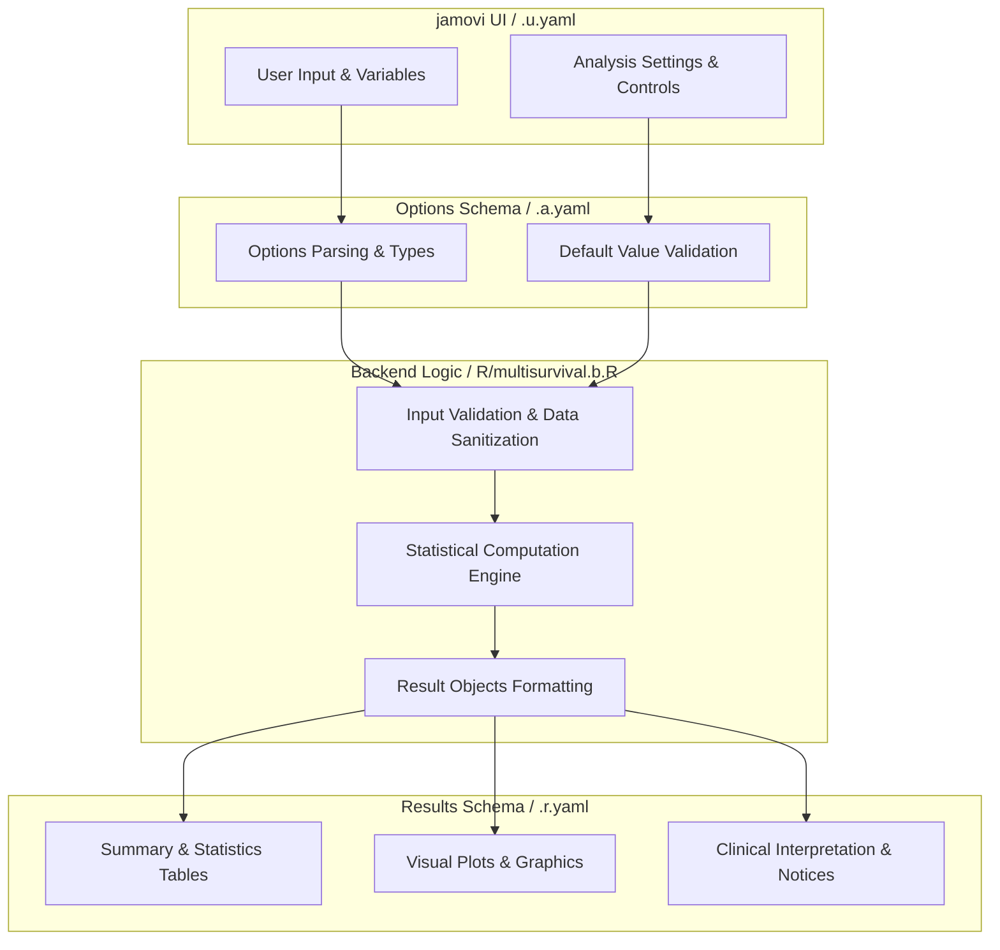
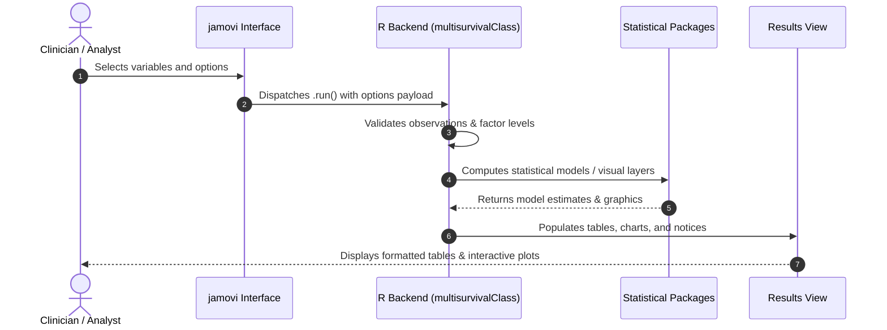

# Multivariable Survival Analysis - Developer Documentation

## 1. Overview

- **Function**: `multisurvival`
- **Title**: Multivariable Survival Analysis
- **Module**: `SurvivalT`
- **Files**:
  - `jamovi/multisurvival.u.yaml` - User Interface Definition
  - `jamovi/multisurvival.a.yaml` - Options & Schema Definition
  - `jamovi/multisurvival.r.yaml` - Results Layout & Tables
  - `R/multisurvival.b.R` - Backend Implementation
- **Summary**: Performs multivariable survival analysis using Cox proportional hazards regression. In multivariable survival analysis, person-time follow-up is crucial for properly adjusting for covariates while accounting for varying observation periods. The Cox proportional hazards model incorporates person-time by modeling the hazard function, which represents the instantaneous event rate per unit of person-time. When stratifying analyses or examining multiple predictors, the model accounts for how these factors influence event rates relative to the person-time at risk in each subgroup.

## 1a. Changelog

- **Date**: 2026-08-29
- **Summary**: Comprehensive documentation suite created & verified against active schemas and backend implementation.

## 2. Options Reference (`.a.yaml`)

| Option | Type | Default | Description |
| :--- | :--- | :--- | :--- |
| `data` | `Data` | `NULL` |  |
| `elapsedtime` | `Variable` | `NULL` | Time Elapsed |
| `tint` | `Bool` | `FALSE` | Using dates to calculate survival time |
| `dxdate` | `Variable` | `NULL` | Diagnosis Date |
| `fudate` | `Variable` | `NULL` | Follow-up Date |
| `timetypedata` | `List` | `ymd` | Time Type in Data (e.g., YYYY-MM-DD) |
| `timetypeoutput` | `List` | `months` | Time Type in Output |
| `uselandmark` | `Bool` | `FALSE` | Use landmark time |
| `landmark` | `Integer` | `3` | Landmark Time |
| `calculatedtime` | `Output` | `NULL` | Add Calculated Time to Data |
| `outcome` | `Variable` | `NULL` | Outcome |
| `outcomeLevel` | `Level` | `NULL` | Event Level |
| `dod` | `Level` | `NULL` | Dead of Disease |
| `dooc` | `Level` | `NULL` | Dead of Other |
| `awd` | `Level` | `NULL` | Alive w Disease |
| `awod` | `Level` | `NULL` | Alive w/o Disease |
| `analysistype` | `List` | `overall` | Survival Type |
| `outcomeredefined` | `Output` | `NULL` | Add Redefined Outcome to Data |
| `explanatory` | `Variables` | `NULL` | Explanatory Variables |
| `contexpl` | `Variables` | `NULL` | Continuous Explanatory Variable |
| `interactions` | `Terms` | `NULL` | Interaction Terms |
| `multievent` | `Bool` | `FALSE` | Multiple event levels |
| `hr` | `Bool` | `FALSE` | Hazards regression plot |
| `sty` | `List` | `t1` | Plot Style |
| `ph_cox` | `Bool` | `FALSE` | Proportional hazards assumption |
| `km` | `Bool` | `FALSE` | Kaplan-Meier |
| `endplot` | `Integer` | `60` | Plot End Time |
| `byplot` | `Integer` | `12` | Time Interval |
| `ci95` | `Bool` | `FALSE` | 95 percent CI |
| `risktable` | `Bool` | `FALSE` | Risktable |
| `censored` | `Bool` | `FALSE` | Censored |
| `medianline` | `List` | `none` | medianline |
| `pplot` | `Bool` | `FALSE` | p-value |
| `cutp` | `String` | `12, 36, 60` | Cutpoints |
| `calculateRiskScore` | `Bool` | `FALSE` | Calculate risk score |
| `numRiskGroups` | `List` | `four` | Number of Risk Groups |
| `plotRiskGroups` | `Bool` | `FALSE` | Plot risk group survival |
| `ci_optimism` | `Bool` | `FALSE` | Optimism-corrected C-index (bootstrap) |
| `ci_optimism_boot` | `Integer` | `150` | Bootstrap resamples (optimism) |
| `addRiskScore` | `Output` | `NULL` | Add Risk Score to Data |
| `addRiskGroup` | `Output` | `NULL` | Add Risk Group to Data |
| `ac` | `Bool` | `FALSE` | Adjusted probability curve |
| `adjexplanatory` | `Variable` | `NULL` | Variable for Adjusted Curve |
| `ac_method` | `List` | `average` | Adjustment Method |
| `ac_summary` | `Bool` | `FALSE` | Adjusted probability summary tables |
| `showNomogram` | `Bool` | `FALSE` | Nomogram |
| `compare_models` | `Bool` | `FALSE` | Covariate contribution (single-term deletion) |
| `use_stratify` | `Bool` | `FALSE` | Use variable stratification |
| `stratvar` | `Variables` | `NULL` | Stratification Variables |
| `person_time` | `Bool` | `FALSE` | Calculate person-time metrics |
| `time_intervals` | `String` | `12, 36, 60` | Time Interval Stratification |
| `rate_multiplier` | `Integer` | `100` | Rate Multiplier |
| `show_survmetrics` | `Bool` | `FALSE` | Model performance metrics |
| `survmetrics_timepoints` | `String` | `12, 24, 36, 60` | Timepoints for Brier / AUC |
| `survmetrics_show_plots` | `Bool` | `FALSE` | Brier score over time plot |
| `showExplanations` | `Bool` | `FALSE` | Analysis explanations |
| `showSummaries` | `Bool` | `TRUE` | Natural language summaries |

## 3. Results Definition (`.r.yaml`)

| Output ID | Type | Title | Description |
| :--- | :--- | :--- | :--- |
| `eventRecodeInfo` | `Html` | `Outcome Recode` |  |
| `todo` | `Html` | `To Do` |  |
| `errors` | `Html` | `Critical Errors` |  |
| `strongWarnings` | `Html` | `Strong Warnings` |  |
| `warnings` | `Html` | `Warnings` |  |
| `infoMessages` | `Html` | `Information` |  |
| `multivariableCoxHeading` | `Preformatted` | `Multivariable Survival Model` |  |
| `text` | `Html` | `Multivariable Survival` |  |
| `text2` | `Html` | `` |  |
| `interactionExplanation` | `Html` | `Interaction Terms — how to read this` |  |
| `interactionTest` | `Table` | `Interaction (Effect-Modification) Test` |  |
| `subgroupHR` | `Table` | `Within-Subgroup Hazard Ratios` |  |
| `multivariableCoxSummaryHeading` | `Preformatted` | `Natural Language Summary` |  |
| `multivariableCoxSummary` | `Html` | `` |  |
| `glossaryPanel` | `Html` | ` Statistical Glossary` |  |
| `assumptionsPanel` | `Html` | `Assumptions & Caveats` |  |
| `survMetricsTable` | `Table` | `Model Performance Metrics` |  |
| `survMetricsSummary` | `Html` | `` |  |
| `survMetricsPlot` | `Image` | `Brier Score Over Time` |  |
| `personTimeHeading` | `Preformatted` | `Person-Time Analysis` |  |
| `personTimeTable` | `Table` | `Person-Time Analysis` |  |
| `personTimeSummaryHeading` | `Preformatted` | `Person-Time Natural Language Summary` |  |
| `personTimeSummary` | `Html` | `` |  |
| `survivalPlotsHeading` | `Preformatted` | `Survival Plots` |  |
| `plot` | `Image` | `Hazards Regression Plot` |  |
| `plot3` | `Image` | `Hazards Regression Plot` |  |
| `cox_phTable` | `Table` | `Proportional Hazards Assumption` |  |
| `cox_ph` | `Preformatted` | `Proportional Hazards Diagnostics` |  |
| `plot8` | `Image` | `Proportional Hazards: Schoenfeld Residual Plots` |  |
| `plotKM` | `Image` | `Kaplan-Meier` |  |
| `risk_score_analysis` | `Preformatted` | `Risk Score Analysis` |  |
| `risk_score_analysis2` | `Html` | `Risk Score Analysis` |  |
| `riskScoreHeading` | `Preformatted` | `Risk Score Analysis` |  |
| `riskScoreSummaryHeading` | `Preformatted` | `Risk Score Natural Language Summary` |  |
| `riskScoreTable` | `Table` | `Risk Score Summary` |  |
| `riskScoreSummary` | `Html` | `` |  |
| `riskScoreMetrics` | `Html` | `Risk Score Model Metrics` |  |
| `riskGroupPlot` | `Image` | `Risk Group Survival Plot` |  |
| `cindexValidation` | `Table` | `Optimism-Corrected Discrimination (Harrell's C-index)` |  |
| `stratificationExplanation` | `Html` | `Stratification Notes` |  |
| `calculatedtime` | `Output` | `Add Calculated Time to Data` |  |
| `outcomeredefined` | `Output` | `Add Redefined Outcome to Data` |  |
| `addRiskScore` | `Output` | `Add Calculated Risk Score to Data` |  |
| `addRiskGroup` | `Output` | `Add Calculated Risk Group to Data` |  |
| `adjustedSurvivalHeading` | `Preformatted` | `Adjusted Probability Analysis` |  |
| `adjustedEstimandPanel` | `Html` | `What is being computed` |  |
| `plot_adj` | `Image` | `Adjusted Probability Plot` |  |
| `adjustedSurvivalSummaryHeading` | `Preformatted` | `Adjusted Probability Natural Language Summary` |  |
| `adjustedSurvivalSummary` | `Html` | `` |  |
| `nomogramHeading` | `Preformatted` | `Nomogram Analysis` |  |
| `plot_nomogram` | `Image` | `Nomogram` |  |
| `nomogram_display` | `Html` | `Nomogram Scoring Guide` |  |
| `nomogramSummaryHeading` | `Preformatted` | `Nomogram Natural Language Summary` |  |
| `nomogramSummary` | `Html` | `` |  |
| `adjustedSurvTable` | `Table` | `Adjusted Probability at Timepoints` |  |
| `adjustedSurvTableSummary` | `Html` | `Adjusted Probability Summary` |  |
| `adjustedMedianTable` | `Table` | `Adjusted Median Time to Event` |  |
| `adjustedMedianSummary` | `Html` | `Adjusted Median Time-to-Event Summary` |  |
| `adjustedCoxTable` | `Table` | `Adjusted Model Results` |  |
| `adjustedCoxText` | `Html` | `Adjusted Model Metrics` |  |
| `adjustedCoxSummary` | `Html` | `Adjusted Model Interpretation` |  |
| `adjustedCoxPH` | `Preformatted` | `Proportional Hazards Test (Adjusted Cox)` |  |
| `modelContributionTable` | `Table` | `Covariate Contribution (single-term deletion)` |  |
| `modelContributionSummary` | `Html` | `` |  |
| `multivariableCoxExplanation` | `Html` | `Understanding Multivariable Cox Regression` |  |
| `multivariableCoxHeading3` | `Preformatted` | `Multivariable Cox Explanations` |  |
| `adjustedSurvivalExplanation` | `Html` | `Understanding Adjusted Survival Curves` |  |
| `riskScoreExplanation` | `Html` | `Understanding Risk Score Analysis` |  |
| `nomogramExplanation` | `Html` | `Understanding Nomograms` |  |
| `personTimeExplanation` | `Html` | `Understanding Person-Time Analysis` |  |
| `stratifiedAnalysisExplanation` | `Html` | `Understanding Stratified Cox Regression` |  |
| `survivalPlotsHeading3` | `Preformatted` | `Survival Plots Explanations` |  |
| `survivalPlotsExplanation` | `Html` | `Understanding Adjusted Survival Curves and Plots` |  |

## 4. Architecture & Data Flow Diagram

## 5. Execution Sequence

## 6. Change Impact & Safety Guidelines

- **Data Filtering**: Ensure observations with missing values are handled gracefully according to analysis options.
- **Formula Conflicts**: Use isolated environment calls or base formula methods when interacting with `ggstatsplot` or formula parsers.
- **Safe Deparsing**: Use `deparse(val)` in syntax generation (`asSource()`) to escape column names with spaces or special symbols.

