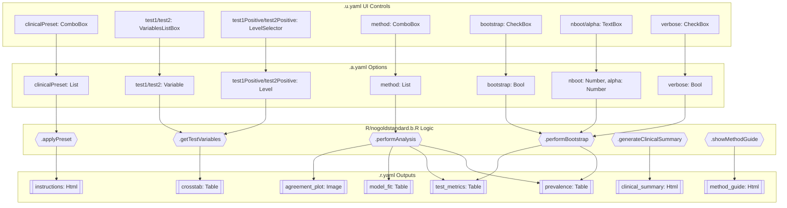
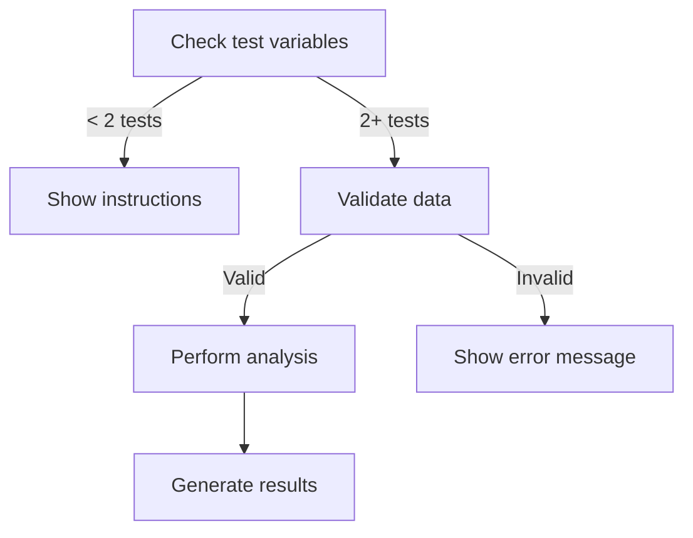
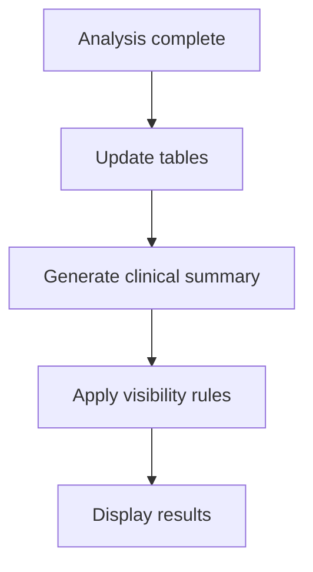

# nogoldstandard Function Documentation

## 1. Overview

- **Function**: `nogoldstandard`
- **Files**:
  - `jamovi/nogoldstandard.u.yaml` — UI
  - `jamovi/nogoldstandard.a.yaml` — Options
  - `R/nogoldstandard.b.R` — Backend
  - `jamovi/nogoldstandard.r.yaml` — Results

**Summary**: The `nogoldstandard` function analyzes diagnostic test performance when no perfect reference test (gold standard) is available. It implements multiple statistical approaches including Latent Class Analysis, Bayesian methods, and composite reference standards to estimate test sensitivity, specificity, disease prevalence, and predictive values from imperfect test results. The analysis supports 2-5 diagnostic tests and provides comprehensive performance metrics with optional bootstrap confidence intervals.

## 2. UI Controls → Options Map

| UI Control | Type | Label | Binds to Option | Defaults & Constraints | Visibility/Enable Rules |
|------------|------|-------|----------------|------------------------|-------------------------|
| `clinicalPreset` | ComboBox | Clinical Scenario | `clinicalPreset` | Default: none | Always visible |
| `test1` | VariablesListBox | Test 1 | `test1` | Required, maxItemCount: 1 | Always visible |
| `test1Positive` | LevelSelector | - | `test1Positive` | - | Enabled when `test1` selected |
| `test2` | VariablesListBox | Test 2 | `test2` | Required, maxItemCount: 1 | Always visible |
| `test2Positive` | LevelSelector | - | `test2Positive` | - | Enabled when `test2` selected |
| `test3` | VariablesListBox | Test 3 (Optional) | `test3` | Optional, maxItemCount: 1 | Always visible |
| `test3Positive` | LevelSelector | - | `test3Positive` | - | Enabled when `test3` selected |
| `test4` | VariablesListBox | Test 4 (Optional) | `test4` | Optional, maxItemCount: 1 | Always visible |
| `test4Positive` | LevelSelector | - | `test4Positive` | - | Enabled when `test4` selected |
| `test5` | VariablesListBox | Test 5 (Optional) | `test5` | Optional, maxItemCount: 1 | Always visible |
| `test5Positive` | LevelSelector | - | `test5Positive` | - | Enabled when `test5` selected |
| `method` | ComboBox | Analysis Method | `method` | Default: all_positive | Always visible |
| `bootstrap` | CheckBox | - | `bootstrap` | Default: false | Always visible |
| `nboot` | TextBox | Samples | `nboot` | Default: 1000, Range: 100-10000 | Enabled when `bootstrap` true |
| `alpha` | TextBox | Alpha | `alpha` | Default: 0.05, Range: 0.01-0.20 | Enabled when `bootstrap` true |
| `verbose` | CheckBox | Verbose Output | `verbose` | Default: false | Enabled when `bootstrap` true |

## 3. Options Reference (.a.yaml)

### Core Options

- **clinicalPreset** / List / Default: none
  - Description: Predefined clinical scenarios with optimized settings
  - Options: none, diagnostic_validation, pathology_agreement, tumor_markers, screening_evaluation
  - Downstream Effects: Applies preset configurations and shows guidance in `.applyPreset()`

- **test1, test2** / Variable / Required
  - Description: Primary diagnostic test variables (factor type)
  - Downstream Effects: Used in all analysis methods, drives `.getTestVariables()`

- **test3, test4, test5** / Variable / Optional
  - Description: Additional diagnostic test variables
  - Downstream Effects: Enables more robust Latent Class Analysis with 3+ tests

- **test1Positive, test2Positive, etc.** / Level / Required when test selected
  - Description: Defines positive level for each test
  - Downstream Effects: Used in data recoding and cross-tabulation logic

### Analysis Method Options

- **method** / List / Default: all_positive
  - Description: Statistical approach for analysis without gold standard
  - Options: latent_class, bayesian, composite, all_positive, any_positive
  - Downstream Effects: Controls analysis path in `.run()`, affects method-specific implementations

### Bootstrap Options

- **bootstrap** / Bool / Default: false
  - Description: Enable bootstrap confidence intervals
  - Downstream Effects: Triggers `.performBootstrap()` for CI calculation

- **nboot** / Number / Default: 1000 / Range: 100-10000
  - Description: Number of bootstrap samples
  - Downstream Effects: Controls bootstrap iterations in CI estimation

- **alpha** / Number / Default: 0.05 / Range: 0.01-0.20
  - Description: Alpha level for confidence intervals
  - Downstream Effects: Used in CI calculation with `qnorm(1 - alpha/2)`

- **verbose** / Bool / Default: false
  - Description: Show detailed progress during bootstrap
  - Downstream Effects: Controls progress messages in bootstrap functions

## 4. Backend Usage (.b.R)

### Primary Option Usage Locations

**`self$options$clinicalPreset`**
- **Code Location**: `.applyPreset()`, `.showWelcomeMessage()`
- **Logic Summary**: Applies preset configurations and displays guidance
- **Result Population**: Updates `instructions` HTML with preset information

**`self$options$method`**
- **Code Location**: `.run()`, `.getMethodSpecificContent()`, `.performAnalysis()`
- **Logic Summary**: Controls analysis pathway - branches to different statistical methods
- **Result Population**: Affects `test_metrics`, `prevalence`, `model_fit` tables; shows/hides method-specific outputs

**`self$options$test1, test2, test3, test4, test5`**
- **Code Location**: `.getTestVariables()`, data processing sections
- **Logic Summary**: Extracts test variables, validates data, creates analysis dataset
- **Result Population**: Drives `crosstab` table and all performance metric calculations

**`self$options$bootstrap, nboot, alpha, verbose`**
- **Code Location**: `.performBootstrap()`, CI calculation sections
- **Logic Summary**: Controls bootstrap confidence interval estimation
- **Result Population**: Updates CI columns in `test_metrics` and `prevalence` tables

### Key Backend Methods

**`.init()`**: Applies presets, shows method guide, displays welcome message
**`.run()`**: Main analysis dispatcher based on method selection
**`.performAnalysis()`**: Method-specific statistical implementations
**`.performBootstrap()`**: Bootstrap confidence interval calculations
**`.generateClinicalSummary()`**: Creates clinical interpretation HTML

### Result Population Patterns

```r
# Table updates
table <- self$results$prevalence
table$setRow(rowNo=1, values=list(...))

# HTML content updates  
self$results$instructions$setContent(html_content)
self$results$clinical_summary$setVisible(TRUE)

# Conditional visibility
self$results$model_fit$setVisible(method == "latent_class")
```

## 5. Results Definition (.r.yaml)

### HTML Outputs

- **instructions** (Html): Initial welcome and setup guidance
  - Visibility: Always visible initially, hidden when analysis ready
  - Population: `.showWelcomeMessage()`

- **clinical_summary** (Html): Clinical interpretation of results
  - Visibility: Hidden initially, shown after analysis
  - Population: `.generateClinicalSummary()`

- **method_guide** (Html): Method selection guidance with statistical background
  - Visibility: Always visible
  - Population: `.showMethodGuide()`

### Data Tables

- **prevalence** (Table): Disease prevalence estimates
  - Schema: estimate (pc), ci_lower (pc), ci_upper (pc)
  - Visibility: Always visible
  - Population: Main analysis results

- **test_metrics** (Table): Test performance metrics
  - Schema: test (text), sensitivity (pc), sens_ci_lower (pc), sens_ci_upper (pc), specificity (pc), spec_ci_lower (pc), spec_ci_upper (pc), ppv (pc), npv (pc)
  - Visibility: Always visible
  - Population: Method-specific analysis results

- **model_fit** (Table): Model fit statistics (LCA only)
  - Schema: statistic (text), value (number)
  - Visibility: `(method=="latent_class")`
  - Population: Latent Class Analysis fit metrics

- **crosstab** (Table): Test cross-tabulation
  - Schema: test_combination (text), count (integer), percentage (pc)
  - Visibility: Always visible
  - Population: Test combination frequencies

### Image Outputs

- **agreement_plot** (Image): Base R test agreement plot
  - Dimensions: 500x400
  - RenderFun: `.plot`

- **agreement_plot2** (Image): ggplot2 test agreement plot  
  - Dimensions: 500x400
  - RenderFun: `.plot_ggplot`

## 6. Data Flow Diagram (UI → Options → Backend → Results)



## 7. Execution Sequence (User Action → Results)

### User Input Flow


### Decision Logic



### Result Processing



**Step-by-step execution flow:**

1. **User interaction** → User selects test variables, defines positive levels, chooses analysis method
2. **Preset application** → If clinical preset selected, apply recommended settings via `.applyPreset()`
3. **Data validation** → Check minimum 2 tests, validate factor variables, handle missing data
4. **Method-specific analysis** → Branch based on `method` option:
   - **latent_class**: Use poLCA package for mixture modeling
   - **bayesian**: Implement EM algorithm with beta priors  
   - **composite**: Create majority vote reference standard
   - **all_positive/any_positive**: Apply conservative/liberal reference standards
5. **Bootstrap CI** → If enabled, perform bootstrap resampling for confidence intervals
6. **Result population** → Update tables (`prevalence`, `test_metrics`, `model_fit`, `crosstab`)
7. **Clinical summary** → Generate interpretative HTML content
8. **Visualization** → Create agreement plots showing test concordance
9. **Visibility control** → Show/hide outputs based on method and analysis state

## 8. Change Impact Guide

### Method Selection Impact

- **If `method` changed**:
  - Recalculates all test metrics with different statistical approach
  - Changes visibility of `model_fit` table (LCA only)  
  - Updates clinical summary interpretation
  - May affect computational time (LCA > Bayesian > others)

### Bootstrap Options Impact

- **If `bootstrap` enabled**:
  - Adds confidence interval columns to results
  - Significantly increases computation time (nboot iterations)
  - Enables progress messaging if `verbose` true
- **If `nboot` increased**: Linear increase in computation time
- **If `alpha` changed**: Affects CI width (lower alpha = wider CIs)

### Test Variable Impact

- **If test variables added/removed**:
  - Changes crosstab combinations (2^n patterns)
  - Affects LCA identifiability (3+ tests recommended)
  - Updates test_metrics table rows
  - Recalculates all performance metrics

### Common Pitfalls

- **Missing positive levels**: Analysis fails without proper level definition
- **Insufficient test overlap**: Low agreement between tests affects reliability
- **LCA convergence**: May require multiple starts or different assumptions
- **Bootstrap with small samples**: CI may be unstable with n < 100

### Recommended Defaults

- **Method: latent_class** for robust estimation with 3+ tests
- **Bootstrap: true** for research publications (with nboot ≥ 1000)  
- **Alpha: 0.05** for standard 95% confidence intervals
- **Verbose: false** for cleaner output (enable for debugging)

## 9. Example Usage

### Example Dataset Requirements

- **Variables**: 2-5 factor variables representing diagnostic test results
- **Levels**: Each test should have clear positive/negative levels
- **Sample size**: Minimum 50 observations recommended, 200+ preferred for bootstrap
- **Missing data**: Handled automatically but complete cases preferred

### Example Option Configuration

```yaml
test1: "PCR_Result"
test1Positive: "Positive"
test2: "Antigen_Test"  
test2Positive: "Pos"
test3: "Clinical_Diagnosis"
test3Positive: "Disease_Present"
method: "latent_class"
bootstrap: true
nboot: 1000
alpha: 0.05
verbose: false
```

### Expected Outputs

- **Disease prevalence** with 95% CI
- **Test performance metrics** (sensitivity, specificity, PPV, NPV) for each test
- **Model fit statistics** (AIC, BIC for LCA)
- **Cross-tabulation** showing test result combinations
- **Clinical summary** with interpretation guidance
- **Agreement plots** visualizing test concordance

## 10. Appendix (Schemas & Snippets)

### Table Schemas

**prevalence Table**:

```yaml
columns:
  - estimate: number, format=pc (percentage)
  - ci_lower: number, format=pc  
  - ci_upper: number, format=pc
```

**test_metrics Table**:

```yaml
columns:
  - test: text (test name)
  - sensitivity: number, format=pc
  - sens_ci_lower: number, format=pc
  - sens_ci_upper: number, format=pc  
  - specificity: number, format=pc
  - spec_ci_lower: number, format=pc
  - spec_ci_upper: number, format=pc
  - ppv: number, format=pc
  - npv: number, format=pc
```

### Key Code Patterns

**Option Access**:

```r
method <- self$options$method
tests <- private$.getTestVariables()
if (self$options$bootstrap) {
    # Perform bootstrap CI
}
```

**Result Population**:

```r
table <- self$results$prevalence
table$setRow(rowNo=1, values=list(
    estimate = prev_est,
    ci_lower = ci_lower,
    ci_upper = ci_upper
))

self$results$clinical_summary$setContent(html_content)
self$results$model_fit$setVisible(method == "latent_class")
```

**Variable Name Escaping**:

```r
escaped_vars <- .escapeVariableNames(var_names)
formula <- stats::as.formula(paste("cbind(", paste(escaped_vars, collapse=","), ")~1"))
```
