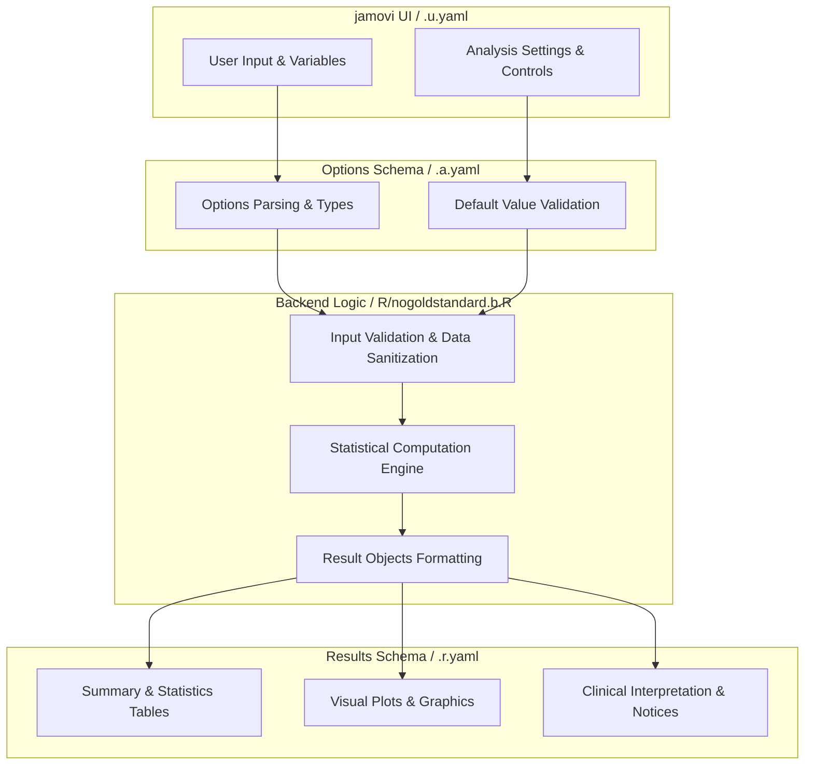
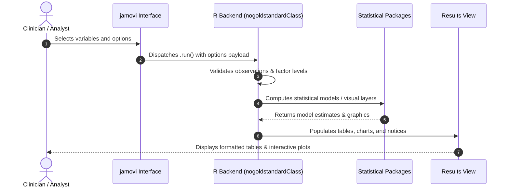

# Analysis Without Gold Standard - Developer Documentation

## 1. Overview

- **Function**: `nogoldstandard`
- **Title**: Analysis Without Gold Standard
- **Module**: `meddecide`
- **Files**:
  - `jamovi/nogoldstandard.u.yaml` - User Interface Definition
  - `jamovi/nogoldstandard.a.yaml` - Options & Schema Definition
  - `jamovi/nogoldstandard.r.yaml` - Results Layout & Tables
  - `R/nogoldstandard.b.R` - Backend Implementation
- **Summary**: Analysis of multiple binary tests when no perfect reference exists. Implements a conditional-independence two-class latent class model, fixed-prior penalized EM point estimation, and descriptive agreement with self-built composite reference rules. Latent classes are unlabeled, and reference-rule results are not diagnostic-accuracy estimates.

## 1a. Changelog

- **Date**: 2026-08-29
- **Summary**: Comprehensive documentation suite created & verified against active schemas and backend implementation.

## 2. Options Reference (`.a.yaml`)

| Option | Type | Default | Description |
| :--- | :--- | :--- | :--- |
| `data` | `Data` | `NULL` |  |
| `clinicalPreset` | `List` | `none` | Illustrative Scenario Example |
| `test1` | `Variable` | `NULL` | Test 1 |
| `test1Positive` | `Level` | `NULL` | Positive Level |
| `test2` | `Variable` | `NULL` | Test 2 |
| `test2Positive` | `Level` | `NULL` | Positive Level |
| `test3` | `Variable` | `NULL` | Test 3 |
| `test3Positive` | `Level` | `NULL` | Positive Level |
| `test4` | `Variable` | `NULL` | Test 4 |
| `test4Positive` | `Level` | `NULL` | Positive Level |
| `test5` | `Variable` | `NULL` | Test 5 |
| `test5Positive` | `Level` | `NULL` | Positive Level |
| `method` | `List` | `latent_class` | Analysis Method |
| `bootstrap` | `Bool` | `FALSE` | Bootstrap CI |
| `nboot` | `Number` | `1000` | Number of Bootstrap Samples |
| `alpha` | `Number` | `0.05` | Alpha for Confidence Intervals |
| `verbose` | `Bool` | `FALSE` | Analysis Diagnostics |
| `seed` | `Integer` | `0` | Random Seed |
| `showSummary` | `Bool` | `FALSE` | Plain-Language Summary |
| `showMethodGuide` | `Bool` | `FALSE` | Method Guide |

## 3. Results Definition (`.r.yaml`)

| Output ID | Type | Title | Description |
| :--- | :--- | :--- | :--- |
| `notices` | `Preformatted` | `Important Information` |  |
| `instructions` | `Html` | `Instructions` |  |
| `agreement_stats` | `Table` | `Agreement Statistics (Cohen's Kappa)` |  |
| `clinical_summary` | `Html` | `Plain-Language Summary` |  |
| `method_guide` | `Html` | `Method Selection Guide` |  |
| `prevalence` | `Table` | `Estimated Class or Rule Proportion` |  |
| `test_metrics` | `Table` | `Estimated Test Metrics or Rule Agreement` |  |
| `model_fit` | `Table` | `Model Fit Statistics` |  |
| `conditional_dependence` | `Table` | `Conditional Independence Check (Bivariate Residuals)` | Latent class analysis assumes the tests are conditionally independent within each latent class. For each pair this compares the observed two-way table with the one implied by the fitted model. A residual above 3.84 is descriptive evidence against conditional independence, but this squared statistic does not identify the direction or cause of dependence and cannot determine the direction of bias in the fitted parameters. Requires four or more tests: with three the model is just-identified and no residual can diagnose dependence. |
| `diagnostics` | `Preformatted` | `Analysis Diagnostics` | Detail of how the estimates were produced: sample size, method, convergence, number of random starts used, and bootstrap failures. Shown only when Verbose output is enabled. |
| `crosstab` | `Table` | `Test Cross-Tabulation` |  |
| `agreement_plot` | `Image` | `Test Agreement Matrix` |  |

## 4. Architecture & Data Flow Diagram

```mermaid
flowchart TD
  subgraph UI[jamovi UI / .u.yaml]
    U1[User Input & Variables]
    U2[Analysis Settings & Controls]
  end

  subgraph Opts[Options Schema / .a.yaml]
    O1[Options Parsing & Types]
    O2[Default Value Validation]
  end

  subgraph Backend[Backend Logic / R/nogoldstandard.b.R]
    B1[Input Validation & Data Sanitization]
    B2[Statistical Computation Engine]
    B3[Result Objects Formatting]
  end

  subgraph Res[Results Schema / .r.yaml]
    R1[Summary & Statistics Tables]
    R2[Visual Plots & Graphics]
    R3[Clinical Interpretation & Notices]
  end

  U1 --> O1
  U2 --> O2
  O1 --> B1
  O2 --> B1
  B1 --> B2
  B2 --> B3
  B3 --> R1
  B3 --> R2
  B3 --> R3
```

## 5. Execution Sequence

```mermaid
sequenceDiagram
  autonumber
  actor User as Clinician / Analyst
  participant UI as jamovi Interface
  participant Backend as R Backend (nogoldstandardClass)
  participant Engine as Statistical Packages
  participant Results as Results View

  User->>UI: Selects variables and options
  UI->>Backend: Dispatches .run() with options payload
  Backend->>Backend: Validates observations & factor levels
  Backend->>Engine: Computes statistical models / visual layers
  Engine-->>Backend: Returns model estimates & graphics
  Backend->>Results: Populates tables, charts, and notices
  Results-->>User: Displays formatted tables & interactive plots
```

## 6. Change Impact & Safety Guidelines

- **Data Filtering**: Ensure observations with missing values are handled gracefully according to analysis options.
- **Formula Conflicts**: Use isolated environment calls or base formula methods when interacting with `ggstatsplot` or formula parsers.
- **Safe Deparsing**: Use `deparse(val)` in syntax generation (`asSource()`) to escape column names with spaces or special symbols.

