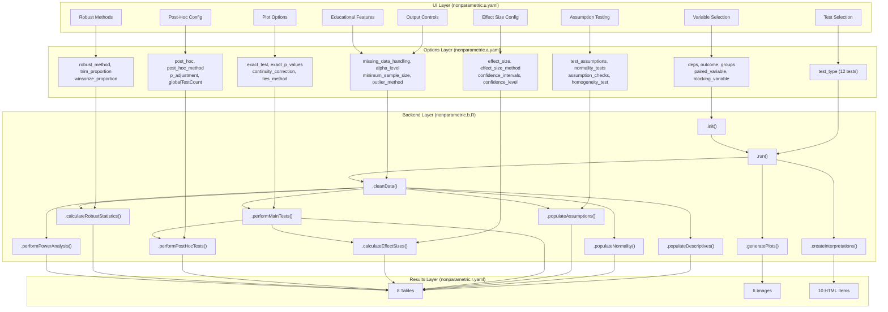
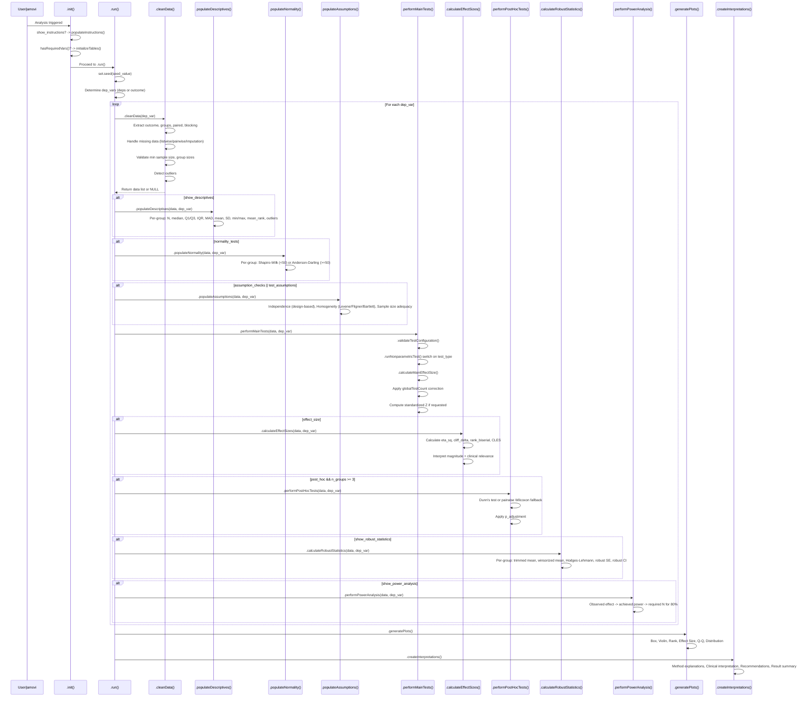

# Non-Parametric Statistical Methods (`nonparametric`) -- Developer Documentation

**Function:** `nonparametric`
**Version:** 0.0.31
**Menu:** ExplorationT > Advanced Statistical Tests
**Module prefix:** clinicopath-descriptives

| File | Path | Purpose |
|------|------|---------|
| Analysis YAML | `jamovi/nonparametric.a.yaml` | 54 options definition |
| Results YAML | `jamovi/nonparametric.r.yaml` | 24 result items |
| UI YAML | `jamovi/nonparametric.u.yaml` | 13 UI sections |
| Backend | `R/nonparametric.b.R` | ~2100 lines, R6 class |
| Header (auto) | `R/nonparametric.h.R` | Generated from YAML |
| Test data | `data/nonparametric_*.rda` | 4 datasets |
| Data script | `data-raw/create_nonparametric_test_data.R` | Test data generator |

---

## 1. Overview

Comprehensive non-parametric statistical analysis module supporting 12 test types, 9 effect size methods, 7 post-hoc methods, 5 robust estimation methods, power analysis, 6 plot types, and educational/interpretation outputs. Designed for clinical pathology research where normality assumptions are violated.

**Test types:** Mann-Whitney U, Kruskal-Wallis, Wilcoxon Signed-Rank, Friedman, Median, Van der Waerden, Mood's Median, Cochran's Q, Page's Trend, McNemar, Sign Test, Jonckheere-Terpstra.

---

## 2. UI Controls to Options Map

### Variable Selection (always visible)

| UI Control | Option | Type | Default | Notes |
|------------|--------|------|---------|-------|
| Dependent Variables (Multiple) | `deps` | Variables | null | numeric only |
| Outcome Variable (Single) | `outcome` | Variable | null | numeric only; use OR `deps` |
| Grouping Variable | `groups` | Variable | null | factor only |
| Paired/Repeated Measures Variable | `paired_variable` | Variable | null | factor; for Wilcoxon, Sign, Cochran's Q |
| Blocking Variable (for Friedman) | `blocking_variable` | Variable | null | factor; required for Friedman/Page |

### Test Selection and Main Options (CollapseBox, open)

| UI Control | Option | Default | Visibility/Enable |
|------------|--------|---------|-------------------|
| Statistical Test Method | `test_type` | `mann_whitney` | always |
| Clinical Research Context | `clinical_context` | `general` | always |

### Effect Sizes and Statistical Inference (CollapseBox, open)

| UI Control | Option | Default | Enable |
|------------|--------|---------|--------|
| Calculate Effect Sizes | `effect_size` | `true` | always |
| Effect Size Measure | `effect_size_method` | `eta_squared` | `(effect_size)` |
| Effect Size Confidence Intervals | `confidence_intervals` | `true` | `(effect_size)` |
| Confidence Level | `confidence_level` | `0.95` | always |

### Post Hoc Analysis and Multiple Comparisons (CollapseBox, open)

| UI Control | Option | Default | Enable |
|------------|--------|---------|--------|
| Pairwise Comparisons | `post_hoc` | `true` | always |
| Multiple Comparison Method | `post_hoc_method` | `dunn` | `(post_hoc)` |
| P-value Adjustment | `p_adjustment` | `holm` | `(post_hoc)` |
| Total Tests in Study | `globalTestCount` | `1` | always |

### Robust Methods and Advanced Options (CollapseBox, **collapsed**)

| UI Control | Option | Default | Enable |
|------------|--------|---------|--------|
| Robust Estimation Method | `robust_method` | `standard` | always |
| Trimming Proportion | `trim_proportion` | `0.1` | `(robust_method == 'trimmed')` |
| Winsorizing Proportion | `winsorize_proportion` | `0.1` | `(robust_method == 'winsorized')` |

### Bootstrap and Resampling Methods (CollapseBox, **collapsed**)

| UI Control | Option | Default | Enable |
|------------|--------|---------|--------|
| Bootstrap Confidence Intervals | `bootstrap_ci` | `false` | always |
| Bootstrap Samples | `bootstrap_samples` | `1000` | `(bootstrap_ci)` |

### Assumption Testing and Diagnostics (CollapseBox, open)

| UI Control | Option | Default | Enable |
|------------|--------|---------|--------|
| Test Assumptions | `test_assumptions` | `true` | always |
| Test Normality | `normality_tests` | `true` | always |
| Detailed Assumption Checking | `assumption_checks` | `true` | always |
| Homogeneity of Variance Test | `homogeneity_test` | `levene` | `(test_assumptions \|\| assumption_checks)` |

### Advanced Test Configuration (CollapseBox, **collapsed**)

| UI Control | Option | Default |
|------------|--------|---------|
| Use Exact Tests | `exact_test` | `false` |
| Use Exact P-values | `exact_p_values` | `true` |
| Continuity Correction | `continuity_correction` | `true` |
| Tie Correction | `tie_correction` | `true` |
| Method for Handling Ties | `ties_method` | `average` |

### Plots and Visualizations (CollapseBox, open)

| UI Control | Option | Default | Enable |
|------------|--------|---------|--------|
| Comprehensive Descriptive Plots | `descriptive_plots` | `true` | always |
| Show Box Plots | `show_boxplots` | `true` | always |
| Show Violin Plots | `show_violin_plots` | `false` | always |
| Show Rank Distribution Plots | `show_rank_plots` | `false` | always |
| Show Effect Size Plots | `show_effect_plots` | `true` | `(effect_size)` |
| Show Q-Q Plots | `show_qqplots` | `false` | always |

### Output Tables and Statistics (CollapseBox, **collapsed**)

| UI Control | Option | Default | Enable |
|------------|--------|---------|--------|
| Show Descriptive Statistics | `show_descriptives` | `true` | always |
| Show Test Statistics Table | `show_test_statistics` | `true` | always |
| Show Post-hoc Comparisons | `show_post_hoc_table` | `true` | `(post_hoc)` |
| Show Effect Sizes Table | `show_effect_sizes` | `true` | `(effect_size)` |
| Show Assumption Tests | `show_assumptions` | `true` | `(test_assumptions \|\| assumption_checks)` |
| Show Robust Statistics | `show_robust_statistics` | `false` | always |
| Show Power Analysis | `show_power_analysis` | `false` | always |

### Educational Features (CollapseBox, **collapsed**)

| UI Control | Option | Default |
|------------|--------|---------|
| Show Getting Started Instructions | `show_instructions` | `true` |
| Show Method Explanations | `show_explanations` | `false` |
| Show Result Interpretation | `show_interpretation` | `false` |
| Show Statistical Recommendations | `show_recommendations` | `false` |

### Reproducibility and Random Seed (CollapseBox, **collapsed**)

| UI Control | Option | Default | Enable |
|------------|--------|---------|--------|
| Set Random Seed | `set_seed` | `true` | always |
| Random Seed Value | `seed_value` | `42` | `(set_seed)` |

### Bottom-level Options (always visible, no CollapseBox)

| UI Control | Option | Default |
|------------|--------|---------|
| Missing Data Handling | `missing_data_handling` | `listwise` |
| Significance Level (Alpha) | `alpha_level` | `0.05` |
| Minimum Sample Size Warning | `minimum_sample_size` | `5` |
| Outlier Detection Method | `outlier_method` | `iqr` |
| Force Exact for Small Samples | `small_sample_exact` | `true` |
| Report Standardized Statistics | `report_standardized_statistics` | `false` |

---

## 3. Options Reference (All 54 Options)

### Variable Options (5)

| # | Name | Type | Default | Range | Downstream |
|---|------|------|---------|-------|------------|
| 1 | `data` | Data | -- | -- | All computations |
| 2 | `deps` | Variables | null | numeric | Multi-variable loop in `.run()` |
| 3 | `outcome` | Variable | null | numeric | Single-variable fallback |
| 4 | `groups` | Variable | null | factor | Group splitting, all tests |
| 5 | `paired_variable` | Variable | null | factor | Wilcoxon paired, Sign, Cochran's Q |
| 6 | `blocking_variable` | Variable | null | factor | Friedman, Page's trend, Cochran's Q |

### Test Selection (1)

| # | Name | Type | Default | Values | Downstream |
|---|------|------|---------|--------|------------|
| 7 | `test_type` | List | `mann_whitney` | 12 tests (see Overview) | `.runNonparametricTest()`, validation, interpretation |

### Effect Size Options (4)

| # | Name | Type | Default | Range | Downstream |
|---|------|------|---------|-------|------------|
| 8 | `effect_size` | Bool | `true` | -- | Gates `effectsizes` table, effect plots |
| 9 | `effect_size_method` | List | `eta_squared` | 9 methods | `.calculateMainEffectSize()` dispatch |
| 10 | `confidence_intervals` | Bool | `true` | -- | Bootstrap CI in Cliff's Delta |
| 11 | `confidence_level` | Number | `0.95` | 0.50-0.99 | CI width everywhere |

### Post-Hoc Options (4)

| # | Name | Type | Default | Values | Downstream |
|---|------|------|---------|--------|------------|
| 12 | `post_hoc` | Bool | `true` | -- | Gates `posthoc` table |
| 13 | `post_hoc_method` | List | `dunn` | dunn, conover, steel_dwass, nemenyi, pairwise_wilcoxon, games_howell, dscf | `.runPostHocTest()` |
| 14 | `p_adjustment` | List | `holm` | none, bonferroni, holm, hochberg, BH, BY | `p.adjust()` method |
| 15 | `globalTestCount` | Integer | `1` | 1-1000 | Multiplies all reported p-values |

### Robust Methods (3)

| # | Name | Type | Default | Range | Downstream |
|---|------|------|---------|-------|------------|
| 16 | `robust_method` | List | `standard` | standard, trimmed, winsorized, aligned, hodges_lehmann | `robustStatistics` table |
| 17 | `trim_proportion` | Number | `0.1` | 0.01-0.40 | `mean(trim=)` |
| 18 | `winsorize_proportion` | Number | `0.1` | 0.01-0.40 | `.winsorizedMean()` |

### Bootstrap Options (2)

| # | Name | Type | Default | Range | Downstream |
|---|------|------|---------|-------|------------|
| 19 | `bootstrap_ci` | Bool | `false` | -- | Triggers bootstrap in Cliff's Delta CI |
| 20 | `bootstrap_samples` | Integer | `1000` | 100-10000 | Number of resamples |

### Assumption Testing (4)

| # | Name | Type | Default | Values | Downstream |
|---|------|------|---------|--------|------------|
| 21 | `test_assumptions` | Bool | `true` | -- | Gates `assumptions` table |
| 22 | `normality_tests` | Bool | `true` | -- | Gates `normality` table |
| 23 | `assumption_checks` | Bool | `true` | -- | Gates `assumptions` table (OR with `test_assumptions`) |
| 24 | `homogeneity_test` | List | `levene` | levene, brown_forsythe, fligner, bartlett | Variance homogeneity test selection |

### Advanced Test Options (5)

| # | Name | Type | Default | Downstream |
|---|------|------|---------|------------|
| 25 | `exact_test` | Bool | `false` | `wilcox.test(exact=)` |
| 26 | `exact_p_values` | Bool | `true` | Enables exact when n<=50 |
| 27 | `continuity_correction` | Bool | `true` | `wilcox.test(correct=)` |
| 28 | `tie_correction` | Bool | `true` | Referenced but not directly passed |
| 29 | `ties_method` | List | `average` | `rank(ties.method=)` in descriptives |

### Visualization Options (6)

| # | Name | Type | Default | Downstream |
|---|------|------|---------|------------|
| 30 | `show_boxplots` | Bool | `true` | `boxplots` image visibility |
| 31 | `show_violin_plots` | Bool | `false` | `violinplots` image visibility |
| 32 | `show_rank_plots` | Bool | `false` | `rankplots` image visibility |
| 33 | `show_effect_plots` | Bool | `true` | `effectsizeplots` image visibility |
| 34 | `descriptive_plots` | Bool | `true` | `distributionplot`, `boxplots`, `violinplots`, `qqplots` visibility |
| 35 | `show_qqplots` | Bool | `false` | `qqplots` image visibility |

### Output Control (7)

| # | Name | Type | Default | Downstream |
|---|------|------|---------|------------|
| 36 | `show_descriptives` | Bool | `true` | `descriptives` table visibility |
| 37 | `show_test_statistics` | Bool | `true` | `tests` table visibility |
| 38 | `show_post_hoc_table` | Bool | `true` | `posthoc` table visibility |
| 39 | `show_effect_sizes` | Bool | `true` | `effectsizes` table visibility |
| 40 | `show_assumptions` | Bool | `true` | Referenced in UI enable |
| 41 | `show_robust_statistics` | Bool | `false` | `robustStatistics` table + triggers computation |
| 42 | `show_power_analysis` | Bool | `false` | `powerAnalysis` table + triggers computation |

### Educational/Interpretation (4)

| # | Name | Type | Default | Downstream |
|---|------|------|---------|------------|
| 43 | `show_instructions` | Bool | `true` | `instructions` HTML |
| 44 | `show_explanations` | Bool | `false` | 5 explanation HTML items |
| 45 | `show_interpretation` | Bool | `false` | `resultInterpretation`, `clinicalInterpretation` HTML |
| 46 | `show_recommendations` | Bool | `false` | `statisticalRecommendations` HTML |

### Clinical Context (1)

| # | Name | Type | Default | Values | Downstream |
|---|------|------|---------|--------|------------|
| 47 | `clinical_context` | List | `general` | general, treatment, biomarker, qol, diagnostic, pathological | Interpretation text |

### Reproducibility (2)

| # | Name | Type | Default | Range | Downstream |
|---|------|------|---------|-------|------------|
| 48 | `set_seed` | Bool | `true` | -- | `set.seed()` in `.run()` |
| 49 | `seed_value` | Integer | `42` | 1-999999 | Seed value |

### Advanced Clinical (5)

| # | Name | Type | Default | Range/Values | Downstream |
|---|------|------|---------|-------------|------------|
| 50 | `missing_data_handling` | List | `listwise` | listwise, pairwise, mean_imputation, median_imputation | `.cleanData()` filtering |
| 51 | `alpha_level` | Number | `0.05` | 0.001-0.10 | All significance tests |
| 52 | `minimum_sample_size` | Integer | `5` | 3-20 | Data validation warnings |
| 53 | `outlier_method` | List | `iqr` | none, iqr, modified_zscore, tukey, hampel | `.detectOutliers()`, outlier count |
| 54 | `small_sample_exact` | Bool | `true` | -- | Auto exact when n<20 |
| 55 | `report_standardized_statistics` | Bool | `false` | -- | Z-score from p-value added as note |

*(Total: 55 option entries including `data`)*

---

## 4. Backend Usage

### Execution Flow in `.run()`

```
set.seed() -> hasRequiredVars() -> FOR EACH dep_var:
  .cleanData() -> .populateDescriptives() -> .populateNormality()
  -> .populateAssumptions() -> .performMainTests()
  -> .calculateEffectSizes() -> .performPostHocTests()
  -> .calculateRobustStatistics() -> .performPowerAnalysis()
-> .generatePlots() -> .createInterpretations()
```

### Option-to-Method Mapping

| Option | Backend Method | Condition |
|--------|---------------|-----------|
| `deps` / `outcome` | Loop variable in `.run()` | Always |
| `groups` | `.cleanData()` group splitting | Always |
| `paired_variable` | `.cleanData()` paired extraction, `.runNonparametricTest()` Wilcoxon pairing | `wilcoxon_signed`, `sign_test` |
| `blocking_variable` | `.cleanData()` blocking extraction, `friedman.test()` | `friedman`, `page_trend`, `cochran_q` |
| `test_type` | `.runNonparametricTest()` switch dispatch | Always |
| `effect_size` | `.calculateEffectSizes()`, `.calculateMainEffectSize()` | `effect_size == TRUE` |
| `effect_size_method` | `.calculateMainEffectSize()` switch dispatch | `effect_size == TRUE` |
| `post_hoc` | `.performPostHocTests()` | `post_hoc == TRUE` |
| `post_hoc_method` | `.runPostHocTest()` method selection | `post_hoc == TRUE` |
| `p_adjustment` | `p.adjust()` or `dunn.test()` method arg | `post_hoc == TRUE` |
| `globalTestCount` | Multiplies reported p in `.performMainTests()` | `> 1` |
| `robust_method` | `.calculateRobustStatistics()` | `show_robust_statistics == TRUE` |
| `show_robust_statistics` | Triggers `.calculateRobustStatistics()` | Acts as both visibility and computation gate |
| `show_power_analysis` | Triggers `.performPowerAnalysis()` | Acts as both visibility and computation gate |
| `missing_data_handling` | `.cleanData()` filtering strategy | Always |
| `outlier_method` | `.detectOutliers()`, `.countOutliers()` | Always (count shown in descriptives) |
| `exact_test` / `exact_p_values` / `small_sample_exact` | `wilcox.test(exact=)` | Mann-Whitney, Wilcoxon |
| `continuity_correction` | `wilcox.test(correct=)` | Mann-Whitney, Wilcoxon |
| `ties_method` | `rank(ties.method=)` in `.populateDescriptives()` | Always |
| `homogeneity_test` | `.populateAssumptions()` test selection | `test_assumptions \|\| assumption_checks` |
| `normality_tests` | `.populateNormality()` | `normality_tests == TRUE` |
| `clinical_context` | `.createClinicalInterpretation()` | `show_interpretation == TRUE` |
| `report_standardized_statistics` | Z-score from p-value in `.performMainTests()` | `== TRUE` |

### Test Type to R Function Mapping

| test_type | R Function | Required Variables | Extra Requirements |
|-----------|-----------|-------------------|-------------------|
| `mann_whitney` | `wilcox.test(outcome ~ groups)` | deps/outcome + groups | Exactly 2 groups |
| `kruskal_wallis` | `kruskal.test(outcome ~ groups)` | deps/outcome + groups | 2+ groups |
| `wilcoxon_signed` | `wilcox.test(paired=TRUE)` | deps/outcome + groups | 2 groups; paired_variable recommended |
| `friedman` | `friedman.test()` | deps/outcome + groups + blocking_variable | blocking required |
| `median_test` | `chisq.test()` on above/below median | deps/outcome + groups | -- |
| `van_der_waerden` | Custom normal-scores chi-sq | deps/outcome + groups | -- |
| `mood_median` | `chisq.test()` or `fisher.test()` | deps/outcome + groups | Fisher for small expected counts |
| `cochran_q` | `DescTools::CochranQTest()` | deps/outcome + groups + blocking/paired | Binary outcomes |
| `page_trend` | `DescTools::PageTest()` | deps/outcome + groups + blocking/paired | Ordered groups |
| `mcnemar` | `mcnemar.test()` | deps/outcome + groups | 2x2 table |
| `sign_test` | `DescTools::SignTest()` | deps/outcome + groups | 2 groups or 1-sample |
| `jonckheere_terpstra` | `DescTools::JonckheereTerpstraTest()` | deps/outcome + groups | Ordered factor |

### Effect Size Method to Function Mapping

| Method | Function | Applicable Tests | Range |
|--------|----------|-----------------|-------|
| `eta_squared` | `.calculateEtaSquared()` | KW (multi-group) | [0, 1] |
| `epsilon_squared` | `.calculateEpsilonSquared()` | KW (multi-group) | [0, 1] |
| `rank_biserial` | `.calculateRankBiserial()` | MW (2-group) | [-1, 1] |
| `cliff_delta` | `.calculateCliffDelta()` | MW (2-group) | [-1, 1] |
| `cles` | `.calculateCLES()` | MW (2-group) | [0, 1] |
| `vargha_delaney` | `.calculateVarghaDelaney()` | MW (2-group) | [0, 1] |
| `kendall_w` | `.calculateKendallW()` | Friedman | [0, 1] |
| `glass_rank_biserial` | `.calculateGlassRankBiserial()` | MW (2-group) | [-1, 1] |
| `somers_d` | `.calculateSomersD()` | Any (ordinal) | [-1, 1] |

---

## 5. Results Definition (24 Items)

### Tables (8)

| # | ID | Title | Type | Visibility | Columns | clearWith |
|---|-----|-------|------|------------|---------|-----------|
| 1 | `descriptives` | Descriptive Statistics by Group | Table | `(show_descriptives)` | 15 cols | deps, outcome, groups, test_type |
| 2 | `normality` | Normality Assessment | Table | `(normality_tests)` | 8 cols | deps, outcome, groups, test_type |
| 3 | `assumptions` | Test Assumptions and Diagnostic Checks | Table | `(assumption_checks \|\| test_assumptions)` | 10 cols | deps, outcome, groups, test_type |
| 4 | `tests` | Non-Parametric Test Results | Table | `(show_test_statistics)` | 10 cols | deps, outcome, groups, test_type, exact_test, continuity_correction, tie_correction, confidence_level |
| 5 | `effectsizes` | Effect Size Details and Interpretation | Table | `(effect_size && show_effect_sizes)` | 8 cols | deps, outcome, groups, test_type, effect_size_method, confidence_level |
| 6 | `posthoc` | Post Hoc Pairwise Comparisons | Table | `(post_hoc && show_post_hoc_table)` | 10 cols | deps, outcome, groups, test_type, post_hoc_method, p_adjustment, confidence_level |
| 7 | `robustStatistics` | Robust Statistical Estimates | Table | `(show_robust_statistics)` | 8 cols | deps, outcome, groups, robust_method, trim_proportion, winsorize_proportion |
| 8 | `powerAnalysis` | Post-hoc Power Analysis and Sample Size | Table | `(show_power_analysis)` | 6 cols | deps, outcome, groups, test_type, effect_size |

### Images (6)

| # | ID | Title | Type | Size | Visibility | renderFun |
|---|-----|-------|------|------|------------|-----------|
| 9 | `distributionplot` | Distribution Comparison Plots | Image | 800x600 | `(descriptive_plots)` | `.distributionplot` |
| 10 | `boxplots` | Box Plots with Individual Data Points | Image | 800x600 | `(show_boxplots \|\| descriptive_plots)` | `.boxplot` |
| 11 | `violinplots` | Violin Plots with Distribution Shapes | Image | 800x600 | `(show_violin_plots \|\| descriptive_plots)` | `.violinplot` |
| 12 | `rankplots` | Rank Distribution Plots | Image | 500x350 | `(show_rank_plots)` | `.plotRankDistribution` |
| 13 | `effectsizeplots` | Effect Size Visualization with CIs | Image | 800x500 | `((show_effect_plots \|\| descriptive_plots) && effect_size)` | `.effectsizeplot` |
| 14 | `qqplots` | Q-Q Plots for Normality Assessment | Image | 800x600 | `((show_qqplots \|\| normality_tests) && descriptive_plots)` | `.qqplot` |

### HTML Items (10)

| # | ID | Title | Visibility |
|---|-----|-------|------------|
| 15 | `instructions` | Getting Started with Non-Parametric Tests | `(show_instructions)` |
| 16 | `methodExplanation` | Understanding Non-Parametric Statistical Methods | `(show_explanations)` |
| 17 | `effectSizeExplanation` | Understanding Effect Sizes in Non-Parametric Tests | `(effect_size && show_explanations)` |
| 18 | `postHocExplanation` | Understanding Post Hoc Testing and Multiple Comparisons | `(post_hoc && show_explanations)` |
| 19 | `assumptionExplanation` | Understanding Test Assumptions and Robustness | `((assumption_checks \|\| test_assumptions) && show_explanations)` |
| 20 | `robustMethodsExplanation` | Understanding Robust Statistical Methods | `(show_robust_statistics && show_explanations)` |
| 21 | `resultInterpretation` | Statistical Results Interpretation | `(show_interpretation)` |
| 22 | `clinicalInterpretation` | Clinical Significance and Practical Interpretation | `(show_interpretation)` |
| 23 | `methodsExplanation` | Statistical Methods and Assumptions Summary | `(show_explanations)` |
| 24 | `statisticalRecommendations` | Statistical Recommendations and Next Steps | `(show_recommendations)` |

---

## 6. Data Flow Diagram



---

## 7. Execution Sequence



---

## 8. Change Impact Guide

### What recalculates when key options change

| Changed Option | Recalculated Results |
|----------------|---------------------|
| `deps` or `outcome` | ALL tables, ALL plots, ALL interpretations |
| `groups` | ALL tables, ALL plots, ALL interpretations |
| `test_type` | `tests`, `effectsizes`, `posthoc`, `powerAnalysis`, all plots, all interpretations |
| `effect_size_method` | `effectsizes` table only |
| `post_hoc_method` or `p_adjustment` | `posthoc` table only |
| `confidence_level` | `tests`, `effectsizes`, `posthoc`, `robustStatistics`, effect size plots |
| `exact_test` / `continuity_correction` | `tests` table only |
| `robust_method` / `trim_proportion` / `winsorize_proportion` | `robustStatistics` table only |
| `homogeneity_test` | `assumptions` table only |
| `alpha_level` | All significance conclusions (normality, assumptions, tests, post-hoc, power) |
| `outlier_method` | `descriptives` outlier count |
| `missing_data_handling` | ALL (changes underlying data) |
| `show_*` toggles | Visibility only (no recomputation except `show_robust_statistics` and `show_power_analysis` which also gate computation) |

### Dual-role Options (gate both visibility AND computation)

- `show_robust_statistics` -- controls both `robustStatistics` table visibility and whether `.calculateRobustStatistics()` runs
- `show_power_analysis` -- controls both `powerAnalysis` table visibility and whether `.performPowerAnalysis()` runs
- `effect_size` -- controls both effect size tables/plots visibility and whether `.calculateEffectSizes()` runs
- `post_hoc` -- controls both `posthoc` table visibility and whether `.performPostHocTests()` runs
- `normality_tests` -- controls both `normality` table visibility and whether `.populateNormality()` runs
- `test_assumptions` / `assumption_checks` -- controls both `assumptions` table visibility and whether `.populateAssumptions()` runs

---

## 9. Example Usage

### Available Test Datasets

| Dataset | File | Description | N | Groups | Use For |
|---------|------|-------------|---|--------|---------|
| `nonparametric_independent` | `data/nonparametric_independent.rda` | Ki-67, mitotic count, tumor size across 4 WHO grades | 120 | G1/G2a/G2b/G3 | KW, JT, Van der Waerden, Median tests |
| `nonparametric_paired` | `data/nonparametric_paired.rda` | Pre/post treatment biomarker levels | 50 | Pre/Post | Wilcoxon signed-rank, Sign test |
| `nonparametric_repeated` | `data/nonparametric_repeated.rda` | Repeated measures across 3+ conditions | varies | 3+ levels | Friedman, Page's trend, Cochran's Q |
| `nonparametric_mcnemar` | `data/nonparametric_mcnemar.rda` | Paired categorical data | varies | 2x2 | McNemar test |

### Example R Calls

```r
# Mann-Whitney U: Compare biomarker between 2 groups
nonparametric(
    data = nonparametric_independent,
    deps = "ki67_index",
    groups = "diagnosis_binary",
    test_type = "mann_whitney",
    effect_size = TRUE,
    effect_size_method = "cliff_delta",
    post_hoc = FALSE
)

# Kruskal-Wallis with Dunn's post-hoc: Compare across 4 tumor grades
nonparametric(
    data = nonparametric_independent,
    deps = c("ki67_index", "mitotic_count"),
    groups = "tumor_grade",
    test_type = "kruskal_wallis",
    effect_size_method = "eta_squared",
    post_hoc = TRUE,
    post_hoc_method = "dunn",
    p_adjustment = "BH"
)

# Wilcoxon signed-rank: Paired pre/post comparison
nonparametric(
    data = nonparametric_paired,
    outcome = "biomarker_level",
    groups = "timepoint",
    paired_variable = "subject_id",
    test_type = "wilcoxon_signed",
    effect_size_method = "rank_biserial"
)

# Jonckheere-Terpstra: Ordered trend test across grades
nonparametric(
    data = nonparametric_independent,
    deps = "ki67_index",
    groups = "tumor_grade",
    test_type = "jonckheere_terpstra"
)

# Full analysis with robust statistics and power
nonparametric(
    data = nonparametric_independent,
    deps = "ki67_index",
    groups = "tumor_grade",
    test_type = "kruskal_wallis",
    show_robust_statistics = TRUE,
    robust_method = "trimmed",
    show_power_analysis = TRUE,
    bootstrap_ci = TRUE,
    bootstrap_samples = 2000
)
```

---

## 10. Appendix: Table Column Schemas

### descriptives (15 columns)

| Column | Title | Type | Format |
|--------|-------|------|--------|
| `variable` | Variable | text | -- |
| `group` | Group | text | -- |
| `n` | N | integer | -- |
| `missing` | Missing | integer | -- |
| `median` | Median | number | zto |
| `q1` | Q1 | number | zto |
| `q3` | Q3 | number | zto |
| `iqr` | IQR | number | zto |
| `mad` | MAD | number | zto |
| `mean` | Mean | number | zto |
| `sd` | SD | number | zto |
| `min` | Min | number | zto |
| `max` | Max | number | zto |
| `mean_rank` | Mean Rank | number | zto |
| `outliers` | Outliers | integer | -- |

### normality (8 columns)

| Column | Title | Type | Format |
|--------|-------|------|--------|
| `variable` | Variable | text | -- |
| `group` | Group | text | -- |
| `test` | Test | text | -- |
| `statistic` | Statistic | number | zto |
| `df` | df | integer | -- |
| `p` | p-value | number | zto,pvalue |
| `conclusion` | Conclusion | text | -- |
| `recommendation` | Recommendation | text | -- |

### assumptions (10 columns)

| Column | Title | Type | Format |
|--------|-------|------|--------|
| `variable` | Variable | text | -- |
| `assumption` | Assumption | text | -- |
| `test` | Test | text | -- |
| `statistic` | Statistic | number | zto |
| `df` | df | integer | -- |
| `p` | p-value | number | zto,pvalue |
| `result` | Result | text | -- |
| `assessment` | Assessment | text | -- |
| `implication` | Implication | text | -- |
| `recommendation` | Recommendation | text | -- |

### tests (10 columns)

| Column | Title | Type | Format |
|--------|-------|------|--------|
| `variable` | Variable | text | -- |
| `test` | Test | text | -- |
| `statistic` | Statistic | number | zto |
| `df` | df | integer | -- |
| `p` | p-value | number | zto,pvalue |
| `effect_size` | Effect Size | number | zto |
| `effect_measure` | Measure | text | -- |
| `effect_ci_lower` | Lower CI | number | zto |
| `effect_ci_upper` | Upper CI | number | zto |
| `interpretation` | Statistical Interpretation | text | -- |

### effectsizes (8 columns)

| Column | Title | Type | Format |
|--------|-------|------|--------|
| `variable` | Variable | text | -- |
| `measure` | Effect Size Measure | text | -- |
| `value` | Value | number | zto |
| `ci_lower` | Lower CI | number | zto |
| `ci_upper` | Upper CI | number | zto |
| `magnitude` | Magnitude | text | -- |
| `interpretation` | Interpretation | text | -- |
| `clinical_relevance` | Clinical Relevance | text | -- |

### posthoc (10 columns)

| Column | Title | Type | Format |
|--------|-------|------|--------|
| `variable` | Variable | text | -- |
| `comparison` | Comparison | text | -- |
| `statistic` | Test Statistic | number | zto |
| `p_raw` | p (raw) | number | zto,pvalue |
| `p_adjusted` | p (adjusted) | number | zto,pvalue |
| `effect_size` | Effect Size | number | zto |
| `effect_ci_lower` | Effect Size CI Lower | number | zto |
| `effect_ci_upper` | Effect Size CI Upper | number | zto |
| `significance` | Significance | text | -- |
| `interpretation` | Interpretation | text | -- |

### robustStatistics (8 columns)

| Column | Title | Type | Format |
|--------|-------|------|--------|
| `variable` | Variable | text | -- |
| `group` | Group | text | -- |
| `trimmed_mean` | Trimmed Mean | number | zto |
| `winsorized_mean` | Winsorized Mean | number | zto |
| `hodges_lehmann` | Hodges-Lehmann | number | zto |
| `robust_se` | Robust SE | number | zto |
| `robust_ci_lower` | Robust CI Lower | number | zto |
| `robust_ci_upper` | Robust CI Upper | number | zto |

### powerAnalysis (6 columns)

| Column | Title | Type | Format |
|--------|-------|------|--------|
| `variable` | Variable | text | -- |
| `comparison` | Comparison | text | -- |
| `observed_effect` | Observed Effect | number | zto |
| `power` | Achieved Power | number | zto |
| `required_n` | Required N (80% power) | integer | -- |
| `power_interpretation` | Power Assessment | text | -- |

### Effect Size Magnitude Thresholds (from `.interpretEffectSizeMagnitude()`)

| Method | Negligible | Small | Medium | Large | Reference |
|--------|-----------|-------|--------|-------|-----------|
| eta_squared / epsilon_squared | < 0.01 | 0.01-0.06 | 0.06-0.14 | >= 0.14 | Cohen 1988 |
| rank_biserial / glass_rank_biserial | < 0.1 | 0.1-0.3 | 0.3-0.5 | >= 0.5 | Cohen 1988 |
| cliff_delta | < 0.147 | 0.147-0.33 | 0.33-0.474 | >= 0.474 | Romano et al. 2006 |
| cles / vargha_delaney | dev < 0.06 | 0.06-0.14 | 0.14-0.21 | >= 0.21 | Vargha & Delaney 2000 |
| kendall_w | < 0.1 | 0.1-0.3 | 0.3-0.5 | >= 0.5 | Cohen 1988 |

### Key R Dependencies

| Package | Used For |
|---------|----------|
| `stats` (base) | `wilcox.test`, `kruskal.test`, `friedman.test`, `mcnemar.test`, `chisq.test`, `fisher.test`, `shapiro.test`, `ks.test`, `bartlett.test`, `fligner.test`, `p.adjust` |
| `car` | `leveneTest()` for homogeneity |
| `nortest` | `ad.test()` for Anderson-Darling normality |
| `DescTools` | `CochranQTest`, `PageTest`, `SignTest`, `JonckheereTerpstraTest` |
| `dunn.test` | `dunn.test()` for Dunn's post-hoc |
| `ggplot2` | All 6 plot types |
| `jmvcore` | Framework: options, tables, images, notices |
