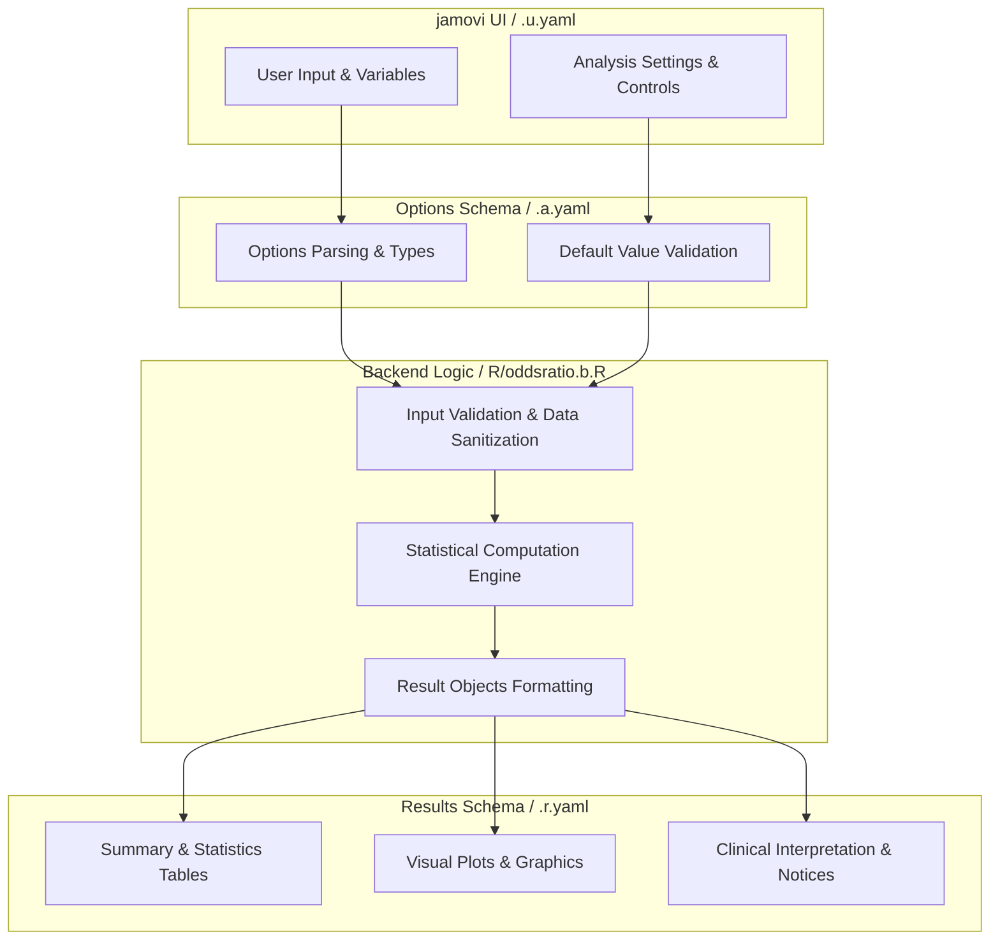
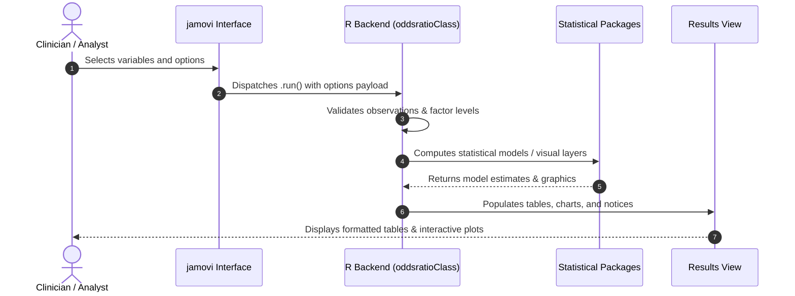

# Odds Ratio Table and Plot - Developer Documentation

## 1. Overview

- **Function**: `oddsratio`
- **Title**: Odds Ratio Table and Plot
- **Module**: `SurvivalT`
- **Files**:
  - `jamovi/oddsratio.u.yaml` - User Interface Definition
  - `jamovi/oddsratio.a.yaml` - Options & Schema Definition
  - `jamovi/oddsratio.r.yaml` - Results Layout & Tables
  - `R/oddsratio.b.R` - Backend Implementation
- **Summary**: Logistic regression odds-ratio table, forest plot, prediction nomogram, and optional binary diagnostic metrics.

## 1a. Changelog

- **Date**: 2026-08-29
- **Summary**: Comprehensive documentation suite created & verified against active schemas and backend implementation.

## 2. Options Reference (`.a.yaml`)

| Option | Type | Default | Description |
| :--- | :--- | :--- | :--- |
| `data` | `Data` | `NULL` |  |
| `explanatory` | `Variables` | `NULL` | Explanatory Variables |
| `outcome` | `Variable` | `NULL` | Binary Outcome |
| `outcomeLevel` | `Level` | `NULL` | Positive Level |
| `diagnosticPredictor` | `Variable` | `NULL` | Diagnostic Predictor (for LRs) |
| `predictorLevel` | `Level` | `NULL` | Predictor Positive Level |
| `usePenalized` | `Bool` | `FALSE` | Use Firth penalized logistic regression |
| `showNomogram` | `Bool` | `FALSE` | Prediction nomogram and diagnostic metrics |
| `showExplanations` | `Bool` | `FALSE` | Educational explanations |

## 3. Results Definition (`.r.yaml`)

| Output ID | Type | Title | Description |
| :--- | :--- | :--- | :--- |
| `todo` | `Html` | `To Do` |  |
| `errors` | `Html` | `Critical Errors` |  |
| `strongWarnings` | `Html` | `Strong Warnings` |  |
| `warnings` | `Html` | `Warnings` |  |
| `infoMessages` | `Html` | `Information` |  |
| `text` | `Html` | `Odds Ratio Table` |  |
| `text2` | `Html` | `Model Performance Metrics` |  |
| `plot` | `Image` | `` |  |
| `oddsRatioExplanation` | `Html` | `Understanding Odds Ratio Analysis` |  |
| `riskMeasuresExplanation` | `Html` | `Understanding Risk Measures` |  |
| `diagnosticTestExplanation` | `Html` | `Understanding Diagnostic Test Performance` |  |
| `plot_nomogram` | `Image` | `Prediction Nomogram` |  |
| `diagnosticMetrics` | `Html` | `Diagnostic Test Performance` |  |
| `nomogram` | `Html` | `Prediction Nomogram Details` |  |
| `nomogramAnalysisExplanation` | `Html` | `` |  |

## 4. Architecture & Data Flow Diagram

## 5. Execution Sequence

## 6. Change Impact & Safety Guidelines

- **Data Filtering**: Ensure observations with missing values are handled gracefully according to analysis options.
- **Formula Conflicts**: Use isolated environment calls or base formula methods when interacting with `ggstatsplot` or formula parsers.
- **Safe Deparsing**: Use `deparse(val)` in syntax generation (`asSource()`) to escape column names with spaces or special symbols.

