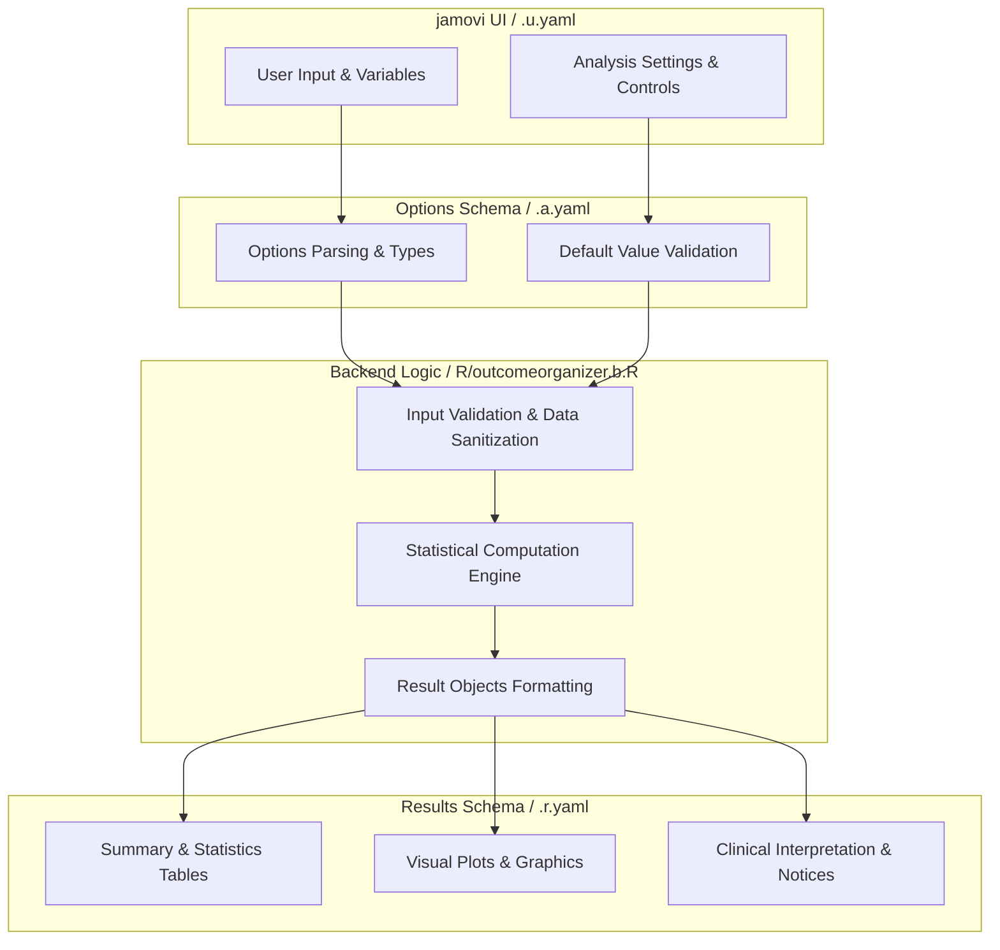
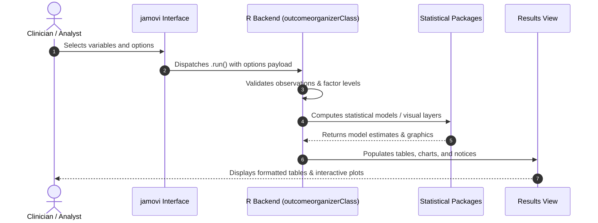

# Outcome Organizer for Survival Analysis - Developer Documentation

## 1. Overview

- **Function**: `outcomeorganizer`
- **Title**: Outcome Organizer for Survival Analysis
- **Module**: `SurvivalT`
- **Files**:
  - `jamovi/outcomeorganizer.u.yaml` - User Interface Definition
  - `jamovi/outcomeorganizer.a.yaml` - Options & Schema Definition
  - `jamovi/outcomeorganizer.r.yaml` - Results Layout & Tables
  - `R/outcomeorganizer.b.R` - Backend Implementation
- **Summary**: Advanced tool for preparing outcome variables for various types of survival analysis including overall survival, cause-specific, competing risks, progression-free survival, and multistate models.

## 1a. Changelog

- **Date**: 2026-08-29
- **Summary**: Comprehensive documentation suite created & verified against active schemas and backend implementation.

## 2. Options Reference (`.a.yaml`)

| Option | Type | Default | Description |
| :--- | :--- | :--- | :--- |
| `data` | `Data` | `NULL` |  |
| `outcome` | `Variable` | `NULL` | Outcome Variable |
| `outcomeLevel` | `Level` | `NULL` | Event Level |
| `recurrence` | `Variable` | `NULL` | Recurrence/Progression Variable |
| `recurrenceLevel` | `Level` | `NULL` | Event Level |
| `patientID` | `Variable` | `NULL` | Patient ID |
| `followupTime` | `Variable` | `NULL` | Follow-up Time |
| `analysistype` | `List` | `os` | Survival Analysis Type |
| `multievent` | `Bool` | `FALSE` | Multiple event levels |
| `dod` | `Level` | `NULL` | Dead of Disease |
| `dooc` | `Level` | `NULL` | Dead of Other Causes |
| `awd` | `Level` | `NULL` | Alive with Disease |
| `awod` | `Level` | `NULL` | Alive without Disease |
| `useHierarchy` | `Bool` | `FALSE` | Use event hierarchy |
| `eventPriority` | `Integer` | `1` | Priority Event Type |
| `intervalCensoring` | `Bool` | `FALSE` | Use interval censoring |
| `intervalStart` | `Variable` | `NULL` | Interval Start Variable |
| `intervalEnd` | `Variable` | `NULL` | Interval End Variable |
| `adminCensoring` | `Bool` | `FALSE` | Use administrative censoring |
| `adminDate` | `Variable` | `NULL` | Administrative Censoring Date |
| `outputTable` | `Bool` | `FALSE` | Output table |
| `diagnostics` | `Bool` | `FALSE` | Diagnostic information |
| `visualization` | `Bool` | `FALSE` | Outcome distribution |
| `showNaturalSummary` | `Bool` | `FALSE` | Natural language summary |
| `showGlossary` | `Bool` | `FALSE` | Survival analysis glossary |
| `addOutcome` | `Output` | `NULL` | Add Recoded Outcome to Data |

## 3. Results Definition (`.r.yaml`)

| Output ID | Type | Title | Description |
| :--- | :--- | :--- | :--- |
| `eventRecodeInfo` | `Html` | `Outcome Recode` |  |
| `todo` | `Html` | `To Do` |  |
| `errors` | `Html` | `Critical Errors` |  |
| `strongWarnings` | `Html` | `Strong Warnings` |  |
| `warnings` | `Html` | `Warnings` |  |
| `infoMessages` | `Html` | `Information` |  |
| `summary` | `Html` | `Summary of Outcome Recoding` |  |
| `outputTable` | `Table` | `Recoded Outcome Summary` |  |
| `diagnosticsTable` | `Table` | `Diagnostic Information` |  |
| `outcomeViz` | `Image` | `Outcome Distribution` |  |
| `naturalSummary` | `Html` | `Natural Language Summary (Copy-Ready)` |  |
| `glossary` | `Html` | `Survival Analysis Glossary` |  |
| `addOutcome` | `Output` | `Add Recoded Outcome to Data` |  |

## 4. Architecture & Data Flow Diagram

## 5. Execution Sequence

## 6. Change Impact & Safety Guidelines

- **Data Filtering**: Ensure observations with missing values are handled gracefully according to analysis options.
- **Formula Conflicts**: Use isolated environment calls or base formula methods when interacting with `ggstatsplot` or formula parsers.
- **Safe Deparsing**: Use `deparse(val)` in syntax generation (`asSource()`) to escape column names with spaces or special symbols.

