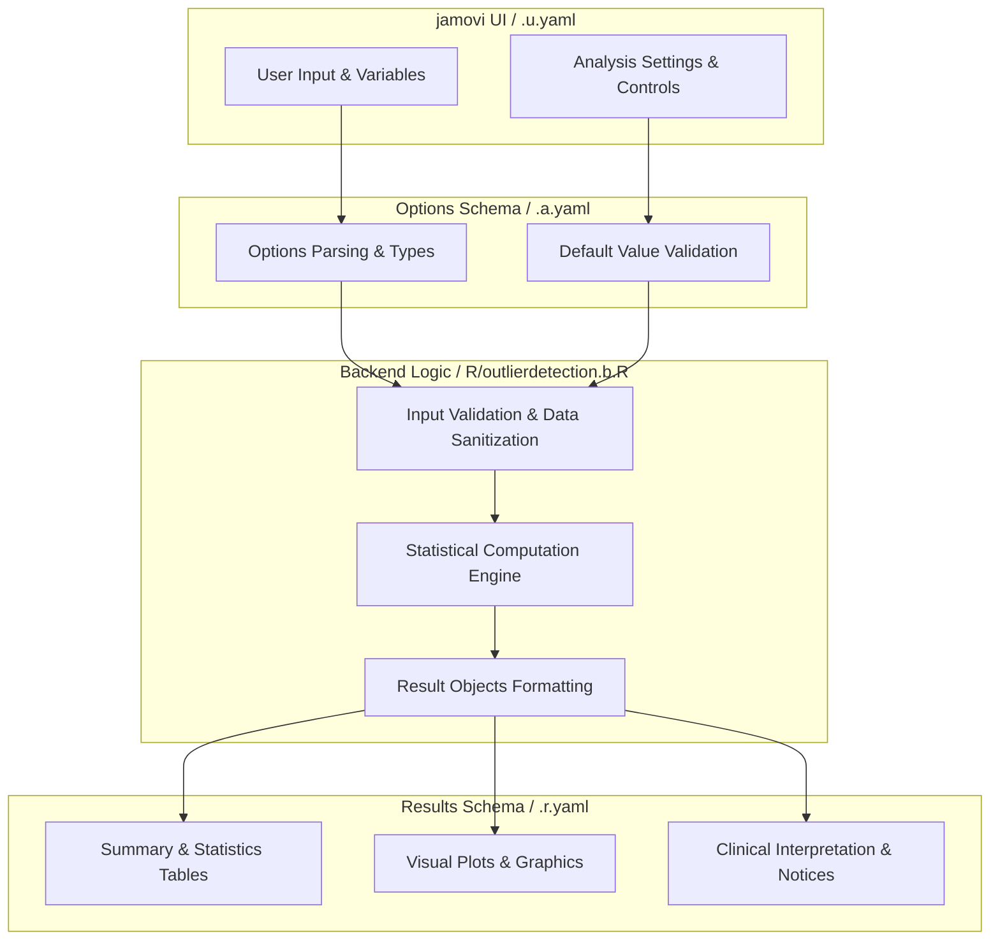
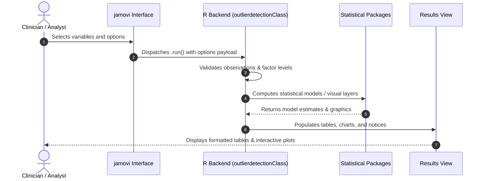

# Outlier Detection - Developer Documentation

## 1. Overview

- **Function**: `outlierdetection`
- **Title**: Outlier Detection
- **Module**: `ExplorationT`
- **Files**:
  - `jamovi/outlierdetection.u.yaml` - User Interface Definition
  - `jamovi/outlierdetection.a.yaml` - Options & Schema Definition
  - `jamovi/outlierdetection.r.yaml` - Results Layout & Tables
  - `R/outlierdetection.b.R` - Backend Implementation
- **Summary**: Outlier detection using multiple statistical methods from the easystats performance package. This module provides comprehensive outlier detection through univariate methods (Z-scores, IQR, confidence intervals), multivariate methods (Mahalanobis distance, MCD, OPTICS, LOF), and composite scoring across multiple algorithms. Complements existing data quality assessment modules with state-of-the-art outlier detection capabilities. Perfect for clinical research data quality control and preprocessing.

## 1a. Changelog

- **Date**: 2026-08-29
- **Summary**: Comprehensive documentation suite created & verified against active schemas and backend implementation.

## 2. Options Reference (`.a.yaml`)

| Option | Type | Default | Description |
| :--- | :--- | :--- | :--- |
| `data` | `Data` | `NULL` |  |
| `vars` | `Variables` | `NULL` | Variables for analysis |
| `method_category` | `List` | `composite` | Detection method category |
| `univariate_methods` | `List` | `zscore_robust` | Univariate method |
| `multivariate_methods` | `List` | `mahalanobis` | Multivariate method |
| `composite_threshold` | `Number` | `0.5` | Composite score threshold |
| `zscore_threshold` | `Number` | `3.29` | Z-score threshold |
| `iqr_multiplier` | `Number` | `1.7` | IQR multiplier |
| `confidence_level` | `Number` | `0.999` | Confidence level for intervals |
| `show_outlier_table` | `Bool` | `TRUE` | Outlier summary table |
| `show_method_comparison` | `Bool` | `FALSE` | Method comparison |
| `show_exclusion_summary` | `Bool` | `FALSE` | Exclusion recommendations |
| `show_visualization` | `Bool` | `FALSE` | Outlier visualization |
| `show_interpretation` | `Bool` | `FALSE` | Analysis interpretation |
| `sampleThreshold` | `Integer` | `10000` | Subsample above (rows) |
| `sampleSize` | `Integer` | `5000` | Rows to analyse when subsampling |
| `seed` | `Integer` | `123` | Random seed |

## 3. Results Definition (`.r.yaml`)

| Output ID | Type | Title | Description |
| :--- | :--- | :--- | :--- |
| `todo` | `Html` | `Instructions` |  |
| `warnings` | `Html` | `Analysis Messages` |  |
| `plot` | `Image` | `Outlier Detection Plot` |  |
| `outlier_table` | `Html` | `Outlier Detection Results` |  |
| `method_comparison` | `Html` | `Method Comparison` |  |
| `exclusion_summary` | `Html` | `Exclusion Recommendations` |  |
| `interpretation` | `Html` | `Analysis Interpretation` |  |

## 4. Architecture & Data Flow Diagram

## 5. Execution Sequence

## 6. Change Impact & Safety Guidelines

- **Data Filtering**: Ensure observations with missing values are handled gracefully according to analysis options.
- **Formula Conflicts**: Use isolated environment calls or base formula methods when interacting with `ggstatsplot` or formula parsers.
- **Safe Deparsing**: Use `deparse(val)` in syntax generation (`asSource()`) to escape column names with spaces or special symbols.

