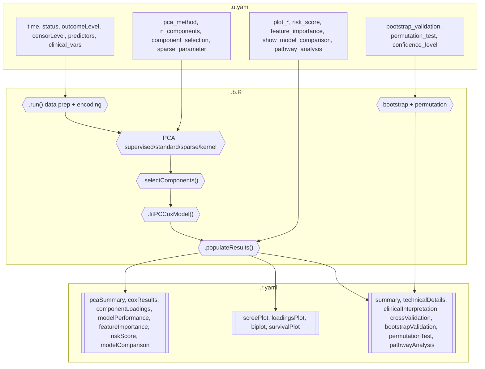

# PCA Cox Regression -- Developer Documentation

## 1. Overview

- **Function**: `pcacox`
- **Menu**: SurvivalT > Dimension Reduction Cox > PCA Cox
- **Version**: 0.0.3 (Draft)
- **Files**:
  - `jamovi/pcacox.u.yaml` -- UI
  - `jamovi/pcacox.a.yaml` -- Options (28 options excl. data)
  - `R/pcacox.b.R` -- Backend (~1400 lines)
  - `jamovi/pcacox.r.yaml` -- Results (20 outputs)

**Summary**: Principal Component Cox regression reduces high-dimensional predictor sets (e.g., gene expression, proteomics) into uncorrelated principal components for Cox proportional hazards modeling. Supports 4 PCA methods (supervised via superpc, standard via prcomp, sparse via sparsepca, kernel via kernlab) with automatic fallback chains. Includes CV-based component selection, bootstrap optimism-corrected validation, permutation testing, risk stratification, feature importance ranking, and model comparison.

---

## 2. UI Controls -> Options Map

### Variable Selectors

| UI Control | Type | Binds to Option | Default | Enable |
|------------|------|-----------------|---------|--------|
| `time` | VariablesListBox | `time` | -- | Always |
| `status` | VariablesListBox | `status` | -- | Always |
| `outcomeLevel` | LevelSelector | `outcomeLevel` | -- | `(status)` |
| `censorLevel` | LevelSelector | `censorLevel` | -- | `(status)` |
| `predictors` | VariablesListBox | `predictors` | -- | Always |
| `clinical_vars` | VariablesListBox | `clinical_vars` | -- | Always |

### Data Suitability (CollapseBox, collapsed: false)

| Control | Type | Option | Default |
|---------|------|--------|---------|
| `suitabilityCheck` | CheckBox | `suitabilityCheck` | `true` |

### Advanced PC Settings (CollapseBox, collapsed: true)

| Control | Type | Option | Default | Constraints |
|---------|------|--------|---------|-------------|
| `pca_method` | ComboBox | `pca_method` | `supervised` | supervised/standard/sparse/kernel |
| `n_components` | TextBox | `n_components` | `5` | 1--50 |
| `component_selection` | ComboBox | `component_selection` | `cv` | cv/fixed/variance/significance |
| `cv_folds` | TextBox | `cv_folds` | `10` | 3--20 |
| `variance_threshold` | TextBox | `variance_threshold` | `0.8` | 0.5--0.99 |
| `sparse_parameter` | TextBox | `sparse_parameter` | `0.1` | 0.001--1.0 |
| `scaling` | CheckBox | `scaling` | `true` | |
| `centering` | CheckBox | `centering` | `true` | |
| `survival_weighting` | CheckBox | `survival_weighting` | `true` | |

### Permutation & Validation (CollapseBox, collapsed: true)

| Control | Type | Option | Default |
|---------|------|--------|---------|
| `confidence_level` | TextBox | `confidence_level` | `0.95` |
| `permutation_test` | CheckBox | `permutation_test` | `false` |
| `n_permutations` | TextBox | `n_permutations` | `100` |
| `bootstrap_validation` | CheckBox | `bootstrap_validation` | `true` |
| `n_bootstrap` | TextBox | `n_bootstrap` | `100` |

### Plots (CollapseBox, collapsed: true)

| Control | Type | Option | Default |
|---------|------|--------|---------|
| `plot_scree` | CheckBox | `plot_scree` | `true` |
| `plot_loadings` | CheckBox | `plot_loadings` | `true` |
| `plot_biplot` | CheckBox | `plot_biplot` | `true` |
| `plot_survival` | CheckBox | `plot_survival` | `true` |

### Additional Analyses (CollapseBox, collapsed: true)

| Control | Type | Option | Default |
|---------|------|--------|---------|
| `risk_score` | CheckBox | `risk_score` | `true` |
| `show_model_comparison` | CheckBox | `show_model_comparison` | `false` |
| `pathway_analysis` | CheckBox | `pathway_analysis` | `false` |
| `feature_importance` | CheckBox | `feature_importance` | `true` |

---

## 5. Results Definition

| Output | Type | Visibility | Population Method |
|--------|------|------------|-------------------|
| `todo` | Html | always | `.init()` welcome / `.run()` errors |
| `suitabilityReport` | Html | `(suitabilityCheck)` | `.assessSuitability()` |
| `summary` | Html | always | `.generateSummary()` |
| `pcaSummary` | Table | always | `.populatePCASummary()` |
| `coxResults` | Table | always | `.formatCoxResults()` |
| `componentLoadings` | Table | always | PCA method internals |
| `modelPerformance` | Table | always | `.calculateModelPerformance()` |
| `featureImportance` | Table | `(feature_importance)` | `.calculateFeatureImportance()` |
| `riskScore` | Table | `(risk_score)` | `.calculateRiskScore()` |
| `modelComparison` | Table | `(show_model_comparison)` | `.populateModelComparison()` |
| `screePlot` | Image | `(plot_scree)` | `.prepareScreePlot()` + `.plotScree()` |
| `loadingsPlot` | Image | `(plot_loadings)` | `.prepareLoadingsPlot()` + `.plotLoadings()` |
| `biplot` | Image | `(plot_biplot)` | `.prepareBiplot()` + `.plotBiplot()` |
| `survivalPlot` | Image | `(plot_survival)` | `.prepareSurvivalPlot()` + `.plotSurvival()` |
| `crossValidation` | Html | `(component_selection:cv)` | `.populateCrossValidation()` |
| `bootstrapValidation` | Html | `(bootstrap_validation)` | `.performBootstrapValidation()` |
| `permutationTest` | Html | `(permutation_test)` | `.performPermutationTest()` |
| `pathwayAnalysis` | Html | `(pathway_analysis)` | `.performLoadingClusterAnalysis()` |
| `technicalDetails` | Html | always | `.populateTechnicalDetails()` |
| `clinicalInterpretation` | Html | always | `.populateClinicalInterpretation()` |

---

## 6. Data Flow Diagram



---

## 7. Execution Sequence

1. **`.init()`** -- Show welcome HTML if variables missing
2. **`.run()`** -- Validate inputs, encode outcomes, check time/events
3. **`.assessSuitability()`** -- EPV, missing data assessment
4. **`.performPCA()`** -- Extract design matrix, scale/center, dispatch to PCA method
5. **PCA method** -- supervised (superpc with CV threshold) / standard (prcomp) / sparse (sparsepca) / kernel (kernlab) with fallback
6. **`.selectComponents()`** -- fixed / variance threshold / CV selection
7. **`.fitPCCoxModel()`** -- `survival::coxph()` on selected PCs + clinical vars
8. **Results population** -- Summary, Cox table, performance, feature importance, risk score
9. **Validation** -- Bootstrap optimism-correction, permutation test
10. **Plots** -- ggplot2 scree, loadings, biplot, survival KM curves
11. **Clinical notices** -- Event count, discrimination assessment, completion summary

---

## 8. Change Impact Guide

| Option Changed | Recalculates | Performance |
|---------------|-------------|-------------|
| `time`/`status`/`predictors` | Everything | Full refit |
| `pca_method` | PCA + downstream | Moderate (superpc has CV) |
| `n_components` | Component selection + Cox | Fast |
| `component_selection` | Component count + Cox | Moderate (CV is slow) |
| `scaling`/`centering` | Design matrix + PCA | Moderate |
| `survival_weighting` | Supervised vs standard PCA | Moderate |
| `bootstrap_validation` | Bootstrap loop | Heavy (n_bootstrap fits) |
| `permutation_test` | Permutation loop | Heavy (n_permutations fits) |
| Display toggles | Only visibility | Negligible |

---

## 9. Example Usage

**Dataset**: `pcacox_clinical` (n=60, 10 predictors, 30 events)

```yaml
time: "time"
status: "status"
outcomeLevel: "Dead"
censorLevel: "Alive"
predictors: ["age", "bmi", "albumin", "crp", "ldh", "hemoglobin", "wbc", "platelets", "tumor_size", "ki67"]
pca_method: "standard"
n_components: 3
component_selection: "fixed"
```

---

## 10. Appendix

### Package Dependencies

| Package | Usage | Required |
|---------|-------|----------|
| `survival` | `Surv()`, `coxph()`, `concordance()`, `survfit()` | Yes |
| `superpc` | Supervised PCA | Optional (fallback to standard) |
| `sparsepca` | Sparse PCA | Optional (fallback to standard) |
| `kernlab` | Kernel PCA | Optional (fallback to standard) |
| `ggplot2` | All plot rendering | Yes (via jamovi) |
