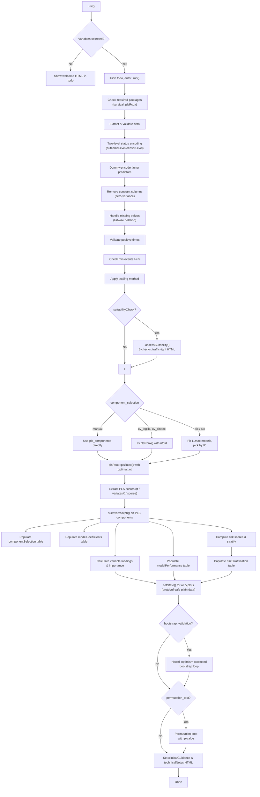

# PLS Cox Regression - Developer Documentation

> **Function:** `plscox` | **Module:** jsurvival | **Menu:** SurvivalT > Dimension Reduction Cox > PLS Cox
> **Version:** 0.0.3 | **JAS:** 1.2 | **Backend:** `R/plscox.b.R`

---

## Overview

The PLS Cox module (`plscox`) performs Partial Least Squares dimensionality reduction combined with Cox proportional hazards modeling for high-dimensional survival data. Unlike LASSO, which selects individual variables, PLS creates **latent components** -- weighted linear combinations of all predictors that maximally explain covariance with the survival outcome.

The module uses the `plsRcox` package as its core engine and supports:

- Automatic or manual component selection (CV log-likelihood, CV C-index, BIC, AIC, manual)
- Four scaling methods (standardize, unit variance, min-max, none)
- Cross-validation (LOO, 10-fold, 5-fold, none)
- Bootstrap validation (Harrell optimism-corrected C-index)
- Permutation testing for overall model significance
- Risk stratification with Kaplan-Meier survival curves
- Variable importance via Cox-weighted PLS loadings
- Data suitability assessment (traffic-light system)

---

## UI Controls to Options Map

The following table maps every UI element (from `.u.yaml`) to the corresponding YAML option (from `.a.yaml`).

| UI Section | UI Widget Type | UI Label | YAML Option | Type | Default |
|---|---|---|---|---|---|
| *Variable Supplier* | VariablesListBox | Time Variable | `time` | Variable | -- |
| *Variable Supplier* | VariablesListBox | Status Variable | `status` | Variable | -- |
| *Variable Supplier* | LevelSelector | Event Level | `outcomeLevel` | Level | -- |
| *Variable Supplier* | LevelSelector | Censored Level | `censorLevel` | Level | -- |
| *Variable Supplier* | VariablesListBox | High-dimensional Predictors | `predictors` | Variables | -- |
| Data Suitability | CheckBox | Data Suitability Assessment | `suitabilityCheck` | Bool | `true` |
| PLS Model Settings | ComboBox | Component Selection Method | `component_selection` | List | `cv_loglik` |
| PLS Model Settings | TextBox | Number of PLS Components | `pls_components` | Integer | `5` |
| PLS Model Settings | ComboBox | Cross-Validation Method | `cross_validation` | List | `k10` |
| PLS Model Settings | ComboBox | Variable Scaling | `scaling_method` | List | `standardize` |
| Advanced PLS Settings | ComboBox | Tie Handling Method | `tie_method` | List | `efron` |
| Advanced PLS Settings | TextBox | Convergence Tolerance | `tolerance` | Number | `1e-06` |
| Advanced PLS Settings | TextBox | Q-squared Limit | `limQ2set` | Number | `0.0975` |
| Advanced PLS Settings | CheckBox | Sparse PLS | `sparse_pls` | Bool | `false` |
| Advanced PLS Settings | CheckBox | P-value Variable Selection | `pvals_expli` | Bool | `false` |
| Advanced PLS Settings | TextBox | P-value Threshold | `alpha_pvals_expli` | Number | `0.05` |
| Validation | CheckBox | Bootstrap Validation | `bootstrap_validation` | Bool | `false` |
| Validation | TextBox | Bootstrap Replications | `n_bootstrap` | Integer | `200` |
| Validation | CheckBox | Permutation Test | `permutation_test` | Bool | `false` |
| Validation | TextBox | Number of Permutations | `n_permutations` | Integer | `100` |
| Risk Stratification | TextBox | Number of Risk Groups | `risk_groups` | Integer | `3` |
| Output Options | CheckBox | Confidence Intervals | `confidence_intervals` | Bool | `true` |
| Output Options | CheckBox | Variable Importance | `feature_importance` | Bool | `true` |
| Output Options | CheckBox | Prediction Accuracy | `prediction_accuracy` | Bool | `true` |
| Plots | CheckBox | Component Plots | `plot_components` | Bool | `true` |
| Plots | CheckBox | Variable Loadings Plot | `plot_loadings` | Bool | `true` |
| Plots | CheckBox | Component Scores Plot | `plot_scores` | Bool | `true` |
| Plots | CheckBox | Cross-Validation Plot | `plot_validation` | Bool | `true` |
| Plots | CheckBox | Survival Curves | `plot_survival` | Bool | `true` |

**UI enable/disable dependencies:**
- `pls_components` TextBox is enabled only when `component_selection` is `manual`
- `alpha_pvals_expli` TextBox is enabled only when `pvals_expli` is checked
- `n_bootstrap` TextBox is enabled only when `bootstrap_validation` is checked
- `n_permutations` TextBox is enabled only when `permutation_test` is checked
- `outcomeLevel` and `censorLevel` LevelSelectors are enabled only when `status` has a value

---

## Options Reference

### Input Variables

| Option | Type | Constraints | Description |
|---|---|---|---|
| `data` | Data | -- | The data frame (implicit, not user-selected). |
| `time` | Variable | Numeric, continuous | Follow-up time variable. Must be positive. |
| `status` | Variable | Factor or numeric | Event/censoring indicator. |
| `outcomeLevel` | Level | From `status` | Level that represents the event of interest. |
| `censorLevel` | Level | From `status` | Level that represents censoring (no event). |
| `predictors` | Variables | Numeric or factor | High-dimensional predictor variables. Factors are dummy-encoded. |

### PLS Model Settings

| Option | Type | Range | Default | Description |
|---|---|---|---|---|
| `pls_components` | Integer | 1--50 | 5 | Maximum number of PLS components to extract. Clamped to `min(p-1, n-2)`. Only used directly when `component_selection = manual`. |
| `cross_validation` | List | loo / k10 / k5 / none | k10 | CV strategy for component selection. LOO uses n folds, k10 uses 10, k5 uses 5. |
| `component_selection` | List | cv_loglik / cv_cindex / bic / aic / manual | cv_loglik | Method for choosing the optimal number of components. CV methods require `cross_validation != none`. |
| `scaling_method` | List | standardize / unit_variance / minmax / none | standardize | How to scale predictors before PLS. `standardize` delegates to plsRcox's `scaleX=TRUE`. |

### Advanced PLS Settings

| Option | Type | Range | Default | plsRcox Default | Description |
|---|---|---|---|---|---|
| `tolerance` | Number | 1e-10 -- 1e-03 | 1e-06 | 1e-12 | Convergence tolerance passed to `tol_Xi` in `plsRcox::plsRcox()`. |
| `tie_method` | List | efron / breslow | efron | efron | Tie handling in Cox partial likelihood. Efron is more accurate. |
| `sparse_pls` | Bool | -- | false | false | Enable sparse PLS for automatic variable selection within components. |
| `limQ2set` | Number | 0.0 -- 1.0 | 0.0975 | 0.0975 | Q-squared threshold for PLS component stopping criterion. |
| `pvals_expli` | Bool | -- | false | false | Use p-value based predictor selection during PLS fitting. |
| `alpha_pvals_expli` | Number | 0.001 -- 0.50 | 0.05 | 0.05 | Significance level for p-value based variable selection. |

### Validation

| Option | Type | Range | Default | Description |
|---|---|---|---|---|
| `bootstrap_validation` | Bool | -- | false | Perform Harrell's optimism-corrected bootstrap validation. |
| `n_bootstrap` | Integer | 50--2000 | 200 | Number of bootstrap replications. |
| `permutation_test` | Bool | -- | false | Perform permutation test for overall model significance. |
| `n_permutations` | Integer | 50--1000 | 100 | Number of permutations. |

### Risk Stratification & Output

| Option | Type | Range | Default | Description |
|---|---|---|---|---|
| `risk_groups` | Integer | 2--5 | 3 | Number of risk groups for quantile-based stratification. |
| `confidence_intervals` | Bool | -- | true | Show HR confidence intervals in model coefficients table. |
| `feature_importance` | Bool | -- | true | Show variable loadings and Cox-weighted importance scores. |
| `prediction_accuracy` | Bool | -- | true | Show model performance metrics (C-index, R-squared, AIC, BIC). |
| `suitabilityCheck` | Bool | -- | true | Run data suitability assessment before analysis. |

### Plot Toggles

| Option | Default | Controls Visibility Of |
|---|---|---|
| `plot_components` | true | `componentPlot` (800x600) |
| `plot_loadings` | true | `loadingsPlot` (800x600) |
| `plot_scores` | true | `scoresPlot` (800x600) |
| `plot_validation` | true | `validationPlot` (800x500) |
| `plot_survival` | true | `survivalPlot` (800x600) |

---

## Backend Usage

### Class Hierarchy

```
plscoxBase (auto-generated from YAML in plscox.h.R)
  └── plscoxClass (R/plscox.b.R)
        ├── private$.init()
        ├── private$.run()
        ├── private$.plotComponents()
        ├── private$.plotLoadings()
        ├── private$.plotScores()
        ├── private$.plotValidation()
        ├── private$.plotSurvival()
        ├── private$.assessSuitability()
        └── private$.generateSuitabilityHtml()
```

### Key R Packages Called

| Package | Functions Used | Purpose |
|---|---|---|
| `plsRcox` | `plsRcox()`, `cv.plsRcox()` | Core PLS-Cox fitting and cross-validation |
| `survival` | `Surv()`, `coxph()`, `survfit()`, `survdiff()`, `concordance()` | Cox modeling and survival objects |
| `survminer` | `ggsurvplot()` | Enhanced survival curve visualization |
| `ggplot2` | Various | All non-survival plots |
| `ggrepel` | `geom_text_repel()` | Non-overlapping labels on loading plots |
| `glue` | `glue()` | HTML content generation |

### API Call Patterns

**PLS Model Fitting:**
```r
pls_model <- plsRcox::plsRcox(
    Xplan = pred_matrix,     # numeric matrix (factors dummy-encoded)
    time = time_var,          # positive numeric vector
    event = status_var,       # 0/1 numeric vector
    nt = optimal_nt,          # integer: number of components
    scaleX = TRUE,            # TRUE when scaling_method == "standardize"
    tol_Xi = 1e-06,           # convergence tolerance
    limQ2set = 0.0975,        # Q-squared stopping threshold
    sparse = FALSE,           # sparse PLS mode
    pvals.expli = FALSE,      # p-value variable selection
    alpha.pvals.expli = 0.05, # alpha for p-value selection
    verbose = FALSE
)
```

**Cross-Validation:**
```r
pls_cv <- plsRcox::cv.plsRcox(
    data = list(x = pred_matrix, time = time_var, status = status_var),
    method = "efron",
    nt = max_components,
    nfold = 10,
    scaleX = TRUE,
    plot.it = FALSE,
    verbose = FALSE,
    allCVcrit = FALSE  # TRUE for cv_cindex selection
)
```

---

## Results Definition

All items from `plscox.r.yaml` (17 total):

| # | Item Name | Type | Dimensions | Visibility | Render Function |
|---|---|---|---|---|---|
| 1 | `todo` | Html | -- | always (hidden when vars selected) | -- (set in `.init`) |
| 2 | `suitabilityReport` | Html | -- | `(suitabilityCheck)` | -- |
| 3 | `modelSummary` | Html | -- | always | -- |
| 4 | `componentSelection` | Table | 5 columns | always | -- |
| 5 | `modelCoefficients` | Table | 8 columns | always | -- |
| 6 | `variableLoadings` | Table | 5 columns | `(feature_importance)` | -- |
| 7 | `modelPerformance` | Table | 5 columns | `(prediction_accuracy)` | -- |
| 8 | `riskStratification` | Table | 7 columns | always | -- |
| 9 | `componentPlot` | Image | 800x600 | `(plot_components)` | `.plotComponents` |
| 10 | `loadingsPlot` | Image | 800x600 | `(plot_loadings)` | `.plotLoadings` |
| 11 | `scoresPlot` | Image | 800x600 | `(plot_scores)` | `.plotScores` |
| 12 | `validationPlot` | Image | 800x500 | `(plot_validation)` | `.plotValidation` |
| 13 | `survivalPlot` | Image | 800x600 | `(plot_survival)` | `.plotSurvival` |
| 14 | `bootstrapResults` | Html | -- | `(bootstrap_validation)` | -- |
| 15 | `permutationResults` | Html | -- | `(permutation_test)` | -- |
| 16 | `clinicalGuidance` | Html | -- | always | -- |
| 17 | `technicalNotes` | Html | -- | always | -- |

### Table Column Details

**componentSelection:** `n_components` (integer), `cv_score` (number), `se_cv_score` (number), `c_index` (number), `selected` (text)

**modelCoefficients:** `component` (text), `coefficient` (number), `hr` (number), `hr_lower` (number), `hr_upper` (number), `se` (number), `z_value` (number), `p_value` (number, format: zto,pvalue)

**variableLoadings:** `variable` (text), `component_1` (number), `component_2` (number), `component_3` (number), `importance_score` (number)

**modelPerformance:** `metric` (text), `value` (number), `se` (number), `lower_ci` (number), `upper_ci` (number)

**riskStratification:** `risk_group` (text), `n_subjects` (integer), `n_events` (integer), `median_survival` (number), `survival_se` (number), `hr_vs_low` (number), `hr_p_value` (number, format: zto,pvalue)

---

## Data Flow Diagram



---

## Execution Sequence

```
.init()
  ├── No variables selected → Show welcome HTML
  └── Variables present → Hide welcome

.run()
  [1]  Validate inputs (time, status, predictors non-null)
  [2]  Check required packages (survival, plsRcox)
  [3]  Extract data, encode status via outcomeLevel/censorLevel
  [4]  Dummy-encode factor predictors (model.matrix)
  [5]  Remove zero-variance columns
  [6]  Listwise deletion of missing values
  [7]  Validate positive survival times, check >= 5 events
  [8]  Apply variable scaling (standardize/unit_variance/minmax/none)
  [9]  Data suitability assessment (if suitabilityCheck)
  [10] Determine optimal_nt via component_selection method
       - manual: use pls_components directly
       - cv_loglik/cv_cindex: cv.plsRcox() cross-validation
       - bic/aic: fit models for k=1..max, pick min IC
  [11] Fit final PLS model with plsRcox::plsRcox(nt = optimal_nt)
  [12] Extract PLS scores from model (tt, variatesX, or scores field)
  [13] Fit survival::coxph() on PLS component scores
  [14] Populate componentSelection table
  [15] Populate modelCoefficients table (with optional CIs)
  [16] Calculate Cox-weighted importance scores (if feature_importance)
  [17] Populate variableLoadings table (top 100 by importance)
  [18] Compute model performance metrics (if prediction_accuracy)
  [19] Compute linear predictor, quantile-cut into risk groups
  [20] Populate riskStratification table (HR vs low risk group)
  [21] Store plot state (protobuf-safe: plain data.frames and vectors)
  [22] Generate clinical guidance HTML
  [23] Generate technical notes HTML
  [24] Run bootstrap validation loop (if bootstrap_validation)
  [25] Run permutation test loop (if permutation_test)

.plotComponents(image, ...)   → AIC vs number of components (from InfCrit)
.plotLoadings(image, ...)     → Scatter/bar of variable loadings on components 1-2
.plotScores(image, ...)       → Component 1 score vs survival time, colored by event
.plotValidation(image, ...)   → CV score vs number of components with error bars
.plotSurvival(image, ...)     → Kaplan-Meier curves by risk group (survminer)
```

---

## Change Impact Guide

When modifying the plscox function, use this table to understand which files need coordinated changes.

| Change Type | Files to Modify | Regenerate? |
|---|---|---|
| Add new option | `plscox.a.yaml`, `plscox.u.yaml`, `R/plscox.b.R` | Yes: run `jmvtools::prepare()` to regenerate `plscox.h.R` |
| Change option default | `plscox.a.yaml` | Yes: regenerate `.h.R` |
| Add new output table/plot | `plscox.r.yaml`, `R/plscox.b.R` | Yes: regenerate `.h.R` |
| Change table columns | `plscox.r.yaml`, `R/plscox.b.R` | Yes: regenerate `.h.R` |
| Fix backend logic only | `R/plscox.b.R` | No |
| Change UI layout only | `plscox.u.yaml` | No |
| Add new plot | `plscox.r.yaml` (Image item + renderFun), `R/plscox.b.R` (render function + setState), `plscox.u.yaml` (CheckBox toggle) | Yes |
| Modify clearWith dependencies | `plscox.r.yaml` | No |

**Critical rule:** Never edit `R/plscox.h.R` directly. It is auto-generated from the YAML files by `jmvtools::prepare()`.

---

## Example Usage (R Console)

```r
# Load package in development mode
devtools::load_all(".")

# Load test dataset
load("data/plscox_metabolomics.rda")

# Run PLS Cox with defaults
plscox(
  data = plscox_metabolomics,
  time = "survival_months",
  status = "death",
  outcomeLevel = "Dead",
  censorLevel = "Alive",
  predictors = c("age", "gender", "bmi",
                  paste0("METAB_", sprintf("%03d", 1:80)))
)

# Run with bootstrap validation and sparse PLS
plscox(
  data = plscox_metabolomics,
  time = "survival_months",
  status = "death",
  outcomeLevel = "Dead",
  censorLevel = "Alive",
  predictors = paste0("METAB_", sprintf("%03d", 1:80)),
  pls_components = 10,
  component_selection = "cv_cindex",
  cross_validation = "k5",
  sparse_pls = TRUE,
  bootstrap_validation = TRUE,
  n_bootstrap = 100,
  risk_groups = 4
)
```

---

## Appendix

### State Management (Protobuf Safety)

All five plots share the same plot state object. State must contain only plain R types to avoid serialization errors.

| State Field | R Type | Source |
|---|---|---|
| `pls_scores` | data.frame | `as.data.frame(pls_model$tt)` |
| `loadings_matrix` | data.frame | `as.data.frame(pls_model$wwetoile)` |
| `inf_crit` | data.frame | `as.data.frame(pls_model$InfCrit)` |
| `time_var` | numeric vector | `as.numeric(time_var)` |
| `status_var` | numeric vector | `as.numeric(status_var)` |
| `risk_categories` | character vector | `as.character(risk_categories)` |
| `optimal_nt` | integer | `as.integer(optimal_nt)` |
| `cv_results` | data.frame or NULL | `as.data.frame(cv_results)` |
| `feature_importance` | logical | from `self$options$feature_importance` |
| `confidence_intervals` | logical | from `self$options$confidence_intervals` |

### File Locations

| File | Path | Purpose |
|---|---|---|
| Analysis definition | `jamovi/plscox.a.yaml` | 30 options (29 user-facing + data) |
| Results definition | `jamovi/plscox.r.yaml` | 17 output items (4 HTML, 4 tables, 5 plots, 2 validation HTML, 2 guidance HTML) |
| UI definition | `jamovi/plscox.u.yaml` | 8 collapsible sections |
| Backend | `R/plscox.b.R` | R6 class (~1380 lines, .run + 5 plots + 2 suitability helpers) |
| Auto-generated header | `R/plscox.h.R` | Compiled from YAML (do not edit) |
| Test data generator | `data-raw/create_plscox_test_data.R` | 3 synthetic datasets |
| Test datasets | `data/plscox_metabolomics.rda`, `data/plscox_small.rda`, `data/plscox_genomic.rda` | RDA format |

### References

Declared in `plscox.r.yaml` under `refs:`:
- `ClinicoPathJamoviModule`
- `plsRcox`
- `survival`
- `ggrepel`
- `survminer`

---

## Changelog

| Date | Change | Author |
|---|---|---|
| 2026-03-13 | Initial comprehensive developer documentation created | Claude |
