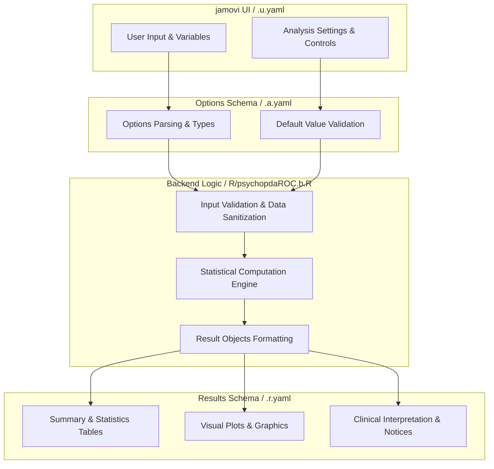
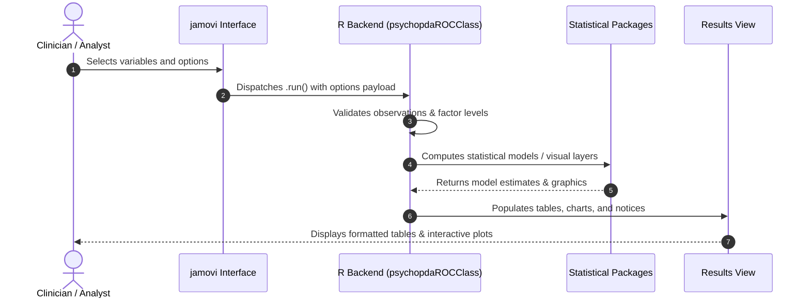

# Advanced ROC Analysis - Developer Documentation

## 1. Overview

- **Function**: `psychopdaROC`
- **Title**: Advanced ROC Analysis
- **Module**: `meddecide`
- **Files**:
  - `jamovi/psychopdaROC.u.yaml` - User Interface Definition
  - `jamovi/psychopdaROC.a.yaml` - Options & Schema Definition
  - `jamovi/psychopdaROC.r.yaml` - Results Layout & Tables
  - `R/psychopdaROC.b.R` - Backend Implementation
- **Summary**: Receiver Operating Characteristic (ROC) curve analysis with optimal cutpoint determination.

## 1a. Changelog

- **Date**: 2026-08-29
- **Summary**: Comprehensive documentation suite created & verified against active schemas and backend implementation.

## 2. Options Reference (`.a.yaml`)

| Option | Type | Default | Description |
| :--- | :--- | :--- | :--- |
| `manualRun` | `Bool` | `FALSE` | Run manually |
| `run` | `Action` | `NULL` | Run |
| `clinicalMode` | `List` | `basic` | Analysis Level |
| `data` | `Data` | `NULL` |  |
| `dependentVars` | `Variables` | `NULL` | Test Variables |
| `classVar` | `Variable` | `NULL` | Class Variable (Gold Standard) |
| `positiveClass` | `Level` | `NULL` | Positive Class |
| `subGroup` | `Variable` | `NULL` | Subgroup Variable (Optional) |
| `method` | `List` | `maximize_metric` | Cutpoint Method |
| `metric` | `List` | `youden` | Optimization Metric |
| `direction` | `List` | `>=` | Classification Direction |
| `specifyCutScore` | `String` | `` | Manual Cutpoint Value |
| `tol_metric` | `Number` | `1e-06` | Metric Tolerance |
| `break_ties` | `List` | `mean` | Tie Breaking Method |
| `allObserved` | `Bool` | `FALSE` | All observed cutpoints |
| `boot_runs` | `Integer` | `0` | Bootstrap Iterations |
| `seed` | `Integer` | `123` | Random Seed |
| `usePriorPrev` | `Bool` | `FALSE` | Use prior prevalence |
| `priorPrev` | `Number` | `0.5` | Prior Prevalence Value |
| `costratioFP` | `Number` | `1` | Cost Ratio (FP:FN) |
| `sensSpecTable` | `Bool` | `FALSE` | Confusion matrices |
| `showThresholdTable` | `Bool` | `FALSE` | Threshold table |
| `maxThresholds` | `Integer` | `20` | Maximum Thresholds to Display |
| `delongTest` | `Bool` | `FALSE` | Compare test performance statistically |
| `plotROC` | `Bool` | `TRUE` | ROC curves |
| `combinePlots` | `Bool` | `TRUE` | Combine multiple ROC curves |
| `cleanPlot` | `Bool` | `FALSE` | Publication-ready plot |
| `showOptimalPoint` | `Bool` | `TRUE` | Mark optimal cutpoint |
| `displaySE` | `Bool` | `FALSE` | Standard error bands |
| `smoothing` | `Bool` | `FALSE` | Apply LOESS smoothing |
| `showConfidenceBands` | `Bool` | `FALSE` | Confidence bands |
| `legendPosition` | `List` | `right` | Legend Position |
| `directLabel` | `Bool` | `FALSE` | Direct curve labels |
| `interactiveROC` | `Bool` | `FALSE` | Create interactive plot |
| `showCriterionPlot` | `Bool` | `FALSE` | Sensitivity/Specificity vs threshold |
| `showPrevalencePlot` | `Bool` | `FALSE` | Predictive values vs prevalence |
| `showDotPlot` | `Bool` | `FALSE` | Test value distribution |
| `precisionRecallCurve` | `Bool` | `FALSE` | Precision-recall curve |
| `partialAUC` | `Bool` | `FALSE` | Partial AUC |
| `partialAUCfrom` | `Number` | `0.8` | Partial AUC From (Specificity) |
| `partialAUCto` | `Number` | `1` | Partial AUC To (Specificity) |
| `rocSmoothingMethod` | `List` | `none` | ROC Smoothing Method |
| `bootstrapCI` | `Bool` | `FALSE` | Bootstrap confidence intervals |
| `bootstrapReps` | `Integer` | `2000` | Bootstrap Replications |
| `quantileCIs` | `Bool` | `FALSE` | CIs at quantiles |
| `quantiles` | `String` | `0.1,0.25,0.5,0.75,0.9` | Quantile Positions |
| `compareClassifiers` | `Bool` | `FALSE` | Compare classifier performance |
| `calculateIDI` | `Bool` | `FALSE` | Discrimination improvement (IDI) |
| `calculateNRI` | `Bool` | `FALSE` | Reclassification improvement (NRI) |
| `refVar` | `Level` | `NULL` | Reference Variable |
| `nriThresholds` | `String` | `` | NRI Risk Categories |
| `idiNriBootRuns` | `Integer` | `1000` | IDI/NRI Bootstrap Iterations |
| `effectSizeAnalysis` | `Bool` | `FALSE` | Effect size analysis |
| `powerAnalysis` | `Bool` | `FALSE` | Statistical power analysis |
| `powerAnalysisType` | `List` | `post_hoc` | Power Analysis Type |
| `expectedAUCDifference` | `Number` | `0.1` | Expected AUC Difference |
| `targetPower` | `Number` | `0.8` | Target Statistical Power |
| `significanceLevel` | `Number` | `0.05` | Significance Level (Alpha) |
| `correlationROCs` | `Number` | `0.5` | ROC Correlation |
| `bayesianAnalysis` | `Bool` | `FALSE` | Bootstrap ROC analysis with prior weighting |
| `priorAUC` | `Number` | `0.7` | Prior AUC Belief |
| `priorPrecision` | `Number` | `10` | Prior Precision |
| `clinicalUtilityAnalysis` | `Bool` | `FALSE` | Clinical utility analysis |
| `treatmentThreshold` | `String` | `0.05,0.5,0.05` | Treatment Threshold Range |
| `harmBenefitRatio` | `Number` | `0.25` | Harm-to-Benefit Ratio |
| `interventionCost` | `Bool` | `FALSE` | Intervention cost analysis |
| `fixedSensSpecAnalysis` | `Bool` | `FALSE` | Fixed sensitivity/Specificity analysis |
| `fixedAnalysisType` | `List` | `sensitivity` | Fixed Analysis Type |
| `fixedSensitivityValue` | `Number` | `0.9` | Target Sensitivity |
| `fixedSpecificityValue` | `Number` | `0.9` | Target Specificity |
| `showFixedROC` | `Bool` | `TRUE` | Fixed point ROC curve |
| `fixedInterpolation` | `List` | `linear` | Interpolation Method |
| `showFixedExplanation` | `Bool` | `TRUE` | Analysis guide |
| `metaAnalysis` | `Bool` | `FALSE` | Meta-analysis of ROC curves |
| `metaAnalysisMethod` | `List` | `both` | Meta-Analysis Method |
| `heterogeneityTest` | `Bool` | `TRUE` | Test for heterogeneity |
| `forestPlot` | `Bool` | `FALSE` | Forest plot |
| `overrideMetaAnalysisWarning` | `Bool` | `FALSE` | Override independence warning (advanced users only) |

## 3. Results Definition (`.r.yaml`)

| Output ID | Type | Title | Description |
| :--- | :--- | :--- | :--- |
| `instructions` | `Html` | `` |  |
| `procedureNotes` | `Html` | `` |  |
| `runSummary` | `Html` | `Analysis Status` |  |
| `clinicalInterpretationTable` | `Table` | `Clinical Interpretation` |  |
| `resultsTable` | `Array` | `Optimal Cutpoints and Performance` |  |
| `sensSpecTable` | `Array` | `Confusion Matrices` |  |
| `thresholdTable` | `Table` | `Detailed Threshold Performance` |  |
| `fixedSensSpecTable` | `Table` | `Fixed Sensitivity/Specificity Results` |  |
| `fixedSensSpecExplanation` | `Html` | `Fixed Sensitivity/Specificity Analysis Guide` |  |
| `aucSummaryTable` | `Table` | `Area Under the ROC Curve` |  |
| `delongComparisonTable` | `Table` | `DeLong Test Pairwise Comparisons` |  |
| `delongTest` | `Preformatted` | `DeLong Test Details` |  |
| `plotROC` | `Array` | `ROC Curves` |  |
| `interactivePlot` | `Image` | `Interactive ROC Plot` |  |
| `fixedSensSpecROC` | `Array` | `Fixed Sensitivity/Specificity ROC Curves` |  |
| `criterionPlot` | `Array` | `Sensitivity/Specificity vs. Threshold` |  |
| `prevalencePlot` | `Array` | `Predictive Values vs. Prevalence` |  |
| `dotPlot` | `Array` | `Test Values Distribution` |  |
| `dotPlotMessage` | `Html` | `Dot Plot Note` |  |
| `precisionRecallPlot` | `Array` | `Precision-Recall Curves` |  |
| `idiTable` | `Table` | `Integrated Discrimination Improvement (IDI)` |  |
| `nriTable` | `Table` | `Net Reclassification Index (NRI)` |  |
| `effectSizeTable` | `Table` | `Effect Size Analysis` |  |
| `powerAnalysisTable` | `Table` | `Power Analysis Results` |  |
| `bayesianROCTable` | `Table` | `Bootstrap ROC Analysis with Prior Weighting` |  |
| `clinicalUtilityTable` | `Table` | `Clinical Utility Analysis` |  |
| `metaAnalysisWarning` | `Html` | `Meta-Analysis Warning` |  |
| `metaAnalysisTable` | `Table` | `Meta-Analysis Results` |  |
| `decisionCurveTable` | `Table` | `Decision Curve Analysis` |  |
| `partialAUCTable` | `Table` | `Partial AUC Results` |  |
| `bootstrapCITable` | `Table` | `Bootstrap Confidence Intervals` |  |
| `rocComparisonTable` | `Table` | `Classifier Performance Comparison` |  |
| `effectSizePlot` | `Array` | `Effect Size Visualization` |  |
| `powerCurvePlot` | `Array` | `Power Analysis Curves` |  |
| `bayesianTracePlot` | `Array` | `Bootstrap AUC Traces` |  |
| `decisionCurvePlot` | `Array` | `Decision Curve Analysis` |  |
| `metaAnalysisForestPlot` | `Array` | `Meta-Analysis Forest Plot` |  |

## 4. Architecture & Data Flow Diagram

## 5. Execution Sequence

## 6. Change Impact & Safety Guidelines

- **Data Filtering**: Ensure observations with missing values are handled gracefully according to analysis options.
- **Formula Conflicts**: Use isolated environment calls or base formula methods when interacting with `ggstatsplot` or formula parsers.
- **Safe Deparsing**: Use `deparse(val)` in syntax generation (`asSource()`) to escape column names with spaces or special symbols.

