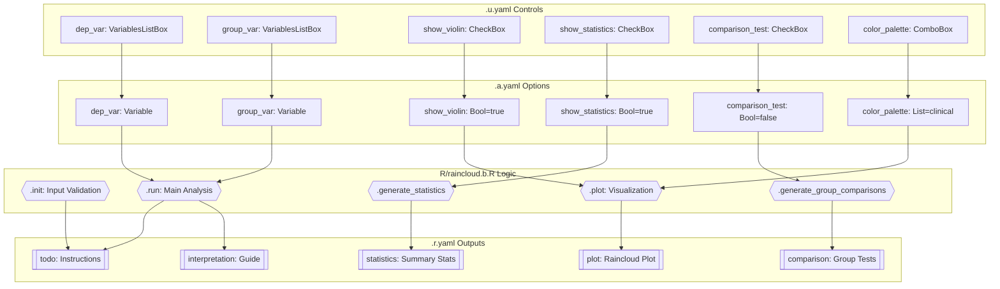
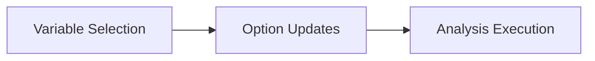
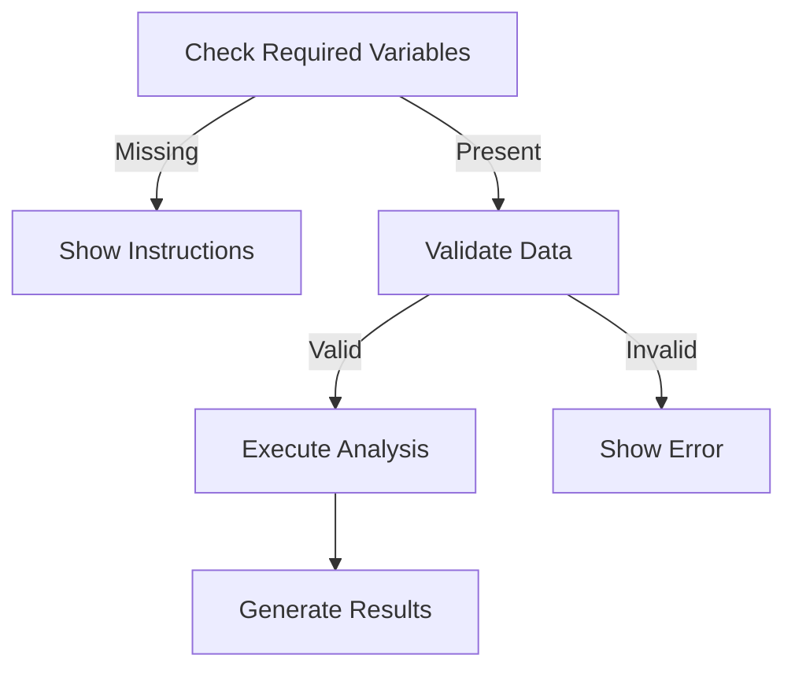
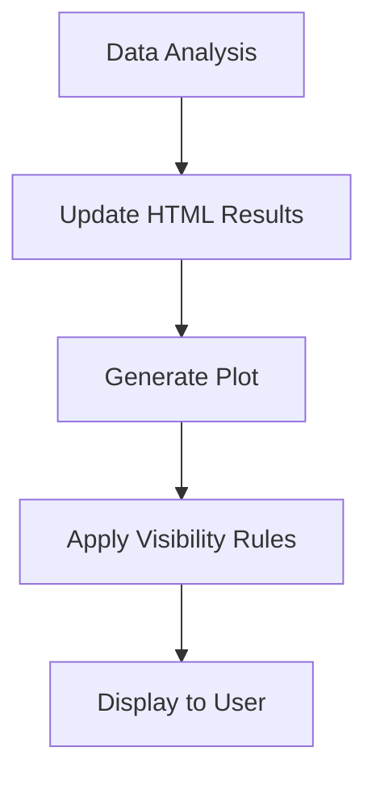
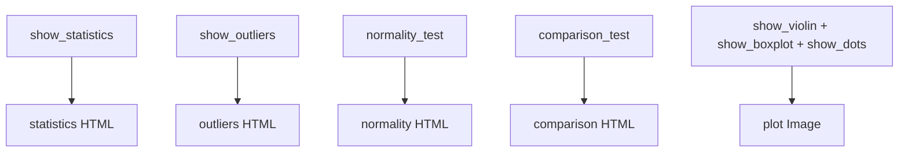

# Raincloud Plot Function Documentation

## 1. Overview

- **Function**: `raincloud`
- **Files**:
  - `jamovi/raincloud.u.yaml` — UI
  - `jamovi/raincloud.a.yaml` — Options  
  - `R/raincloud.b.R` — Backend
  - `jamovi/raincloud.r.yaml` — Results
- **Summary**: Creates comprehensive raincloud plots for distribution visualization using the ggdist package. Combines half-violin plots (density), box plots (quartiles), and dot plots (individual data points) to reveal distribution patterns that traditional box plots might miss, including multimodality, skewness, and outliers.

## 2. UI Controls → Options Map

| UI Control | Type | Label | Binds to Option | Defaults & Constraints | Visibility/Enable |
|------------|------|-------|----------------|----------------------|------------------|
| `dep_var` | VariablesListBox | Dependent Variable | `dep_var` | maxItemCount: 1, continuous/numeric | Always visible |
| `group_var` | VariablesListBox | Grouping Variable | `group_var` | maxItemCount: 1, nominal/ordinal | Always visible |
| `facet_var` | VariablesListBox | Faceting Variable (Optional) | `facet_var` | maxItemCount: 1, optional | Always visible |
| `color_var` | VariablesListBox | Color Variable (Optional) | `color_var` | maxItemCount: 1, optional | Always visible |
| `show_violin` | CheckBox | Show Half-Violin (Density) | `show_violin` | default: true | Plot Components group |
| `show_boxplot` | CheckBox | Show Box Plot | `show_boxplot` | default: true | Plot Components group |
| `show_dots` | CheckBox | Show Data Points | `show_dots` | default: true | Plot Components group |
| `dots_side` | ComboBox | Dots Position | `dots_side` | left/right/both, default: left | Plot Components group |
| `orientation` | ComboBox | Plot Orientation | `orientation` | vertical/horizontal, default: horizontal | Plot Components group |
| `violin_width` | TextBox | Violin Width | `violin_width` | min: 0.1, max: 2, default: 0.7 | Component Sizes group |
| `box_width` | TextBox | Box Plot Width | `box_width` | min: 0.05, max: 1, default: 0.2 | Component Sizes group |
| `dots_size` | TextBox | Dots Size | `dots_size` | min: 0.1, max: 5, default: 1.2 | Component Sizes group |
| `alpha_violin` | TextBox | Violin Transparency | `alpha_violin` | min: 0, max: 1, default: 0.7 | Component Sizes group |
| `alpha_dots` | TextBox | Dots Transparency | `alpha_dots` | min: 0, max: 1, default: 0.8 | Component Sizes group |
| `color_palette` | ComboBox | Color Palette | `color_palette` | 14 options including clinical/prism, default: clinical | Colors & Themes group |
| `plot_theme` | ComboBox | Plot Theme | `plot_theme` | 8 options including clinical/prism, default: clinical | Colors & Themes group |
| `plot_title` | TextBox | Plot Title | `plot_title` | default: "Raincloud Plot - Distribution Visualization" | Labels & Titles group |
| `x_label` | TextBox | X-Axis Label | `x_label` | default: "", auto-inferred if empty | Labels & Titles group |
| `y_label` | TextBox | Y-Axis Label | `y_label` | default: "", auto-inferred if empty | Labels & Titles group |
| `show_statistics` | CheckBox | Show Summary Statistics | `show_statistics` | default: true | Statistical Analysis group |
| `show_outliers` | CheckBox | Highlight Outliers | `show_outliers` | default: false | Statistical Analysis group |
| `outlier_method` | ComboBox | Outlier Detection Method | `outlier_method` | iqr/zscore/modified_zscore, default: iqr | Statistical Analysis group |
| `normality_test` | CheckBox | Test for Normality | `normality_test` | default: false | Statistical Analysis group |
| `comparison_test` | CheckBox | Group Comparison Test | `comparison_test` | default: false | Statistical Analysis group |
| `comparison_method` | ComboBox | Comparison Method | `comparison_method` | auto/ttest/wilcoxon/anova/kruskal, default: auto | Statistical Analysis group |

## 3. Options Reference (.a.yaml)

### Core Variables
- **`data`** / Data / (required) — Input dataset as data frame
- **`dep_var`** / Variable / (required) — Continuous/numeric variable for distribution visualization
- **`group_var`** / Variable / (required) — Categorical variable for grouping comparisons
- **`facet_var`** / Variable / NULL — Optional variable for creating separate panels
- **`color_var`** / Variable / NULL — Optional variable for coloring, defaults to grouping variable

### Plot Components
- **`show_violin`** / Bool / true — Display half-violin plot showing probability density
- **`show_boxplot`** / Bool / true — Display box plot with median and quartiles  
- **`show_dots`** / Bool / true — Display individual data points as dots
- **`dots_side`** / List / left — Position of dots (left/right/both)
- **`orientation`** / List / horizontal — Plot orientation (horizontal for classic raincloud)

### Component Sizing
- **`violin_width`** / Number / 0.7 — Width scaling factor (0.1-2.0)
- **`box_width`** / Number / 0.2 — Box plot width (0.05-1.0) 
- **`dots_size`** / Number / 1.2 — Size of individual dots (0.1-5.0)
- **`alpha_violin`** / Number / 0.7 — Violin transparency (0.0-1.0)
- **`alpha_dots`** / Number / 0.8 — Dots transparency (0.0-1.0)

### Appearance
- **`color_palette`** / List / clinical — Color scheme including GraphPad Prism palettes
- **`plot_theme`** / List / clinical — Visual theme including publication and Prism themes
- **`plot_title`** / String / "Raincloud Plot..." — Custom plot title
- **`x_label`** / String / "" — Custom X-axis label (auto if empty)
- **`y_label`** / String / "" — Custom Y-axis label (auto if empty)

### Statistical Analysis  
- **`show_statistics`** / Bool / true — Display summary statistics table
- **`show_outliers`** / Bool / false — Highlight outliers in visualization
- **`outlier_method`** / List / iqr — Method for outlier detection
- **`normality_test`** / Bool / false — Perform Shapiro-Wilk tests per group
- **`comparison_test`** / Bool / false — Perform statistical group comparisons
- **`comparison_method`** / List / auto — Statistical test method selection

## 4. Backend Usage (.b.R)

### Initialization & Validation (.init)
- **Input validation**: Validates numeric parameters (alpha_violin, alpha_dots, violin_width, box_width, dots_size) against their constraints using `jmvcore::reject()`
- **Error handling**: Provides translated error messages for out-of-bounds values

### Main Execution (.run)
- **Variable checking**: Tests for required variables (`dep_var`, `group_var`) and displays welcome message if missing
- **Package requirements**: Safely requires ggdist package with fallback error message
- **Data preparation**: Creates analysis dataset with complete cases, converts variables to appropriate types
- **Conditional analysis**: Executes statistical analyses based on options:
  - `show_statistics` → `.generate_statistics()` → `self$results$statistics$setContent()`
  - `show_outliers` → `.generate_outlier_analysis()` → `self$results$outliers$setContent()`
  - `normality_test` → `.generate_normality_tests()` → `self$results$normality$setContent()`
  - `comparison_test` → `.generate_group_comparisons()` → `self$results$comparison$setContent()`
- **Plot data storage**: Uses `image$setState(analysis_data)` to pass data to plot function
- **Interpretation guide**: Always generates comprehensive interpretation via `self$results$interpretation$setContent()`

### Plot Generation (.plot)
- **Data retrieval**: Gets analysis data from `image$state`
- **Component layering**: Conditionally adds plot components based on options:
  - `show_violin` → `ggdist::stat_halfeye()` with `alpha_violin` and `violin_width`
  - `show_boxplot` → `geom_boxplot()` with `box_width`, outlier handling via `show_outliers`
  - `show_dots` → `ggdist::stat_dots()` with `dots_size`, `alpha_dots`, and `dots_side`
- **Orientation handling**: `orientation` == "horizontal" → `coord_flip()`
- **Color application**: Uses `color_palette` via `.get_color_palette()` helper
- **Theme application**: Uses `plot_theme` via `.get_plot_theme()` helper  
- **Label customization**: Applies `plot_title`, `x_label`, `y_label` with auto-generation fallbacks

### Statistical Methods
- **`.generate_statistics()`**: Calculates group-wise descriptive statistics using dplyr, includes skewness/kurtosis
- **`.generate_outlier_analysis()`**: Implements three outlier methods based on `outlier_method`
- **`.generate_normality_tests()`**: Performs Shapiro-Wilk tests per group with sample size constraints
- **`.generate_group_comparisons()`**: Implements automatic test selection or manual choice via `comparison_method`

## 5. Results Definition (.r.yaml)

### Output Objects
- **`todo`** / Html / "Instructions" — Welcome message and instructions, always visible, populated when variables missing
- **`plot`** / Image / "Raincloud Plot" — Main visualization (800x600), rendered via `.plot()`, always visible
- **`statistics`** / Html / "Summary Statistics" — Descriptive statistics table, visible when `show_statistics=true`
- **`outliers`** / Html / "Outlier Analysis" — Outlier detection results, visible when `show_outliers=true`  
- **`normality`** / Html / "Normality Tests" — Shapiro-Wilk test results per group, visible when `normality_test=true`
- **`comparison`** / Html / "Group Comparisons" — Statistical test results with copy-ready sentences, visible when `comparison_test=true`
- **`interpretation`** / Html / "Interpretation Guide" — Comprehensive guide for reading plots, always visible

### Visibility Rules
- **Static visibility**: `todo`, `plot`, `interpretation` always shown
- **Option-dependent**: `statistics`, `outliers`, `normality`, `comparison` controlled by corresponding boolean options
- **Content-dependent**: `todo` shows welcome when variables missing, empty otherwise

### Population Entry Points
- `.run()` method populates all HTML results based on analysis options
- `.plot()` method generates the image result using stored analysis data
- Error conditions populate `todo` or `interpretation` with diagnostic messages

## 6. Data Flow Diagram (UI → Options → Backend → Results)



## 7. Execution Sequence (User Action → Results)

### User Input Flow


### Decision Logic  


### Result Processing


**Step-by-step execution flow:**

1. **User variable selection** → UI updates `dep_var`, `group_var` options
2. **Backend validation** → `.init()` validates numeric parameters, `.run()` checks required variables  
3. **Prerequisite handling** → Show welcome message if variables missing, error if ggdist unavailable
4. **Data preparation** → Extract variables, remove incomplete cases, convert to appropriate types
5. **Conditional analysis** → Execute statistical analyses based on boolean options with checkpoint calls
6. **Result population** → Update HTML results via `setContent()`, store plot data via `setState()`
7. **Visualization** → `.plot()` retrieves data, builds layered ggplot based on component options
8. **Display application** → Show visible results per `.r.yaml` visibility rules



## 8. Change Impact Guide

### Key Option Changes

**Variable Selection (`dep_var`, `group_var`)**
- **If changed**: Complete reanalysis, all results regenerate, plot redraws
- **Common pitfalls**: Non-numeric dependent variable, single-level grouping variable
- **Performance**: Minimal impact unless very large datasets

**Plot Components (`show_violin`, `show_boxplot`, `show_dots`)**  
- **If changed**: Only plot regenerates, statistical analyses unchanged
- **Common pitfalls**: Disabling all components creates empty plot
- **Recommended**: Keep at least violin + boxplot for meaningful visualization

**Statistical Options (`show_statistics`, `comparison_test`, `normality_test`)**
- **If changed**: Corresponding HTML result shows/hides, may trigger statistical computations
- **Common pitfalls**: Small sample sizes for normality tests (<3 observations)
- **Performance**: Comparison tests can be expensive with many groups

**Color/Theme Options (`color_palette`, `plot_theme`)**
- **If changed**: Only plot regenerates with new appearance
- **Common pitfalls**: None, purely visual changes
- **Recommended**: Clinical palette and theme for medical research

**Size/Transparency Options (`violin_width`, `alpha_violin`, etc.)**
- **If changed**: Only plot regenerates, validated against constraints in `.init()`
- **Common pitfalls**: Values outside defined ranges trigger validation errors
- **Performance**: No impact

## 9. Example Usage

### Example Dataset Requirements
- **Dependent variable**: Continuous/numeric (e.g., Age, Biomarker levels, Test scores)
- **Grouping variable**: Categorical with 2+ levels (e.g., Treatment groups, Disease status)
- **Optional faceting**: Additional categorical variable for subgroup analysis
- **Sample data**: `histopathology` dataset with Age (continuous) and Group (categorical)

### Example Option Payload
```yaml
dep_var: "Age"
group_var: "Group"  
facet_var: "Sex"
show_violin: true
show_boxplot: true
show_dots: true
show_statistics: true
comparison_test: true
color_palette: "clinical"
plot_theme: "publication"
```

### Expected Outputs
- **Main plot**: Horizontal raincloud with violin, box, and dot components
- **Statistics table**: Group-wise means, medians, standard deviations, skewness
- **Comparison results**: Statistical test results with copy-ready interpretation sentences
- **Interpretation guide**: Comprehensive explanation of plot reading and clinical applications

## 10. Appendix (Schemas & Snippets)

### Key Code Snippets

**Option Access Pattern**:
```r
# Validation in .init()
if (self$options$alpha_violin < 0 || self$options$alpha_violin > 1) {
    jmvcore::reject(.("Violin transparency must be between 0 and 1"), code = "")
}

# Usage in .run() 
if (self$options$show_statistics) {
    stats_html <- private$.generate_statistics(analysis_data, dep_var, group_var)
    self$results$statistics$setContent(stats_html)
}

# Plot component conditional
if (self$options$show_violin) {
    p <- p + ggdist::stat_halfeye(
        alpha = self$options$alpha_violin,
        width = self$options$violin_width
    )
}
```

**Result Population Pattern**:
```r  
# HTML content
self$results$statistics$setContent(stats_html)
self$results$interpretation$setContent(interpretation_html)

# Plot data storage  
image <- self$results$plot
image$setState(analysis_data)

# Plot retrieval
analysis_data <- image$state
```

### Statistical Methods Summary
- **Descriptive statistics**: Mean, median, SD, IQR, range, skewness per group
- **Outlier detection**: IQR method (1.5×IQR), Z-score (|z|>3), Modified Z-score (robust)
- **Normality testing**: Shapiro-Wilk per group (n=3-5000)  
- **Group comparisons**: Automatic selection (t-test/Wilcoxon for 2 groups, ANOVA/Kruskal-Wallis for 3+) or manual override
- **Copy-ready results**: Formatted sentences with statistical details for research reports