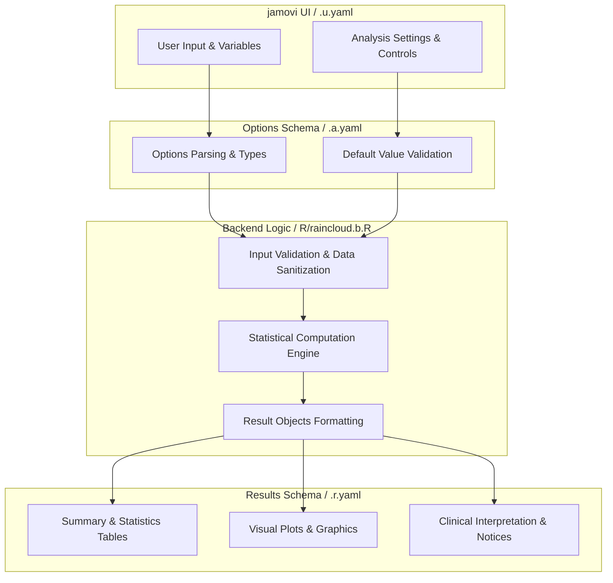
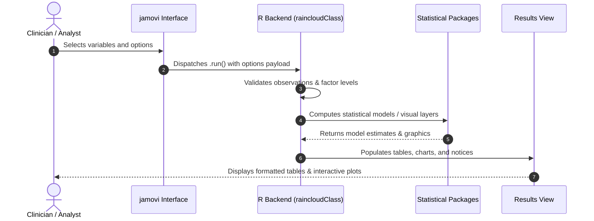

# Raincloud Plot - Developer Documentation

## 1. Overview

- **Function**: `raincloud`
- **Title**: Raincloud Plot
- **Module**: `JJStatsPlotT`
- **Files**:
  - `jamovi/raincloud.u.yaml` - User Interface Definition
  - `jamovi/raincloud.a.yaml` - Options & Schema Definition
  - `jamovi/raincloud.r.yaml` - Results Layout & Tables
  - `R/raincloud.b.R` - Backend Implementation
- **Summary**: Creates Raincloud plots to visualize data distributions using ggdist package. Raincloud plots combine three visualization techniques: half-violin plots showing  distribution density, box plots showing summary statistics, and dot plots showing  individual data points. This provides a comprehensive view of data distribution  that reveals patterns traditional box plots might miss, including multimodality and distribution shape. Based on the ggdist R-Bloggers tutorial.

## 1a. Changelog

- **Date**: 2026-08-29
- **Summary**: Comprehensive documentation suite created & verified against active schemas and backend implementation.

## 2. Options Reference (`.a.yaml`)

| Option | Type | Default | Description |
| :--- | :--- | :--- | :--- |
| `data` | `Data` | `NULL` |  |
| `dep_var` | `Variable` | `NULL` | Dependent Variable |
| `group_var` | `Variable` | `NULL` | Grouping Variable |
| `facet_var` | `Variable` | `NULL` | Faceting Variable (Optional) |
| `color_var` | `Variable` | `NULL` | Color Variable (Optional) |
| `show_violin` | `Bool` | `TRUE` | Half-violin (density) |
| `show_boxplot` | `Bool` | `TRUE` | Box plot |
| `show_dots` | `Bool` | `TRUE` | Data points |
| `dots_side` | `List` | `left` | Dots Position |
| `violin_width` | `Number` | `0.7` | Violin Width |
| `box_width` | `Number` | `0.2` | Box Plot Width |
| `dots_size` | `Number` | `1.2` | Dots Size |
| `alpha_violin` | `Number` | `0.7` | Violin Transparency |
| `alpha_dots` | `Number` | `0.8` | Dots Transparency |
| `orientation` | `List` | `horizontal` | Plot Orientation |
| `color_palette` | `List` | `clinical` | Color Palette |
| `plot_theme` | `List` | `clinical` | Plot Theme |
| `plot_title` | `String` | `Raincloud Plot - Distribution Visualization` | Plot Title |
| `x_label` | `String` | `` | X-Axis Label |
| `y_label` | `String` | `` | Y-Axis Label |
| `show_statistics` | `Bool` | `FALSE` | Summary statistics |
| `show_outliers` | `Bool` | `FALSE` | Highlight outliers |
| `outlier_method` | `List` | `iqr` | Outlier Detection Method |
| `normality_test` | `Bool` | `FALSE` | Test for normality |
| `comparison_test` | `Bool` | `FALSE` | Group comparison test |
| `comparison_method` | `List` | `auto` | Comparison Method |
| `adjust_method` | `List` | `none` | P-value Adjustment |
| `effect_size` | `Bool` | `FALSE` | Effect size (2 groups) |
| `log_transform` | `Bool` | `FALSE` | Log-transform Y-axis |

## 3. Results Definition (`.r.yaml`)

| Output ID | Type | Title | Description |
| :--- | :--- | :--- | :--- |
| `todo` | `Html` | `Instructions` |  |
| `plot` | `Image` | `Raincloud Plot` |  |
| `statistics` | `Html` | `Summary Statistics` |  |
| `outliers` | `Html` | `Outlier Analysis` |  |
| `normality` | `Html` | `Normality Tests` |  |
| `comparison` | `Html` | `Group Comparisons` |  |
| `interpretation` | `Html` | `Interpretation Guide` |  |

## 4. Architecture & Data Flow Diagram

```mermaid
flowchart TD
  subgraph UI[jamovi UI / .u.yaml]
    U1[User Input & Variables]
    U2[Analysis Settings & Controls]
  end

  subgraph Opts[Options Schema / .a.yaml]
    O1[Options Parsing & Types]
    O2[Default Value Validation]
  end

  subgraph Backend[Backend Logic / R/raincloud.b.R]
    B1[Input Validation & Data Sanitization]
    B2[Statistical Computation Engine]
    B3[Result Objects Formatting]
  end

  subgraph Res[Results Schema / .r.yaml]
    R1[Summary & Statistics Tables]
    R2[Visual Plots & Graphics]
    R3[Clinical Interpretation & Notices]
  end

  U1 --> O1
  U2 --> O2
  O1 --> B1
  O2 --> B1
  B1 --> B2
  B2 --> B3
  B3 --> R1
  B3 --> R2
  B3 --> R3
```

## 5. Execution Sequence

```mermaid
sequenceDiagram
  autonumber
  actor User as Clinician / Analyst
  participant UI as jamovi Interface
  participant Backend as R Backend (raincloudClass)
  participant Engine as Statistical Packages
  participant Results as Results View

  User->>UI: Selects variables and options
  UI->>Backend: Dispatches .run() with options payload
  Backend->>Backend: Validates observations & factor levels
  Backend->>Engine: Computes statistical models / visual layers
  Engine-->>Backend: Returns model estimates & graphics
  Backend->>Results: Populates tables, charts, and notices
  Results-->>User: Displays formatted tables & interactive plots
```

## 6. Change Impact & Safety Guidelines

- **Data Filtering**: Ensure observations with missing values are handled gracefully according to analysis options.
- **Formula Conflicts**: Use isolated environment calls or base formula methods when interacting with `ggstatsplot` or formula parsers.
- **Safe Deparsing**: Use `deparse(val)` in syntax generation (`asSource()`) to escape column names with spaces or special symbols.

