# Relative Survival Analysis -- Developer Documentation

---

## 1. Overview

| Field | Value |
|---|---|
| **Function** | `relativesurvival` |
| **Class** | `relativesurvivalClass` (R6, inherits `relativesurvivalBase`) |
| **Menu** | SurvivalT > Advanced Survival |
| **Version** | 0.0.3 |

### Files

| File | Path | Role |
|---|---|---|
| Analysis definition | `jamovi/relativesurvival.a.yaml` | Options, types, defaults, constraints |
| Backend | `R/relativesurvival.b.R` | R6 class with all computation and rendering |
| Results definition | `jamovi/relativesurvival.r.yaml` | Output items (tables, plots, HTML) |
| UI layout | `jamovi/relativesurvival.u.yaml` | Control arrangement and enable/visibility rules |

### Summary

Relative survival analysis compares observed patient survival to expected population survival. It is the standard approach for cancer registry studies where individual cause-of-death is unreliable or unavailable. This module uses the `relsurv` package and provides:

- **4 estimation methods**: Pohar-Perme (recommended, unbiased net survival), Ederer I, Ederer II, Hakulinen
- **15 country rate tables**: US, Minnesota, France, Slovenia (bundled with `relsurv`), plus Turkey, Germany, UK, Italy, Japan, Spain, Brazil, South Korea, China, India (WHO GHO life tables), and a Custom placeholder
- **3 regression models**: Additive excess hazard (`relsurv::rsadd`), Multiplicative (`relsurv::rsmul`), Flexible parametric (`rstpm2::stpm2` with `bhazard`)
- **Age standardization**: ICSS weights (5 age groups)
- **Period analysis**: 5-year diagnosis period comparison
- **Outputs**: 7 tables, 4 plots, HTML summary, clinical interpretation with prognosis grading, HTML notices

---

## 2. UI Controls -> Options Map

Derived from `relativesurvival.u.yaml` mapped to `relativesurvival.a.yaml`.

| UI Control (type, label) | Binds to Option | Defaults & Constraints | Visibility / Enable Rules |
|---|---|---|---|
| VariablesListBox, "Follow-up Time" | `time` | Required; numeric; maxItemCount=1 | Always visible |
| VariablesListBox, "Vital Status" | `status` | Required; factor or numeric; maxItemCount=1 | Always visible |
| VariablesListBox, "Age at Diagnosis" | `age` | Required; numeric; maxItemCount=1 | Always visible |
| VariablesListBox, "Sex" | `sex` | Required; factor; maxItemCount=1 | Always visible |
| VariablesListBox, "Calendar Year" | `year` | Required; numeric; maxItemCount=1 | Always visible |
| VariablesListBox, "Additional Covariates" | `covariates` | Optional; numeric or factor; multi-select | Always visible |
| ComboBox, "Population Rate Table" | `ratetable` | Default: `us`; 15 options | Always visible |
| ComboBox, "Estimation Method" | `method` | Default: `poharperme`; 4 options | Always visible |
| ComboBox, "Time Scale" | `time_scale` | Default: `years`; 3 options | Always visible |
| CheckBox, "Net Survival" | `net_survival` | Default: `true` | Always visible |
| CheckBox, "Excess Mortality" | `excess_mortality` | Default: `true` | Always visible |
| CheckBox, "Crude Probability of Death" | `crude_probability` | Default: `true` | Always visible |
| CheckBox, "Age-Standardized Rates" | `age_standardized` | Default: `false` | Always visible |
| CheckBox, "Period Analysis" | `period_analysis` | Default: `false` | Always visible |
| TextBox, "Cohort Definition" | `cohort_year` | Default: `""`; string | **Enabled when** `period_analysis` is true |
| ComboBox, "Regression Model" | `regression_model` | Default: `none`; 4 options | Always visible |
| TextBox, "Spline Degrees of Freedom" | `spline_df` | Default: `4`; min 1, max 10; integer | **Enabled when** `regression_model` is `flexible` |
| CheckBox, "Plot Observed Survival" | `plot_observed` | Default: `true` | Always visible |
| CheckBox, "Plot Expected Survival" | `plot_expected` | Default: `true` | Always visible |
| CheckBox, "Plot Relative Survival" | `plot_relative` | Default: `true` | Always visible |
| CheckBox, "Plot Excess Mortality" | `plot_excess` | Default: `true` | Always visible |
| TextBox, "Confidence Level" | `confidence_level` | Default: `0.95`; min 0.5, max 0.99 | Always visible |
| TextBox, "Time Points for Estimates" | `timepoints` | Default: `"1,3,5,10"`; string | Always visible |

---

## 3. Options Reference (.a.yaml)

22 options total. Listed with downstream effects in `.b.R`.

| # | Name | Type | Default | Description | Downstream Effects |
|---|---|---|---|---|---|
| 1 | `data` | Data | -- | The data frame | Passed to all private methods |
| 2 | `time` | Variable | -- | Follow-up time (days/months/years) | `.prepareData()`: converted to `time_years` and `time_days` based on `time_scale` |
| 3 | `status` | Variable | -- | Vital status (0=alive, 1=dead) | `.prepareData()`: parsed to binary `status_num`; supports factor or numeric |
| 4 | `age` | Variable | -- | Age at diagnosis (years) | `.prepareData()`: validated 0-120, converted to `age_days` for ratetable `rmap` |
| 5 | `sex` | Variable | -- | Sex/gender (factor) | `.prepareData()`: mapped to `"male"`/`"female"` via multilingual pattern matching |
| 6 | `year` | Variable | -- | Calendar year of diagnosis | `.prepareData()`: converted to `diagdate` (Date, mid-year July 1) |
| 7 | `covariates` | Variables | `[]` | Additional covariates | `.fitRegressionModel()`: composed into formula terms; EPV check at top of `.run()` |
| 8 | `ratetable` | List | `us` | Population rate table (15 options) | `.getRateTable()`: selects relsurv built-in or loads WHO bundle; fallback to US |
| 9 | `method` | List | `poharperme` | Estimation method (4 options) | `.calculateRelativeSurvival()`: mapped to relsurv method string; `.displaySurvivalTable()` note |
| 10 | `time_scale` | List | `years` | Input time unit | `.prepareData()`: conversion factor to years (1, /12, /365.25) |
| 11 | `net_survival` | Bool | `true` | Show net survival table | Gates `.displayNetSurvivalTable()` call; gates `netSurvivalTable` visibility |
| 12 | `excess_mortality` | Bool | `true` | Show excess mortality table | Gates `.calculateExcessMortality()` call; gates `excessMortalityTable` visibility |
| 13 | `crude_probability` | Bool | `true` | Show crude probability table | Gates `.calculateCrudeProbabilities()` call; gates `crudeProbTable` visibility |
| 14 | `age_standardized` | Bool | `false` | Age-standardized rates | Gates `.calculateAgeStandardized()` call; gates `ageStandardizedTable` visibility |
| 15 | `period_analysis` | Bool | `false` | Period analysis mode | Gates `.calculatePeriodAnalysis()` call; gates `periodAnalysisTable` visibility; enables `cohort_year` |
| 16 | `cohort_year` | String | `""` | Year range for cohort filter | `.calculatePeriodAnalysis()`: parsed as "YYYY-YYYY"; filters diagnosis years |
| 17 | `regression_model` | List | `none` | Regression model type | Gates `.fitRegressionModel()` call; gates `regressionTable` and `modelFit` visibility |
| 18 | `spline_df` | Integer | `4` | Spline df for flexible model | `.fitRegressionModel()`: passed to `rstpm2::stpm2(df=...)` |
| 19 | `plot_observed` | Bool | `true` | Show observed survival plot | Gates `observedPlot` visibility |
| 20 | `plot_expected` | Bool | `true` | Show expected survival plot | Gates `expectedPlot` visibility |
| 21 | `plot_relative` | Bool | `true` | Show relative survival plot | Gates `relativePlot` visibility |
| 22 | `plot_excess` | Bool | `true` | Show excess mortality plot | Gates `excessPlot` visibility (combined with `excess_mortality`) |
| 23 | `confidence_level` | Number | `0.95` | CI level | Passed to `relsurv::rs.surv(conf.int=...)`, `relsurv::cmp.rel(conf.int=...)`, delta-method CIs |
| 24 | `timepoints` | String | `"1,3,5,10"` | Comma-separated time points | `.parseTimepoints()`: used in all table-population methods for row generation |

> Note: The .a.yaml file lists 22 option blocks (excluding `data`), but options 23-24 (`confidence_level`, `timepoints`) bring the total to 24 named entries including `data`.

---

## 4. Backend Usage (.b.R)

### Private Fields

| Field | Purpose |
|---|---|
| `.plot_data` | Stores the merged survival data.frame for observed/expected/relative plots |
| `.excess_plot_data` | Stores the excess hazard data.frame for the excess plot |
| `.prepared_data` | Cleaned, validated data after `.prepareData()` |
| `.rate_table` | The resolved population ratetable object |
| `.noticeList` | Accumulator for HTML notice messages |

### Option Usage Map

| `self$options$X` | Used In | Logic Summary | Result Population |
|---|---|---|---|
| `time` | `.init()`, `.run()` guard, `.prepareData()` | Null-check for welcome screen; column extraction | All outputs depend on this |
| `status` | `.init()`, `.run()` guard, `.prepareData()` | Parsed to binary; factor support (2 levels) | `status_num` column |
| `age` | `.init()`, `.run()` guard, `.prepareData()` | Validated 0-120; converted to `age_days` | ratetable matching |
| `sex` | `.init()`, `.run()` guard, `.prepareData()` | Multilingual pattern match (7 male, 7 female patterns) | `sex_relsurv` factor |
| `year` | `.init()`, `.run()` guard, `.prepareData()` | Validated 1900-2100; mid-year Date | `diagdate` for ratetable |
| `covariates` | `.prepareData()`, `.run()` EPV check, `.fitRegressionModel()` | Included in data selection; EPV = events/covariates; formula composition | `regressionTable` rows |
| `ratetable` | `.getRateTable()` | Switch statement: 4 relsurv built-in, 10 WHO collection, 1 custom; fallback to US | All survival calculations |
| `method` | `.calculateRelativeSurvival()`, `.displaySurvivalTable()`, `.plotRelative()` | Mapped to relsurv string; used in table notes and plot title | `survivalTable`, `relativePlot` |
| `time_scale` | `.prepareData()` | Conversion: years=1x, months=/12, days=/365.25 | `time_years`, `time_days` |
| `net_survival` | `.run()` conditional | If true: calls `.displayNetSurvivalTable()` | `netSurvivalTable` rows |
| `excess_mortality` | `.run()` conditional | If true: calls `.calculateExcessMortality()` | `excessMortalityTable` rows, `excessPlot` state |
| `crude_probability` | `.run()` conditional | If true: calls `.calculateCrudeProbabilities()` via `relsurv::cmp.rel()` | `crudeProbTable` rows |
| `age_standardized` | `.run()` conditional | If true: ICSS-weighted age-group stratified Pohar-Perme | `ageStandardizedTable` rows |
| `period_analysis` | `.run()` conditional | If true: 5-year period stratified analysis | `periodAnalysisTable` rows |
| `cohort_year` | `.calculatePeriodAnalysis()` | Parsed as range; filters data by diagnosis year | Subset for period analysis |
| `regression_model` | `.run()` conditional, `.fitRegressionModel()` | none=skip; additive=`rsadd`; multiplicative=`rsmul`; flexible=`stpm2` | `regressionTable`, `modelFit` |
| `spline_df` | `.fitRegressionModel()` | Passed to `rstpm2::stpm2(df=...)` only when model=flexible | Flexible model complexity |
| `plot_observed` | Visibility only | r.yaml `(plot_observed)` | `observedPlot` show/hide |
| `plot_expected` | Visibility only | r.yaml `(plot_expected)` | `expectedPlot` show/hide |
| `plot_relative` | Visibility only | r.yaml `(plot_relative)` | `relativePlot` show/hide |
| `plot_excess` | Visibility only | r.yaml `(plot_excess && excess_mortality)` | `excessPlot` show/hide |
| `confidence_level` | `.calculateRelativeSurvival()`, `.calculateExcessMortality()`, `.calculateCrudeProbabilities()`, `.calculateAgeStandardized()`, `.displayRegressionResults()`, `.displaySummary()` | Passed to relsurv conf.int; used for z-critical in delta-method and Wald CIs | All CI columns |
| `timepoints` | `.displaySurvivalTable()`, `.displayNetSurvivalTable()`, `.calculateCrudeProbabilities()`, `.calculateAgeStandardized()` | Parsed via `.parseTimepoints()`; controls which rows appear | Row count in all time-indexed tables |

### Key Private Methods

| Method | Lines | Purpose |
|---|---|---|
| `.init()` | 19-64 | Welcome HTML when variables missing; clears todo otherwise |
| `.run()` | 67-190 | Main orchestrator: guards, data prep, threshold checks, dispatches all calculations, generates plots, renders notices |
| `.prepareData()` | 193-313 | Data cleaning: column selection, NA removal, time conversion, status parsing, age validation, sex mapping, year-to-date |
| `.getRateTable()` | 316-372 | Rate table resolution via switch; WHO collection loader; US fallback |
| `.calculateRelativeSurvival()` | 375-407 | Core: `relsurv::rs.surv()` with method mapping |
| `.calculateObservedSurvival()` | 410-417 | `survival::survfit()` Kaplan-Meier |
| `.calculateExpectedSurvival()` | 420-433 | `survival::survexp()` population survival |
| `.displaySurvivalTable()` | 436-488 | Populates `survivalTable` at parsed timepoints |
| `.displayNetSurvivalTable()` | 491-524 | Populates `netSurvivalTable` with SE |
| `.calculateExcessMortality()` | 527-621 | Interval excess hazard = `-log(S(t)/S(t-1))`; delta-method CIs; stores plot data |
| `.calculateCrudeProbabilities()` | 624-690 | `relsurv::cmp.rel()` for disease vs other-cause decomposition |
| `.calculateAgeStandardized()` | 693-798 | ICSS-weighted Pohar-Perme by 5 age groups |
| `.calculatePeriodAnalysis()` | 801-885 | 5-year period stratification; cohort filtering |
| `.fitRegressionModel()` | 888-961 | Dispatches to rsadd/rsmul/stpm2; computes background hazard for flexible model |
| `.displayRegressionResults()` | 964-1039 | Extracts coefficients, CIs, model fit (LL, AIC) |
| `.generatePlotData()` | 1042-1096 | Builds unified data.frame; sets state for 3 survival plots |
| `.plotObserved()` | 1099-1124 | ggplot2 step plot, blue (#2166AC), percent y-axis |
| `.plotExpected()` | 1127-1152 | ggplot2 step plot, green (#4DAF4A) |
| `.plotRelative()` | 1155-1193 | ggplot2 step + ribbon CI, red (#B2182B), reference lines at 1.0 and 0.5 |
| `.plotExcess()` | 1196-1220 | ggplot2 bar chart, salmon (#D6604D) |
| `.displaySummary()` | 1223-1261 | HTML summary block with patient count, events, median FU, method, ratetable |
| `.displayInterpretation()` | 1264-1315 | Clinical interpretation with prognosis grading based on 5-year net survival |
| `.computeExpectedHazard()` | 1333-1371 | Per-individual background hazard for stpm2 bhazard; fallback from individual.h to individual.s |
| `.stepIdx()` / `.stepLookup()` | 1318-1330 | Left-continuous step-function index/value lookup |
| `.parseTimepoints()` | 1416-1423 | Comma/semicolon/whitespace splitter; positive numeric filter |
| `.methodLabel()` | 1426-1434 | Human-readable method name lookup |
| `.addNotice()` / `.renderNotices()` | 1374-1413 | HTML notice accumulator with styled severity levels |

---

## 5. Results Definition (.r.yaml)

16 output items. JRS version 1.1.

| # | Name | Type | Title | Visibility Rule | clearWith | Column Schema |
|---|---|---|---|---|---|---|
| 1 | `todo` | Html | To Do | always | time, status, age, sex, year | -- |
| 2 | `notices` | Html | Notices | always | time, status, age, sex, year, covariates, ratetable, method, regression_model | -- |
| 3 | `summary` | Html | Analysis Summary | always | -- | -- |
| 4 | `survivalTable` | Table | Survival Estimates by Time | always | -- | See Appendix |
| 5 | `netSurvivalTable` | Table | Net Survival Estimates | `(net_survival)` | -- | See Appendix |
| 6 | `excessMortalityTable` | Table | Excess Mortality Rates | `(excess_mortality)` | -- | See Appendix |
| 7 | `crudeProbTable` | Table | Crude Probability of Death | `(crude_probability)` | -- | See Appendix |
| 8 | `regressionTable` | Table | Regression Model Results | `(!regression_model:none)` | -- | See Appendix |
| 9 | `observedPlot` | Image | Observed Survival | `(plot_observed)` | time, status, covariates, time_scale | renderFun: `.plotObserved` |
| 10 | `expectedPlot` | Image | Expected Survival | `(plot_expected)` | age, sex, year, ratetable, time_scale | renderFun: `.plotExpected` |
| 11 | `relativePlot` | Image | Relative Survival | `(plot_relative)` | time, status, age, sex, year, method, ratetable, time_scale, confidence_level | renderFun: `.plotRelative` |
| 12 | `excessPlot` | Image | Excess Mortality | `(plot_excess && excess_mortality)` | time, status, age, sex, year, method, ratetable, time_scale | renderFun: `.plotExcess` |
| 13 | `ageStandardizedTable` | Table | Age-Standardized Survival | `(age_standardized)` | -- | See Appendix |
| 14 | `periodAnalysisTable` | Table | Period Analysis Results | `(period_analysis)` | -- | See Appendix |
| 15 | `modelFit` | Table | Model Fit Statistics | `(!regression_model:none)` | -- | See Appendix |
| 16 | `interpretation` | Html | Clinical Interpretation | always | -- | -- |

### Plot Specifications

| Plot | Width | Height | Render Function | Color |
|---|---|---|---|---|
| `observedPlot` | 700 | 450 | `.plotObserved` | #2166AC (blue) |
| `expectedPlot` | 700 | 450 | `.plotExpected` | #4DAF4A (green) |
| `relativePlot` | 700 | 450 | `.plotRelative` | #B2182B (red) + CI ribbon |
| `excessPlot` | 700 | 450 | `.plotExcess` | #D6604D (salmon bars) |

### References

- `ClinicoPathJamoviModule`
- `relsurv`
- `rstpm2`
- `survival`

---

## 6. Data Flow Diagram

```mermaid
flowchart TB
    subgraph UI ["UI Layer (.u.yaml)"]
        VL_time["VariablesListBox: time"]
        VL_status["VariablesListBox: status"]
        VL_age["VariablesListBox: age"]
        VL_sex["VariablesListBox: sex"]
        VL_year["VariablesListBox: year"]
        VL_cov["VariablesListBox: covariates"]
        CB_rt["ComboBox: ratetable"]
        CB_method["ComboBox: method"]
        CB_ts["ComboBox: time_scale"]
        CHK_ns["CheckBox: net_survival"]
        CHK_em["CheckBox: excess_mortality"]
        CHK_cp["CheckBox: crude_probability"]
        CHK_as["CheckBox: age_standardized"]
        CHK_pa["CheckBox: period_analysis"]
        TB_cy["TextBox: cohort_year"]
        CB_reg["ComboBox: regression_model"]
        TB_sdf["TextBox: spline_df"]
        CHK_po["CheckBox: plot_observed"]
        CHK_pe["CheckBox: plot_expected"]
        CHK_pr["CheckBox: plot_relative"]
        CHK_px["CheckBox: plot_excess"]
        TB_cl["TextBox: confidence_level"]
        TB_tp["TextBox: timepoints"]
    end

    subgraph Options ["Options Layer (.a.yaml)"]
        O_required["time, status, age, sex, year"]
        O_analysis["net_survival, excess_mortality,\ncrude_probability, age_standardized,\nperiod_analysis, cohort_year"]
        O_model["regression_model, spline_df, covariates"]
        O_viz["plot_observed, plot_expected,\nplot_relative, plot_excess"]
        O_config["ratetable, method, time_scale,\nconfidence_level, timepoints"]
    end

    subgraph Backend ["Backend Layer (.b.R)"]
        INIT[".init()"]
        RUN[".run()"]
        PREP[".prepareData()"]
        RT[".getRateTable()"]
        RS[".calculateRelativeSurvival()"]
        KM[".calculateObservedSurvival()"]
        EXP[".calculateExpectedSurvival()"]
        DST[".displaySurvivalTable()"]
        NST[".displayNetSurvivalTable()"]
        EM[".calculateExcessMortality()"]
        CP[".calculateCrudeProbabilities()"]
        AS[".calculateAgeStandardized()"]
        PA[".calculatePeriodAnalysis()"]
        REG[".fitRegressionModel()"]
        GPD[".generatePlotData()"]
        SUM[".displaySummary()"]
        INT[".displayInterpretation()"]
        NOT[".renderNotices()"]
    end

    subgraph Results ["Results Layer (.r.yaml)"]
        R_todo["todo (Html)"]
        R_notices["notices (Html)"]
        R_summary["summary (Html)"]
        R_survT["survivalTable"]
        R_netT["netSurvivalTable"]
        R_exmT["excessMortalityTable"]
        R_crdT["crudeProbTable"]
        R_regT["regressionTable"]
        R_modF["modelFit"]
        R_obsP["observedPlot"]
        R_expP["expectedPlot"]
        R_relP["relativePlot"]
        R_excP["excessPlot"]
        R_ageT["ageStandardizedTable"]
        R_perT["periodAnalysisTable"]
        R_interp["interpretation (Html)"]
    end

    VL_time & VL_status & VL_age & VL_sex & VL_year --> O_required
    VL_cov --> O_model
    CB_rt & CB_method & CB_ts & TB_cl & TB_tp --> O_config
    CHK_ns & CHK_em & CHK_cp & CHK_as & CHK_pa & TB_cy --> O_analysis
    CB_reg & TB_sdf --> O_model
    CHK_po & CHK_pe & CHK_pr & CHK_px --> O_viz

    O_required --> INIT --> R_todo
    O_required --> RUN
    RUN --> PREP --> RT --> RS
    RS --> KM & EXP
    RS --> DST --> R_survT
    RS --> NST --> R_netT
    RS --> EM --> R_exmT & R_excP
    RS --> CP --> R_crdT
    RS --> AS --> R_ageT
    RS --> PA --> R_perT
    RS --> REG --> R_regT & R_modF
    RS & KM & EXP --> GPD --> R_obsP & R_expP & R_relP
    RS --> SUM --> R_summary
    RS --> INT --> R_interp
    RUN --> NOT --> R_notices
```



---

## 7. Execution Sequence

Step-by-step from user action to results display.

| Step | Method | What Happens |
|---|---|---|
| 1 | `.init()` | If any of the 5 required variables is null, display welcome HTML in `todo` and return. Otherwise clear `todo`. |
| 2 | `.run()` guard | Same null check; return early if incomplete. |
| 3 | `.run()` dep check | `requireNamespace('relsurv')` and `requireNamespace('survival')`; `jmvcore::reject()` on failure. |
| 4 | `.run()` reset | Clear `private$.noticeList`. |
| 5 | `.prepareData()` | Extract columns, `naOmit`, reject if < 30 rows. Convert time to years/days. Parse status to 0/1. Validate age 0-120, convert to days. Map sex via multilingual patterns. Convert year to mid-year Date. |
| 6 | `.run()` thresholds | Count events. Reject if < 10. Warn if < 20 or < 50. EPV check if regression + covariates. |
| 7 | `.getRateTable()` | Resolve ratetable by option value. Load WHO collection if needed. Fallback to US with note. |
| 8 | `.calculateRelativeSurvival()` | Call `relsurv::rs.surv()` with mapped method, ratetable, confidence level. |
| 9 | `.calculateObservedSurvival()` | Call `survival::survfit()` for Kaplan-Meier. |
| 10 | `.calculateExpectedSurvival()` | Call `survival::survexp()` for population survival. |
| 11 | `.displaySurvivalTable()` | Parse timepoints, lookup step-function values at each, populate `survivalTable`. |
| 12 | `.displayNetSurvivalTable()` | Conditional on `net_survival`. Same timepoint logic with SE. |
| 13 | `.calculateExcessMortality()` | Conditional on `excess_mortality`. Yearly interval excess hazard with delta-method CIs. Store `excessPlot` state. |
| 14 | `.calculateCrudeProbabilities()` | Conditional on `crude_probability`. Call `relsurv::cmp.rel()`, populate `crudeProbTable`. |
| 15 | `.calculateAgeStandardized()` | Conditional on `age_standardized`. ICSS 5-group weighted Pohar-Perme. |
| 16 | `.calculatePeriodAnalysis()` | Conditional on `period_analysis`. Filter by cohort_year, create 5-year periods, compute 5-year RS per period. |
| 17 | `.fitRegressionModel()` | Conditional on `regression_model != none`. Compose formula from covariates. Dispatch to rsadd/rsmul/stpm2. Display coefficients and fit statistics. |
| 18 | `.generatePlotData()` | Build merged data.frame with observed/expected/net columns. Set state for `observedPlot`, `expectedPlot`, `relativePlot`. |
| 19 | `.displaySummary()` | HTML block: method, N, events, median FU, ratetable label, CI level. |
| 20 | `.displayInterpretation()` | 5-year net survival lookup. Prognosis grading: >90% excellent, >70% good, >50% fair, <=50% poor. Key concepts explanation. |
| 21 | `.addNotice("info", ...)` | Completion notice. |
| 22 | `.renderNotices()` | Render accumulated notices as styled HTML divs into `notices` output. |
| 23 | Plot render | jamovi calls `.plotObserved()`, `.plotExpected()`, `.plotRelative()`, `.plotExcess()` using stored state. |

---

## 8. Change Impact Guide

| Option Changed | What Recalculates | Pitfalls | Recommended Default |
|---|---|---|---|
| `time` | Everything (all tables, all plots, summary, interpretation) | Ensure correct `time_scale` is set; mismatch silently produces wrong results | -- |
| `status` | Everything | Must be 0/1 or 2-level factor; 3+ levels rejected | Numeric 0/1 preferred |
| `age` | Rate table matching, age standardization, all survival estimates | Must be in years (not months or days); out of 0-120 rejected | -- |
| `sex` | Rate table matching, all survival estimates | Multilingual mapping covers 7 patterns per sex; unmapped values cause hard reject | Use "male"/"female" |
| `year` | Rate table matching, period analysis, all survival estimates | Must be 4-digit year; converted to mid-year Date; out of 1900-2100 rejected | -- |
| `ratetable` | All survival/mortality calculations | WHO tables require `ratetable_who_collection` data object; missing table falls back to US silently | `us` for US data |
| `method` | `rel_surv` object, survivalTable, netSurvivalTable, relativePlot, excessMortalityTable | Pohar-Perme is only unbiased net survival estimator; others are biased in presence of informative censoring | `poharperme` |
| `time_scale` | Data preparation (time conversion) | Incorrect scale produces wildly wrong estimates; no automatic detection | Match input data units |
| `covariates` | Regression tables only | EPV < 10 triggers warning; empty covariates with regression != none shows note | Start with 1-2 covariates |
| `regression_model` | `regressionTable`, `modelFit` | `flexible` requires `rstpm2` package; `additive` and `multiplicative` require covariates; stpm2 bhazard fallback if expected hazard fails | `none` unless needed |
| `spline_df` | Flexible model only | Too low (1-2) = underfitting; too high (8-10) = overfitting/convergence issues | `4` |
| `confidence_level` | All CI columns, relativePlot ribbon | Values near 0.5 produce very narrow CIs; near 0.99 produces very wide | `0.95` |
| `timepoints` | Row count in survivalTable, netSurvivalTable, crudeProbTable, ageStandardizedTable | Timepoints beyond max follow-up are silently dropped (up to 110% of max) | `"1,3,5,10"` |
| `age_standardized` | ageStandardizedTable | Requires >= 2 age groups with >= 5 patients each; uses Pohar-Perme regardless of `method` | `false` |
| `period_analysis` | periodAnalysisTable | Each period needs >= 10 patients and >= 5 years follow-up for 5-year RS | `false` |
| `cohort_year` | Period analysis data subset | Empty string = all data; malformed string ignored; filter can reduce below 30 patients (rejection) | `""` |
| `plot_*` | Visibility only (no recalculation) | Plot data is always computed; toggling only shows/hides | All `true` |

---

## 9. Example Usage

### Dataset Requirements

| Variable | Type | Example Values | Notes |
|---|---|---|---|
| Follow-up time | Numeric | `2.5, 0.8, 7.3` | In years (default) or months/days |
| Vital status | Numeric or Factor | `0, 1` or `Alive, Dead` | Binary; 1 = event |
| Age at diagnosis | Numeric | `45, 72, 58` | In years; range 0-120 |
| Sex | Factor | `male, female` or `M, F` | Multilingual patterns supported |
| Calendar year | Numeric | `2010, 2015, 2008` | 4-digit year |
| Covariates (optional) | Numeric or Factor | `stage_III, grade_2` | For regression models |

**Minimum requirements**: 30 complete cases, 10 events.

### Example R Call (via jamovi wrapper)

```r
relativesurvival(
    data = cancer_registry,
    time = "followup_years",
    status = "vital_status",
    age = "age_at_diagnosis",
    sex = "gender",
    year = "diagnosis_year",
    ratetable = "us",
    method = "poharperme",
    time_scale = "years",
    net_survival = TRUE,
    excess_mortality = TRUE,
    crude_probability = TRUE,
    age_standardized = FALSE,
    period_analysis = FALSE,
    regression_model = "none",
    confidence_level = 0.95,
    timepoints = "1,3,5,10",
    plot_observed = TRUE,
    plot_expected = TRUE,
    plot_relative = TRUE,
    plot_excess = TRUE
)
```

### Expected Outputs

With default settings, the analysis produces:

1. **survivalTable**: 4 rows (1, 3, 5, 10 years) with observed, expected, relative survival + CIs
2. **netSurvivalTable**: 4 rows with net survival, CI, SE
3. **excessMortalityTable**: Up to 10 rows (yearly intervals) with excess hazard, CI, p-value
4. **crudeProbTable**: 4 rows with disease death and other-cause death probabilities
5. **observedPlot**: Blue step-function survival curve
6. **expectedPlot**: Green step-function population curve
7. **relativePlot**: Red step-function with shaded CI ribbon; reference lines at 100% and 50%
8. **excessPlot**: Salmon bar chart of yearly excess hazard
9. **summary**: HTML block with method, N, events, median follow-up, ratetable, CI level
10. **interpretation**: Clinical prognosis grading based on 5-year net survival
11. **notices**: Styled HTML notices (warnings about sample size, completion message)

---

## 10. Appendix: Full Column Schemas

### survivalTable

| Column Name | Title | Type |
|---|---|---|
| `time_point` | Time | number |
| `observed` | Observed Survival | number |
| `expected` | Expected Survival | number |
| `relative` | Relative Survival | number |
| `rel_ci_lower` | RS CI Lower | number |
| `rel_ci_upper` | RS CI Upper | number |

### netSurvivalTable

| Column Name | Title | Type |
|---|---|---|
| `time_point` | Time | number |
| `net_survival` | Net Survival | number |
| `net_ci_lower` | CI Lower | number |
| `net_ci_upper` | CI Upper | number |
| `standard_error` | Std. Error | number |

### excessMortalityTable

| Column Name | Title | Type | Format |
|---|---|---|---|
| `time_interval` | Time Interval | text | -- |
| `excess_hazard` | Excess Hazard | number | -- |
| `hazard_ci_lower` | CI Lower | number | -- |
| `hazard_ci_upper` | CI Upper | number | -- |
| `p_value` | p-value | number | `zto,pvalue` |

### crudeProbTable

| Column Name | Title | Type |
|---|---|---|
| `time_point` | Time | number |
| `disease_death` | Disease Death | number |
| `other_death` | Other Causes Death | number |
| `disease_ci_lower` | Disease CI Lower | number |
| `disease_ci_upper` | Disease CI Upper | number |

### regressionTable

| Column Name | Title | Type | Format |
|---|---|---|---|
| `variable` | Variable | text | -- |
| `coefficient` | Coefficient | number | -- |
| `std_error` | Std. Error | number | -- |
| `z_value` | z-value | number | -- |
| `p_value` | p-value | number | `zto,pvalue` |
| `coef_ci_lower` | CI Lower | number | -- |
| `coef_ci_upper` | CI Upper | number | -- |

### ageStandardizedTable

| Column Name | Title | Type |
|---|---|---|
| `time_point` | Time | number |
| `crude_rate` | Crude Rate | number |
| `age_adjusted` | Age-Adjusted Rate | number |
| `adj_ci_lower` | CI Lower | number |
| `adj_ci_upper` | CI Upper | number |

### periodAnalysisTable

| Column Name | Title | Type |
|---|---|---|
| `period` | Period | text |
| `n_patients` | N Patients | integer |
| `rel_survival_5y` | 5-Year RS | number |
| `rs_ci_lower` | CI Lower | number |
| `rs_ci_upper` | CI Upper | number |

### modelFit

| Column Name | Title | Type |
|---|---|---|
| `metric` | Metric | text |
| `value` | Value | number |
| `interpretation` | Interpretation | text |

### Plot State Schemas

**observedPlot / expectedPlot / relativePlot** (shared state data.frame):

| Column | Description |
|---|---|
| `time` | Time in years |
| `observed` | Kaplan-Meier survival |
| `expected` | Population survival |
| `net_survival` | Net/relative survival from rs.surv |
| `ci_lower` | Lower CI bound for net survival |
| `ci_upper` | Upper CI bound for net survival |

**excessPlot** state data.frame:

| Column | Description |
|---|---|
| `interval` | Year integer (1, 2, 3, ...) |
| `excess_hazard` | Interval excess hazard value |
