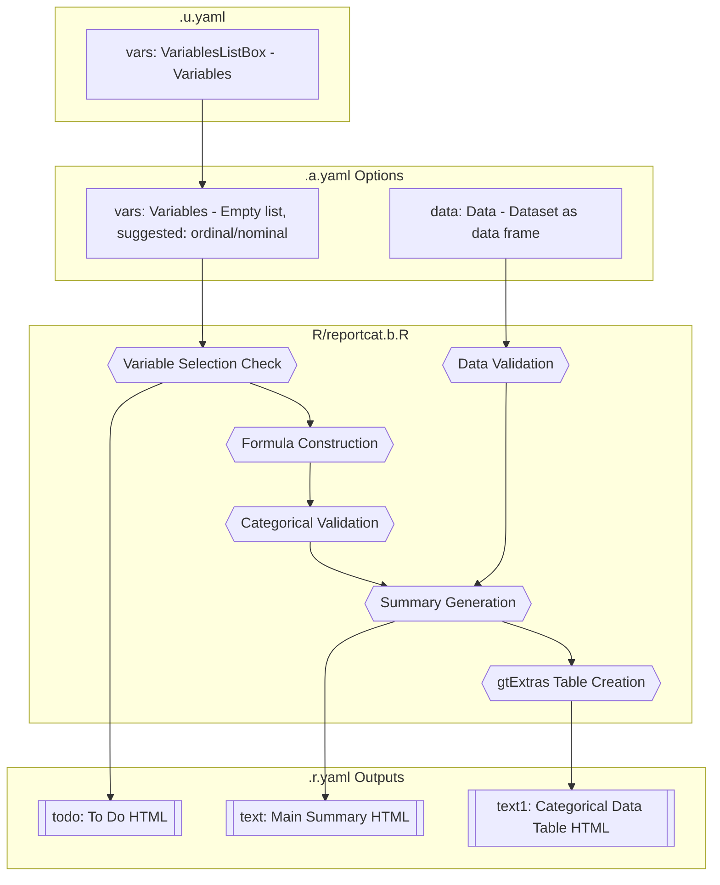
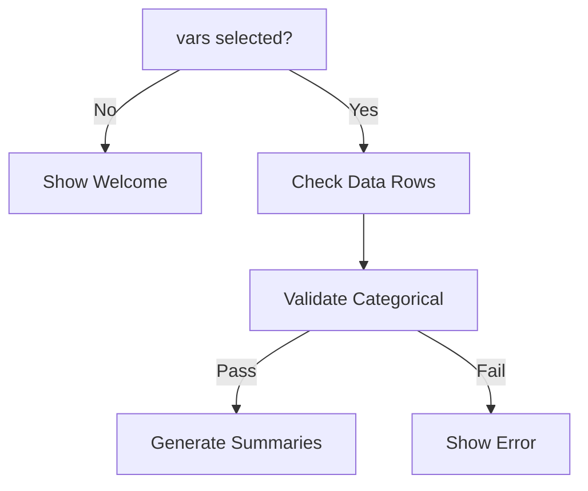
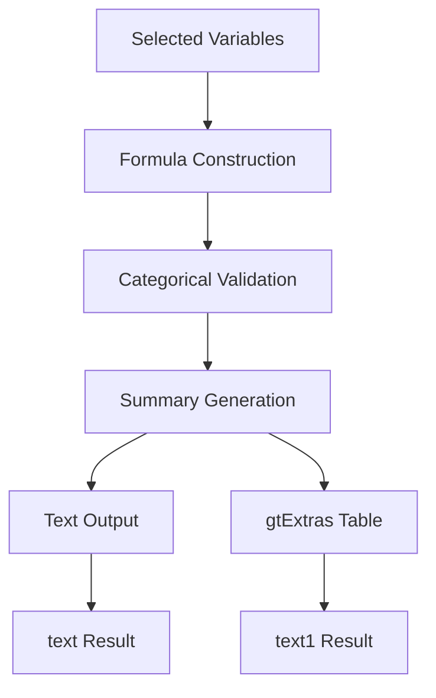
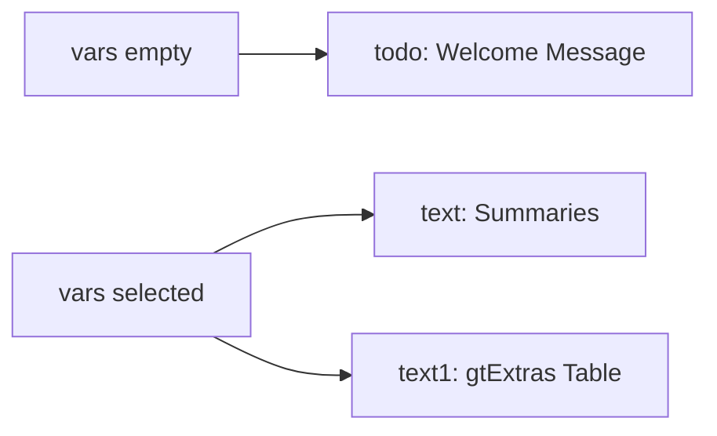

# reportcat Function Documentation

## 1. Overview

- **Function**: `reportcat`
- **Files**:
  - `jamovi/reportcat.u.yaml` — UI
  - `jamovi/reportcat.a.yaml` — Options
  - `R/reportcat.b.R` — Backend
  - `jamovi/reportcat.r.yaml` — Results

- **Summary**: The reportcat function generates a detailed summary of categorical variables including counts, percentages, and missing value information. It produces both textual and visual formats using gtExtras styling, making it easy to interpret the distribution of categorical data in a dataset.

## 2. UI Controls → Options Map

| UI Control | Type | Label | Binds to Option | Defaults & Constraints | Visibility/Enable Rules |
|------------|------|-------|-----------------|------------------------|-------------------------|
| `vars` | VariablesListBox | Variables | `vars` | Empty list, suggested: ordinal/nominal, permitted: factor | Always visible |

## 3. Options Reference (.a.yaml)

| Name | Type | Default | Description | Downstream Effects |
|------|------|---------|-------------|-------------------|
| `data` | Data | - | The dataset as a data frame | Used throughout backend for variable analysis |
| `vars` | Variables | Empty list | Categorical variables to summarize (ordinal, nominal, factors) | Controls which variables are processed and summarized |

## 4. Backend Usage (.b.R)

### `self$options$vars` Usage

**Code Locations**:

- `.run()` method - line 19: Initial check for variable selection
- `.run()` method - line 41: Formula construction with selected variables
- `.run()` method - line 89: Summary generation for each variable

**Logic Summary**:

- **Empty check**: If no variables selected, displays welcome message
- **Formula construction**: Uses `jmvcore::constructFormula()` and `jmvcore::decomposeFormula()` to process selected variables
- **Validation**: Checks that all selected variables are categorical (factor or character)
- **Summary generation**: Iterates through each variable using `purrr::map()` to generate individual summaries

**Result Population**:

- `self$results$todo$setContent()` - Shows/hides welcome message
- `self$results$text$setContent()` - Sets main textual summary
- `self$results$text1$setContent()` - Sets visual summary table

### `self$options$data` Usage

**Code Locations**:

- `.run()` method - line 35: Row count validation
- `.run()` method - line 38: Data assignment to `mydata`
- Private methods - lines 96, 128: Used in gtExtras table generation

**Logic Summary**:

- Validates dataset has rows
- Provides data source for all statistical calculations
- Used in both textual and visual summary generation

## 5. Results Definition (.r.yaml)

| Output ID | Type | Title | Visibility | Schema | Population Entry Points |
|-----------|------|-------|------------|---------|------------------------|
| `todo` | Html | "To Do" | When `vars` is empty | HTML content | `self$results$todo$setContent()` - line 28, 32 |
| `text` | Html | "" | When `vars` selected | HTML content | `self$results$text$setContent()` - line 91 |
| `text1` | Html | "Categorical Data" | When `vars` selected | HTML content | `self$results$text1$setContent()` - line 114 |

**Clear Conditions**: The `todo` output clears when `vars` changes.

## 6. Data Flow Diagram (UI → Options → Backend → Results)



## 7. Execution Sequence (User Action → Results)

### User Input Flow


### Variable Validation


### Processing Pipeline


### Result Updates


**Step-by-step execution flow:**

1. **User selects categorical variables** → UI updates `vars` option
2. **Backend validation** → Check if vars empty, show welcome or proceed
3. **Data validation** → Validate rows exist, construct formula, check categorical types
4. **Summary generation** → Use `purrr::map()` to process each variable
5. **Text creation** → Generate detailed statistics with counts/percentages
6. **Visual table** → Create gtExtras styled table with error handling
7. **Results display** → Update text and text1 results, clear todo message

## 8. Change Impact Guide

### Key Option Changes

**If `vars` changed**:

- **Recalculates**: All summary statistics, level counts, percentages, missing value counts
- **Outputs affected**: `todo` (visibility), `text` (content), `text1` (table content)
- **Performance implications**: Linear scaling with number of variables and their unique levels
- **Common pitfalls**:
  - Selecting non-categorical variables triggers validation error
  - Large datasets with many levels may slow gtExtras rendering
  - Character variables are automatically converted to factors

**Data validation requirements**:

- Dataset must contain at least one complete row
- Selected variables must be categorical (factor or character types)
- Missing values are handled gracefully but reported in summaries

**Recommended defaults**:

- Start with a few key categorical variables to assess performance
- Use factor variables rather than character for better performance
- Ensure proper factor level ordering for ordinal variables

## 9. Example Usage

**Example dataset requirements**:

- Variables: Must include categorical variables (factors or characters)
- Levels: Works with any number of levels, but most readable with 2-10 levels per variable
- Missing values: Handled automatically and reported

**Example option payload**:

```yaml
data: myDataFrame
vars: ["gender", "treatment_group", "disease_stage"]
```

**Expected outputs**:

- **Welcome message**: Displayed when no variables selected, with styling instructions
- **Text summary**: Detailed breakdown showing variable name, total observations, levels, missing values, and percentage distribution for each level
- **Visual table**: gtExtras-styled summary table with statistics optimized for categorical data, hiding irrelevant numeric columns

## 10. Appendix (Schemas & Snippets)

### HTML Output Schemas

**todo output**: Welcome message with HTML styling

```html
<div style='font-family: Arial, sans-serif; color: #2c3e50;'>
  <h2>Welcome to ClinicoPath</h2>
  <p>Instructions for variable selection...</p>
</div>
```

**text output**: Variable summaries with HTML formatting

```html
<strong>variable_name</strong> has X observations and Y levels.<br>
level1: n = count1, percentage1% of valid cases.<br>
Missing values: Z.<br><br>
```

**text1 output**: gtExtras table HTML with fallback handling

### Key Code Snippets

**Variable validation**:

```r
# reportcat.b.R:46-50
non_categorical <- myvars[!sapply(mydata[myvars], function(x) is.factor(x) || is.character(x))]
if (length(non_categorical) > 0) {
    stop(paste("Non-categorical variables detected:", paste(non_categorical, collapse = ", ")))
}
```

**Summary generation**:

```r
# reportcat.b.R:72-79
description <- summar %>%
    dplyr::mutate(
        percent = n / validtotal,
        level_description = glue::glue("{level}: n = {n}, {scales::percent(percent)} of valid cases. ")
    ) %>%
    dplyr::pull(level_description)
```

**Results population**:

```r
# reportcat.b.R:89-91, 114
summaries <- purrr::map(.x = myvars, .f = catsummary)
summary_text <- paste(summaries, collapse = "<br><br>")
self$results$text$setContent(summary_text)
self$results$text1$setContent(plot_dataset)
```
