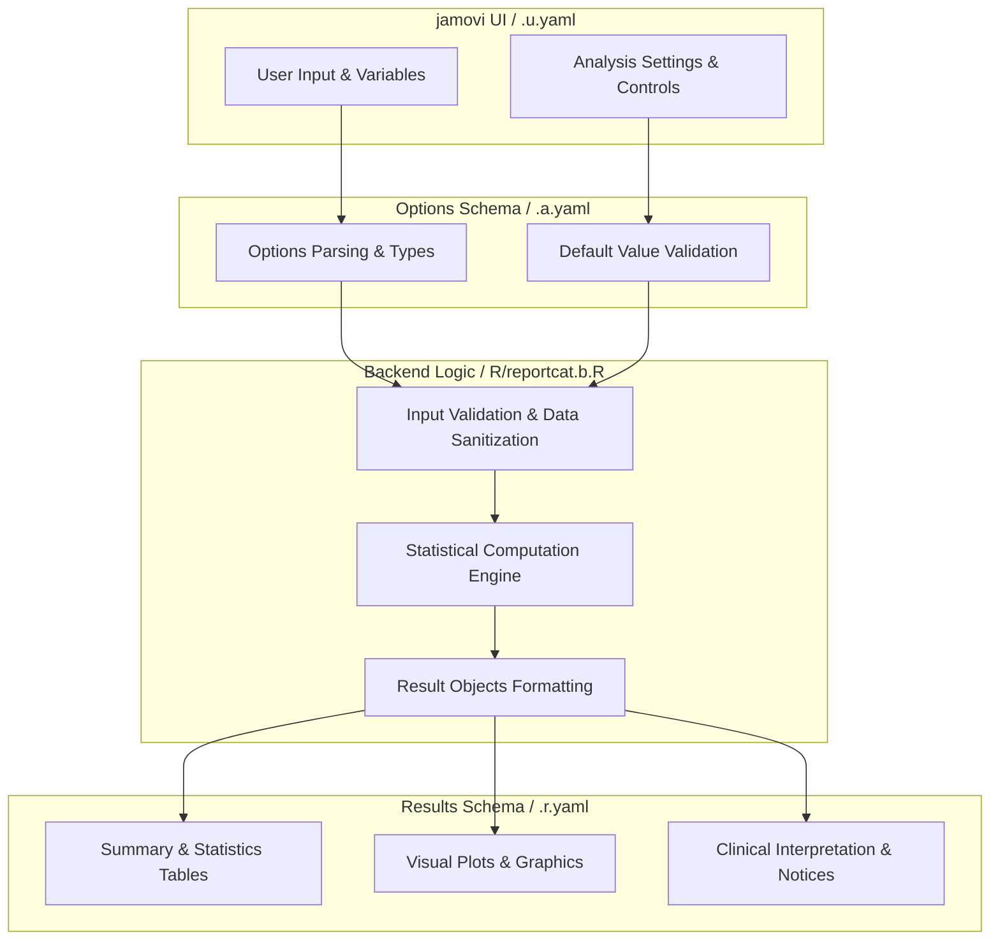
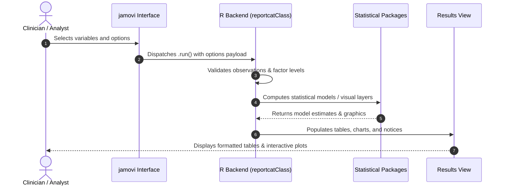

# Summary of Categorical Variables - Developer Documentation

## 1. Overview

- **Function**: `reportcat`
- **Title**: Summary of Categorical Variables
- **Module**: `ExplorationT`
- **Files**:
  - `jamovi/reportcat.u.yaml` - User Interface Definition
  - `jamovi/reportcat.a.yaml` - Options & Schema Definition
  - `jamovi/reportcat.r.yaml` - Results Layout & Tables
  - `R/reportcat.b.R` - Backend Implementation
- **Summary**: Generates a detailed summary of categorical variables including counts, percentages, and missing value information. The output is presented in both textual and visual formats, making it easy to interpret the distribution of your data.

## 1a. Changelog

- **Date**: 2026-08-29
- **Summary**: Comprehensive documentation suite created & verified against active schemas and backend implementation.

## 2. Options Reference (`.a.yaml`)

| Option | Type | Default | Description |
| :--- | :--- | :--- | :--- |
| `data` | `Data` | `NULL` |  |
| `vars` | `Variables` | `NULL` | Variables |

## 3. Results Definition (`.r.yaml`)

| Output ID | Type | Title | Description |
| :--- | :--- | :--- | :--- |
| `todo` | `Html` | `To Do` |  |
| `clinicalSummary` | `Html` | `Clinical Interpretation` |  |
| `aboutAnalysis` | `Html` | `About This Analysis` |  |
| `assumptions` | `Html` | `Data Quality & Assumptions` |  |
| `text` | `Html` | `Variable Summaries` |  |
| `text1` | `Html` | `Summary Table` |  |
| `reportSentences` | `Html` | `Copy-Ready Clinical Summary` |  |
| `dataWarnings` | `Html` | `Data Warnings` |  |
| `error` | `Html` | `Error Message` |  |

## 4. Architecture & Data Flow Diagram

```mermaid
flowchart TD
  subgraph UI[jamovi UI / .u.yaml]
    U1[User Input & Variables]
    U2[Analysis Settings & Controls]
  end

  subgraph Opts[Options Schema / .a.yaml]
    O1[Options Parsing & Types]
    O2[Default Value Validation]
  end

  subgraph Backend[Backend Logic / R/reportcat.b.R]
    B1[Input Validation & Data Sanitization]
    B2[Statistical Computation Engine]
    B3[Result Objects Formatting]
  end

  subgraph Res[Results Schema / .r.yaml]
    R1[Summary & Statistics Tables]
    R2[Visual Plots & Graphics]
    R3[Clinical Interpretation & Notices]
  end

  U1 --> O1
  U2 --> O2
  O1 --> B1
  O2 --> B1
  B1 --> B2
  B2 --> B3
  B3 --> R1
  B3 --> R2
  B3 --> R3
```

## 5. Execution Sequence

```mermaid
sequenceDiagram
  autonumber
  actor User as Clinician / Analyst
  participant UI as jamovi Interface
  participant Backend as R Backend (reportcatClass)
  participant Engine as Statistical Packages
  participant Results as Results View

  User->>UI: Selects variables and options
  UI->>Backend: Dispatches .run() with options payload
  Backend->>Backend: Validates observations & factor levels
  Backend->>Engine: Computes statistical models / visual layers
  Engine-->>Backend: Returns model estimates & graphics
  Backend->>Results: Populates tables, charts, and notices
  Results-->>User: Displays formatted tables & interactive plots
```

## 6. Change Impact & Safety Guidelines

- **Data Filtering**: Ensure observations with missing values are handled gracefully according to analysis options.
- **Formula Conflicts**: Use isolated environment calls or base formula methods when interacting with `ggstatsplot` or formula parsers.
- **Safe Deparsing**: Use `deparse(val)` in syntax generation (`asSource()`) to escape column names with spaces or special symbols.

