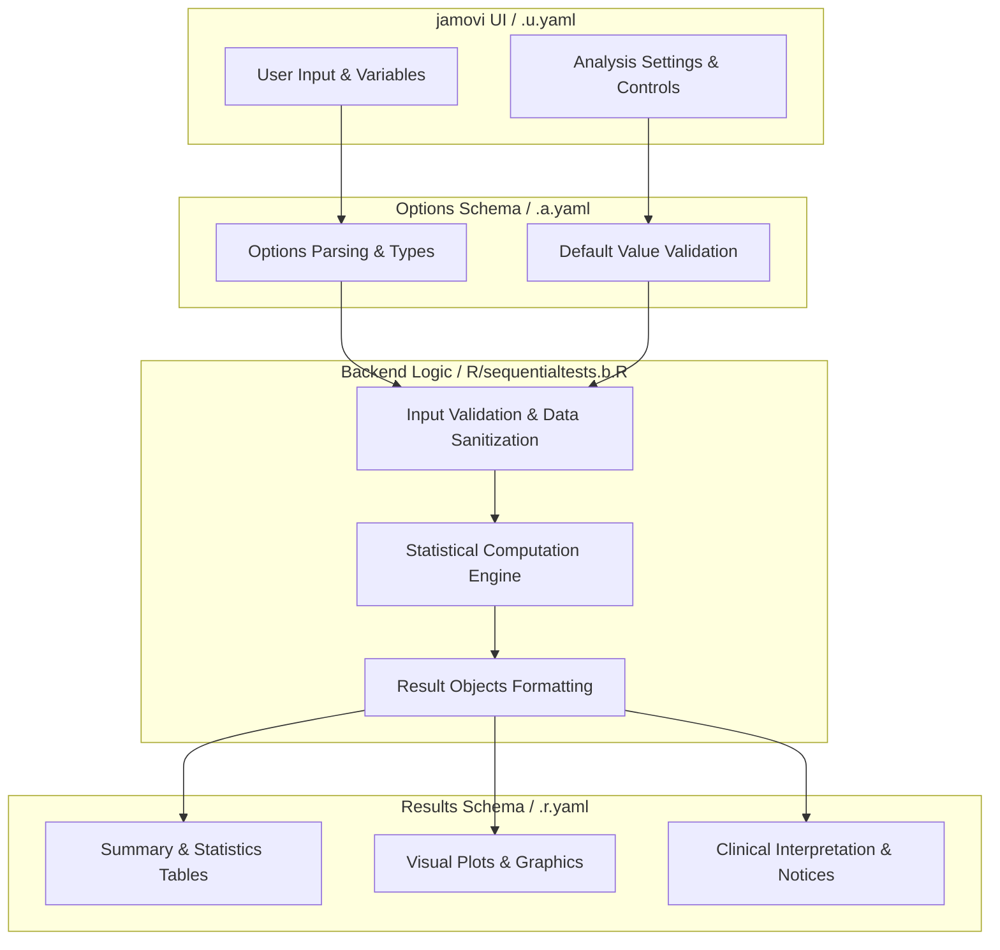
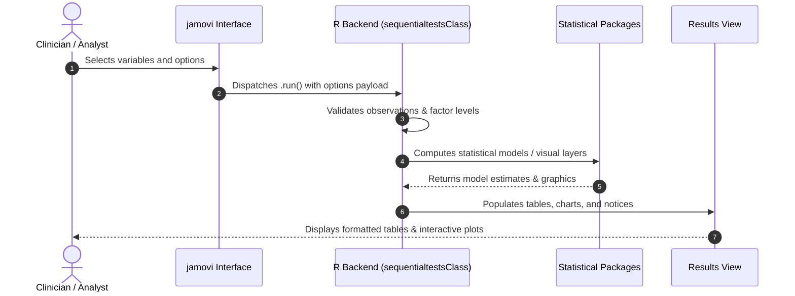

# Sequential Testing Analysis - Developer Documentation

## 1. Overview

- **Function**: `sequentialtests`
- **Title**: Sequential Testing Analysis
- **Module**: `meddecide`
- **Files**:
  - `jamovi/sequentialtests.u.yaml` - User Interface Definition
  - `jamovi/sequentialtests.a.yaml` - Options & Schema Definition
  - `jamovi/sequentialtests.r.yaml` - Results Layout & Tables
  - `R/sequentialtests.b.R` - Backend Implementation
- **Summary**: Analyzes how diagnostic accuracy changes when applying two tests in sequence, comparing three different testing strategies: serial positive (confirmation), serial negative (exclusion), and parallel testing. Provides comprehensive analysis including population flow, cost implications, and diagnostic plots.  The named scenarios and their values are teaching examples only, not clinical guidance or validated diagnostic pathways. Replace all example parameters with estimates applicable to the intended population before interpreting results.  This analysis is particularly useful for: • Exploring how diagnostic strategies behave under explicit assumptions • Comparing hypothetical test sequences for teaching or planning • Understanding trade-offs between sensitivity and specificity • Illustrating expected testing volume and cost under user-supplied assumptions • Teaching sequential testing concepts and Bayesian probability

## 1a. Changelog

- **Date**: 2026-08-29
- **Summary**: Comprehensive documentation suite created & verified against active schemas and backend implementation.

## 2. Options Reference (`.a.yaml`)

| Option | Type | Default | Description |
| :--- | :--- | :--- | :--- |
| `preset` | `List` | `custom` | Teaching Example |
| `test1_name` | `String` | `Screening Test` | Screening Test Name |
| `test1_sens` | `Number` | `0.95` | Sensitivity |
| `test1_spec` | `Number` | `0.7` | Specificity |
| `test1_cost` | `Number` | `0` | Illustrative Unit Cost |
| `test2_name` | `String` | `Confirmatory Test` | Confirmatory Test Name |
| `test2_sens` | `Number` | `0.8` | Sensitivity |
| `test2_spec` | `Number` | `0.98` | Specificity |
| `test2_cost` | `Number` | `0` | Illustrative Unit Cost |
| `strategy` | `List` | `serial_positive` | Testing Strategy |
| `prevalence` | `Number` | `0.1` | Disease Prevalence |
| `population_size` | `Integer` | `1000` | Illustrative Population Size |
| `show_explanation` | `Bool` | `FALSE` | Explanations |
| `show_formulas` | `Bool` | `FALSE` | Calculation formulas |
| `show_cost_analysis` | `Bool` | `FALSE` | Cost analysis |
| `show_plots` | `Bool` | `FALSE` | Diagnostic plots |

## 3. Results Definition (`.r.yaml`)

| Output ID | Type | Title | Description |
| :--- | :--- | :--- | :--- |
| `notices` | `Preformatted` | `Important Information` |  |
| `plain_summary` | `Html` | `Summary (Plain Language)` |  |
| `summary_table` | `Table` | `Summary of Testing Strategy` |  |
| `individual_tests_table` | `Table` | `Individual Test Performance` |  |
| `population_flow_table` | `Table` | `Population Flow Analysis` |  |
| `cost_analysis_table` | `Table` | `Cost Analysis` |  |
| `explanation_text` | `Html` | `Explanation` |  |
| `formulas_text` | `Html` | `Formulas Used` |  |
| `plot_flow_diagram` | `Image` | `Testing Strategy Flow Diagram` |  |
| `plot_performance` | `Image` | `Test Performance Comparison` |  |
| `plot_probability` | `Image` | `Probability Transformation` |  |
| `plot_population_flow` | `Image` | `Population Flow Visualization` |  |
| `plot_sensitivity_analysis` | `Image` | `Sensitivity Analysis: PPV/NPV vs Prevalence` |  |
| `clinical_guidance` | `Html` | `Strategy Notes and Teaching Examples` |  |

## 4. Architecture & Data Flow Diagram

## 5. Execution Sequence

## 6. Change Impact & Safety Guidelines

- **Data Filtering**: Ensure observations with missing values are handled gracefully according to analysis options.
- **Formula Conflicts**: Use isolated environment calls or base formula methods when interacting with `ggstatsplot` or formula parsers.
- **Safe Deparsing**: Use `deparse(val)` in syntax generation (`asSource()`) to escape column names with spaces or special symbols.

