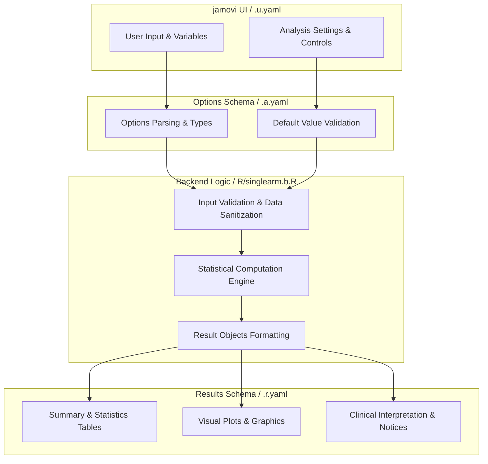
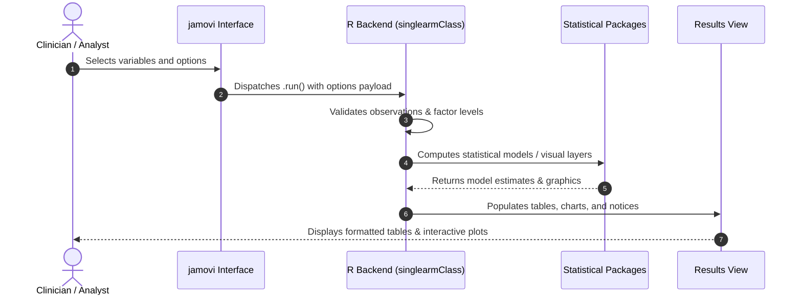

# Single Arm Survival - Developer Documentation

## 1. Overview

- **Function**: `singlearm`
- **Title**: Single Arm Survival
- **Module**: `SurvivalT`
- **Files**:
  - `jamovi/singlearm.u.yaml` - User Interface Definition
  - `jamovi/singlearm.a.yaml` - Options & Schema Definition
  - `jamovi/singlearm.r.yaml` - Results Layout & Tables
  - `R/singlearm.b.R` - Backend Implementation
- **Summary**: Performs survival analysis for a single cohort without group comparisons. Kaplan-Meier estimates use event times and risk sets; in competing-risk mode, cumulative incidence retains competing terminal events as separate states. Optional person-time rates use the sum of individual observation periods as their denominator. This is descriptive analysis of one cohort, not a treatment-effect estimate.

## 1a. Changelog

- **Date**: 2026-08-29
- **Summary**: Comprehensive documentation suite created & verified against active schemas and backend implementation.

## 2. Options Reference (`.a.yaml`)

| Option | Type | Default | Description |
| :--- | :--- | :--- | :--- |
| `data` | `Data` | `NULL` |  |
| `elapsedtime` | `Variable` | `NULL` | Time Elapsed |
| `tint` | `Bool` | `FALSE` | Using dates to calculate survival time |
| `dxdate` | `Variable` | `NULL` | Diagnosis Date |
| `fudate` | `Variable` | `NULL` | Follow-up Date |
| `calculatedtime` | `Output` | `NULL` | Add Calculated Time to Data |
| `outcome` | `Variable` | `NULL` | Outcome |
| `outcomeLevel` | `Level` | `NULL` | Event Level |
| `dod` | `Level` | `NULL` | Dead of Disease |
| `dooc` | `Level` | `NULL` | Dead of Other |
| `awd` | `Level` | `NULL` | Alive w Disease |
| `awod` | `Level` | `NULL` | Alive w/o Disease |
| `analysistype` | `List` | `overall` | Survival Type |
| `outcomeredefined` | `Output` | `NULL` | Add Redefined Outcome to Data |
| `cutp` | `String` | `12, 36, 60` | Cutpoints |
| `timetypedata` | `List` | `ymd` | Time Type in Data (e.g., YYYY-MM-DD) |
| `timetypeoutput` | `List` | `months` | Time Unit |
| `uselandmark` | `Bool` | `FALSE` | Use landmark time |
| `landmark` | `Number` | `3` | Landmark Time |
| `sc` | `Bool` | `FALSE` | Survival / cumulative-incidence plot |
| `kmunicate` | `Bool` | `FALSE` | KMunicate-style plot |
| `ce` | `Bool` | `FALSE` | Cumulative event probability |
| `ch` | `Bool` | `FALSE` | Cumulative hazard |
| `endplot` | `Number` | `60` | Plot End Time |
| `ybegin_plot` | `Number` | `0` | Start y-axis |
| `yend_plot` | `Number` | `1` | End y-axis |
| `byplot` | `Number` | `12` | Time Interval |
| `multievent` | `Bool` | `FALSE` | Multiple event levels |
| `ci95` | `Bool` | `FALSE` | 95 percent CI |
| `risktable` | `Bool` | `FALSE` | Risktable |
| `censored` | `Bool` | `FALSE` | Censored |
| `medianline` | `List` | `none` | Median line |
| `person_time` | `Bool` | `FALSE` | Calculate person-time metrics |
| `time_intervals` | `String` | `12, 36, 60` | Time Interval Stratification |
| `rate_multiplier` | `Integer` | `100` | Rate Multiplier |
| `baseline_hazard` | `Bool` | `FALSE` | Piecewise hazard-rate analysis |
| `hazard_smoothing` | `Bool` | `FALSE` | Smoothed hazard function |
| `showExplanations` | `Bool` | `FALSE` | Analysis explanations |
| `showSummaries` | `Bool` | `FALSE` | Natural language summaries |
| `advancedDiagnostics` | `Bool` | `FALSE` | Descriptive data diagnostics |

## 3. Results Definition (`.r.yaml`)

| Output ID | Type | Title | Description |
| :--- | :--- | :--- | :--- |
| `eventRecodeInfo` | `Html` | `Outcome Recode` |  |
| `todo` | `Html` | `To Do` |  |
| `errors` | `Html` | `Errors` |  |
| `warnings` | `Html` | `Warnings` |  |
| `info` | `Html` | `Information` |  |
| `medianHeading` | `Preformatted` | `Median Time-to-Event Analysis` |  |
| `medianTable` | `Table` | `Median Time-to-Event Table` |  |
| `clinicalSummary` | `Html` | `Descriptive Cohort Summary (Copy-Ready)` |  |
| `medianSummary` | `Preformatted` | `Median Time-to-Event Natural Language Summary` |  |
| `medianHeading3` | `Preformatted` | `Median Time-to-Event Explanations` |  |
| `medianSurvivalExplanation` | `Html` | `Understanding the Kaplan-Meier Median` |  |
| `survTableHeading` | `Preformatted` | `Time-Specific Probability Estimates` |  |
| `survTable` | `Table` | `Time-Specific Probability Estimates` |  |
| `survTableSummary` | `Preformatted` | `Survival Table Natural Language Summary` |  |
| `survTableHeading3` | `Preformatted` | `Survival Table Explanations` |  |
| `survivalProbabilityExplanation` | `Html` | `Understanding Survival Probabilities` |  |
| `personTimeHeading` | `Preformatted` | `Person-Time Analysis` |  |
| `personTimeTable` | `Table` | `Person-Time Analysis` |  |
| `personTimeHeading2` | `Preformatted` | `Person-Time Analysis Natural Language Summary` |  |
| `personTimeSummary` | `Html` | `Person-Time Summary` |  |
| `personTimeHeading3` | `Preformatted` | `Person-Time Analysis Explanations` |  |
| `personTimeExplanation` | `Html` | `Understanding Person-Time Analysis` |  |
| `plot` | `Image` | `Survival Plot` |  |
| `plot_cif` | `Image` | `Cumulative Incidence Function` |  |
| `plot6` | `Image` | `KMunicate-Style Plot` |  |
| `plot2` | `Image` | `Cumulative Event Probability` |  |
| `plot3` | `Image` | `Cumulative Hazard` |  |
| `survivalPlotsHeading3` | `Preformatted` | `Plots Explanations` |  |
| `survivalPlotsExplanation` | `Html` | `Understanding Survival Curves and Plots` |  |
| `baselineHazardHeading` | `Preformatted` | `Exploratory Piecewise Hazard-Rate Analysis` |  |
| `baselineHazardTable` | `Table` | `Piecewise Hazard-Rate Estimates` |  |
| `baselineHazardPlot` | `Image` | `Piecewise Hazard-Rate Estimates` |  |
| `smoothedHazardPlot` | `Image` | `Smoothed Hazard Function` |  |
| `baselineHazardSummary` | `Html` | `Piecewise Hazard-Rate Analysis Summary` |  |
| `baselineHazardHeading3` | `Preformatted` | `Piecewise Hazard-Rate Analysis Explanations` |  |
| `baselineHazardExplanation` | `Html` | `Understanding Piecewise Hazard-Rate Analysis` |  |
| `dataQualityHeading` | `Preformatted` | `Descriptive Data Diagnostics` |  |
| `dataQualityTable` | `Table` | `Descriptive Data Metrics` |  |
| `dataQualitySummary` | `Html` | `Descriptive Data Diagnostics Summary` |  |
| `calculatedtime` | `Output` | `Add Calculated Time to Data` |  |
| `outcomeredefined` | `Output` | `Add Redefined Outcome to Data` |  |

## 4. Architecture & Data Flow Diagram

## 5. Execution Sequence

## 6. Change Impact & Safety Guidelines

- **Data Filtering**: Ensure observations with missing values are handled gracefully according to analysis options.
- **Formula Conflicts**: Use isolated environment calls or base formula methods when interacting with `ggstatsplot` or formula parsers.
- **Safe Deparsing**: Use `deparse(val)` in syntax generation (`asSource()`) to escape column names with spaces or special symbols.

