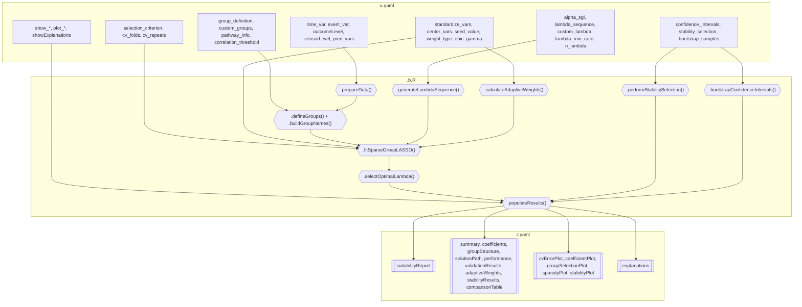

# Sparse Group LASSO Cox Regression -- Developer Documentation

## 1. Overview

- **Function**: `sparsegrouplasso`
- **Menu**: SurvivalT > Penalized Cox Regression > Sparse Group LASSO Cox
- **Version**: 1.0.0 (Draft)
- **Files**:
  - `jamovi/sparsegrouplasso.u.yaml` -- UI
  - `jamovi/sparsegrouplasso.a.yaml` -- Options
  - `R/sparsegrouplasso.b.R` -- Backend
  - `jamovi/sparsegrouplasso.r.yaml` -- Results

**Summary**: Sparse Group LASSO approximates penalized Cox regression that selects variable groups while allowing individual sparsity within groups. Uses `glmnet::cv.glmnet(family="cox")` with penalty.factor weighting to combine group-level and individual-level penalties. Supports 5 grouping methods, 4 selection criteria (CV deviance, AIC, BIC, EBIC), adaptive weighting, stability selection, bootstrap CIs, repeated CV, and comparison against pure Group LASSO and LASSO models.

---

## 2. UI Controls -> Options Map

### Variable Selectors

| UI Control | Type | Label | Binds to Option | Default | Enable Condition |
|------------|------|-------|-----------------|---------|------------------|
| `time_var` | VariablesListBox | Time Variable | `time_var` | -- | Always |
| `event_var` | VariablesListBox | Event Variable | `event_var` | -- | Always |
| `outcomeLevel` | LevelSelector | Event Level | `outcomeLevel` | -- | `(event_var)` |
| `censorLevel` | LevelSelector | Censored Level | `censorLevel` | -- | `(event_var)` |
| `pred_vars` | VariablesListBox | Predictor Variables | `pred_vars` | -- | Always |

### Data Suitability (CollapseBox, collapsed: false)

| UI Control | Type | Binds to Option | Default |
|------------|------|-----------------|---------|
| `suitabilityCheck` | CheckBox | `suitabilityCheck` | `true` |

### Group Definition (CollapseBox, collapsed: false)

| UI Control | Type | Binds to Option | Default | Enable Condition |
|------------|------|-----------------|---------|------------------|
| `group_definition` | ComboBox | `group_definition` | `factor_based` | Always |
| `custom_groups` | TextBox (string) | `custom_groups` | `""` | `(group_definition:custom)` |
| `pathway_info` | VariablesListBox | `pathway_info` | -- | Always |
| `correlation_threshold` | TextBox (number) | `correlation_threshold` | `0.7` | `(group_definition:correlation_based)` |

### Penalty & Lambda (CollapseBox, collapsed: false)

| UI Control | Type | Binds to Option | Default | Enable Condition |
|------------|------|-----------------|---------|------------------|
| `alpha_sgl` | TextBox (number) | `alpha_sgl` | `0.95` | Always |
| `lambda_sequence` | ComboBox | `lambda_sequence` | `auto` | Always |
| `custom_lambda` | TextBox (string) | `custom_lambda` | `""` | `(lambda_sequence:custom)` |
| `lambda_min_ratio` | TextBox (number) | `lambda_min_ratio` | `0.001` | Always |
| `n_lambda` | TextBox (number) | `n_lambda` | `100` | Always |

### Cross-Validation (CollapseBox, collapsed: false)

| UI Control | Type | Binds to Option | Default |
|------------|------|-----------------|---------|
| `selection_criterion` | ComboBox | `selection_criterion` | `cv_deviance` |
| `cv_folds` | TextBox (number) | `cv_folds` | `10` |
| `cv_repeats` | TextBox (number) | `cv_repeats` | `1` |

### Validation & Stability (CollapseBox, collapsed: true)

| UI Control | Type | Binds to Option | Default | Enable Condition |
|------------|------|-----------------|---------|------------------|
| `confidence_intervals` | CheckBox | `confidence_intervals` | `false` | Always |
| `bootstrap_samples` | TextBox (number) | `bootstrap_samples` | `500` | `(confidence_intervals)` |
| `alpha_level` | TextBox (number) | `alpha_level` | `0.05` | `(confidence_intervals)` |
| `stability_selection` | CheckBox | `stability_selection` | `false` | Always |
| `stability_threshold` | TextBox (number) | `stability_threshold` | `0.8` | `(stability_selection)` |
| `stability_subsample` | TextBox (number) | `stability_subsample` | `0.8` | `(stability_selection)` |

### Advanced Optimization (CollapseBox, collapsed: true)

| UI Control | Type | Binds to Option | Default | Enable Condition |
|------------|------|-----------------|---------|------------------|
| `standardize_vars` | CheckBox | `standardize_vars` | `true` | Always |
| `center_vars` | CheckBox | `center_vars` | `true` | Always |
| `seed_value` | TextBox (number) | `seed_value` | `42` | Always |
| `ebic_gamma` | TextBox (number) | `ebic_gamma` | `1` | `(selection_criterion:ebic)` |
| `weight_type` | ComboBox | `weight_type` | `none` | Always |
| `weight_power` | TextBox (number) | `weight_power` | `1` | `(weight_type:ridge_based OR univariate_based OR lasso_based)` |

### Plots (CollapseBox, collapsed: true)

| UI Control | Type | Binds to Option | Default |
|------------|------|-----------------|---------|
| `plot_cv_error` | CheckBox | `plot_cv_error` | `true` |
| `plot_coefficients` | CheckBox | `plot_coefficients` | `true` |
| `plot_groups` | CheckBox | `plot_groups` | `true` |
| `plot_sparsity` | CheckBox | `plot_sparsity` | `false` |
| `plot_stability` | CheckBox | `plot_stability` | `false` |

### Results Display (CollapseBox, collapsed: true)

| UI Control | Type | Binds to Option | Default |
|------------|------|-----------------|---------|
| `show_summary` | CheckBox | `show_summary` | `true` |
| `show_coefficients` | CheckBox | `show_coefficients` | `true` |
| `show_groups` | CheckBox | `show_groups` | `true` |
| `show_path` | CheckBox | `show_path` | `false` |
| `show_performance` | CheckBox | `show_performance` | `true` |
| `show_validation` | CheckBox | `show_validation` | `true` |
| `showExplanations` | CheckBox | `showExplanations` | `true` |

---

## 3. Options Reference

Total: 37 options (excluding `data`).

All options are wired in `.b.R`. See the full check report for the argument behavior matrix confirming 37/37 effective.

---

## 4. Backend Usage

### Key Methods

| Method | Purpose | Options Used |
|--------|---------|-------------|
| `.init()` | Welcome/instructions HTML | `time_var`, `event_var`, `pred_vars` |
| `.run()` | Main orchestrator + clinical notices | All |
| `.prepareData()` | Validation, event encoding, dummy expansion | `time_var`, `event_var`, `outcomeLevel`, `censorLevel`, `pred_vars`, `pathway_info` |
| `.defineGroups()` | Dispatch to 5 grouping methods | `group_definition` |
| `.buildGroupNames()` | Descriptive names from member variables | groups, variable names |
| `.generateLambdaSequence()` | Auto/custom/adaptive lambda grid | `lambda_sequence`, `custom_lambda`, `lambda_min_ratio`, `n_lambda`, `alpha_sgl` |
| `.calculateAdaptiveWeights()` | Ridge/univariate/LASSO-based initial weights | `weight_type`, `weight_power` |
| `.fitSparseGroupLASSO()` | Core `glmnet::cv.glmnet` with penalty.factor | `alpha_sgl`, `cv_folds`, `cv_repeats`, `seed_value` |
| `.selectOptimalLambda()` | CV deviance / AIC / BIC / EBIC selection | `selection_criterion`, `ebic_gamma`, n_obs |
| `.performStabilitySelection()` | Subsample loop | `bootstrap_samples`, `stability_subsample`, `stability_threshold` |
| `.bootstrapConfidenceIntervals()` | Percentile CIs | `bootstrap_samples`, `alpha_level` |
| `.populateComparisonTable()` | Fits Group LASSO + LASSO reference models | `alpha_sgl` |
| `.assessSuitability()` | EPV, missing data, multicollinearity HTML | `suitabilityCheck` |

### Notice System (12 triggers)

Uses `.insertNotice()` helper with `jmvcore::Notice` + fallback to `todo` HTML.

---

## 5. Results Definition

| Output | Type | Visibility | Population Method |
|--------|------|------------|-------------------|
| `instructions` | Html | `false` | `.init()` |
| `todo` | Html | `false` | Notice fallback |
| `suitabilityReport` | Html | `(suitabilityCheck)` | `.assessSuitability()` |
| `summary` | Table | `(show_summary)` | `.populateSummaryTable()` |
| `coefficients` | Table | `(show_coefficients)` | `.populateCoefficientsTable()` |
| `groupStructure` | Table | `(show_groups)` | `.populateGroupStructureTable()` |
| `solutionPath` | Table | `(show_path)` | `.populateSolutionPath()` |
| `performance` | Table | `(show_performance)` | `.populatePerformanceTable()` |
| `validationResults` | Table | `(show_validation)` | `.populateValidationTable()` |
| `adaptiveWeights` | Table | runtime `setVisible()` | `.populateAdaptiveWeightsTable()` |
| `stabilityResults` | Table | `(stability_selection)` | `.populateStabilityTable()` |
| `comparisonTable` | Table | `(show_performance)` | `.populateComparisonTable()` |
| `cvErrorPlot` | Image | `(plot_cv_error)` | `.plotCVError()` + `.renderCVErrorPlot()` |
| `coefficientPlot` | Image | `(plot_coefficients)` | `.plotCoefficientPath()` + `.renderCoefficientPlot()` |
| `groupSelectionPlot` | Image | `(plot_groups)` | `.plotGroupSelection()` + `.renderGroupSelectionPlot()` |
| `sparsityPlot` | Image | `(plot_sparsity)` | `.plotSparsity()` + `.renderSparsityPlot()` |
| `stabilityPlot` | Image | `(plot_stability)` | `.plotStability()` + `.renderStabilityPlot()` |
| `explanations` | Html | `(showExplanations)` | `.populateExplanations()` |

---

## 6. Data Flow Diagram



---

## 7. Execution Sequence

1. **User assigns variables** -> time, event (with levels), predictors
2. **`.init()`** -> If missing, show welcome HTML; if < 2 predictors, show setup HTML
3. **`.run()`** -> Guards: package availability, variable count
4. **`.assessSuitability()`** -> EPV, missing data %, multicollinearity (actual max |r|)
5. **`.prepareData()`** -> complete cases, two-level encoding, time validation, dummy expansion
6. **`.performSparseGroupLASSO()`**:
   - `.defineGroups()` -> dispatch to factor_based/custom/pathway/variable_type/correlation
   - `.buildGroupNames()` -> descriptive names from member variables
   - `.generateLambdaSequence()` -> auto (log-spaced) / adaptive (glmnet-driven) / custom
   - `.calculateAdaptiveWeights()` -> ridge/univariate/LASSO initial estimates
   - `.fitSparseGroupLASSO()` -> `glmnet::cv.glmnet` with penalty.factor, optional repeated CV
   - `.selectOptimalLambda()` -> CV deviance / AIC / BIC / EBIC with correct n_obs
   - Optional: `.performStabilitySelection()`, `.bootstrapConfidenceIntervals()`
7. **`.populateResults()`** -> dispatch to all table/plot/HTML population methods
8. **Clinical notices** -> event count, discrimination, selection status, completion summary

---

## 8. Change Impact Guide

| Option Changed | What Recalculates | Performance |
|---------------|-------------------|-------------|
| `time_var`/`event_var`/`pred_vars` | Everything | Full refit |
| `alpha_sgl` | Penalty mix + full refit | Moderate |
| `selection_criterion` | Only lambda selection (not refit) | Fast |
| `group_definition` | Groups + refit | Moderate |
| `cv_repeats` | N x CV fits | Linear with repeats |
| `stability_selection` | bootstrap_samples x fits | Heavy |
| `confidence_intervals` | bootstrap_samples x fits | Heavy |
| Display toggles | Only visibility | Negligible |

---

## 9. Example Usage

**Dataset**: `sparsegrouplasso_lung` (n=180, 14 predictors, 95 events)

```yaml
time_var: "time"
event_var: "status"
outcomeLevel: "Dead"
censorLevel: "Alive"
pred_vars: ["age", "smoking_py", "tumor_size", "pdl1", "crp", "nlr", "albumin", "ldh"]
group_definition: "factor_based"
alpha_sgl: 0.95
cv_folds: 5
```

---

## 10. Appendix

### Package Dependencies

| Package | Usage |
|---------|-------|
| `glmnet` | `cv.glmnet()`, `glmnet()` -- core engine |
| `survival` | `Surv()`, `concordance()`, `coxph()` |
| `ggplot2` | All plot rendering |
| `scales` | `percent_format()` in stability plot |
