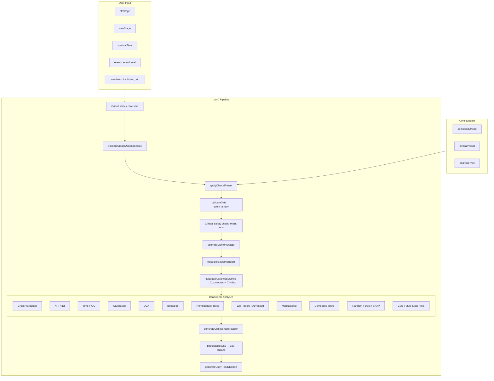

# stagemigration -- Developer Documentation

> **Function:** `stagemigration`
> **Menu:** OncoPathT > Stage Migration Analysis
> **Version:** 0.0.31
> **Backend:** `R/stagemigration.b.R` (29,248 lines, ~878 functions)
> **Helper files:** `stagemigration_helpers.R`, `stagemigration-competing-risks.R`, `stagemigration-discrimination.R`, `stagemigration-utils.R`, `stagemigration-validation.R` (2,479 lines combined)
> **Total codebase:** ~31,700 lines across 7 R files + 4 YAML files (9,023 lines)

---

## 1. Overview

**stagemigration** is a comprehensive TNM staging system validation tool designed for pathologists and oncologists who need to evaluate whether a revised staging system (e.g., TNM 8th edition) provides superior prognostic discrimination compared to an existing system (e.g., TNM 7th edition).

### What It Does

Given two staging variables applied to the same patient cohort with survival follow-up, the function computes:

- **Migration matrix** -- cross-tabulation showing how patients move between staging systems
- **C-index comparison** -- Harrell's concordance index for old vs. new staging
- **NRI / IDI** -- Net Reclassification Improvement and Integrated Discrimination Improvement
- **Will Rogers phenomenon detection** -- identifies apparent survival improvement caused by stage migration rather than true treatment benefit
- **Bootstrap validation** -- optimism-corrected performance estimates
- **Decision Curve Analysis (DCA)** -- clinical utility at various threshold probabilities
- **Time-dependent ROC** -- AUC at multiple time points
- **Calibration analysis** -- Hosmer-Lemeshow, spline-based, and LOWESS calibration
- **Competing risks** -- Fine-Gray models, cause-specific hazards, CIF
- **Random survival forests** -- variable importance, SHAP values
- **15+ additional methods** -- RMST, cure models, frailty models, multi-state models, interval censoring, informative censoring, concordance probability, win ratio, optimal cutpoint determination

### Scale

| Dimension | Count |
|-----------|-------|
| Options (`.a.yaml`) | 238 |
| Outputs (`.r.yaml`) | 180 (122 Tables, 10 Images, 47 Html, 1 Preformatted) |
| Private methods (`.b.R`) | ~878 |
| UI sections (CollapseBoxes) | 8 |
| Test datasets | 8 `.rda` files |

---

## 2. UI Controls to Options Map

The UI (`jamovi/stagemigration.u.yaml`, 1,340 lines) is organized into 8 CollapseBox sections plus the top-level variable suppliers.

### Variable Suppliers (always visible)

| UI Label | Option | Type |
|----------|--------|------|
| Original Staging System | `oldStage` | Variable (factor) |
| New Staging System | `newStage` | Variable (factor) |
| Survival Time (months) | `survivalTime` | Variable (numeric) |
| Event Indicator | `event` | Variable (factor/numeric) |
| Event Level | `eventLevel` | Level (auto-detected) |

### CollapseBox 1: Analysis Configuration (default: open)

Controls the overall analysis scope and clinical context.

| UI Control | Option | Type | Default |
|------------|--------|------|---------|
| Complexity Mode | `complexityMode` | List | `quick` |
| Cancer Type | `cancerType` | List | `general` |
| Report Language | `preferredLanguage` | List | `en` |
| Confidence Level | `confidenceLevel` | Number | `0.95` |
| Clinical Preset | `clinicalPreset` | List | `routine_clinical` |
| Analysis Type | `analysisType` | List | `comprehensive` |
| Use Optimism Correction | `useOptimismCorrection` | Bool | `false` |

**Complexity modes:** `quick` (matrix + C-index, ~5-10 min), `standard` (+ NRI, curves, tests, ~15-20 min), `comprehensive` (+ bootstrap, ROC, DCA, ~30+ min).

### CollapseBox 2: Basic Outputs (default: open)

| UI Control | Option | Default |
|------------|--------|---------|
| Overview Summary | `showMigrationOverview` | `true` |
| Migration Matrix | `showMigrationMatrix` | `true` |
| Stage Distribution | `showStageDistribution` | `false` |
| Migration Summary | `showMigrationSummary` | `false` |
| C-index Comparison | `showStatisticalComparison` | `false` |
| Show Explanations | `showExplanations` | `true` |
| Copy-Ready Summary | `generateCopyReadyReport` | `false` |
| Abbreviation Glossary | `showAbbreviationGlossary` | `false` |
| Executive Summary | `generateExecutiveSummary` | `false` |

### CollapseBox 3: Discrimination & Validation (default: collapsed)

**Discrimination Metrics:**

| Option | Type | Default |
|--------|------|---------|
| `showConcordanceComparison` | Bool | `false` |
| `calculateNRI` | Bool | `false` |
| `nriTimePoints` | String | `"12, 24, 60"` |
| `nriClinicalThreshold` | Number | `0.20` |
| `calculateIDI` | Bool | `false` |
| `calculatePseudoR2` | Bool | `false` |
| `calculateSME` | Bool | `false` |

**ROC Analysis:**

| Option | Type | Default |
|--------|------|---------|
| `performROCAnalysis` | Bool | `false` |
| `rocTimePoints` | String | `"12, 24, 36, 60"` |
| `showROCComparison` | Bool | `false` |

**Validation Methods:**

| Option | Type | Default |
|--------|------|---------|
| `performBootstrap` | Bool | `false` |
| `bootstrapReps` | Number | `1000` |
| `performCrossValidation` | Bool | `false` |
| `cvFolds` | Number | `5` |

**Display Options:**

| Option | Type | Default |
|--------|------|---------|
| `showConfidenceIntervals` | Bool | `false` |
| `includeEffectSizes` | Bool | `false` |

### CollapseBox 4: Survival Analysis (default: collapsed)

**Survival Curves:**

| Option | Type | Default |
|--------|------|---------|
| `showSurvivalCurves` | Bool | `false` |
| `survivalPlotType` | List | `separate` |
| `showRiskTables` | Bool | `false` |

**Statistical Tests:**

| Option | Type | Default |
|--------|------|---------|
| `performHomogeneityTests` | Bool | `false` |
| `performTrendTests` | Bool | `false` |
| `performLikelihoodTests` | Bool | `false` |

**Will Rogers Phenomenon:**

| Option | Type | Default |
|--------|------|---------|
| `advancedMigrationAnalysis` | Bool | `false` |
| `showWillRogersVisualization` | Bool | `false` |
| `showWillRogersAnalysis` | Bool | `false` |

### CollapseBox 5: Multifactorial Analysis (default: collapsed)

| Option | Type | Default |
|--------|------|---------|
| `enableMultifactorialAnalysis` | Bool | `false` |
| `continuousCovariates` | Variables | `NULL` |
| `categoricalCovariates` | Variables | `NULL` |
| `institutionVariable` | Variable | `null` |
| `multifactorialComparisonType` | List | `comprehensive` |
| `showMultifactorialTables` | Bool | `false` |
| `showAdjustedCIndexComparison` | Bool | `false` |
| `showNestedModelTests` | Bool | `false` |
| `showStepwiseResults` | Bool | `false` |
| `performInteractionTests` | Bool | `false` |
| `stratifiedAnalysis` | Bool | `false` |

### CollapseBox 6: Competing Risks Analysis (default: collapsed)

| Option | Type | Default |
|--------|------|---------|
| `performCompetingRisks` | Bool | `false` |
| `competingEventVar` | Variable | `null` |
| `competingRisksCovariates` | Variables | `null` |
| `competingRisksMethod` | List | `comprehensive` |
| `competingEventLevels` | String | `"cancer_death, other_death, censored"` |
| `primaryEventLevel` | String | `"cancer_death"` |
| `performGrayTest` | Bool | `false` |
| `stratifyByStaging` | Bool | `false` |
| `calculateCRCIndex` | Bool | `false` |
| `generateCIFPlots` | Bool | `false` |

### CollapseBox 7: Clinical Utility Analysis (default: collapsed)

**Decision Analysis:**

| Option | Type | Default |
|--------|------|---------|
| `performDCA` | Bool | `false` |
| `performCalibration` | Bool | `false` |
| `showCalibrationPlots` | Bool | `false` |
| `showDecisionCurves` | Bool | `false` |

**Clinical Utility Metrics:**

| Option | Type | Default |
|--------|------|---------|
| `performClinicalUtilityAnalysis` | Bool | `false` |
| `clinicalUtilityPrevalence` | Number | -- |
| `clinicalUtilityTimePoint` | Number | -- |
| `clinicalUtilityNNT` | Bool | `false` |
| `clinicalUtilityComparison` | Bool | `false` |
| `clinicalUtilityCostEffectiveness` | Bool | `false` |
| `clinicalUtilityBootstrap` | Bool | `false` |
| `clinicalUtilityTimeVarying` | Bool | `false` |

### CollapseBox 8: Advanced Models (default: collapsed)

This section contains 7 sub-modules, several marked **[Experimental]**:

1. **RMST Analysis** -- `calculateRMST`, `plotTimeRange`
2. **Optimal Cutpoint** -- `performOptimalCutpoint`, `continuousStageVariable`, `cutpointMethod` (maxstat, contal_oquigley, minp), `validateCutpoint`, `cutpointBootstrap`, `generateStagingSystem`
3. **SHAP Analysis** -- `performSHAPAnalysis`, `shapAnalysisType`, `shapCovariates`, `shapSampleSize`, `shapInteractionAnalysis`
4. **Advanced Competing Risks** -- `performCompetingRisksAdvanced`, Fine-Gray / cause-specific methods
5. **[Experimental] Multi-State Models** -- `performMultiStateAnalysis`, `multiStateModel` (illness_death, etc.), `stateVariable`, `transitionTimeVariable`, `calculateTransitionProbabilities`, `generateTransitionMatrix`
6. **[Experimental] Interval Censoring** -- `performIntervalCensoringAnalysis`, `intervalCensoringLeftTime`, `intervalCensoringRightTime`, NPMLE + parametric
7. **[Experimental] Frailty Models** -- `performFrailtyModelsAnalysis`, `frailtyClusterVariable`, `frailtyDistribution` (gamma, etc.)
8. **[Experimental] Cure Models** -- `performCureModelAnalysis`, `cureModelType` (mixture), `cureDistribution` (weibull), cure fraction estimation
9. **[Experimental] Informative Censoring** -- `performInformativeCensoringAnalysis`, IPW adjustment, sensitivity analysis
10. **Concordance Probability** -- `performConcordanceProbabilityAnalysis`, time-dependent concordance, robustness
11. **[Experimental] Win Ratio** -- `performWinRatioAnalysis`, hierarchical endpoints, generalized pairwise comparison

---

## 3. Options Reference

### 3.1 Core Variables (5 options)

| Name | Type | Default | Description |
|------|------|---------|-------------|
| `oldStage` | Variable (factor) | `null` | Original TNM staging (e.g., TNM7_Stage) |
| `newStage` | Variable (factor) | `null` | Revised TNM staging (e.g., TNM8_Stage) |
| `survivalTime` | Variable (numeric) | `null` | Follow-up time in months |
| `event` | Variable (factor/numeric) | `null` | Event indicator (death/censored) |
| `eventLevel` | Level | auto | Which factor level = event |

### 3.2 Analysis Configuration (8 options)

| Name | Type | Default | Values |
|------|------|---------|--------|
| `complexityMode` | List | `quick` | quick, standard, comprehensive |
| `analysisType` | List | `comprehensive` | basic, standard, comprehensive |
| `clinicalPreset` | List | `routine_clinical` | routine_clinical, publication_ready, quick_screen, custom |
| `cancerType` | List | `general` | general, lung, breast, colorectal, + others |
| `confidenceLevel` | Number | `0.95` | 0.80--0.99 |
| `preferredLanguage` | List | `en` | en, tr, de, fr, es |
| `useOptimismCorrection` | Bool | `false` | -- |
| `optimizeForLargeDatasets` | Bool | `false` | -- |

### 3.3 UX / Guided Mode (5 options)

| Name | Type | Default |
|------|------|---------|
| `enableGuidedMode` | Bool | `false` |
| `generateCopyReadyReport` | Bool | `false` |
| `enableAccessibilityFeatures` | Bool | `false` |
| `enableProgressIndicators` | Bool | `false` |
| `showExplanations` | Bool | `true` |

### 3.4 NRI / IDI / SME (5 options)

| Name | Type | Default |
|------|------|---------|
| `calculateNRI` | Bool | `false` |
| `nriTimePoints` | String | `"12, 24, 60"` |
| `nriClinicalThreshold` | Number | `0.20` |
| `calculateIDI` | Bool | `false` |
| `calculateSME` | Bool | `false` |

### 3.5 ROC / DCA / Calibration (6 options)

| Name | Type | Default |
|------|------|---------|
| `performROCAnalysis` | Bool | `false` |
| `rocTimePoints` | String | `"12, 24, 36, 60"` |
| `performDCA` | Bool | `false` |
| `performCalibration` | Bool | `false` |
| `showCalibrationPlots` | Bool | `false` |
| `showDecisionCurves` | Bool | `false` |

### 3.6 Bootstrap / Cross-Validation (4 options)

| Name | Type | Default |
|------|------|---------|
| `performBootstrap` | Bool | `false` |
| `bootstrapReps` | Number | `1000` |
| `performCrossValidation` | Bool | `false` |
| `cvFolds` | Number | `5` |

### 3.7 Survival & Homogeneity Tests (6 options)

| Name | Type | Default |
|------|------|---------|
| `showSurvivalCurves` | Bool | `false` |
| `survivalPlotType` | List | `separate` |
| `showRiskTables` | Bool | `false` |
| `performHomogeneityTests` | Bool | `false` |
| `performTrendTests` | Bool | `false` |
| `performLikelihoodTests` | Bool | `false` |

### 3.8 Will Rogers & Advanced Migration (3 options)

| Name | Type | Default |
|------|------|---------|
| `advancedMigrationAnalysis` | Bool | `false` |
| `showWillRogersVisualization` | Bool | `false` |
| `showWillRogersAnalysis` | Bool | `false` |

### 3.9 Display / Output Toggles (~20 options)

| Name | Default | Notes |
|------|---------|-------|
| `showMigrationOverview` | `true` | Always-on by default |
| `showMigrationMatrix` | `true` | Always-on by default |
| `showStageDistribution` | `false` | |
| `showMigrationSummary` | `false` | |
| `showStatisticalComparison` | `false` | |
| `showConcordanceComparison` | `false` | |
| `showMigrationHeatmap` | `false` | |
| `showSankeyDiagram` | `false` | |
| `showROCComparison` | `false` | |
| `showForestPlot` | `false` | |
| `showClinicalInterpretation` | `false` | |
| `showStatisticalSummary` | `false` | |
| `showMethodologyNotes` | `false` | |
| `includeEffectSizes` | `false` | |
| `generateExecutiveSummary` | `false` | |
| `showAbbreviationGlossary` | `false` | |
| `showConfidenceIntervals` | `false` | |
| `showMigrationSurvivalComparison` | `false` | |
| `showWillRogersVisualization` | `false` | |
| `calculatePseudoR2` | `false` | |

### 3.10 Random Forest (17 options)

| Name | Type | Default |
|------|------|---------|
| `performRandomForestAnalysis` | Bool | `false` |
| `forestModelType` | List | `rsf` |
| `forestNTrees` | Number | `500` |
| `forestMTry` | String | `"auto"` |
| `forestMinNodeSize` | Number | `3` |
| `forestCovariates` | Variables | `null` |
| `calculateVariableImportance` | Bool | `false` |
| `forestImportanceType` | List | `permutation` |
| `performForestValidation` | Bool | `false` |
| `forestPredictionTimePoints` | String | `"12, 24, 36, 60"` |
| `generateSurvivalPredictions` | Bool | `false` |
| `forestDiscriminationMetrics` | Bool | `false` |
| `forestStagingComparison` | Bool | `false` |
| `forestBootstrap` | Bool | `false` |
| `forestBootstrapSamples` | Number | `100` |
| `generateForestSummary` | Bool | `false` |
| `rfMinimalDepth` | Bool | `false` |

### 3.11 SHAP Analysis (10 options)

| Name | Type | Default |
|------|------|---------|
| `performSHAPAnalysis` | Bool | `false` |
| `shapAnalysisType` | List | `comprehensive` |
| `shapCovariates` | Variables | `null` |
| `shapSampleSize` | Number | `100` |
| `shapBackgroundSamples` | Number | `50` |
| `shapExplanationType` | List | `auto` |
| `generateSHAPPlots` | Bool | `false` |
| `shapPatientProfiles` | List | `representative` |
| `shapInteractionAnalysis` | Bool | `false` |
| `shapClinicalThresholds` | String | `"0.25, 0.50, 0.75"` |

### 3.12 Cure Models (14 options)

| Name | Type | Default |
|------|------|---------|
| `performCureModelAnalysis` | Bool | `false` |
| `cureModelType` | List | `mixture` |
| `cureDistribution` | List | `weibull` |
| `cureAnalyzeOldStage` | Bool | `false` |
| `cureAnalyzeNewStage` | Bool | `false` |
| `cureFractionEstimation` | List | `parametric` |
| `cureConfidenceLevel` | Number | `0.95` |
| `cureBootstrapCI` | Bool | `false` |
| `cureBootstrapReps` | Number | `500` |
| `cureTimeHorizon` | Number | `120` |
| `curePlateauThreshold` | Number | `0.05` |
| `cureModelComparison` | Bool | `false` |
| `cureStageSpecificAnalysis` | Bool | `false` |
| `generateCureSummary` | Bool | `false` |

### 3.13 Multi-State Models (12 options)

Key: `performMultiStateAnalysis`, `multiStateModel` (illness_death, progressive, custom), `stateVariable`, `transitionTimeVariable`, `multiStateStates`, `absorptionStates`, `multiStateCovariates`, `calculateTransitionProbabilities`, `generateTransitionMatrix`, `multiStateGraphics`, `msStratifyByStaging`, `generateMSMSummary`.

### 3.14 Interval Censoring (11 options)

Key: `performIntervalCensoringAnalysis`, `intervalCensoringLeftTime`, `intervalCensoringRightTime`, `intervalCensoringDistribution` (weibull, lognormal, loglogistic, exponential), `intervalCensoringModel` (both, parametric, nonparametric).

### 3.15 Informative Censoring (12 options)

Key: `performInformativeCensoringAnalysis`, `informativeCensoringTestMethod` (all_tests), `informativeCensoringAdjustmentMethod` (sensitivity_analysis), `informativeCensoringIPWVariables`, `informativeCensoringSensitivityRange`.

### 3.16 Concordance Probability (11 options)

Key: `performConcordanceProbabilityAnalysis`, `concordanceProbabilityMethods` (all_methods), `concordanceProbabilityTimePoints`, `concordanceProbabilityWeighting` (uniform), `concordanceProbabilityRobustnessAnalysis`.

### 3.17 Win Ratio (12 options)

Key: `performWinRatioAnalysis`, `winRatioEndpoints` (death_progression_response), `winRatioDeathVariable`, `winRatioSecondaryEndpoint`, `winRatioTertiaryEndpoint`, `winRatioMatchingStrategy` (all_pairs), `winRatioConfidenceMethod` (bootstrap), `winRatioHandleTies` (next_endpoint), `winRatioGeneralizedPairwise`.

### 3.18 Frailty Models (10 options)

Key: `performFrailtyModelsAnalysis`, `frailtyClusterVariable`, `frailtyDistribution` (gamma), `frailtyVarianceComponents`, `frailtyHeterogeneityTest`, `frailtyClusterComparison`, `frailtyModelSelection`, `frailtyPredictiveAccuracy`, `frailtyDiagnostics`, `frailtyAdvancedInference`.

---

## 4. Backend Usage -- Key Private Methods

### 4.1 Lifecycle Methods

#### `.init()` (line 237)
Sets visibility of the welcome message based on whether core variables are selected. Dynamically resizes the survival curves plot based on `survivalPlotType` (separate / sidebyside / overlay) and `showRiskTables`.

#### `.run()` (line 2892)
Main execution entry point. Orchestrates the full pipeline:

1. **Guard** -- checks core variables, shows welcome if missing
2. **Validate dependencies** -- `private$.validateOptionDependencies()`
3. **Apply clinical preset** -- `private$.applyClinicalPreset()`
4. **Validate data** -- `private$.validateData()` (delegates to `stagemigration_validateData()`)
5. **Clinical safety check** -- warns if <10, <20, or <50 events
6. **Memory optimization** -- `private$.optimizeMemoryUsage(data)`
7. **Core analyses** (always run):
   - `.calculateBasicMigration(data)` -- migration matrix, rates, upstaging/downstaging
   - `.calculateAdvancedMetrics(data)` -- C-index, Cox models (delegated to helpers)
8. **Conditional analyses** (gated by options):
   - Cross-validation, NRI, IDI, ROC, calibration, DCA, bootstrap, homogeneity, Will Rogers, multifactorial, competing risks, clinical interpretation
9. **Populate results** -- `private$.populateResults(all_results, data)`
10. **Copy-ready report** -- `private$.generateCopyReadyReport(all_results)`
11. **Guided mode completion** -- progress indicator

### 4.2 Data Pipeline

#### `.validateData()` (line 889)
Delegates to `stagemigration_validateData()` in `stagemigration-validation.R`. Collects additional variables (covariates, institution variable) for validation. Returns data with `event_binary` column. Displays formatted HTML error messages on validation failure.

#### `.validateOptionDependencies()` (line 735)
Checks that dependent options make sense (e.g., ROC comparison plot requires ROC analysis enabled). Returns a list with `has_issues` and `has_warnings` flags.

#### `.applyClinicalPreset()` (line 386)
Maps the `clinicalPreset` selection to a set of analysis defaults. Presets: `routine_clinical`, `publication_ready`, `quick_screen`, `custom`.

#### `.optimizeMemoryUsage()` (line 600)
Optional memory optimization for large datasets when `optimizeForLargeDatasets` is `true`.

### 4.3 Core Statistical Methods

#### `.calculateBasicMigration(data)` (line 956)
Creates a cross-tabulation of old vs. new staging. Computes:
- Total patients, unchanged, migrated, migration rate
- Per-stage migration (destinations, rates)
- Upstaging / downstaging counts (respects factor level ordering)
- Returns a structured list with `migration_table`, `stage_migration`, `upstaging`, `downstaging`

#### `.calculateAdvancedMetrics(data)` (line 1072)
Delegated to `stagemigration_calculateAdvancedMetrics()` in helpers. Fits Cox proportional hazards models for old and new staging systems. Computes C-index for both. Returns models and discrimination metrics.

#### `.calculateNRI(data)` (line 1083)
Delegated to `stagemigration_calculateNRI()`. Computes category-based and category-free NRI at specified time points. Uses Kaplan-Meier survival probability extraction per stage stratum.

#### `.calculateIDI(data)` (line 1146)
Delegated to `stagemigration_calculateIDI()`. Computes integrated discrimination improvement (difference in discrimination slopes between old and new staging).

#### `.performTimeROCAnalysis(data)` (line 1268)
Time-dependent ROC analysis at multiple time points using `timeROC` or internal implementation. Compares AUC between staging systems.

#### `.performDCA(data)` (line 1498)
Decision Curve Analysis. Calculates net benefit at various threshold probabilities for both staging systems vs. treat-all / treat-none strategies.

#### `.performLegacyBootstrapValidation(data)` (line 1600)
Bootstrap internal validation. Resamples data `bootstrapReps` times, fits models on each resample, evaluates on original data. Computes optimism-corrected C-index, calibration slope, and discrimination metrics.

#### `.performHomogeneityTests(data)` (line 2112)
Comprehensive battery of tests for both old and new staging:
- Log-rank trend test (`.calculateTrendTest`)
- Within-stage homogeneity (`.calculateWithinStageHomogeneity`)
- Jonckheere-Terpstra test (`.calculateJonckheereTerpstraTest`)
- Separation test (`.calculateSeparationTest`)

#### `.calculatePseudoR2()` (line 1810)
Computes four pseudo R-squared measures: Nagelkerke, Cox-Snell, McFadden, and Royston. Compares explanatory power of old vs. new staging.

### 4.4 Will Rogers Phenomenon Analysis

#### `.performAdvancedMigrationAnalysis(all_results)` (line 6778)
The master orchestrator for Will Rogers and advanced analyses. Called when `advancedMigrationAnalysis` is enabled. Runs:
- `.analyzeWillRogers(data, all_results)` -- core Will Rogers detection
- `.performAdvancedWillRogersAssessment()` -- simulation-based evidence
- `.performEnhancedWillRogersAnalysis()` -- stage-by-stage breakdown
- `.performDetailedWillRogersAnalysis()` -- comprehensive detail tables
- Stage-specific C-index, enhanced pseudo R2, enhanced reclassification
- Landmark analysis, advanced calibration, monotonicity checks
- SME, RMST, competing risks (if enabled)
- Optimal cutpoint, SHAP analysis (if enabled)

#### `.analyzeWillRogers(data, all_results)` (line 7640)
Core Will Rogers phenomenon detection. Identifies patients who changed stage between systems and analyzes whether their survival differs from patients who remained in the same stage.

#### `.performWillRogersSimulation()` (line 19191)
Simulation-based assessment: randomly reassigns stages to create null distribution, compares observed survival differences to simulated distribution.

### 4.5 Multifactorial Analysis

#### `.performMultifactorialAnalysis(data)` (line 13021)
Covariate-adjusted staging validation. Fits models with covariates, performs:
- Bootstrap model selection (`.performBootstrapModelSelection`)
- Advanced interaction detection (`.performAdvancedInteractionDetection`)
- Comprehensive model diagnostics (`.performComprehensiveModelDiagnostics`)
- Adjusted NRI (`.calculateAdjustedNRI`)
- Multivariable DCA (`.performMultivariableDCA`)
- Personalized predictions (`.generatePersonalizedPredictions`)

### 4.6 Calibration Analysis

#### `.performCalibrationAnalysis(data)` (line 12240)
Multi-method calibration:
- Standard Hosmer-Lemeshow (`.calculateCalibrationMetrics`)
- Spline-based calibration (`.calculateSplineBasedCalibration`)
  - RCS calibration (`.calculateRCSCalibration`)
  - LOWESS calibration (`.calculateLowessCalibration`)
  - RMS calibration (`.calculateRMSCalibration`)

### 4.7 Cross-Validation

#### `.performCrossValidation(data, all_results)` (line 17369)
K-fold cross-validation with support for multi-institutional validation (when `institutionVariable` is provided). Each fold: fit Cox models on training set, evaluate C-index on test set. Reports pooled estimates with confidence intervals.

### 4.8 Plot Rendering (10 plots)

| Method | Output Name | Description |
|--------|-------------|-------------|
| `.plotMigrationHeatmap()` | `migrationHeatmap` | Heatmap of migration matrix |
| `.plotSankeyDiagram()` | `sankeyDiagram` | Flow diagram of stage migrations |
| `.plotROCComparison()` | `rocComparisonPlot` | Time-dependent ROC curves |
| `.plotForest()` | `forestPlot` | Hazard ratio forest plot |
| `.plotCalibration()` | `calibrationPlots` | Calibration curves (observed vs. predicted) |
| `.plotDecisionCurves()` | `decisionCurves` | DCA net benefit curves |
| `.plotSurvivalCurves()` | `survivalCurves` | KM curves (separate/sidebyside/overlay) |
| `.plotWillRogersEffect()` | `willRogersVisualization` | Will Rogers effect visualization |
| `.plotMigrationSurvivalComparison()` | `migrationSurvivalComparison` | Survival by migration status |
| `.plotCrossValidation()` | `crossValidationPlot` | CV performance visualization |

### 4.9 Result Population

#### `.populateResults(all_results, data)` (line 3308)
Central dispatcher that populates all 180 output items. Calls ~50 populate methods conditionally based on analysis options. Each populate method (e.g., `.populateMigrationMatrix`, `.populateNRIAnalysis`, `.populateBootstrapResults`) converts analysis results into jamovi table rows.

### 4.10 Clinical Interpretation

#### `.generateClinicalInterpretation(all_results)` (line 2533)
Synthesizes all analysis results into a clinical interpretation with:
- Overall assessment of staging system improvement
- Recommendation (`.generateRecommendation`)
- Evidence strength rating
- Guideline-ready language for tumor boards

---

## 5. Results Definition

The results file (`jamovi/stagemigration.r.yaml`, 4,917 lines) defines 180 output items.

### 5.1 Html Outputs (47 items)

Primarily explanation panels that appear when `showExplanations` is enabled. Examples:

| Name | Title | Visibility |
|------|-------|------------|
| `welcomeMessage` | Welcome | (always, hidden after init) |
| `copyReadyReport` | Copy-Ready Clinical Summary | `(generateCopyReadyReport)` |
| `guidedModeProgress` | Analysis Progress | `(enableGuidedMode)` |
| `migrationOverviewExplanation` | Understanding the Migration Overview | `false` |
| `nriResultsExplanation` | Understanding NRI | `false` |
| `bootstrapValidationExplanation` | Understanding Bootstrap Validation | `(performBootstrap && showExplanations)` |
| `abbreviationGlossary` | Comprehensive Glossary | `(showAbbreviationGlossary)` |
| `methodologyNotes` | Methodology Notes | `(showMethodologyNotes)` |

### 5.2 Table Outputs (122 items)

Grouped by analysis module:

**Core Tables:**

| Name | Visibility |
|------|------------|
| `migrationOverview` | `(showMigrationOverview)` |
| `migrationMatrix` | `(showMigrationMatrix)` |
| `stageDistribution` | `(showStageDistribution)` |
| `migrationSummary` | `(showMigrationSummary)` |
| `statisticalComparison` | `(showStatisticalComparison)` |
| `concordanceComparison` | `(showConcordanceComparison)` |

**Discrimination Tables:**

| Name | Visibility |
|------|------------|
| `nriResults` | `(calculateNRI)` |
| `idiResults` | `(calculateIDI)` |
| `rocAnalysis` | `(performROCAnalysis)` |
| `pseudoR2Results` | `(calculatePseudoR2)` |
| `dcaResults` | `(performDCA)` |

**Validation Tables:**

| Name | Visibility |
|------|------------|
| `bootstrapResults` | `(performBootstrap)` |
| `crossValidationResults` | `(performCrossValidation)` |
| `calibrationAnalysis` | `(performCalibration \|\| advancedMigrationAnalysis)` |

**Will Rogers & Advanced Migration Tables:**

| Name | Visibility |
|------|------------|
| `willRogersBasicAnalysis` | `(showWillRogersAnalysis)` |
| `willRogersAnalysis` | `(advancedMigrationAnalysis)` |
| `willRogersEnhancedAnalysis` | `(advancedMigrationAnalysis)` |
| `willRogersStageDetail` | `(advancedMigrationAnalysis)` |
| `willRogersEvidenceSummary` | `(advancedMigrationAnalysis)` |
| `willRogersClinicalRecommendation` | `(advancedMigrationAnalysis)` |
| `monotonicityCheck` | `(advancedMigrationAnalysis)` |
| `comparativeAnalysisDashboard` | `(advancedMigrationAnalysis)` |
| `stageSpecificCIndex` | `(advancedMigrationAnalysis)` |
| `enhancedPseudoR2` | `(advancedMigrationAnalysis)` |
| `enhancedReclassificationMetrics` | `(advancedMigrationAnalysis)` |
| `proportionalHazardsTest` | `(advancedMigrationAnalysis)` |
| `decisionCurveAnalysis` | `(advancedMigrationAnalysis)` |
| `integratedAUCAnalysis` | `(advancedMigrationAnalysis)` |
| `enhancedMigrationPatternAnalysis` | `(advancedMigrationAnalysis)` |
| `landmarkAnalysisResults` | `(advancedMigrationAnalysis)` |
| `advancedMigrationHeatmapStats` | `(advancedMigrationAnalysis && showMigrationHeatmap)` |

**Survival / Homogeneity Tables:**

| Name | Visibility |
|------|------------|
| `likelihoodTests` | `(performLikelihoodTests)` |
| `linearTrendTest` | `(performLikelihoodTests)` |
| `homogeneityTests` | `(performHomogeneityTests)` |
| `trendTests` | `(performTrendTests)` |

**Multifactorial Tables:**

| Name | Visibility |
|------|------------|
| `multifactorialResults` | `(enableMultifactorialAnalysis && showMultifactorialTables)` |
| `adjustedCIndexComparison` | `(enableMultifactorialAnalysis && showAdjustedCIndexComparison)` |
| `nestedModelTests` | `(enableMultifactorialAnalysis && showNestedModelTests)` |
| `stepwiseResults` | `(enableMultifactorialAnalysis && showStepwiseResults)` |
| `interactionTests` | `(enableMultifactorialAnalysis && performInteractionTests)` |
| `stratifiedAnalysisTable` | `(enableMultifactorialAnalysis && stratifiedAnalysis)` |

**SME / RMST Tables:**

| Name | Visibility |
|------|------------|
| `stageMigrationEffect` | `(calculateSME)` |
| `stageMigrationEffectAssessment` | `(calculateSME)` |
| `rmstByStage` | `(calculateRMST)` |
| `rmstComparison` | `(calculateRMST)` |

**Competing Risks Tables (basic + advanced):**

| Name | Visibility |
|------|------------|
| `competingRisksEventDistribution` | `(performCompetingRisks)` |
| `competingRisksComparison` | `(performCompetingRisks)` |
| `fineGrayResults` | `(performCompetingRisksAdvanced && finegray/comprehensive)` |
| `causeSpecificResults` | `(performCompetingRisksAdvanced && causespecific/comprehensive)` |
| `cifSummary` | `(performCompetingRisksAdvanced)` |
| `competingRisksCIndex` | `(performCompetingRisksAdvanced && calculateCRCIndex)` |

**Optimal Cutpoint Tables:**

| Name | Visibility |
|------|------------|
| `optimalCutpointAnalysis` | `(performOptimalCutpoint)` |
| `cutpointValidation` | `(performOptimalCutpoint && validateCutpoint/bootstrap)` |
| `generatedStagingSystem` | `(performOptimalCutpoint && generateStagingSystem)` |

**SHAP Tables:**

| Name | Visibility |
|------|------------|
| `shapGlobalImportance` | `(performSHAPAnalysis)` |
| `shapIndividualExplanations` | `(performSHAPAnalysis && individual/comprehensive)` |
| `shapInteractions` | `(performSHAPAnalysis && shapInteractionAnalysis)` |
| `shapSummaryStats` | `(performSHAPAnalysis)` |

**Multi-State Tables:**

| Name | Visibility |
|------|------------|
| `transitionIntensities` | `(performMultiStateAnalysis && generateTransitionMatrix)` |
| `transitionProbabilities` | `(performMultiStateAnalysis && calculateTransitionProbabilities)` |
| `stateOccupancy` | `(performMultiStateAnalysis)` |
| `multiStateComparison` | `(performMultiStateAnalysis)` |
| `multiStateSummary` | `(performMultiStateAnalysis && generateMSMSummary)` |

**Random Forest Tables:**

| Name | Visibility |
|------|------------|
| `forestVariableImportance` | `(performRandomForestAnalysis && calculateVariableImportance)` |
| `forestModelPerformance` | `(performRandomForestAnalysis)` |
| `forestSurvivalPredictions` | `(performRandomForestAnalysis && generateSurvivalPredictions)` |
| `forestCoxComparison` | `(performRandomForestAnalysis && forestDiscriminationMetrics)` |
| `forestStagingComparisonTable` | `(performRandomForestAnalysis && forestStagingComparison)` |
| `forestAnalysisSummary` | `(performRandomForestAnalysis && generateForestSummary)` |

**Cure Model Tables:**

| Name | Visibility |
|------|------------|
| `cureFractionEstimates` | `(performCureModelAnalysis)` |
| `cureModelParameters` | `(performCureModelAnalysis)` |
| `cureModelComparisonTable` | `(performCureModelAnalysis && cureModelComparison)` |
| `stageSpecificCureAnalysis` | `(performCureModelAnalysis && cureStageSpecificAnalysis)` |
| `cureModelBootstrap` | `(performCureModelAnalysis && cureBootstrapCI)` |
| `cureAnalysisSummary` | `(performCureModelAnalysis && generateCureSummary)` |

**Interval Censoring Tables:**

| Name | Visibility |
|------|------------|
| `intervalCensoringOverview` | `(performIntervalCensoringAnalysis)` |
| `intervalCensoringNonparametric` | `(performIntervalCensoringAnalysis)` |
| `intervalCensoringParametric` | `(performIntervalCensoringAnalysis)` |
| `intervalCensoringComparison` | `(performIntervalCensoringAnalysis)` |
| `intervalCensoringDiagnosticsTable` | `(performIntervalCensoringAnalysis)` |
| `intervalCensoringSummary` | `(performIntervalCensoringAnalysis)` |

**Informative Censoring Tables:**

All gated by `(performInformativeCensoringAnalysis)`: overview, tests, by-stage, adjustment, sensitivity, diagnostics, summary.

**Concordance Probability Tables:**

All gated by `(performConcordanceProbabilityAnalysis)`: overview, estimates, time-dependent, comparison, robustness, diagnostics, summary.

**Win Ratio Tables:**

All gated by `(performWinRatioAnalysis)`: overview, primary results, endpoint contributions, stage-specific, sensitivity, generalized pairwise, summary.

**Frailty Model Tables:**

All gated by `(performFrailtyModelsAnalysis)`: overview, comparison, variance components, cluster-specific, bootstrap, diagnostics, summary.

**Clinical Utility Tables:**

All gated by `(performClinicalUtilityAnalysis)`: overview, comparison, NNT, net benefit, time-varying, bootstrap, summary.

**Summary Tables:**

| Name | Visibility |
|------|------------|
| `clinicalInterpretation` | `(showClinicalInterpretation)` |
| `executiveSummary` | `(generateExecutiveSummary)` |
| `statisticalSummary` | `(showStatisticalSummary)` |
| `effectSizes` | `(includeEffectSizes)` |
| `enhancedLRComparison` | `(showStatisticalComparison)` |

### 5.3 Image Outputs (10 items)

| Name | Title | Visibility | Render Method |
|------|-------|------------|---------------|
| `decisionCurves` | Decision Curves | `(showDecisionCurves)` | `.plotDecisionCurves` |
| `migrationHeatmap` | Migration Heatmap | `(showMigrationHeatmap)` | `.plotMigrationHeatmap` |
| `sankeyDiagram` | Stage Migration Flow | `(showSankeyDiagram)` | `.plotSankeyDiagram` |
| `rocComparisonPlot` | Time-dependent ROC | `(showROCComparison)` | `.plotROCComparison` |
| `forestPlot` | HR Forest Plot | `(showForestPlot)` | `.plotForest` |
| `calibrationPlots` | Calibration Plots | `(showCalibrationPlots && ...)` | `.plotCalibration` |
| `willRogersVisualization` | Will Rogers Visualization | `(showWillRogersVisualization)` | `.plotWillRogersEffect` |
| `migrationSurvivalComparison` | Migration Survival Curves | `(showMigrationSurvivalComparison)` | `.plotMigrationSurvivalComparison` |
| `survivalCurves` | KM Curves by Stage | `(showSurvivalCurves)` | `.plotSurvivalCurves` |
| `crossValidationPlot` | CV Performance | `(performCrossValidation)` | `.plotCrossValidation` |

---

## 6. Data Flow Diagram



---

## 7. Execution Flow Diagram

```mermaid
sequenceDiagram
    participant U as User (jamovi UI)
    participant I as .init()
    participant R as .run()
    participant V as .validateData()
    participant B as .calculateBasicMigration()
    participant A as .calculateAdvancedMetrics()
    participant C as Conditional Analyses
    participant P as .populateResults()

    U->>I: Select variables
    I->>I: Set welcome visibility, resize plots

    U->>R: Click "Run"
    R->>R: Check core variables
    R->>R: validateOptionDependencies()
    R->>R: applyClinicalPreset()
    R->>V: validateData()
    V-->>R: data + event_binary

    R->>R: Clinical safety (event count)
    R->>R: optimizeMemoryUsage()

    R->>B: calculateBasicMigration(data)
    B-->>R: migration_table, rates, up/downstaging

    R->>A: calculateAdvancedMetrics(data)
    A-->>R: Cox models, C-index

    loop For each enabled analysis
        R->>C: NRI / IDI / ROC / DCA / Bootstrap / etc.
        C-->>R: analysis results
    end

    R->>R: generateClinicalInterpretation()
    R->>P: populateResults(all_results, data)
    P-->>P: Fill 122 tables, configure 10 plots, set 47 HTML items
    R->>R: generateCopyReadyReport() [if enabled]
```



---

## 8. Change Impact Guide

### Modifying Core Variables

| Change | Impact | Files |
|--------|--------|-------|
| Rename `oldStage` option | Breaks all methods referencing `self$options$oldStage` | `.a.yaml`, `.u.yaml`, `.r.yaml`, `.b.R` (~92 locations), helpers |
| Rename `newStage` option | Same scope as oldStage | All 4 YAML + `.b.R` |
| Change `survivalTime` type | Validation changes in `stagemigration-validation.R` | `.a.yaml`, `.b.R`, validation helper |
| Add new `eventLevel` value | Update `.validateData()` and event_binary creation | `.a.yaml`, validation helper |

### Modifying Analysis Options

| Change | Impact | Files |
|--------|--------|-------|
| Change `analysisType` values | Gate logic in `.run()`, lines ~3060-3200 | `.a.yaml`, `.b.R` |
| Add new `clinicalPreset` | `.applyClinicalPreset()` (line 386) | `.a.yaml`, `.u.yaml`, `.b.R` |
| Change `complexityMode` levels | `.run()` gate logic, UI labels | `.a.yaml`, `.u.yaml`, `.b.R` |
| Add a new analysis toggle | Add option in `.a.yaml`, UI control in `.u.yaml`, output in `.r.yaml`, gate + method in `.b.R`, populate method | All 4 files |

### Adding a New Output Table

1. Define in `stagemigration.r.yaml` with columns and visibility rule
2. Add populate method `.populateXxx()` in `.b.R`
3. Call from `.populateResults()` (line 3308)
4. Gate behind appropriate analysis toggle

### Adding a New Plot

1. Define `Image` in `.r.yaml` with `renderFun` pointing to `.plotXxx`
2. Add `.plotXxx(image, ggtheme, theme, ...)` method
3. Set state in `.configurePlots()` (line 4166)
4. Add UI checkbox in `.u.yaml`
5. Add Bool option in `.a.yaml`

---

## 9. Example Usage

### Test Datasets

Eight `.rda` files are available under `data/`:

| File | Object | Description |
|------|--------|-------------|
| `stagemigration_combined.rda` | `combined_data` | 2,100 patients across 6 cancer scenarios |
| `stagemigration_lung_cancer.rda` | `lung_cancer_data` | Lung cancer TNM7 vs TNM8 |
| `stagemigration_breast_cancer.rda` | `breast_cancer_data` | Breast cancer staging |
| `stagemigration_colorectal_cancer.rda` | `colorectal_cancer_data` | Colorectal cancer staging |
| `stagemigration_small_sample.rda` | `small_sample_data` | Edge case: small N |
| `stagemigration_large_performance.rda` | `large_performance_data` | Performance testing |
| `stagemigration_problematic.rda` | `problematic_data` | Edge cases, missing data |
| `stagemigration_summary_stats.rda` | -- | Summary statistics |

### R Wrapper Usage

```r
# Minimal invocation
stagemigration(
  data = combined_data,
  oldStage = "tnm7_stage",
  newStage = "tnm8_stage",
  survivalTime = "os_months",
  event = "death_status",
  eventLevel = "Dead"
)

# Comprehensive validation
stagemigration(
  data = combined_data,
  oldStage = "tnm7_stage",
  newStage = "tnm8_stage",
  survivalTime = "os_months",
  event = "death_status",
  eventLevel = "Dead",
  analysisType = "comprehensive",
  calculateNRI = TRUE,
  calculateIDI = TRUE,
  performROCAnalysis = TRUE,
  performBootstrap = TRUE,
  bootstrapReps = 1000,
  performDCA = TRUE,
  performCalibration = TRUE,
  advancedMigrationAnalysis = TRUE,
  showSurvivalCurves = TRUE,
  showMigrationHeatmap = TRUE,
  generateExecutiveSummary = TRUE,
  generateCopyReadyReport = TRUE
)
```

### In jamovi

1. Load dataset (e.g., `stagemigration_combined.omv`)
2. Navigate to **OncoPathT > Stage Migration Analysis**
3. Drag `tnm7_stage` to "Original Staging System"
4. Drag `tnm8_stage` to "New Staging System"
5. Drag `os_months` to "Survival Time"
6. Drag `death_status` to "Event Indicator"
7. Select event level if not auto-detected
8. Adjust complexity mode and enable desired analyses

---

## 10. Appendix: Module-Level Analysis Toggles

These 25 top-level Bool options gate major analysis branches in `.run()` and `.performAdvancedMigrationAnalysis()`:

| # | Toggle Option | Gating Method | Section |
|---|--------------|---------------|---------|
| 1 | `calculateNRI` | `.calculateNRI()` | Discrimination |
| 2 | `calculateIDI` | `.calculateIDI()` | Discrimination |
| 3 | `performROCAnalysis` | `.performTimeROCAnalysis()` | Discrimination |
| 4 | `performDCA` | `.performDCA()` | Clinical Utility |
| 5 | `performCalibration` | `.performCalibrationAnalysis()` | Calibration |
| 6 | `performBootstrap` | `.performLegacyBootstrapValidation()` | Validation |
| 7 | `performCrossValidation` | `.performCrossValidation()` | Validation |
| 8 | `performHomogeneityTests` | `.performHomogeneityTests()` | Survival |
| 9 | `performTrendTests` | `.performHomogeneityTests()` (shared) | Survival |
| 10 | `performLikelihoodTests` | `.populateLikelihoodTests()` | Survival |
| 11 | `advancedMigrationAnalysis` | `.performAdvancedMigrationAnalysis()` | Will Rogers |
| 12 | `enableMultifactorialAnalysis` | `.performMultifactorialAnalysis()` | Multifactorial |
| 13 | `performInteractionTests` | `.performInteractionTestsOnly()` | Multifactorial |
| 14 | `performCompetingRisks` | `.performCompetingRisksAnalysis()` | Competing Risks |
| 15 | `performCompetingRisksAdvanced` | `.performCompetingRisksAdvanced()` | Competing Risks |
| 16 | `performRandomForestAnalysis` | RF analysis pipeline | Random Forest |
| 17 | `performSHAPAnalysis` | `.performSHAPAnalysis()` | Interpretability |
| 18 | `performOptimalCutpoint` | `.performOptimalCutpointDetermination()` | Cutpoint |
| 19 | `calculateSME` | `.calculateStageMigrationEffect()` | Advanced |
| 20 | `calculateRMST` | `.calculateRMSTMetrics()` | Advanced |
| 21 | `calculatePseudoR2` | `.calculatePseudoR2()` | Discrimination |
| 22 | `performMultiStateAnalysis` | Multi-state pipeline | Advanced Models |
| 23 | `performCureModelAnalysis` | Cure model pipeline | Advanced Models |
| 24 | `performIntervalCensoringAnalysis` | Interval censoring pipeline | Advanced Models |
| 25 | `performInformativeCensoringAnalysis` | Informative censoring pipeline | Advanced Models |

Additional experimental toggles that are not top-level gates but further sub-gate within their parent analysis: `performConcordanceProbabilityAnalysis`, `performWinRatioAnalysis`, `performFrailtyModelsAnalysis`, `performClinicalUtilityAnalysis`.

### Helper File Responsibilities

| File | Lines | Purpose |
|------|-------|---------|
| `stagemigration_helpers.R` | 563 | Delegated calculations: `calculateAdvancedMetrics`, `compareBootstrapCIndex`, `calculateNRI`, `calculateIDI` |
| `stagemigration-validation.R` | 521 | `stagemigration_validateData()` -- data cleaning, event binary creation, covariate handling |
| `stagemigration-utils.R` | 570 | Shared utility functions |
| `stagemigration-discrimination.R` | 301 | Discrimination metric calculations |
| `stagemigration-competing-risks.R` | 524 | Competing risks analysis helpers |

---

*Generated for ClinicoPath module v0.0.31. File paths are relative to the package root.*
