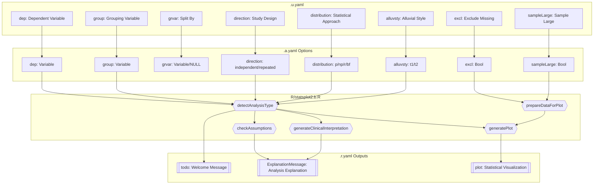
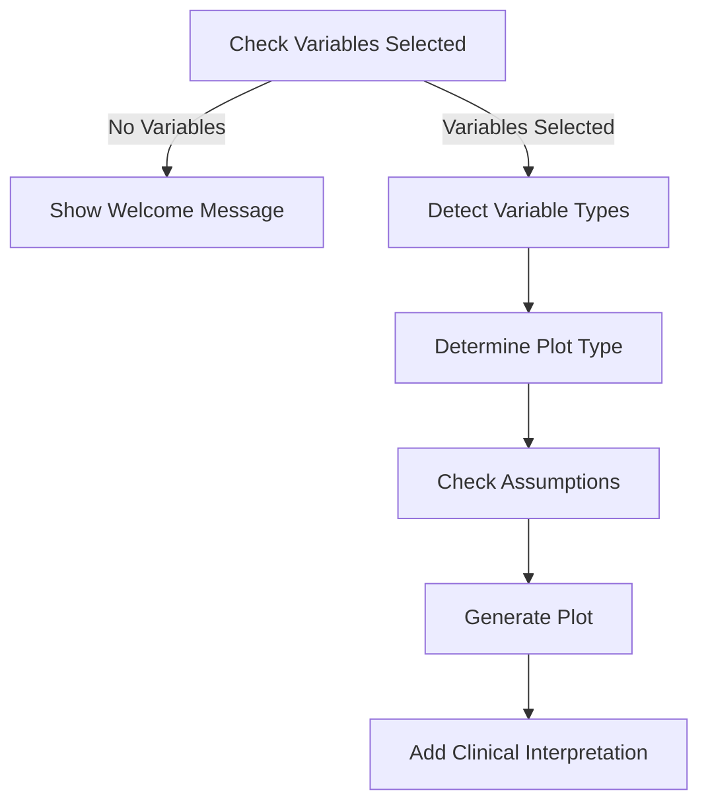
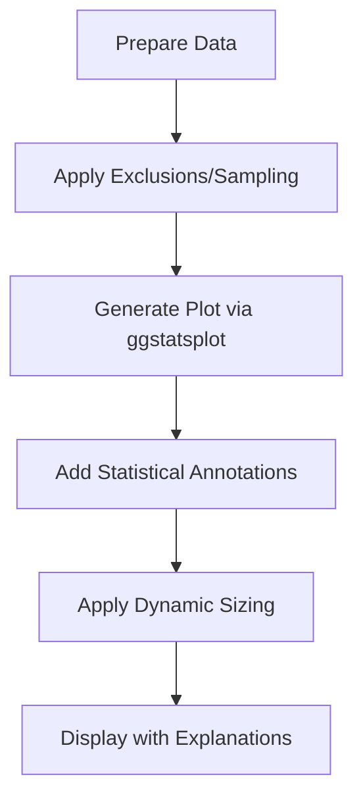
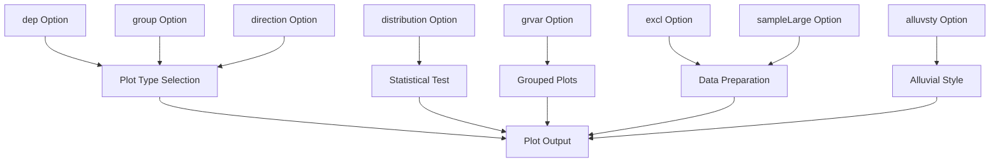

# statsplot2 Function Documentation

## 1. Overview

- **Function**: `statsplot2`
- **Files**:
  - `jamovi/statsplot2.u.yaml` — UI
  - `jamovi/statsplot2.a.yaml` — Options
  - `R/statsplot2.b.R` — Backend
  - `jamovi/statsplot2.r.yaml` — Results
- **Summary**: Automatic Plot Selection automatically identifies variable types and generates the most appropriate statistical visualization with integrated statistical testing. It supports both independent and repeated measures designs, handles categorical and continuous variables, and provides clinical interpretations with assumption checking.

## 2. UI Controls → Options Map

| UI Control | Type | Label | Binds to Option | Defaults & Constraints | Visibility/Enable Rules |
|------------|------|-------|----------------|----------------------|-------------------------|
| dep | VariablesListBox | Dependent Variable (y-axis) | dep | maxItemCount: 1 | Always visible |
| group | VariablesListBox | Grouping Variable (x-axis) | group | maxItemCount: 1 | Always visible |
| grvar | VariablesListBox | Split By (Optional) | grvar | maxItemCount: 1, default: NULL | Always visible |
| direction | ComboBox | Study Design | direction | Options: independent/repeated, default: independent | Always visible |
| distribution | ComboBox | Statistical Approach | distribution | Options: p/np/r/bf, default: p | Always visible |
| alluvsty | ComboBox | Alluvial Plot Style | alluvsty | Options: t1/t2, default: t1 | Enabled when: (direction:repeated) |
| excl | CheckBox | Exclude Missing Values | excl | default: false | Always visible |
| sampleLarge | CheckBox | Sample Large Datasets | sampleLarge | default: true | Always visible |

## 3. Options Reference (.a.yaml)

### dep
- **Type**: Variable
- **Default**: NULL
- **Description**: The dependent variable (y-axis, 1st measurement). Can be continuous or categorical.
- **Downstream Effects**: Used in `.detectAnalysisType()` to determine plot type, validates in `.validatePlotData()`, central to all plot generation functions

### group
- **Type**: Variable
- **Default**: NULL
- **Description**: The grouping variable (x-axis, 2nd measurement). Can be continuous or categorical.
- **Downstream Effects**: Used in `.detectAnalysisType()` to determine plot type, defines x-axis in all plot functions, critical for group comparisons

### grvar
- **Type**: Variable  
- **Default**: NULL
- **Description**: Optional grouping variable for creating grouped plots across multiple panels
- **Downstream Effects**: Triggers grouped plot generation in `.plotGrouped()`, affects plot sizing calculations

### direction
- **Type**: List
- **Default**: "independent"
- **Options**: ["independent", "repeated"]
- **Description**: Measurement design type (between-subjects vs within-subjects)
- **Downstream Effects**: Determines plot function selection, affects statistical test choice, enables alluvial plot options for repeated measures

### distribution
- **Type**: List
- **Default**: "p"
- **Options**: ["p" (parametric), "np" (nonparametric), "r" (robust), "bf" (Bayesian)]
- **Description**: Statistical approach for analysis
- **Downstream Effects**: Passed to ggstatsplot functions, affects assumption checking warnings, modifies clinical interpretation text

### alluvsty
- **Type**: List
- **Default**: "t1"
- **Options**: ["t1" (ggalluvial), "t2" (easyalluvial)]
- **Description**: Style for alluvial diagrams when comparing two categorical variables in repeated measures
- **Downstream Effects**: Controls which alluvial plotting function is used (`.plotAlluvialGG()` vs `.plotAlluvialEasy()`)

### excl
- **Type**: Bool
- **Default**: false
- **Description**: If TRUE, excludes rows with missing values before analysis
- **Downstream Effects**: Triggers `jmvcore::naOmit()` in `.prepareDataForPlot()`

### sampleLarge
- **Type**: Bool
- **Default**: true
- **Description**: Automatically samples large datasets (>10,000 rows) to 5,000 rows for improved performance
- **Downstream Effects**: Controls sampling behavior in `.prepareDataForPlot()` with reproducible seed

## 4. Backend Usage (.b.R)

### Options Usage in Key Functions:

#### `.detectAnalysisType()`
- **Code Locations**: Lines 71-93
- **Logic Summary**: 
  - Accesses `self$options$dep` and `self$options$group` to determine variable types
  - Uses `self$options$direction`, `distribution`, and `alluvsty` to create analysis configuration
  - Returns cached analysis info structure used throughout execution

#### `.prepareDataForPlot()`
- **Code Locations**: Lines 443-476
- **Logic Summary**:
  - `self$options$excl` → Triggers NA exclusion via `jmvcore::naOmit()`
  - `self$options$sampleLarge` → Samples to 5000 rows if data > 10000 rows
  - Returns prepared data structure with variable names

#### `.plotGrouped()`
- **Code Locations**: Lines 611-718
- **Logic Summary**:
  - Uses `self$options$grvar` to create multiple plots
  - Generates subplot for each level of grouping variable
  - Handles native grouped functions vs manual grouping

#### `.init()`
- **Code Locations**: Lines 294-339
- **Logic Summary**:
  - Package dependency checking
  - Option visibility rules based on selected variables
  - Determines which options are relevant for current selection

### Result Population:

#### `self$results$todo`
- **Population**: Lines 213-228
- **Logic**: Shows welcome message when no variables selected

#### `self$results$ExplanationMessage`
- **Population**: Lines 340-358
- **Logic**: Combines explanations, clinical interpretations, and assumption warnings

#### `self$results$plot`
- **Population**: Lines 792-798 (via `.plot()` renderFun)
- **Logic**: Renders the generated plot with dynamic sizing

## 5. Results Definition (.r.yaml)

### todo (Html)
- **Type**: Html
- **Title**: "To Do"
- **Visibility**: Shown when no variables are selected
- **clearWith**: [dep, group, direction, distribution, excl, grvar, sampleLarge]
- **Population Entry Point**: `.run()` lines 213-228

### ExplanationMessage (Preformatted)
- **Type**: Preformatted
- **Title**: "Explanation"
- **Visibility**: Always visible when variables are selected
- **clearWith**: [dep, group, direction, distribution, excl, grvar, sampleLarge]
- **Population Entry Point**: `.run()` lines 340-358

### plot (Image)
- **Type**: Image
- **Title**: "Automatically Selected Plot"
- **Dimensions**: width: 800, height: 600 (dynamic sizing based on groups)
- **renderFun**: .plot
- **requiresData**: true
- **clearWith**: [dep, group, direction, distribution, alluvsty, excl, grvar, sampleLarge]
- **Population Entry Point**: `.plot()` function lines 721-798

## 6. Data Flow Diagram (UI → Options → Backend → Results)



## 7. Execution Sequence (User Action → Results)

### User Input Flow


### Decision Logic


### Result Processing


**Step-by-step execution flow:**

1. **User selects variables** → UI updates dep/group options
2. **Backend validation** → `.detectAnalysisType()` determines variable types and plot selection
3. **Data preparation** → `.prepareDataForPlot()` handles NA exclusion and large dataset sampling
4. **Assumption checking** → `.checkAssumptions()` validates statistical assumptions, generates warnings
5. **Plot generation** → `.generatePlot()` dispatches to appropriate plot function based on variable types
6. **Clinical interpretation** → `.generateClinicalInterpretation()` adds context-specific guidance
7. **Results display** → Combined explanations shown in ExplanationMessage, plot rendered with dynamic sizing

### Options Impact Graph


## 8. Change Impact Guide

### dep (Dependent Variable)
- **If changed**: Complete re-analysis, plot type may change, new variable type detection
- **Common pitfalls**: Selecting incompatible variable types, missing values
- **Recommended defaults**: Continuous outcome variables for most analyses

### group (Grouping Variable)  
- **If changed**: Plot type recalculation, x-axis update, statistical test change
- **Common pitfalls**: Too many factor levels, continuous variables with many unique values
- **Recommended defaults**: Factor variables with 2-5 levels

### direction (Study Design)
- **If changed**: Switch between independent/paired statistical tests, enables alluvial options for repeated
- **Common pitfalls**: Using repeated for independent data or vice versa
- **Recommended defaults**: "independent" for most cross-sectional analyses

### distribution (Statistical Approach)
- **If changed**: Different statistical tests applied, assumption warnings update, interpretation changes
- **Common pitfalls**: Using parametric with non-normal data
- **Recommended defaults**: "p" for normal data, "np" for skewed/ordinal data

### grvar (Split By)
- **If changed**: Creates multiple subplot panels, increases computation time, adjusts plot dimensions
- **Common pitfalls**: Too many levels creating tiny unreadable plots
- **Recommended defaults**: NULL (no splitting) unless specific subgroup analysis needed

### sampleLarge
- **If changed**: Affects performance vs completeness trade-off for large datasets
- **Common pitfalls**: Disabling for very large datasets may cause performance issues
- **Recommended defaults**: true (enabled) for optimal performance

## 9. Example Usage

### Example Dataset Requirements
- **Variables needed**: At least 2 variables (continuous, factor, or mixed)
- **Sample size**: Works with any size, automatic sampling for n>10,000
- **Missing values**: Handled via excl option

### Example Option Payload
```yaml
dep: "Age"              # Continuous outcome
group: "Treatment"      # Factor with 2-3 levels
direction: "independent"
distribution: "p"       # Parametric approach
excl: true             # Remove missing values
sampleLarge: true      # Auto-sample if large
```

### Expected Outputs
- **Violin plot** for factor vs continuous (independent)
- **Scatter plot** for continuous vs continuous
- **Bar chart** for factor vs factor
- **Alluvial diagram** for repeated factor comparisons
- **Clinical interpretation** with assumption warnings
- **Statistical annotations** from ggstatsplot

## 10. Appendix (Schemas & Snippets)

### Key Code Patterns

**Option Access Pattern:**
```r
# In .detectAnalysisType()
mydep <- self$data[[self$options$dep]]
mygroup <- self$data[[self$options$group]]
direction <- self$options$direction
```

**Result Population Pattern:**
```r
# Setting explanation message
self$results$ExplanationMessage$setContent(combined_explanation)

# Rendering plot
image$setSize(new_width, new_height)
print(plot)
```

**Validation Pattern:**
```r
# Check for required variables
if (is.null(self$options$dep) || is.null(self$options$group)) {
    return(NULL)
}
```

### Plot Type Determination Matrix

| dep Type | group Type | direction | Resulting Plot |
|----------|------------|-----------|----------------|
| continuous | factor | independent | Violin plot (ggbetweenstats) |
| continuous | continuous | independent | Scatter plot (ggscatterstats) |
| factor | factor | independent | Bar chart (ggbarstats) |
| factor | continuous | independent | Dot plot (ggdotplotstats) |
| continuous | factor | repeated | Within-subjects violin (ggwithinstats) |
| factor | factor | repeated | Alluvial diagram |
| * | * | * (unsupported) | Basic ggplot2 fallback |

### Package Dependencies
- **Core**: ggstatsplot (required)
- **Optional**: ggalluvial, dplyr, easyalluvial, patchwork, cowplot
- **Graceful degradation**: Basic plots work without optional packages

### Performance Considerations
- **Caching**: Analysis type detection cached via `.cached_analysis`
- **Sampling**: Automatic 5000-row sampling for datasets >10,000 rows
- **Checkpoints**: Strategic placement before expensive operations
- **Dynamic sizing**: Plot dimensions adjust based on grouping levels