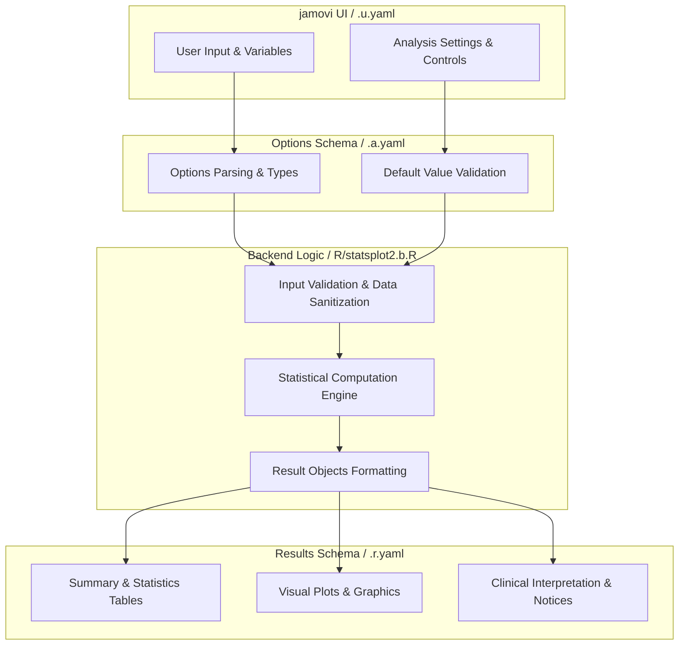
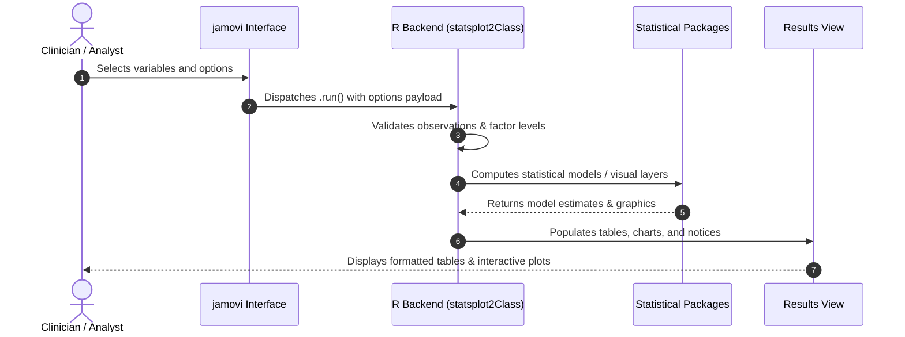

# Automatic Plot Selection - Developer Documentation

## 1. Overview

- **Function**: `statsplot2`
- **Title**: Automatic Plot Selection
- **Module**: `JJStatsPlot`
- **Files**:
  - `jamovi/statsplot2.u.yaml` - User Interface Definition
  - `jamovi/statsplot2.a.yaml` - Options & Schema Definition
  - `jamovi/statsplot2.r.yaml` - Results Layout & Tables
  - `R/statsplot2.b.R` - Backend Implementation
- **Summary**: Automatically selects and generates the most appropriate statistical visualization based on variable data types. Features enhanced error messages with contextual guidance, robust data validation, and comprehensive fallback options. Supports both independent and repeated measures designs with various plot types including violin plots, scatter plots, bar charts, and alluvial diagrams.

## 1a. Changelog

- **Date**: 2026-08-29
- **Summary**: Comprehensive documentation suite created & verified against active schemas and backend implementation.

## 2. Options Reference (`.a.yaml`)

| Option | Type | Default | Description |
| :--- | :--- | :--- | :--- |
| `data` | `Data` | `NULL` |  |
| `dep` | `Variable` | `NULL` | Outcome - Dependent Variable (y-axis) |
| `group` | `Variable` | `NULL` | Comparison Groups (x-axis) |
| `grvar` | `Variable` | `NULL` | Split By (Optional) |
| `direction` | `List` | `independent` | Study Design |
| `distribution` | `List` | `p` | Statistical Approach |
| `alluvsty` | `List` | `t1` | Alluvial Plot Style |
| `excl` | `Bool` | `FALSE` | Exclude missing values |
| `sampleLarge` | `Bool` | `FALSE` | Sample large datasets |
| `sampleThreshold` | `Integer` | `10000` | Sample Above (rows) |
| `sampleSize` | `Integer` | `5000` | Rows To Keep |
| `seed` | `Integer` | `42` | Random Seed |

## 3. Results Definition (`.r.yaml`)

| Output ID | Type | Title | Description |
| :--- | :--- | :--- | :--- |
| `notices` | `Preformatted` | `Important Information` |  |
| `todo` | `Html` | `To Do` |  |
| `ExplanationMessage` | `Html` | `Explanation` |  |
| `plot` | `Image` | `Automatically Selected Plot` |  |

## 4. Architecture & Data Flow Diagram

```mermaid
flowchart TD
  subgraph UI[jamovi UI / .u.yaml]
    U1[User Input & Variables]
    U2[Analysis Settings & Controls]
  end

  subgraph Opts[Options Schema / .a.yaml]
    O1[Options Parsing & Types]
    O2[Default Value Validation]
  end

  subgraph Backend[Backend Logic / R/statsplot2.b.R]
    B1[Input Validation & Data Sanitization]
    B2[Statistical Computation Engine]
    B3[Result Objects Formatting]
  end

  subgraph Res[Results Schema / .r.yaml]
    R1[Summary & Statistics Tables]
    R2[Visual Plots & Graphics]
    R3[Clinical Interpretation & Notices]
  end

  U1 --> O1
  U2 --> O2
  O1 --> B1
  O2 --> B1
  B1 --> B2
  B2 --> B3
  B3 --> R1
  B3 --> R2
  B3 --> R3
```

## 5. Execution Sequence

```mermaid
sequenceDiagram
  autonumber
  actor User as Clinician / Analyst
  participant UI as jamovi Interface
  participant Backend as R Backend (statsplot2Class)
  participant Engine as Statistical Packages
  participant Results as Results View

  User->>UI: Selects variables and options
  UI->>Backend: Dispatches .run() with options payload
  Backend->>Backend: Validates observations & factor levels
  Backend->>Engine: Computes statistical models / visual layers
  Engine-->>Backend: Returns model estimates & graphics
  Backend->>Results: Populates tables, charts, and notices
  Results-->>User: Displays formatted tables & interactive plots
```

## 6. Change Impact & Safety Guidelines

- **Data Filtering**: Ensure observations with missing values are handled gracefully according to analysis options.
- **Formula Conflicts**: Use isolated environment calls or base formula methods when interacting with `ggstatsplot` or formula parsers.
- **Safe Deparsing**: Use `deparse(val)` in syntax generation (`asSource()`) to escape column names with spaces or special symbols.

