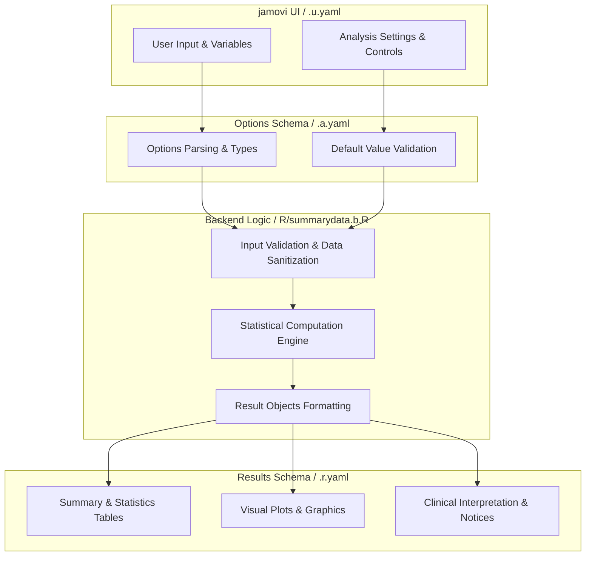
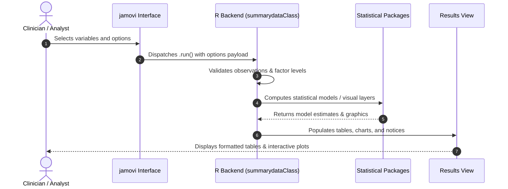

# Summary of Continuous Variables - Developer Documentation

## 1. Overview

- **Function**: `summarydata`
- **Title**: Summary of Continuous Variables
- **Module**: `ExplorationT`
- **Files**:
  - `jamovi/summarydata.u.yaml` - User Interface Definition
  - `jamovi/summarydata.a.yaml` - Options & Schema Definition
  - `jamovi/summarydata.r.yaml` - Results Layout & Tables
  - `R/summarydata.b.R` - Backend Implementation
- **Summary**: This module generates descriptive statistics for continuous variables. It provides both a textual summary and a visually appealing summary table. Optionally, you can enable distribution diagnostics to examine normality, skewness, and kurtosis.

## 1a. Changelog

- **Date**: 2026-08-29
- **Summary**: Comprehensive documentation suite created & verified against active schemas and backend implementation.

## 2. Options Reference (`.a.yaml`)

| Option | Type | Default | Description |
| :--- | :--- | :--- | :--- |
| `data` | `Data` | `NULL` |  |
| `vars` | `Variables` | `NULL` | Variables |
| `distr` | `Bool` | `FALSE` | Distribution diagnostics |
| `decimal_places` | `Integer` | `2` | Decimal places |
| `outliers` | `Bool` | `FALSE` | Outlier detection |
| `report_sentences` | `Bool` | `FALSE` | Report sentences |

## 3. Results Definition (`.r.yaml`)

| Output ID | Type | Title | Description |
| :--- | :--- | :--- | :--- |
| `notices` | `Preformatted` | `Important Information` |  |
| `todo` | `Html` | `To Do` |  |
| `text` | `Html` | `` |  |
| `text1` | `Html` | `Continuous Data Plots` |  |
| `clinicalInterpretation` | `Html` | `Clinical Interpretation` |  |
| `aboutAnalysis` | `Html` | `About This Analysis` |  |
| `outlierReport` | `Html` | `Outlier Detection Results` |  |
| `reportSentences` | `Html` | `Copy-Ready Clinical Summary` |  |
| `glossary` | `Html` | `Statistical Glossary` |  |

## 4. Architecture & Data Flow Diagram

## 5. Execution Sequence

## 6. Change Impact & Safety Guidelines

- **Data Filtering**: Ensure observations with missing values are handled gracefully according to analysis options.
- **Formula Conflicts**: Use isolated environment calls or base formula methods when interacting with `ggstatsplot` or formula parsers.
- **Safe Deparsing**: Use `deparse(val)` in syntax generation (`asSource()`) to escape column names with spaces or special symbols.

