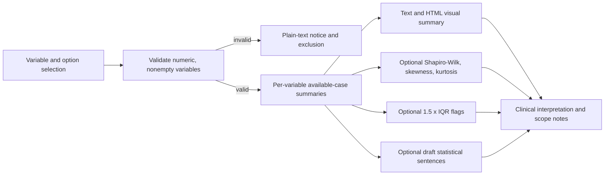

# Summary of Continuous Variables - Developer Documentation

## Overview

- **Function**: `summarydata`
- **Menu group**: `ExplorationT`
- **Purpose**: summarize one or more numeric variables with descriptive
  statistics, an HTML visual-summary table, optional distribution diagnostics,
  optional IQR outlier flags, and draft reporting sentences.
- **Backend**: `R/summarydata.b.R`
- **Schemas**: `jamovi/summarydata.a.yaml`, `jamovi/summarydata.u.yaml`, and
  `jamovi/summarydata.r.yaml`

All statistics are computed separately for each variable from its available
observations. The analysis does not impute missing values and does not restrict
all variables to a common complete-case sample.

## Options

| Option | Type | Default | Behaviour |
| :--- | :--- | :--- | :--- |
| `data` | `Data` | required | Input data frame. |
| `vars` | `Variables` | required in R | Numeric columns to summarize. The jamovi UI may initially have no selection and displays instructions. |
| `distr` | `Bool` | `FALSE` | Adds Shapiro-Wilk, skewness, and kurtosis diagnostics. |
| `decimal_places` | `Integer` | `2` | Uses 0-5 decimals for displayed statistics; Shapiro-Wilk p-values use 3 decimals. |
| `outliers` | `Bool` | `FALSE` | Flags observations outside the 1.5 x IQR fences. |
| `report_sentences` | `Bool` | `FALSE` | Produces draft statistical sentences with available and missing counts. |

## Results

| Output ID | Type | Title | Content |
| :--- | :--- | :--- | :--- |
| `notices` | `Preformatted` | Important Information | Plain-text data-quality and rendering notices. |
| `todo` | `Html` | Data Information | Welcome instructions or excluded-variable information. |
| `text` | `Html` | untitled | Per-variable descriptive and optional distribution text. |
| `text1` | `Html` | Continuous Data Plots | `gtExtras::gt_plt_summary()` output; a disclosed numeric fallback is used if inline plots cannot render. |
| `clinicalInterpretation` | `Html` | Clinical Interpretation | Missingness overview, uses, and scope limitations. |
| `aboutAnalysis` | `Html` | About This Analysis | Capabilities and interpretation cautions. |
| `outlierReport` | `Html` | Outlier Detection Results | IQR fences and flagged values. |
| `reportSentences` | `Html` | Draft Statistical Summary | Draft prose requiring units and study context before reuse. |
| `glossary` | `Html` | Statistical Glossary | Definitions and interpretation cautions. |

## Data flow

## Statistical and clinical boundaries

- The displayed SD is the sample standard deviation from R's `sd()`.
- Shapiro-Wilk is run only for 3-5000 non-missing, nonconstant values. A
  non-significant result does not establish normality.
- IQR fences are screening rules for potential outliers, not expected or
  clinical reference ranges. Flagged observations require contextual review.
- This descriptive analysis does not establish clinical reference intervals or
  verify assumptions for a later statistical model.
- If rows are repeated specimens, blocks, cores, or visits, results are row-level
  unless the user first aggregates to the intended unit of analysis.

## Maintenance notes

- Keep option names identical across the three YAML schemas and the backend.
- Escape variable names before inserting them into HTML.
- Result items persist between jamovi reruns; clear selection-dependent content
  on every early-return path.
- Treat `R/summarydata.h.R` and `man/summarydata.Rd` as generated files. Update
  source schemas/backend and regenerate them through the repository build flow.
