# Survival Analysis -- Developer Documentation

> **Function:** `survival`
> **Module:** ClinicoPath (SurvivalT > ClinicoPath Survival)
> **Version:** 0.0.33
> **Backend:** 6,515 lines across 29+ private methods

---

## 1. Overview

The `survival` function is the largest single analysis in the ClinicoPath jamovi module. It provides a comprehensive univariate survival analysis toolkit covering Kaplan-Meier estimation, Cox proportional hazards regression, competing risks, RMST, person-time incidence rates, calibration curves, restricted cubic splines for non-linearity, bootstrap internal validation, age-adjusted analysis, and parametric survival models (currently disabled).

### Files

| File | Path | Purpose |
|------|------|---------|
| Analysis definition | `jamovi/survival.a.yaml` | 73 options (variables, booleans, lists, integers, strings, outputs) |
| UI definition | `jamovi/survival.u.yaml` | 540 lines, 10 CollapseBox sections |
| Results definition | `jamovi/survival.r.yaml` | 1,515 lines, ~50 output items |
| Backend | `R/survival.b.R` | 6,515 lines, R6 class `survivalClass` inheriting `survivalBase` |
| Auto-generated header | `R/survival.h.R` | Compiled from YAML files (do not edit) |

---

## 2. UI Controls to Options Map

Controls are grouped by CollapseBox sections in `survival.u.yaml`. Each row maps a UI widget to its `.a.yaml` option.

### Top-Level Variable Inputs (always visible)

| UI Control | Type | Label | Option | a.yaml Type | Default | Enable Condition |
|---|---|---|---|---|---|---|
| VariablesListBox | target | Time Elapsed | `elapsedtime` | Variable (numeric) | null | -- |
| VariablesListBox | target | Outcome | `outcome` | Variable (factor/numeric) | null | -- |
| LevelSelector | selector | Event Level | `outcomeLevel` | Level | allowNone | `(outcome && !multievent)` |
| VariablesListBox | target | Explanatory Variable | `explanatory` | Variable (factor) | null | -- |

### CollapseBox: Advanced Elapsed Time Options (collapsed)

| UI Control | Type | Label | Option | a.yaml Type | Default | Enable Condition |
|---|---|---|---|---|---|---|
| CheckBox | checkbox | Calculate time from dates | `tint` | Bool | false | -- |
| VariablesListBox | target | Diagnosis Date | `dxdate` | Variable | null | -- |
| VariablesListBox | target | Follow-up Date | `fudate` | Variable | null | -- |
| ComboBox | dropdown | Input Time Type | `timetypedata` | List | ymd | `(tint)` |
| ComboBox | dropdown | Output Time Type | `timetypeoutput` | List | months | `(tint)` |
| CheckBox | checkbox | Use Landmark Time | `uselandmark` | Bool | false | -- |
| TextBox | number | Landmark Time | `landmark` | Integer | 3 | `(uselandmark)` |

### CollapseBox: Analysis with Multiple Outcomes (collapsed)

| UI Control | Type | Label | Option | a.yaml Type | Default | Enable Condition |
|---|---|---|---|---|---|---|
| CheckBox | checkbox | Enable Multiple Event Analysis | `multievent` | Bool | false | `(outcome)` |
| LevelSelector | selector | Dead of Disease | `dod` | Level | allowNone | `(outcome && multievent)` |
| LevelSelector | selector | Dead of Other Causes | `dooc` | Level | allowNone | `(outcome && multievent)` |
| LevelSelector | selector | Alive with Disease | `awd` | Level | allowNone | `(outcome && multievent)` |
| LevelSelector | selector | Alive without Disease | `awod` | Level | allowNone | `(outcome && multievent)` |
| ComboBox | dropdown | Analysis Type | `analysistype` | List | overall | `(outcome && multievent)` |

### CollapseBox: Statistical Analysis (collapsed)

**Cox Regression Analysis:**

| UI Control | Type | Label | Option | a.yaml Type | Default | Enable Condition |
|---|---|---|---|---|---|---|
| CheckBox | checkbox | Proportional Hazards Test | `ph_cox` | Bool | false | -- |
| CheckBox | checkbox | Stratified Cox Model | `stratified_cox` | Bool | false | -- |
| CheckBox | checkbox | Residual Diagnostics | `residual_diagnostics` | Bool | false | -- |
| CheckBox | checkbox | Log-Log Plot | `loglog` | Bool | false | -- |
| VariablesListBox | target | Stratification Variable | `strata_variable` | Variable (factor) | null | -- |

**Age Adjustment:**

| UI Control | Type | Label | Option | a.yaml Type | Default | Enable Condition |
|---|---|---|---|---|---|---|
| CheckBox | checkbox | Age-Adjusted Cox Regression | `age_adjustment` | Bool | false | -- |
| VariablesListBox | target | Age Variable | `age_variable` | Variable (numeric) | null | `(age_adjustment)` |
| CheckBox | checkbox | Test Age x Group Interaction | `age_interaction` | Bool | false | `(age_adjustment)` |
| CheckBox | checkbox | Stratify Cox by Age Groups | `age_stratified_cox` | Bool | false | `(age_adjustment)` |
| TextBox | string | Age Group Cutpoints | `age_group_cutpoints` | String | '50, 65, 75' | `(age_adjustment && (age_stratified_cox \|\| age_stratified_km \|\| age_standardization))` |
| CheckBox | checkbox | Age as Time Scale | `age_time_scale` | Bool | false | `(age_adjustment)` |
| CheckBox | checkbox | Age Standardization (SMR) | `age_standardization` | Bool | false | `(age_adjustment)` |
| ComboBox | dropdown | Standardization Method | `age_standardization_method` | List | indirect | `(age_adjustment && age_standardization)` |
| CheckBox | checkbox | Age-Stratified KM Plots | `age_stratified_km` | Bool | false | `(age_adjustment)` |
| CheckBox | checkbox | Adjusted Survival Curves | `adjusted_curves` | Bool | false | `(age_adjustment)` |

**Model Validation:**

| UI Control | Type | Label | Option | a.yaml Type | Default | Enable Condition |
|---|---|---|---|---|---|---|
| CheckBox | checkbox | Calibration Curves | `calibration_curves` | Bool | false | -- |
| TextBox | number | Time Point (0 = median) | `calibration_timepoint` | Number | 0 | `(calibration_curves)` |
| TextBox | number | Number of Risk Groups | `calibration_ngroups` | Integer | 5 | `(calibration_curves)` |
| CheckBox | checkbox | Bootstrap Internal Validation | `bootstrapValidation` | Bool | false | -- |
| TextBox | number | Bootstrap Resamples | `bootstrapValN` | Integer | 200 | `(bootstrapValidation)` |

**Non-Linearity Assessment:**

| UI Control | Type | Label | Option | a.yaml Type | Default | Enable Condition |
|---|---|---|---|---|---|---|
| CheckBox | checkbox | Restricted Cubic Splines | `rcs_analysis` | Bool | false | -- |
| VariablesListBox | target | Continuous Variable for Spline | `rcs_variable` | Variable (numeric) | NULL | `(rcs_analysis)` |
| TextBox | number | Number of Knots (3-7) | `rcs_knots` | Integer | 4 | `(rcs_analysis)` |

**Pairwise Comparisons:**

| UI Control | Type | Label | Option | a.yaml Type | Default | Enable Condition |
|---|---|---|---|---|---|---|
| CheckBox | checkbox | Perform Pairwise Comparisons | `pw` | Bool | false | -- |
| ComboBox | dropdown | P-value Adjustment Method | `padjustmethod` | List | holm | `(pw)` |

**Weighted Log-Rank Tests:**

| UI Control | Type | Label | Option | a.yaml Type | Default | Enable Condition |
|---|---|---|---|---|---|---|
| CheckBox | checkbox | Perform Weighted Log-Rank Tests | `weightedLogRank` | Bool | false | -- |
| ComboBox | dropdown | Test Type | `survivalTestType` | List | logrank | `(weightedLogRank)` |

**Restricted Mean Survival Time:**

| UI Control | Type | Label | Option | a.yaml Type | Default | Enable Condition |
|---|---|---|---|---|---|---|
| CheckBox | checkbox | RMST Analysis | `rmst_analysis` | Bool | false | -- |
| TextBox | number | Tau (Restriction Time) | `rmst_tau` | Number | 0 | `(rmst_analysis)` |

### CollapseBox: Survival Plots (collapsed)

| UI Control | Type | Label | Option | a.yaml Type | Default | Enable Condition |
|---|---|---|---|---|---|---|
| CheckBox | checkbox | Survival Curves | `sc` | Bool | false | -- |
| CheckBox | checkbox | KMunicate Plot | `kmunicate` | Bool | false | -- |
| CheckBox | checkbox | Cumulative Events | `ce` | Bool | false | -- |
| CheckBox | checkbox | Cumulative Hazard | `ch` | Bool | false | -- |
| CheckBox | checkbox | 95% Confidence Intervals | `ci95` | Bool | false | -- |
| CheckBox | checkbox | Risk Table | `risktable` | Bool | false | -- |
| CheckBox | checkbox | Show Censored Points | `censored` | Bool | false | -- |
| CheckBox | checkbox | Show P-values | `pplot` | Bool | false | -- |
| ComboBox | dropdown | Median Survival Line | `medianline` | List | none | -- |
| TextBox | number | Plot End Time | `endplot` | Integer | 60 | -- |
| TextBox | number | Time Interval | `byplot` | Integer | 12 | -- |
| TextBox | number | Y-axis Start | `ybegin_plot` | Number | 0.00 | -- |
| TextBox | number | Y-axis End | `yend_plot` | Number | 1.00 | -- |

### CollapseBox: Survival Tables (collapsed)

| UI Control | Type | Label | Option | a.yaml Type | Default |
|---|---|---|---|---|---|
| TextBox | string | Time Points for Table | `cutp` | String | '12, 36, 60' |

### CollapseBox: Person-Time Analysis (collapsed)

| UI Control | Type | Label | Option | a.yaml Type | Default | Enable Condition |
|---|---|---|---|---|---|---|
| CheckBox | checkbox | Calculate Person-Time Rates | `person_time` | Bool | false | -- |
| TextBox | string | Time Intervals | `time_intervals` | String | '12, 36, 60' | `(person_time)` |
| TextBox | number | Rate Multiplier | `rate_multiplier` | Integer | 100 | -- |

### CollapseBox: Data Export Options (collapsed)

| UI Control | Type | Label | Option | a.yaml Type | Enable Condition |
|---|---|---|---|---|---|
| Output | output | Export Estimated Survival | `export_survival_data` | Output | -- |
| Output | output | Add Calculated Time to Data | `calculatedtime` | Output | `(tint)` |
| Output | output | Add Redefined Outcome to Data | `outcomeredefined` | Output | `(multievent)` |

### CollapseBox: Analysis Explanations (expanded by default)

| UI Control | Type | Label | Option | a.yaml Type | Default |
|---|---|---|---|---|---|
| CheckBox | checkbox | Show Analysis Explanations | `showExplanations` | Bool | false |
| CheckBox | checkbox | Show Natural Language Summaries | `showSummaries` | Bool | false |
| CheckBox | checkbox | REMARK Reporting Checklist | `remark_checklist` | Bool | false |

### CollapseBox: Parametric Survival Models (collapsed)

| UI Control | Type | Label | Option | a.yaml Type | Default | Enable Condition |
|---|---|---|---|---|---|---|
| CheckBox | checkbox | Enable Parametric Models | `use_parametric` | Bool | false | -- |
| ComboBox | dropdown | Distribution | `parametric_distribution` | List | weibull | `(use_parametric)` |
| CheckBox | checkbox | Include Covariates | `parametric_covariates` | Bool | true | `(use_parametric)` |
| TextBox | number | Spline Knots | `spline_knots` | Integer | 3 | `(use_parametric)` |
| ComboBox | dropdown | Spline Scale | `spline_scale` | List | hazard | `(use_parametric)` |
| CheckBox | checkbox | Extrapolation Analysis | `parametric_extrapolation` | Bool | false | `(use_parametric)` |
| TextBox | number | Extrapolation Time Horizon | `extrapolation_time` | Number | 0 | `(use_parametric && parametric_extrapolation)` |
| CheckBox | checkbox | Model Diagnostics | `parametric_diagnostics` | Bool | true | `(use_parametric)` |
| CheckBox | checkbox | Compare Multiple Distributions | `compare_distributions` | Bool | false | `(use_parametric)` |
| CheckBox | checkbox | Parametric Survival Plots | `parametric_survival_plots` | Bool | false | `(use_parametric)` |
| CheckBox | checkbox | Hazard Function Plots | `hazard_plots` | Bool | false | `(use_parametric)` |

---

## 3. Options Reference

### Core Variable Options

| Option | Type | Default | Description | Backend Impact |
|--------|------|---------|-------------|----------------|
| `data` | Data | -- | The dataset | `self$data` throughout |
| `elapsedtime` | Variable (numeric) | null | Survival time column | Used in `.cleandata()` -> `.definemytime()` |
| `outcome` | Variable (factor/numeric) | null | Event indicator | Used in `.cleandata()` -> `.definemyoutcome()` |
| `outcomeLevel` | Level | allowNone | Which factor level = event | Drives binary recoding in `.definemyoutcome()` |
| `explanatory` | Variable (factor) | null | Grouping variable | Used in `.cleandata()` -> `.definemyfactor()` |

### Date Calculation Options

| Option | Type | Default | Description | Backend Impact |
|--------|------|---------|-------------|----------------|
| `tint` | Bool | false | Use dates for time | Gates date-to-time conversion in `.definemytime()` |
| `dxdate` | Variable | null | Diagnosis date | Lubridate parsing per `timetypedata` |
| `fudate` | Variable | null | Follow-up date | Lubridate parsing per `timetypedata` |
| `timetypedata` | List | ymd | Date format in data | Selects lubridate parser (ymd, dmy, mdy, etc.) |
| `timetypeoutput` | List | months | Output time units | Conversion divisor in `.definemytime()`, axis labels in plots |
| `calculatedtime` | Output | -- | Export calculated time | `.run()` writes to `self$results$calculatedtime` |

### Multiple Outcome Options

| Option | Type | Default | Description | Backend Impact |
|--------|------|---------|-------------|----------------|
| `multievent` | Bool | false | Enable competing risks | Triggers outcome recoding; gates `analysistype` |
| `dod`, `dooc`, `awd`, `awod` | Level | allowNone | Event level assignments | Map outcome factor levels to competing risk states |
| `analysistype` | List | overall | overall/cause/compete | `"compete"` skips Cox, pairwise, RMST; uses `cmprsk` |
| `outcomeredefined` | Output | -- | Export recoded outcome | `.run()` writes recoded outcome column |

### Landmark Analysis

| Option | Type | Default | Description | Backend Impact |
|--------|------|---------|-------------|----------------|
| `uselandmark` | Bool | false | Enable landmark analysis | `.cleandata()` filters patients, adjusts time |
| `landmark` | Integer | 3 | Landmark time point | Filter threshold; note added via `setNote()` |

### Survival Table Options

| Option | Type | Default | Description | Backend Impact |
|--------|------|---------|-------------|----------------|
| `cutp` | String | '12, 36, 60' | Time cutpoints | Parsed to numeric vector in `.survTable()` |

### Statistical Test Options

| Option | Type | Default | Description | Backend Impact |
|--------|------|---------|-------------|----------------|
| `pw` | Bool | false | Pairwise comparisons | Gates `.pairwise()` execution |
| `padjustmethod` | List | holm | P-value correction method | Passed to `survminer::pairwise_survdiff()` |
| `weightedLogRank` | Bool | false | Weighted log-rank tests | Gates `.calculateWeightedLogRank()` |
| `survivalTestType` | List | logrank | Test type for pairwise | Determines rho for `survminer::pairwise_survdiff()` |
| `ph_cox` | Bool | false | PH assumption test | Gates Schoenfeld residual test + PH plot |

### Cox Regression Options

| Option | Type | Default | Description | Backend Impact |
|--------|------|---------|-------------|----------------|
| `stratified_cox` | Bool | false | Stratified Cox model | Adds `strata()` term to Cox formula |
| `strata_variable` | Variable (factor) | null | Stratification variable | Pulled from `self$data` (not cleanData) |
| `residual_diagnostics` | Bool | false | Show residuals | Gates `.calculateResiduals()` call inside `.cox()` |
| `loglog` | Bool | false | Log-log plot | Gates `.plot7()` rendering |

### Age Adjustment Options

| Option | Type | Default | Description | Backend Impact |
|--------|------|---------|-------------|----------------|
| `age_adjustment` | Bool | false | Master toggle | Gates entire `.ageAdjustedCox()` branch |
| `age_variable` | Variable (numeric) | null | Age column | Pulled from `self$data` via `.addAgeVariable()` |
| `age_interaction` | Bool | false | Test age x group | Adds interaction term, reports LRT |
| `age_stratified_cox` | Bool | false | Stratify by age groups | Uses `strata(age_group)` instead of covariate |
| `age_group_cutpoints` | String | '50, 65, 75' | Age group boundaries | Parsed to numeric; creates factor via `cut()` |
| `age_time_scale` | Bool | false | Age as time axis | `Surv(age_entry, age_event, event)` formulation |
| `age_standardization` | Bool | false | Compute SMR | Observed vs expected deaths by age group |
| `age_standardization_method` | List | indirect | Indirect/Direct | Indirect = SMR; Direct = apply rates to standard pop |
| `age_stratified_km` | Bool | false | Age-stratified KM plots | Gates `.plotAgeStratifiedKM()` |
| `adjusted_curves` | Bool | false | Adjusted survival curves | Gates `.plotAdjustedCurves()` |

### Model Validation Options

| Option | Type | Default | Description | Backend Impact |
|--------|------|---------|-------------|----------------|
| `calibration_curves` | Bool | false | Calibration assessment | Gates `.calculateCalibration()` + `.plotCalibration()` |
| `calibration_timepoint` | Number | 0 | Time for calibration (0 = median) | Determines prediction horizon |
| `calibration_ngroups` | Integer | 5 | Risk group quantiles | Reduced automatically if too few unique predictions |
| `rcs_analysis` | Bool | false | Non-linearity assessment | Gates `.calculateRCS()` + `.plotRCS()` |
| `rcs_variable` | Variable (numeric) | NULL | Continuous predictor for spline | Pulled from `self$data`, not cleanData |
| `rcs_knots` | Integer | 4 | Number of spline knots | df = knots - 1 for `splines::ns()` |
| `bootstrapValidation` | Bool | false | Bootstrap C-index | Gates `.calculateBootstrapValidation()` |
| `bootstrapValN` | Integer | 200 | Number of resamples | Loop count in bootstrap; min 50, max 1000 |

### RMST Options

| Option | Type | Default | Description | Backend Impact |
|--------|------|---------|-------------|----------------|
| `rmst_analysis` | Bool | false | Enable RMST | Gates `.calculateRMST()` |
| `rmst_tau` | Number | 0 | Time horizon (0 = 75th pctl) | `summary(km_fit, rmean = tau)` |

### Person-Time Options

| Option | Type | Default | Description | Backend Impact |
|--------|------|---------|-------------|----------------|
| `person_time` | Bool | false | Enable person-time | Gates `.personTimeAnalysis()` |
| `time_intervals` | String | '12, 36, 60' | Interval boundaries | Parsed to numeric; creates time strata |
| `rate_multiplier` | Integer | 100 | Rate denominator | e.g. per 100 or per 1000 person-time |

### Plot Appearance Options

| Option | Type | Default | Description | Backend Impact |
|--------|------|---------|-------------|----------------|
| `sc` | Bool | false | Survival curve | Gates `.plot()` |
| `kmunicate` | Bool | false | KMunicate plot | Gates `.plot6()` |
| `ce` | Bool | false | Cumulative events | Gates `.plot2()` |
| `ch` | Bool | false | Cumulative hazard | Gates `.plot3()` |
| `endplot` | Integer | 60 | Plot x-axis max | `xlim = c(0, endplot)` |
| `ybegin_plot` | Number | 0.00 | Plot y-axis min | `ylim` lower bound |
| `yend_plot` | Number | 1.00 | Plot y-axis max | `ylim` upper bound |
| `byplot` | Integer | 12 | Axis break interval | `break.time.by` in survminer |
| `ci95` | Bool | false | Confidence intervals | `conf.int` in `surv_plot()` |
| `risktable` | Bool | false | Risk table | `risk.table` in `surv_plot()` |
| `censored` | Bool | false | Censoring marks | `censor` in `surv_plot()` |
| `pplot` | Bool | false | P-value on plot | `pval` + `pval.method` in `surv_plot()` |
| `medianline` | List | none | Median line type | `surv.median.line` (none/h/v/hv) |

### Display Options

| Option | Type | Default | Description | Backend Impact |
|--------|------|---------|-------------|----------------|
| `showExplanations` | Bool | false | Method explanations | Gates visibility of all `*Explanation` Html items |
| `showSummaries` | Bool | false | Natural language summaries | Gates `*Summary` items + clinical interpretation |
| `remark_checklist` | Bool | false | REMARK checklist | Gates `.generateRemarkChecklist()` |
| `export_survival_data` | Output | -- | Export survival estimates | Gates `.exportSurvivalData()` |

### Parametric Model Options (UI present, backend disabled)

| Option | Type | Default | Description |
|--------|------|---------|-------------|
| `use_parametric` | Bool | false | Master toggle (currently disabled in `.run()`) |
| `parametric_distribution` | List | weibull | exp/weibull/lnorm/llogis/gamma/gengamma/gompertz/survspline |
| `parametric_covariates` | Bool | true | Include explanatory variable |
| `spline_knots` | Integer | 3 | For Royston-Parmar models |
| `spline_scale` | List | hazard | hazard/odds/normal |
| `parametric_extrapolation` | Bool | false | Extrapolation beyond follow-up |
| `extrapolation_time` | Number | 0 | Extrapolation horizon (0 = 2x max observed) |
| `parametric_diagnostics` | Bool | true | AIC/BIC and fit statistics |
| `compare_distributions` | Bool | false | Multi-distribution comparison |
| `parametric_survival_plots` | Bool | false | Parametric survival curves |
| `hazard_plots` | Bool | false | Hazard function plots |

---

## 4. Backend Usage

### Major Analysis Branches

The `.run()` method orchestrates all analysis in this sequence, with `private$.checkpoint()` calls between each step for jamovi's cooperative multitasking:

1. **Input validation** (`private$.validateInputs()`) -- checks required variables are assigned
2. **Data cleaning** (`private$.cleandata()`) -- assembles time/outcome/factor, applies landmark, renames columns, sets plot state
3. **Event count safety checks** -- blocks analysis if < 10 events, warns if 10-50
4. **Median survival** (`private$.medianSurv(results)`) -- always runs
5. **RMST** (`private$.calculateRMST(results, tau)`) -- if `rmst_analysis`
6. **Cox regression** (`private$.cox(results)`) -- unless competing risk
7. **Age-adjusted Cox** (`private$.ageAdjustedCox(results)`) -- if `age_adjustment` + `age_variable`
8. **Age as time scale** (`private$.ageTimeScaleCox(results)`) -- if `age_time_scale`
9. **Age standardization** (`private$.ageStandardization(results)`) -- if `age_standardization`
10. **Survival probability table** (`private$.survTable(results)`) -- always runs
11. **Export survival data** (`private$.exportSurvivalData(results)`)
12. **Calibration curves** (`private$.calculateCalibration(results)`) -- if `calibration_curves`
13. **RCS non-linearity** (`private$.calculateRCS(results)`) -- if `rcs_analysis` + `rcs_variable`
14. **Pairwise comparisons** (`private$.pairwise(results)`) -- if `pw`
15. **Weighted log-rank** (`private$.calculateWeightedLogRank(results)`) -- if `weightedLogRank`
16. **Bootstrap validation** (`private$.calculateBootstrapValidation(results)`) -- if `bootstrapValidation`
17. **REMARK checklist** (`private$.generateRemarkChecklist(results)`) -- if `remark_checklist`
18. **Person-time analysis** (`private$.personTimeAnalysis(results)`) -- if `person_time`
19. **Calculated time/outcome export** -- if `tint`/`multievent` + output enabled
20. **Explanations** (`private$.populateExplanations()`)
21. **Clinical interpretation** (`private$.populateEnhancedClinicalContent()`)

All branches except median survival and survival tables are **skipped for competing risk analysis** (`multievent && analysistype == "compete"`).

### Key Private Methods

**`.buildSurvFormula(time_var, outcome_var, group_var, ns_prefix)`**
Central formula constructor. Escapes variable names with backticks via `.escapeVariableNames()`. Returns `"survival::Surv(time, outcome) ~ group"` or just the LHS if `group_var` is NULL. The `ns_prefix` parameter controls whether `survival::Surv` or `Surv` is used (finalfit requires no prefix).

**`.cleandata()`**
Assembles the analysis dataset from three sub-methods:
- `.definemytime()` -- handles date parsing (lubridate) and time unit conversion
- `.definemyoutcome()` -- binary recoding for overall/cause-specific, multi-state for competing risks
- `.definemyfactor()` -- extracts and validates the explanatory variable

Returns a named list with `cleanData`, `name1time`, `name2outcome`, `name3explanatory`, and labelled names. Also sets plot state via `image$setState(plotData)` for all five plot results.

**`.medianSurv(results)`**
Fits `survival::survfit()`, extracts median survival per group with CIs. Populates `medianTable` row by row. Generates natural language summary via `.generateClinicalInterpretation()`.

**`.cox(results)`**
Uses `finalfit::finalfit()` for formatted Cox output. Checks events-per-variable (EPV < 5 = critical, < 10 = warning). Handles stratified Cox by pulling `strata_variable` from `self$data`. Tests PH assumption via `survival::cox.zph()` if `ph_cox` is enabled. Calls `.calculateResiduals()` if `residual_diagnostics` is enabled.

**`.calculateRMST(results, tau)`**
Fits KM curve, calls `summary(km_fit, rmean = tau, extend = TRUE)`. Default tau = 75th percentile of follow-up time. Returns table with RMST, SE, and Wald CIs per group.

**`.calculateWeightedLogRank(results)`**
Runs four weighted log-rank tests via `survival::survdiff(rho = ...)`:
- Log-Rank (rho = 0)
- Gehan-Breslow-Wilcoxon (rho = 1)
- Tarone-Ware (rho = 0.5)
- Peto-Peto approximation (rho = 1)

**`.calculateBootstrapValidation(results)`**
Harrell's optimism-corrected C-index. For each of `bootstrapValN` resamples: fits Cox on bootstrap sample, evaluates apparent C-index, evaluates on original data, computes optimism. Reports apparent, optimism, and corrected C-index + Somers' Dxy + calibration slope. Uses `reverse = TRUE` in `survival::concordance()` because higher LP = worse prognosis.

**`.calculateCalibration(results)`**
Groups patients by predicted survival quantiles, computes KM-observed survival per group. Reports calibration slope, calibration-in-the-large, and Brier-like score. Handles edge case of too few unique predictions by reducing effective group count.

**`.calculateRCS(results)`**
Fits linear Cox and spline Cox (using `splines::ns()`), performs likelihood ratio test for non-linearity. The `rcs_variable` is pulled from `self$data` and aligned by rownames because `.cleandata()` only includes time/outcome/explanatory columns.

**`.ageAdjustedCox(results)`**
Two modes: age as covariate or age-stratified (via `strata(age_group)`). Reports unadjusted vs age-adjusted HRs side-by-side. Optionally tests age x group interaction via LRT. Age variable pulled from `self$data` via `.addAgeVariable()`.

**`.generateClinicalInterpretation(results, analysis_type)`**
Produces natural language clinical interpretation of median survival, Cox results, and survival probabilities. Context-aware: median < 6 months flags "rapidly progressing condition."

**`.generateCopyReadySentences(results)`**
Generates publication-ready sentences for direct copy into manuscripts.

### Plot Methods

| Method | Option Gate | renderFun | Description |
|--------|------------|-----------|-------------|
| `.plot()` | `sc` | `.plot` | Standard KM survival curves via `finalfit::surv_plot()` |
| `.plot2()` | `ce` | `.plot2` | Cumulative events via `survminer::ggsurvplot()` with `fun = "event"` |
| `.plot3()` | `ch` | `.plot3` | Cumulative hazard via `survminer::ggsurvplot()` with `fun = "cumhaz"` |
| `.plot6()` | `kmunicate` | `.plot6` | KMunicate-style plot via `KMunicate::KMunicate()` |
| `.plot7()` | `loglog` | `.plot7` | Log-log plot via `survminer::ggsurvplot()` with `fun = "cloglog"` |
| `.plot8()` | `ph_cox` | `.plot8` | Schoenfeld residuals plot via `survminer::ggcoxzph()` |
| `.plot9()` | `residual_diagnostics` | `.plot9` | Residual diagnostic plots |
| `.plotCalibration()` | `calibration_curves` | `.plotCalibration` | Predicted vs observed calibration plot |
| `.plotRCS()` | `rcs_analysis` | `.plotRCS` | HR curve over continuous predictor range |
| `.plotAgeStratifiedKM()` | `age_stratified_km` | `.plotAgeStratifiedKM` | KM curves by age group |
| `.plotAdjustedCurves()` | `adjusted_curves` | `.plotAdjustedCurves` | Age-adjusted survival curves |
| `.plotParametricSurvival()` | `use_parametric && parametric_survival_plots` | `.plotParametricSurvival` | Parametric model curves (disabled) |
| `.plotHazardFunction()` | `use_parametric && hazard_plots` | `.plotHazardFunction` | Hazard function plots (disabled) |
| `.plotExtrapolation()` | `use_parametric && parametric_extrapolation` | `.plotExtrapolation` | Extrapolation plot (disabled) |

All plot methods receive `(image, ggtheme, theme, ...)` parameters. They retrieve data from `image$state` (set during `.cleandata()`). All skip execution when `multievent && analysistype == "compete"`.

---

## 5. Results Definition

All output items from `survival.r.yaml`:

### Always-Visible Core Outputs

| Name | Type | Title | clearWith |
|------|------|-------|-----------|
| `subtitle` | Preformatted | Survival Analysis - ${explanatory} | -- |
| `todo` | Html | To Do | explanatory, outcome, outcomeLevel, elapsedtime, ... |
| `medianSurvivalHeading` | Preformatted | Median Survival Analysis | -- |
| `medianTable` | Table | Median Survival Table: Levels for ${explanatory} | explanatory, outcome, ... |
| `coxRegressionHeading` | Preformatted | Cox Regression Analysis | -- |
| `coxTable` | Table | Cox Table - ${explanatory} | explanatory, outcome, ... |
| `tCoxtext2` | Html | (Cox formatted output) | explanatory, outcome, ... |
| `survivalTablesHeading` | Preformatted | Survival Probability Tables | -- |
| `survTable` | Table | 1, 3, 5 year Survival - ${explanatory} | explanatory, outcome, ... |

### Conditional on `showSummaries`

| Name | Type | Title | Additional Condition |
|------|------|-------|---------------------|
| `medianSummary` | Preformatted | Median Survival Summary - ${explanatory} | -- |
| `coxSummary` | Preformatted | Cox Regression Summary - ${explanatory} | -- |
| `survTableSummary` | Preformatted | 1, 3, 5-yr Survival Summary - ${explanatory} | -- |
| `clinicalInterpretationExplanation` | Html | Enhanced Clinical Interpretation | -- |
| `copyReadySentencesExplanation` | Html | Copy-Ready Clinical Report Sentences | -- |
| `rmstSummary` | Preformatted | RMST Interpretation | `rmst_analysis` |
| `pairwiseSummary` | Preformatted | Pairwise Comparison Summary - ${explanatory} | `pw` |
| `weightedLogRankExplanation` | Html | Weighted Log-Rank Test Interpretation | `weightedLogRank` |
| `bootstrapValidationExplanation` | Html | Bootstrap Validation Interpretation | `bootstrapValidation` |

### Conditional on `showExplanations`

| Name | Type | Title | Additional Condition |
|------|------|-------|---------------------|
| `medianSurvivalHeading3` | Preformatted | Median Survival Explanations | -- |
| `medianSurvivalExplanation` | Html | Understanding Median Survival | -- |
| `coxRegressionHeading3` | Preformatted | Cox Regression Explanations | -- |
| `coxRegressionExplanation` | Html | Understanding Cox Regression | -- |
| `survivalTablesHeading3` | Preformatted | Survival Tables Explanations | -- |
| `survivalTablesExplanation` | Html | Understanding Survival Tables | -- |
| `survivalPlotsHeading3` | Preformatted | Survival Plots Explanations | `sc \|\| ce \|\| ch \|\| kmunicate \|\| loglog` |
| `survivalPlotsExplanation` | Html | Understanding Survival Curves | (same) |
| `personTimeExplanation` | Html | Understanding Person-Time | `person_time` |
| `rmstExplanation` | Html | Understanding RMST | `rmst_analysis` |
| `residualDiagnosticsExplanation` | Html | Understanding Residual Diagnostics | `residual_diagnostics` |
| `calibrationInterpretation` | Html | Calibration Interpretation | `calibration_curves` |
| `rcsInterpretation` | Html | Non-Linearity Interpretation | `rcs_analysis` |
| `ageAdjustedExplanation` | Html | Understanding Age-Adjusted Analysis | `age_adjustment` |
| `parametricModelsExplanation` | Html | Understanding Parametric Models | `use_parametric` |
| `clinicalGlossaryExplanation` | Html | Clinical Terminology Glossary | -- |

### Conditional Analysis Outputs

| Name | Type | Visible Condition | renderFun |
|------|------|-------------------|-----------|
| `personTimeHeading` | Preformatted | `person_time` | -- |
| `personTimeTable` | Table | `person_time` | -- |
| `personTimeSummary` | Html | `person_time` | -- |
| `rmstHeading` | Preformatted | `rmst_analysis` | -- |
| `rmstTable` | Table | `rmst_analysis` | -- |
| `cox_ph` | Preformatted | `ph_cox` | -- |
| `phInterpretation` | Html | `ph_cox` | -- |
| `pairwiseComparisonHeading` | Preformatted | `pw` | -- |
| `pairwiseTable` | Table | `pw` | -- |
| `weightedLogRankTable` | Table | `weightedLogRank` | -- |
| `residualsTable` | Table | `residual_diagnostics` | -- |
| `bootstrapValidationTable` | Table | `bootstrapValidation` | -- |
| `calibrationTable` | Table | `calibration_curves` | -- |
| `calibrationGroupTable` | Table | `calibration_curves` | -- |
| `rcsTestTable` | Table | `rcs_analysis` | -- |

### Age Adjustment Outputs

| Name | Type | Visible Condition |
|------|------|-------------------|
| `ageAdjustedCoxHeading` | Preformatted | `age_adjustment` |
| `ageAdjustedCoxTable` | Table | `age_adjustment` |
| `ageInteractionTable` | Table | `age_interaction` |
| `ageAdjustedInterpretation` | Html | `age_adjustment` |
| `ageTimeScaleTable` | Table | `age_time_scale` |
| `ageTimeScaleInterpretation` | Html | `age_time_scale` |
| `ageStandardizationTable` | Table | `age_standardization` |
| `ageStandardizationInterpretation` | Html | `age_standardization` |
| `remarkChecklist` | Html | `remark_checklist` |

### Plot Outputs

| Name | Type | Visible Condition | renderFun | Size |
|------|------|-------------------|-----------|------|
| `plot` | Image | `sc` | `.plot` | 600x450 |
| `plot2` | Image | `ce` | `.plot2` | 600x450 |
| `plot3` | Image | `ch` | `.plot3` | 600x450 |
| `plot6` | Image | `kmunicate` | `.plot6` | 600x450 |
| `plot7` | Image | `loglog` | `.plot7` | 600x450 |
| `plot8` | Image | `ph_cox` | `.plot8` | 600x450 |
| `residualsPlot` | Image | `residual_diagnostics` | `.plot9` | 600x450 |
| `calibrationPlot` | Image | `calibration_curves` | `.plotCalibration` | 600x500 |
| `rcsPlot` | Image | `rcs_analysis` | `.plotRCS` | 600x450 |
| `ageStratifiedKMPlot` | Image | `age_stratified_km` | `.plotAgeStratifiedKM` | 700x500 |
| `adjustedCurvesPlot` | Image | `adjusted_curves` | `.plotAdjustedCurves` | 700x500 |
| `parametricSurvivalPlot` | Image | `use_parametric && parametric_survival_plots` | `.plotParametricSurvival` | 600x450 |
| `hazardFunctionPlot` | Image | `use_parametric && hazard_plots` | `.plotHazardFunction` | 600x450 |
| `extrapolationPlot` | Image | `use_parametric && parametric_extrapolation` | `.plotExtrapolation` | 600x450 |

### Data Export Outputs

| Name | Type | Description |
|------|------|-------------|
| `calculatedtime` | Output | Calculated time from dates (measureType: continuous) |
| `outcomeredefined` | Output | Recoded outcome for competing risks |
| `survivalExport` | Output | Full survival estimates table |
| `survivalExportSummary` | Html | Export summary |

### Parametric Model Outputs (disabled in current release)

| Name | Type | Visible Condition |
|------|------|-------------------|
| `parametricModelComparison` | Table | `use_parametric && compare_distributions` |
| `parametricModelSummary` | Table | `use_parametric` |
| `parametricDiagnostics` | Html | `use_parametric && parametric_diagnostics` |
| `extrapolationTable` | Table | `use_parametric && parametric_extrapolation` |

---

## 6. Data Flow Diagram

```mermaid
flowchart TD
    subgraph UI ["UI Layer (survival.u.yaml)"]
        VAR[Variable Inputs<br/>elapsedtime, outcome, explanatory]
        OPTS[CollapseBox Options<br/>73 parameters]
    end

    subgraph OPTIONS ["Options Layer (survival.a.yaml)"]
        CORE[Core: elapsedtime, outcome,<br/>outcomeLevel, explanatory]
        DATE[Date: tint, dxdate, fudate,<br/>timetypedata, timetypeoutput]
        MULTI[Multi-event: multievent,<br/>dod, dooc, awd, awod, analysistype]
        STAT[Statistical: pw, ph_cox,<br/>rmst_analysis, weightedLogRank, ...]
        PLOT[Plot: sc, ce, ch, kmunicate,<br/>endplot, byplot, ci95, ...]
        AGE[Age: age_adjustment,<br/>age_variable, age_interaction, ...]
        VALID[Validation: calibration_curves,<br/>rcs_analysis, bootstrapValidation]
    end

    subgraph BACKEND ["Backend (survival.b.R)"]
        INIT[".init()<br/>Visibility management"]
        VALIDATE[".validateInputs()"]
        CLEAN[".cleandata()<br/>Date parsing, outcome recoding,<br/>landmark filtering"]

        subgraph ANALYSES ["Analysis Methods"]
            MED[".medianSurv()"]
            COX[".cox()<br/>+ .calculateResiduals()"]
            RMST[".calculateRMST()"]
            WLR[".calculateWeightedLogRank()"]
            BOOT[".calculateBootstrapValidation()"]
            CAL[".calculateCalibration()"]
            RCS[".calculateRCS()"]
            AGE_COX[".ageAdjustedCox()"]
            PT[".personTimeAnalysis()"]
            PW[".pairwise()"]
        end

        subgraph PLOTS ["Plot Methods"]
            P1[".plot() - KM curves"]
            P2[".plot2() - Cum. events"]
            P3[".plot3() - Cum. hazard"]
            P6[".plot6() - KMunicate"]
            P7[".plot7() - Log-log"]
            P8[".plot8() - PH test"]
            P9[".plot9() - Residuals"]
            PCAL[".plotCalibration()"]
            PRCS[".plotRCS()"]
            PAGE[".plotAgeStratifiedKM()"]
            PADJ[".plotAdjustedCurves()"]
        end

        INTERP[".generateClinicalInterpretation()<br/>.generateCopyReadySentences()"]
    end

    subgraph RESULTS ["Results Layer (survival.r.yaml)"]
        TABLES[Tables: medianTable, coxTable,<br/>survTable, rmstTable, ...]
        HTML[Html: explanations, summaries,<br/>interpretations, checklist]
        IMAGES[Images: plot, plot2, plot3,<br/>plot6-9, calibrationPlot, rcsPlot, ...]
        EXPORTS[Outputs: calculatedtime,<br/>outcomeredefined, survivalExport]
    end

    VAR --> CORE
    OPTS --> STAT & PLOT & AGE & VALID & DATE & MULTI
    CORE --> INIT --> VALIDATE --> CLEAN
    DATE --> CLEAN
    MULTI --> CLEAN
    CLEAN --> MED & COX & RMST & PT
    STAT --> WLR & BOOT & PW
    VALID --> CAL & RCS & BOOT
    AGE --> AGE_COX
    PLOT --> P1 & P2 & P3 & P6 & P7

    MED --> TABLES
    COX --> TABLES & P8 & P9
    RMST --> TABLES
    WLR --> TABLES
    BOOT --> TABLES
    CAL --> TABLES & PCAL
    RCS --> TABLES & PRCS
    AGE_COX --> TABLES & PAGE & PADJ
    PT --> TABLES

    INTERP --> HTML
    P1 & P2 & P3 & P6 & P7 & P8 & P9 --> IMAGES
    PCAL & PRCS & PAGE & PADJ --> IMAGES
    CLEAN --> EXPORTS
```



---

## 7. Execution Sequence

1. **User assigns variables** in the jamovi UI: `elapsedtime`, `outcome`, `explanatory` (minimum required).

2. **`.init()` runs** (triggered by any option change):
   - Hides all output items.
   - Checks if required variables are assigned; if not, shows `todo` Html and returns.
   - Makes core outputs visible (medianTable, coxTable, survTable).
   - Conditionally shows optional outputs based on boolean options.

3. **`.run()` executes**:
   - Resets `private$.cachedGetData`.
   - Calls `private$.validateInputs()` (wrapped in tryCatch).
   - Calls `private$.cleandata()` which:
     - Retrieves labelled data via `private$.getData()`.
     - Defines time (date parsing if `tint`), outcome (binary recoding), and factor.
     - Applies landmark filtering if `uselandmark`.
     - Renames columns to original variable names.
     - Calls `jmvcore::naOmit()`.
     - Sets plot state on all Image results.
     - Returns the results list.
   - Checks event count (< 10 = stop, < 20 = caution note, < 50 = info note).
   - Runs each analysis branch sequentially with `.checkpoint()` between them.
   - Writes export outputs if enabled.
   - Populates explanations and clinical interpretation.

4. **Plot rendering** happens asynchronously when jamovi displays each Image result, calling the corresponding `.plotX()` method with the stored state.

---

## 8. Change Impact Guide

| Option Changed | What Recalculates |
|---|---|
| `elapsedtime`, `outcome`, `outcomeLevel` | Everything -- full re-analysis |
| `explanatory` | Everything -- full re-analysis |
| `tint`, `dxdate`, `fudate` | Time calculation, then full re-analysis |
| `multievent`, `analysistype`, `dod/dooc/awd/awod` | Outcome recoding, then full re-analysis |
| `uselandmark`, `landmark` | Data filtering in `.cleandata()`, then full re-analysis |
| `cutp` | Only `survTable` and `survTableSummary` |
| `pw`, `padjustmethod` | Only pairwise comparison table |
| `ph_cox` | Only PH assumption test + plot8 |
| `sc`, `ce`, `ch`, `kmunicate`, `loglog` | Only the corresponding plot |
| `endplot`, `byplot`, `ybegin_plot`, `yend_plot` | All visible plots re-render |
| `ci95`, `risktable`, `censored`, `pplot`, `medianline` | Plot appearance only |
| `rmst_analysis`, `rmst_tau` | Only RMST table and summary |
| `person_time`, `time_intervals`, `rate_multiplier` | Only person-time table and summary |
| `weightedLogRank`, `survivalTestType` | Only weighted log-rank table |
| `bootstrapValidation`, `bootstrapValN` | Only bootstrap validation table (computationally expensive) |
| `calibration_curves`, `calibration_timepoint`, `calibration_ngroups` | Only calibration table + plot |
| `rcs_analysis`, `rcs_variable`, `rcs_knots` | Only RCS table + plot |
| `age_adjustment` + sub-options | Only age-adjusted outputs |
| `showSummaries` | Visibility toggle only (summaries computed during `.run()` regardless) |
| `showExplanations` | Visibility toggle only (explanations populated during `.run()`) |
| `stratified_cox`, `strata_variable` | Cox regression re-runs with `strata()` term |
| `residual_diagnostics` | Residuals table + plot |

Note: Due to how jamovi's `clearWith` works, changing a core variable (time/outcome/explanatory) clears cached results for almost every output, forcing a complete re-analysis.

---

## 9. Available Test Datasets

Datasets in `data/` matching `survival*.rda`:

| Dataset | Purpose |
|---------|---------|
| `survival_analysis_data.rda` | General survival analysis test data |
| `survival_test.rda` | Basic test dataset |
| `survival_dates.rda` | Date-based time calculation testing |
| `survival_competing.rda` | Competing risks analysis |
| `survival_landmark.rda` | Landmark analysis |
| `survival_stratified.rda` | Stratified Cox testing |
| `survival_person_time.rda` | Person-time analysis |
| `survival_rmst.rda` | RMST analysis |
| `survival_rmst_test.rda` | RMST edge cases |
| `survival_small.rda` | Small sample testing |
| `survival_comprehensive.rda` | Full-feature testing |
| `survival_low_epv.rda` | Low events-per-variable scenarios |
| `survival_extreme_hr.rda` | Extreme hazard ratio edge cases |
| `survivalcont_test.rda` | Continuous predictor testing |
| `survivalcont_ki67.rda` | Ki-67 continuous predictor |
| `survivalcont_psa.rda` | PSA continuous predictor |
| `survivalcont_hemoglobin.rda` | Hemoglobin continuous predictor |
| `survivalcont_tumorsize.rda` | Tumor size continuous predictor |
| `survivalcont_age.rda` | Age continuous predictor |
| `survivalcont_compete.rda` | Competing risk with continuous predictor |
| `survivalcont_dates.rda` | Date-based with continuous predictor |
| `survivalcont_landmark.rda` | Landmark with continuous predictor |
| `survivalcont_multicut.rda` | Multiple cutpoint testing |
| `survivalcont_expression.rda` | Gene expression data |
| `survivalcont_small.rda` | Small sample with continuous predictor |
| `survivalcont_nocutoff.rda` | No natural cutoff scenarios |
| `survivalcont_extreme.rda` | Extreme values testing |
| `survivalcont_missing.rda` | Missing data handling |
| `survivalcont_constant.rda` | Constant predictor edge case |
| `survivalcont_large.rda` | Large dataset performance testing |
| `survivalpower_scenarios.rda` | Power analysis scenarios |

---

## 10. Key Architecture Decisions

### No `jmvcore::Notice` objects

All user-facing warnings and informational messages use `self$results$TABLE$setNote(key, message)` instead of `jmvcore::Notice` objects inserted via `self$results$insert()`. This avoids protobuf serialization errors caused by function references inside Notice objects. See `docs/NOTICE_TO_HTML_CONVERSION_GUIDE.md` for the full rationale.

### `janitor::clean_names()` via `.getData()` helper

Variable names with spaces, special characters, or non-ASCII characters are sanitized through the `.getData()` helper which applies `janitor::clean_names()`. An `original_names_mapping` dictionary is maintained to restore display names in output tables and plot titles via `.getDisplayName()` and `.restoreOriginalNamesInSurvivalTable()`.

### `.buildSurvFormula()` for consistent escaping

All formula construction goes through a single helper that backtick-escapes variable names containing special characters. This prevents formula parsing errors with variables like `"Tumor Size (cm)"` or column names produced by `janitor::clean_names()`.

### `setNote()` pattern for clinical warnings

Clinical safety warnings (low event counts, convergence issues, EPV warnings, landmark exclusions) are communicated via `table$setNote(key, message)` which is serialization-safe and persists across jamovi sessions. The key parameter allows updating or replacing specific notes without accumulating duplicates.

### Variables pulled from `self$data` vs `cleanData`

The `.cleandata()` method only includes `time`, `outcome`, and `explanatory` columns. Additional variables needed by specific analyses (`strata_variable`, `rcs_variable`, `age_variable`) are pulled directly from `self$data` and aligned by rownames. This is a deliberate design choice to keep the clean data pipeline simple, but it requires careful NA handling after the join.

### Competing risk guard clauses

Every analysis method that uses Cox regression, pairwise comparisons, or standard survival formulas begins with:
```r
if (private$.isCompetingRisk()) { return() }
```
This prevents incompatible analyses from running when `multievent && analysistype == "compete"`. Competing risk analysis uses `cmprsk` package with cumulative incidence functions instead of KM/Cox.

### `private$.checkpoint()` calls

Inserted between every major analysis step to yield control back to jamovi's event loop. This prevents the UI from freezing during long-running analyses (especially bootstrap validation with up to 1000 resamples).

### Parametric models: defined but disabled

The full parametric survival model infrastructure (options, UI controls, result definitions, and stub plot methods) is in place but commented out in `.run()`. The `.plotParametricSurvival()`, `.plotHazardFunction()`, and `.plotExtrapolation()` methods exist as empty stubs. This is staged for a future release.

### Bootstrap validation: `reverse = TRUE`

The bootstrap validation uses `survival::concordance(cox_fit, reverse = TRUE)` because Cox linear predictors have the convention that higher values = worse prognosis, while concordance by default assumes higher = better. Without `reverse = TRUE`, the C-index would be inverted.

### Event count safety thresholds

Three tiers enforced in `.run()`:
- **< 10 events**: `stop()` -- blocks analysis entirely with error message
- **10-19 events**: `setNote("lowevents", ...)` -- caution warning
- **20-49 events**: `setNote("moderateevents", ...)` -- informational note about limitations for complex analyses

These thresholds protect clinicians from drawing conclusions from statistically underpowered analyses.
