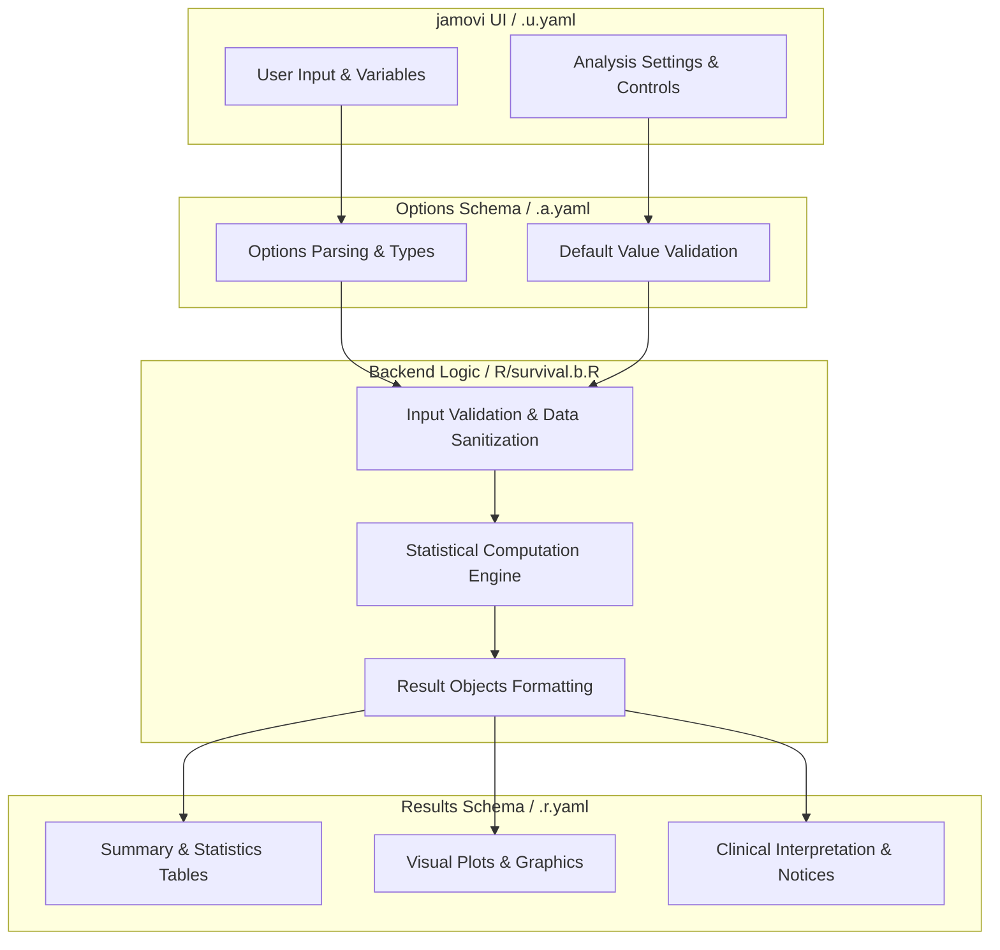
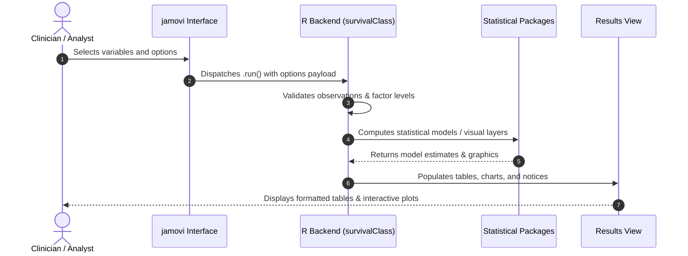

# Survival Analysis - Developer Documentation

## 1. Overview

- **Function**: `survival`
- **Title**: Survival Analysis
- **Module**: `SurvivalT`
- **Files**:
  - `jamovi/survival.u.yaml` - User Interface Definition
  - `jamovi/survival.a.yaml` - Options & Schema Definition
  - `jamovi/survival.r.yaml` - Results Layout & Tables
  - `R/survival.b.R` - Backend Implementation
- **Summary**: Performs univariate time-to-event analysis comparing groups using Kaplan-Meier estimates, log-rank tests, and Cox proportional hazards regression. Optional outputs include restricted mean survival time and crude person-time incidence rates. These methods describe associations and do not establish causality.

## 1a. Changelog

- **Date**: 2026-08-29
- **Summary**: Comprehensive documentation suite created & verified against active schemas and backend implementation.

## 2. Options Reference (`.a.yaml`)

| Option | Type | Default | Description |
| :--- | :--- | :--- | :--- |
| `data` | `Data` | `NULL` |  |
| `elapsedtime` | `Variable` | `NULL` | Time Elapsed |
| `tint` | `Bool` | `FALSE` | Using dates to calculate survival time |
| `dxdate` | `Variable` | `NULL` | Diagnosis Date |
| `fudate` | `Variable` | `NULL` | Follow-up Date |
| `calculatedtime` | `Output` | `NULL` | Add Calculated Time to Data |
| `explanatory` | `Variable` | `NULL` | Explanatory Variable |
| `outcome` | `Variable` | `NULL` | Outcome |
| `outcomeLevel` | `Level` | `NULL` | Event Level |
| `dod` | `Level` | `NULL` | Dead of Disease |
| `dooc` | `Level` | `NULL` | Dead of Other |
| `awd` | `Level` | `NULL` | Alive w Disease |
| `awod` | `Level` | `NULL` | Alive w/o Disease |
| `analysistype` | `List` | `overall` | Survival Type |
| `outcomeredefined` | `Output` | `NULL` | Add Redefined Outcome to Data |
| `cutp` | `String` | `12, 36, 60` | Cutpoints |
| `timetypedata` | `List` | `ymd` | Time Type in Data (e.g., YYYY-MM-DD) |
| `timetypeoutput` | `List` | `months` | Time Type in Output |
| `uselandmark` | `Bool` | `FALSE` | Use landmark time |
| `landmark` | `Integer` | `3` | Landmark Time |
| `pw` | `Bool` | `FALSE` | Pairwise comparisons |
| `padjustmethod` | `List` | `holm` | Adjustment Method |
| `weightedLogRank` | `Bool` | `FALSE` | Weighted log-rank tests |
| `survivalTestType` | `List` | `logrank` | Survival Test Type |
| `ph_cox` | `Bool` | `FALSE` | Proportional hazards assumption |
| `sc` | `Bool` | `FALSE` | Survival plot |
| `kmunicate` | `Bool` | `FALSE` | KMunicate-style plot |
| `ce` | `Bool` | `FALSE` | Cumulative events |
| `ch` | `Bool` | `FALSE` | Cumulative hazard |
| `endplot` | `Integer` | `60` | Plot End Time |
| `ybegin_plot` | `Number` | `0` | Start y-axis |
| `yend_plot` | `Number` | `1` | End y-axis |
| `byplot` | `Integer` | `12` | Time Interval |
| `multievent` | `Bool` | `FALSE` | Multiple event levels |
| `ci95` | `Bool` | `FALSE` | 95 percent CI |
| `risktable` | `Bool` | `FALSE` | Risktable |
| `censored` | `Bool` | `FALSE` | Censored |
| `pplot` | `Bool` | `FALSE` | p-value |
| `medianline` | `List` | `none` | medianline |
| `person_time` | `Bool` | `FALSE` | Calculate person-time metrics |
| `time_intervals` | `String` | `12, 36, 60` | Time Interval Stratification |
| `rate_multiplier` | `Integer` | `100` | Rate Multiplier |
| `rmst_analysis` | `Bool` | `FALSE` | Restricted mean survival time (RMST) |
| `rmst_tau` | `Number` | `0` | RMST Time Horizon |
| `stratified_cox` | `Bool` | `FALSE` | Stratified Cox regression |
| `strata_variable` | `Variable` | `NULL` | Stratification Variable |
| `age_adjustment` | `Bool` | `FALSE` | Age-adjusted analysis |
| `age_variable` | `Variable` | `NULL` | Age Variable |
| `age_interaction` | `Bool` | `FALSE` | Test age interaction |
| `age_stratified_cox` | `Bool` | `FALSE` | Age-stratified Cox model |
| `age_group_cutpoints` | `String` | `50, 65, 75` | Age Group Cutpoints |
| `age_time_scale` | `Bool` | `FALSE` | Age as time scale |
| `age_standardization` | `Bool` | `FALSE` | Age standardization (SMR) |
| `age_standardization_method` | `List` | `indirect` | Standardization Method |
| `age_stratified_km` | `Bool` | `FALSE` | Age-stratified KM plots |
| `adjusted_curves` | `Bool` | `FALSE` | Adjusted survival curves |
| `remark_checklist` | `Bool` | `FALSE` | REMARK reporting checklist |
| `residual_diagnostics` | `Bool` | `FALSE` | Model residual diagnostics |
| `export_survival_data` | `Output` | `NULL` | Export Estimated Survival |
| `loglog` | `Bool` | `FALSE` | Log-log plot |
| `showExplanations` | `Bool` | `FALSE` | Analysis explanations |
| `showSummaries` | `Bool` | `FALSE` | Natural language summaries |
| `use_parametric` | `Bool` | `FALSE` | Parametric survival models |
| `parametric_distribution` | `List` | `weibull` | Parametric Distribution |
| `parametric_covariates` | `Bool` | `TRUE` | Include covariates in parametric model |
| `spline_knots` | `Integer` | `3` | Number of Spline Knots |
| `spline_scale` | `List` | `hazard` | Spline Scale |
| `compare_distributions` | `Bool` | `FALSE` | Compare multiple distributions |
| `parametric_survival_plots` | `Bool` | `FALSE` | Parametric survival plots |
| `calibration_curves` | `Bool` | `FALSE` | Calibration curves |
| `calibration_timepoint` | `Number` | `0` | Calibration Time Point |
| `calibration_ngroups` | `Integer` | `5` | Number of Risk Groups |
| `rcs_analysis` | `Bool` | `FALSE` | Non-linearity assessment (RCS) |
| `rcs_variable` | `Variable` | `NULL` | Continuous Variable for Spline |
| `rcs_knots` | `Integer` | `4` | Number of Knots |
| `bootstrapValidation` | `Bool` | `FALSE` | Bootstrap internal validation |
| `bootstrapValN` | `Integer` | `200` | Number of Bootstrap Resamples |
| `seed` | `Integer` | `42` | Random Seed |

## 3. Results Definition (`.r.yaml`)

| Output ID | Type | Title | Description |
| :--- | :--- | :--- | :--- |
| `eventRecodeInfo` | `Html` | `Outcome Recode` |  |
| `subtitle` | `Preformatted` | ``Survival Analysis - ${explanatory}`` |  |
| `todo` | `Html` | `To Do` |  |
| `errors` | `Html` | `Critical Errors` |  |
| `strongWarnings` | `Html` | `Strong Warnings` |  |
| `warnings` | `Html` | `Warnings` |  |
| `infoMessages` | `Html` | `Information` |  |
| `medianSurvivalHeading` | `Preformatted` | `Median Survival Analysis` |  |
| `medianSummary` | `Preformatted` | ``Median Survival Summary and Table - ${explanatory}`` |  |
| `medianTable` | `Table` | ``Median Survival Table: Levels for ${explanatory}`` |  |
| `medianSurvivalHeading3` | `Preformatted` | `Median Survival Analysis Explanations` |  |
| `medianSurvivalExplanation` | `Html` | `Understanding Median Survival Analysis` |  |
| `coxRegressionHeading` | `Preformatted` | `Cox Regression Analysis` |  |
| `coxSummary` | `Preformatted` | ``Cox Regression Summary and Table - ${explanatory}`` |  |
| `coxTable` | `Table` | ``Cox Table- ${explanatory}`` |  |
| `tCoxtext2` | `Html` | `` |  |
| `coxRegressionHeading3` | `Preformatted` | `Cox Regression Analysis Explanations` |  |
| `coxRegressionExplanation` | `Html` | `Understanding Cox Regression Analysis` |  |
| `ageAdjustedCoxHeading` | `Preformatted` | `Age-Adjusted Cox Regression` |  |
| `ageAdjustedCoxTable` | `Table` | `Age-Adjusted Cox Regression` |  |
| `ageInteractionTable` | `Table` | `Age x Group Interaction Test` |  |
| `ageAdjustedInterpretation` | `Html` | `Age Adjustment Interpretation` |  |
| `ageAdjustedExplanation` | `Html` | `Understanding Age-Adjusted Survival Analysis` |  |
| `ageTimeScaleTable` | `Table` | `Cox Model with Age as Time Scale` |  |
| `ageTimeScaleInterpretation` | `Html` | `Age Time Scale Interpretation` |  |
| `ageStandardizationTable` | `Table` | `Age-Standardized Mortality` |  |
| `ageStandardizationInterpretation` | `Html` | `Age Standardization Interpretation` |  |
| `ageStratifiedKMPlot` | `Image` | `Age-Stratified Kaplan-Meier Curves` |  |
| `adjustedCurvesPlot` | `Image` | `Adjusted Survival Curves` |  |
| `remarkChecklist` | `Html` | `REMARK Reporting Checklist` |  |
| `cox_ph` | `Preformatted` | `Proportional Hazards Assumption` |  |
| `phInterpretation` | `Html` | `Proportional Hazards Assessment & Recommendations` |  |
| `plot8` | `Image` | ``Proportional Hazards Assumption - ${explanatory}`` |  |
| `survivalTablesHeading` | `Preformatted` | `Survival Probability Tables` |  |
| `survTableSummary` | `Preformatted` | ``1, 3, 5-yr Survival Summary and Table  - ${explanatory}`` |  |
| `survTable` | `Table` | ``1, 3, 5 year Survival - ${explanatory}`` |  |
| `survivalTablesHeading3` | `Preformatted` | `Survival Tables Explanations` |  |
| `survivalTablesExplanation` | `Html` | `Understanding Survival Probability Tables` |  |
| `personTimeHeading` | `Preformatted` | `Person-Time Analysis` |  |
| `personTimeTable` | `Table` | `Person-Time Analysis` |  |
| `personTimeSummary` | `Html` | `Person-Time Summary` |  |
| `personTimeExplanation` | `Html` | `Understanding Person-Time Analysis` |  |
| `rmstHeading` | `Preformatted` | `RMST Analysis` |  |
| `rmstTable` | `Table` | `Restricted Mean Survival Time` |  |
| `rmstSummary` | `Preformatted` | `RMST Interpretation` |  |
| `rmstExplanation` | `Html` | `Understanding Restricted Mean Survival Time (RMST)` |  |
| `residualDiagnosticsExplanation` | `Html` | `Understanding Cox Model Residual Diagnostics` |  |
| `residualsTable` | `Table` | `Cox Model Residuals` |  |
| `survivalExport` | `Output` | `Export Survival Data` |  |
| `survivalExportSummary` | `Html` | `Export Summary` |  |
| `pairwiseComparisonHeading` | `Preformatted` | `Pairwise Comparison Analysis` |  |
| `pairwiseTable` | `Table` | ``Pairwise Comparison Table - ${explanatory}`` |  |
| `pairwiseSummary` | `Preformatted` | ``Pairwise Comparison Summary and Table - ${explanatory}`` |  |
| `weightedLogRankTable` | `Table` | ``Weighted Log-Rank Tests - ${explanatory}`` |  |
| `weightedLogRankExplanation` | `Html` | `Weighted Log-Rank Test Interpretation` |  |
| `plot` | `Image` | ``Survival Plot - ${explanatory}`` |  |
| `plot2` | `Image` | ``Cumulative Events - ${explanatory}`` |  |
| `plot3` | `Image` | ``Cumulative Hazard - ${explanatory}`` |  |
| `plot6` | `Image` | ``KMunicate-Style Plot - ${explanatory}`` |  |
| `survivalPlotsHeading3` | `Preformatted` | `Survival Plots Explanations` |  |
| `survivalPlotsExplanation` | `Html` | `Understanding Survival Curves and Plots` |  |
| `plot7` | `Image` | ``Log-Log Plot - ${explanatory}`` |  |
| `residualsPlot` | `Image` | ``Residuals Diagnostic Plot - ${explanatory}`` |  |
| `calculatedtime` | `Output` | `Add Calculated Time to Data` |  |
| `outcomeredefined` | `Output` | `Add Redefined Outcome to Data` |  |
| `calibrationTable` | `Table` | `Calibration Assessment` |  |
| `calibrationGroupTable` | `Table` | `Calibration by Risk Group` |  |
| `calibrationPlot` | `Image` | `Calibration Plot` |  |
| `calibrationInterpretation` | `Html` | `Calibration Assessment Interpretation` |  |
| `rcsTestTable` | `Table` | `Non-Linearity Test (Likelihood Ratio)` |  |
| `rcsPlot` | `Image` | `Hazard Ratio Curve (Spline Effect)` |  |
| `rcsInterpretation` | `Html` | `Non-Linearity Assessment Interpretation` |  |
| `bootstrapValidationTable` | `Table` | `Bootstrap Internal Validation` |  |
| `bootstrapValidationExplanation` | `Html` | `Bootstrap Validation Interpretation` |  |
| `parametricModelComparison` | `Table` | `Parametric Model Comparison` |  |
| `parametricModelSummary` | `Table` | `Parametric Model Results` |  |
| `parametricSurvivalPlot` | `Image` | `Parametric Survival Curves` |  |
| `parametricModelsExplanation` | `Html` | `Understanding Parametric Survival Models` |  |
| `clinicalGlossaryExplanation` | `Html` | `Clinical Terminology Glossary` |  |
| `clinicalInterpretationExplanation` | `Html` | `Enhanced Clinical Interpretation` |  |
| `copyReadySentencesExplanation` | `Html` | `Copy-Ready Clinical Report Sentences` |  |

## 4. Architecture & Data Flow Diagram

```mermaid
flowchart TD
  subgraph UI[jamovi UI / .u.yaml]
    U1[User Input & Variables]
    U2[Analysis Settings & Controls]
  end

  subgraph Opts[Options Schema / .a.yaml]
    O1[Options Parsing & Types]
    O2[Default Value Validation]
  end

  subgraph Backend[Backend Logic / R/survival.b.R]
    B1[Input Validation & Data Sanitization]
    B2[Statistical Computation Engine]
    B3[Result Objects Formatting]
  end

  subgraph Res[Results Schema / .r.yaml]
    R1[Summary & Statistics Tables]
    R2[Visual Plots & Graphics]
    R3[Clinical Interpretation & Notices]
  end

  U1 --> O1
  U2 --> O2
  O1 --> B1
  O2 --> B1
  B1 --> B2
  B2 --> B3
  B3 --> R1
  B3 --> R2
  B3 --> R3
```

## 5. Execution Sequence

```mermaid
sequenceDiagram
  autonumber
  actor User as Clinician / Analyst
  participant UI as jamovi Interface
  participant Backend as R Backend (survivalClass)
  participant Engine as Statistical Packages
  participant Results as Results View

  User->>UI: Selects variables and options
  UI->>Backend: Dispatches .run() with options payload
  Backend->>Backend: Validates observations & factor levels
  Backend->>Engine: Computes statistical models / visual layers
  Engine-->>Backend: Returns model estimates & graphics
  Backend->>Results: Populates tables, charts, and notices
  Results-->>User: Displays formatted tables & interactive plots
```

## 6. Change Impact & Safety Guidelines

- **Data Filtering**: Ensure observations with missing values are handled gracefully according to analysis options.
- **Formula Conflicts**: Use isolated environment calls or base formula methods when interacting with `ggstatsplot` or formula parsers.
- **Safe Deparsing**: Use `deparse(val)` in syntax generation (`asSource()`) to escape column names with spaces or special symbols.

