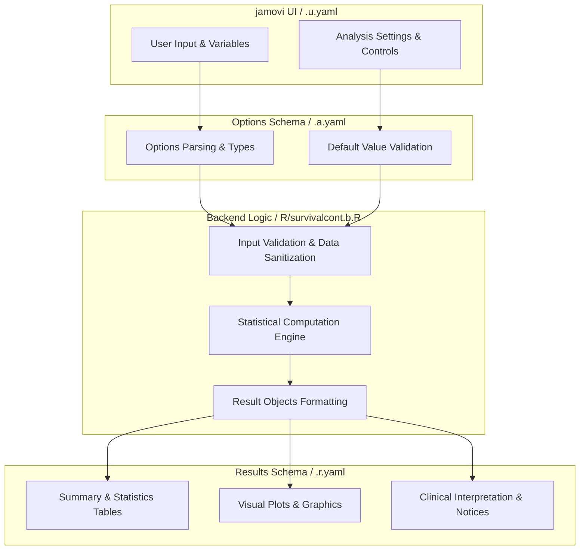
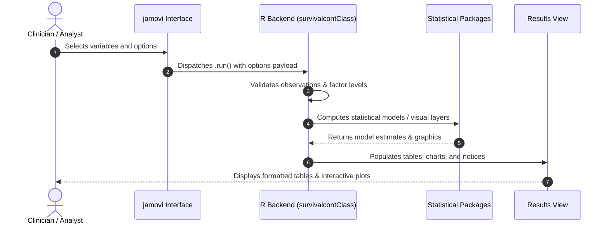

# Survival Analysis for Continuous Variable - Developer Documentation

## 1. Overview

- **Function**: `survivalcont`
- **Title**: Survival Analysis for Continuous Variable
- **Module**: `SurvivalT`
- **Files**:
  - `jamovi/survivalcont.u.yaml` - User Interface Definition
  - `jamovi/survivalcont.a.yaml` - Options & Schema Definition
  - `jamovi/survivalcont.r.yaml` - Results Layout & Tables
  - `R/survivalcont.b.R` - Backend Implementation
- **Summary**: Analysis for Survival Analysis for Continuous Variable

## 1a. Changelog

- **Date**: 2026-08-29
- **Summary**: Comprehensive documentation suite created & verified against active schemas and backend implementation.

## 2. Options Reference (`.a.yaml`)

| Option | Type | Default | Description |
| :--- | :--- | :--- | :--- |
| `data` | `Data` | `NULL` |  |
| `elapsedtime` | `Variable` | `NULL` | Time Elapsed |
| `tint` | `Bool` | `FALSE` | Using dates to calculate survival time |
| `dxdate` | `Variable` | `NULL` | Diagnosis Date |
| `fudate` | `Variable` | `NULL` | Follow-up Date |
| `calculatedtime` | `Output` | `NULL` | Add Calculated Time to Data |
| `contexpl` | `Variable` | `NULL` | Continuous Explanatory Variable |
| `outcome` | `Variable` | `NULL` | Outcome |
| `outcomeLevel` | `Level` | `NULL` | Event Level |
| `dod` | `Level` | `NULL` | Dead of Disease |
| `dooc` | `Level` | `NULL` | Dead of Other |
| `awd` | `Level` | `NULL` | Alive w Disease |
| `awod` | `Level` | `NULL` | Alive w/o Disease |
| `analysistype` | `List` | `overall` | Survival Type |
| `outcomeredefined` | `Output` | `NULL` | Add Redefined Outcome to Data |
| `cutp` | `String` | `12, 36, 60` | Survival Estimate Time Points |
| `timetypedata` | `List` | `ymd` | Time Type in Data (e.g., YYYY-MM-DD) |
| `timetypeoutput` | `List` | `months` | Time Type in Output |
| `uselandmark` | `Bool` | `FALSE` | Use landmark time |
| `landmark` | `Integer` | `3` | Landmark Time |
| `sc` | `Bool` | `FALSE` | Survival curves after grouping |
| `kmunicate` | `Bool` | `FALSE` | KMunicate-style plot |
| `ce` | `Bool` | `FALSE` | Cumulative events |
| `ch` | `Bool` | `FALSE` | Cumulative hazard |
| `endplot` | `Integer` | `60` | Plot End Time |
| `ybegin_plot` | `Number` | `0` | Start y-axis |
| `yend_plot` | `Number` | `1` | End y-axis |
| `byplot` | `Integer` | `12` | Time Interval |
| `findcut` | `Bool` | `FALSE` | Find cut-off for continuous explanatory variable |
| `multiple_cutoffs` | `Bool` | `FALSE` | Find multiple cut-offs |
| `num_cutoffs` | `List` | `two` | Number of Cut-offs |
| `cutoff_method` | `List` | `quantile` | Multiple Cut-off Method |
| `min_group_size` | `Number` | `10` | Minimum Group Size ( percent) |
| `calculatedcutoff` | `Output` | `NULL` | Add Calculated Cut-off Group to Data |
| `calculatedmulticut` | `Output` | `NULL` | Add Multiple Cut-off Groups to Data |
| `multievent` | `Bool` | `FALSE` | Multiple event levels |
| `ci95` | `Bool` | `FALSE` | 95 percent CI |
| `risktable` | `Bool` | `FALSE` | Risktable |
| `censored` | `Bool` | `FALSE` | Censored |
| `medianline` | `List` | `none` | medianline |
| `person_time` | `Bool` | `FALSE` | Calculate person-time metrics |
| `time_intervals` | `String` | `12, 36, 60` | Time Interval Stratification |
| `rate_multiplier` | `Integer` | `100` | Rate Multiplier |
| `rmst_analysis` | `Bool` | `FALSE` | RMST summary |
| `rmst_tau` | `Number` | `0` | RMST Time Horizon (τ) |
| `residual_diagnostics` | `Bool` | `FALSE` | Residual diagnostics |
| `stratified_cox` | `Bool` | `FALSE` | Stratified Cox regression |
| `strata_variable` | `Variable` | `NULL` | Stratification Variable |
| `loglog` | `Bool` | `FALSE` | Log-log plot |
| `showExplanations` | `Bool` | `FALSE` | Analysis explanations |
| `showSummaries` | `Bool` | `FALSE` | Natural language summaries |
| `seed` | `Integer` | `12345` | Random Seed |

## 3. Results Definition (`.r.yaml`)

| Output ID | Type | Title | Description |
| :--- | :--- | :--- | :--- |
| `eventRecodeInfo` | `Html` | `Outcome Recode` |  |
| `todo` | `Html` | `To Do` |  |
| `clinicalWarnings` | `Html` | `Clinical Assumptions and Warnings` |  |
| `errors` | `Html` | `Critical Errors` |  |
| `strongWarnings` | `Html` | `Strong Warnings` |  |
| `warnings` | `Html` | `Warnings` |  |
| `infoMessages` | `Html` | `Information` |  |
| `coxRegressionHeading` | `Preformatted` | `Cox Regression for Continuous Variables` |  |
| `coxSummary` | `Preformatted` | ``Cox Regression Summary and Table - ${contexpl}`` |  |
| `coxTable` | `Table` | ``Cox Table- ${contexpl}`` |  |
| `stratifiedCoxTable` | `Table` | `Stratified Cox Regression` |  |
| `tCoxtext2` | `Html` | `` |  |
| `coxRegressionHeading3` | `Preformatted` | `Cox Regression Explanations` |  |
| `coxRegressionExplanation` | `Html` | `Understanding Cox Regression for Continuous Variables` |  |
| `personTimeHeading` | `Preformatted` | `Person-Time Analysis` |  |
| `personTimeTable` | `Table` | `Person-Time Analysis` |  |
| `personTimeSummary` | `Html` | `Person-Time Summary` |  |
| `personTimeExplanation` | `Html` | `Understanding Person-Time Analysis` |  |
| `rmstHeading` | `Preformatted` | `RMST Analysis` |  |
| `rmstTable` | `Table` | `Restricted Mean Survival Time` |  |
| `rmstSummary` | `Preformatted` | `RMST Interpretation` |  |
| `rmstExplanation` | `Html` | `Understanding RMST Analysis` |  |
| `residualsTable` | `Table` | `Case-Level Cox Model Residuals` |  |
| `schoenfeldResidualsTable` | `Table` | `Schoenfeld Residuals at Event Times` |  |
| `residualDiagnosticsExplanation` | `Html` | `Understanding Cox Model Residuals` |  |
| `cutoffAnalysisHeading` | `Preformatted` | `Cut-off Point Analysis` |  |
| `rescutTable` | `Table` | `Cut Point` |  |
| `cutoffAnalysisHeading3` | `Preformatted` | `Cut-off Analysis Explanations` |  |
| `cutoffAnalysisExplanation` | `Html` | `Understanding Cut-off Point Analysis` |  |
| `plot4` | `Image` | `Cutpoint Plot` |  |
| `plot5` | `Image` | ``Survival Plot - ${contexpl} Grouped with New Cut-Off`` |  |
| `medianSummary` | `Preformatted` | ``Median Survival Summary and Table - ${contexpl}`` |  |
| `medianTable` | `Table` | ``Median Survival Table: Levels for ${contexpl}`` |  |
| `survTableSummary` | `Preformatted` | ``Survival at Selected Time Points - ${contexpl}`` |  |
| `survTable` | `Table` | ``Survival at Selected Time Points - ${contexpl}`` |  |
| `plot2` | `Image` | ``Cumulative Events  - ${contexpl} Grouped with New Cut-Off`` |  |
| `plot3` | `Image` | ``Cumulative Hazard  - ${contexpl} Grouped with New Cut-Off`` |  |
| `plot6` | `Image` | ``KMunicate-Style Plot  - ${contexpl} Grouped with New Cut-Off`` |  |
| `survivalPlotsHeading3` | `Preformatted` | `Survival Plots Explanations` |  |
| `survivalPlotsExplanation` | `Html` | `Understanding Survival Curves and Plots` |  |
| `plot7` | `Image` | ``Log-Log Plot - ${contexpl} Grouped with New Cut-Off`` |  |
| `loglogPlotExplanation` | `Html` | `Understanding Log-Log Plots for Proportional Hazards Assessment` |  |
| `residualsPlot` | `Image` | ``Residuals Diagnostic Plot - ${contexpl}`` |  |
| `calculatedtime` | `Output` | `Add Calculated Time to Data` |  |
| `outcomeredefined` | `Output` | `Add Redefined Outcome to Data` |  |
| `calculatedcutoff` | `Output` | `Add Calculated Cut-off Group to Data` |  |
| `multipleCutTable` | `Table` | `Multiple Cut-off Points` |  |
| `multipleMedianTable` | `Table` | ``Median Survival by Multiple Cut-offs: ${contexpl}`` |  |
| `multipleCutoffsExplanation` | `Html` | `Understanding Multiple Cut-offs Analysis` |  |
| `multipleSurvTable` | `Table` | ``Survival Estimates by Multiple Cut-offs: ${contexpl}`` |  |
| `plotMultipleCutoffs` | `Image` | ``Multiple Cut-offs Visualization - ${contexpl}`` |  |
| `plotMultipleSurvival` | `Image` | ``Survival Plot with Multiple Cut-offs - ${contexpl}`` |  |
| `calculatedmulticut` | `Output` | `Add Multiple Cut-off Groups to Data` |  |

## 4. Architecture & Data Flow Diagram

## 5. Execution Sequence

## 6. Change Impact & Safety Guidelines

- **Data Filtering**: Ensure observations with missing values are handled gracefully according to analysis options.
- **Formula Conflicts**: Use isolated environment calls or base formula methods when interacting with `ggstatsplot` or formula parsers.
- **Safe Deparsing**: Use `deparse(val)` in syntax generation (`asSource()`) to escape column names with spaces or special symbols.

