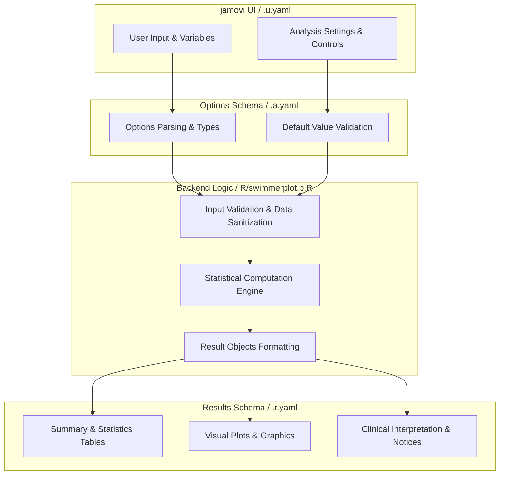
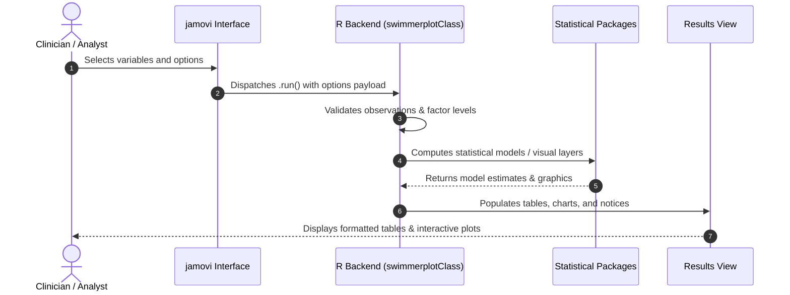

# Swimmer Plot - Developer Documentation

## 1. Overview

- **Function**: `swimmerplot`
- **Title**: Swimmer Plot
- **Module**: `OncoPath`
- **Files**:
  - `jamovi/swimmerplot.u.yaml` - User Interface Definition
  - `jamovi/swimmerplot.a.yaml` - Options & Schema Definition
  - `jamovi/swimmerplot.r.yaml` - Results Layout & Tables
  - `R/swimmerplot.b.R` - Backend Implementation
- **Summary**: Creates comprehensive swimmer plots using the ggswim package to visualize patient timelines, clinical events, milestones, and treatment responses. Features enhanced data validation and complete ggswim integration for professional clinical visualization.

## 1a. Changelog

- **Date**: 2026-08-29
- **Summary**: Comprehensive documentation suite created & verified against active schemas and backend implementation.

## 2. Options Reference (`.a.yaml`)

| Option | Type | Default | Description |
| :--- | :--- | :--- | :--- |
| `data` | `Data` | `NULL` |  |
| `patientID` | `Variable` | `NULL` | Patient ID |
| `startTime` | `Variable` | `NULL` | Start Time |
| `endTime` | `Variable` | `NULL` | End Time |
| `responseVar` | `Variable` | `NULL` | Response/Status Variable |
| `censorVar` | `Variable` | `NULL` | Censoring/Event Status Variable |
| `groupVar` | `Variable` | `NULL` | Grouping Variable |
| `timeType` | `List` | `raw` | Time Input Type |
| `dateFormat` | `List` | `ymd` | Date Format in Data |
| `timeUnit` | `List` | `months` | Time Unit for Display |
| `timeDisplay` | `List` | `relative` | Time Display Mode |
| `maxMilestones` | `Integer` | `5` | Maximum milestones |
| `milestone1Name` | `String` | `Surgery` | Milestone 1 Name |
| `milestone1Date` | `Variable` | `NULL` | Milestone 1 Date |
| `milestone2Name` | `String` | `Treatment Start` | Milestone 2 Name |
| `milestone2Date` | `Variable` | `NULL` | Milestone 2 Date |
| `milestone3Name` | `String` | `Response Assessment` | Milestone 3 Name |
| `milestone3Date` | `Variable` | `NULL` | Milestone 3 Date |
| `milestone4Name` | `String` | `Progression` | Milestone 4 Name |
| `milestone4Date` | `Variable` | `NULL` | Milestone 4 Date |
| `milestone5Name` | `String` | `Death/Last Follow-up` | Milestone 5 Name |
| `milestone5Date` | `Variable` | `NULL` | Milestone 5 Date |
| `showEventMarkers` | `Bool` | `FALSE` | Event markers |
| `eventVar` | `Variable` | `NULL` | Event Type Variable |
| `eventTimeVar` | `Variable` | `NULL` | Event Time Variable |
| `laneWidth` | `Number` | `3` | Lane Width |
| `markerSize` | `Number` | `5` | Marker Size |
| `plotTheme` | `List` | `ggswim` | Plot Theme |
| `colorPalette` | `List` | `default` | Color Palette |
| `showLegend` | `Bool` | `TRUE` | Legend |
| `referenceLines` | `List` | `none` | Reference Lines |
| `customReferenceTime` | `Number` | `12` | Custom Reference Time |
| `customReferenceDate` | `String` | `` | Custom Reference Date |
| `sortVariable` | `Variable` | `NULL` | Sort By Variable |
| `sortOrder` | `List` | `duration_desc` | Sort Order |
| `showInterpretation` | `Bool` | `TRUE` | Clinical interpretation |
| `personTimeAnalysis` | `Bool` | `TRUE` | Person-time analysis |
| `responseAnalysis` | `Bool` | `TRUE` | Response analysis |
| `showGlossary` | `Bool` | `FALSE` | Clinical glossary |
| `showCopyReady` | `Bool` | `FALSE` | Copy-ready manuscript text |
| `showAbout` | `Bool` | `FALSE` | About this analysis |
| `exportTimeline` | `Bool` | `FALSE` | Export timeline data |
| `exportSummary` | `Bool` | `FALSE` | Export summary statistics |

## 3. Results Definition (`.r.yaml`)

| Output ID | Type | Title | Description |
| :--- | :--- | :--- | :--- |
| `notices` | `Preformatted` | `Important Information` |  |
| `warningNotice` | `Html` | `` |  |
| `instructions` | `Html` | `Instructions` |  |
| `plot` | `Image` | `Patient Timeline Visualization` |  |
| `summary` | `Table` | `Timeline Summary Statistics` |  |
| `interpretation` | `Html` | `Clinical Interpretation` |  |
| `personTimeTable` | `Table` | `Person-Time Analysis` |  |
| `milestoneTable` | `Table` | `Milestone Event Summary` |  |
| `eventMarkerTable` | `Table` | `Event Marker Summary` |  |
| `timelineData` | `Table` | `Export Timeline Data` |  |
| `summaryData` | `Table` | `Export Summary Statistics` |  |
| `exportInfo` | `Html` | `Export Information` |  |
| `validationReport` | `Html` | `Data Validation Report` |  |
| `advancedMetrics` | `Table` | `Advanced Clinical Metrics` |  |
| `groupComparisonTest` | `Table` | `Group Comparison Statistical Tests` |  |
| `clinicalGlossary` | `Html` | `Clinical Glossary` |  |
| `copyReadyReport` | `Html` | `Copy-Ready Manuscript Text` |  |
| `aboutAnalysis` | `Html` | `About This Analysis` |  |

## 4. Architecture & Data Flow Diagram

## 5. Execution Sequence

## 6. Change Impact & Safety Guidelines

- **Data Filtering**: Ensure observations with missing values are handled gracefully according to analysis options.
- **Formula Conflicts**: Use isolated environment calls or base formula methods when interacting with `ggstatsplot` or formula parsers.
- **Safe Deparsing**: Use `deparse(val)` in syntax generation (`asSource()`) to escape column names with spaces or special symbols.

