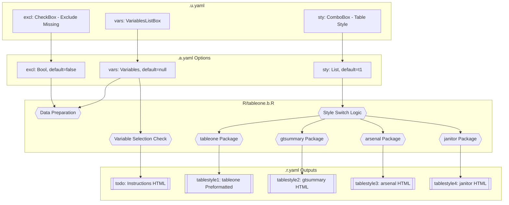
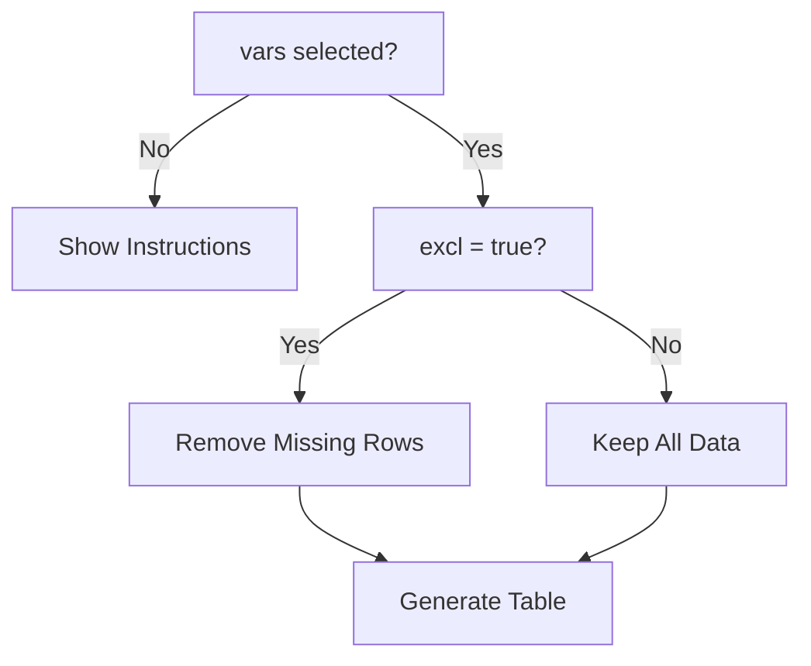
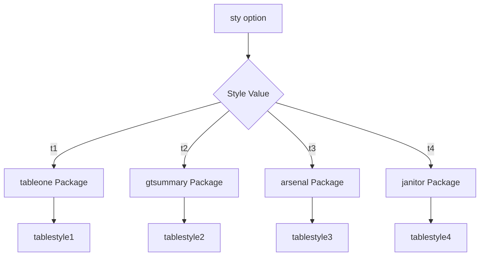
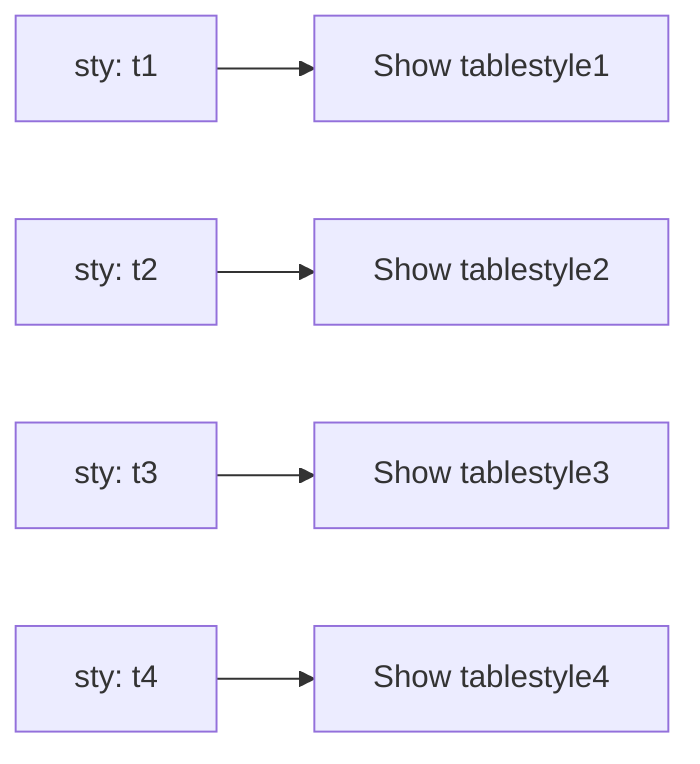

# Jamovi Function Documentation: tableone

## 1. Overview

- **Function**: `tableone`
- **Files**:
  - `jamovi/tableone.u.yaml` — UI
  - `jamovi/tableone.a.yaml` — Options
  - `R/tableone.b.R` — Backend
  - `jamovi/tableone.r.yaml` — Results

**Summary**: The `tableone` function generates a "Table One", a descriptive summary table frequently used in clinicopathological research manuscripts. It provides four different output styles using different R packages (tableone, gtsummary, arsenal, janitor) to offer flexible formatting options for researchers. Users can select variables, choose table styles, and optionally exclude missing values from the analysis.

## 2. UI Controls → Options Map

| UI Control | Type | Label | Binds to Option | Defaults & Constraints | Visibility/Enable Rules |
|------------|------|-------|----------------|------------------------|------------------------|
| `vars` | VariablesListBox | "Select Variables" | `vars` | No default, accepts multiple variables | Always visible |
| `sty` | ComboBox | "Table Style" | `sty` | Default: `t1` (tableone), Options: t1/t2/t3/t4 | Always visible |
| `excl` | CheckBox | "Exclude Missing Values (NA)" | `excl` | Default: `false` | Always visible |

## 3. Options Reference (.a.yaml)

| Name | Type | Default | Description | Downstream Effects |
|------|------|---------|-------------|-------------------|
| `data` | Data | N/A | The input dataset for analysis | Used throughout `.b.R` as `self$data` |
| `vars` | Variables | None | Variables to include in Table One (numeric, ordinal, categorical) | Controls which columns are selected via `jmvcore::select()` |
| `sty` | List | `t1` | Table output style: t1=tableone, t2=gtsummary, t3=arsenal, t4=janitor | Determines which code branch executes in `.run()` method |
| `excl` | Bool | `false` | Exclude missing values (NA) from analysis | Controls whether `jmvcore::naOmit()` is applied |

## 4. Backend Usage (.b.R)

### `self$options$vars` Usage
- **Code Locations**: Lines 33, 54-55, 87, 105
- **Logic Summary**: 
  - Line 33: Null check to display instructions when no variables selected
  - Line 54-55: Assigns selected variables and uses `jmvcore::select()` to subset data
  - Line 87: Used in arsenal formula construction via `jmvcore::constructFormula()`
  - Line 105: Iterates through variables for janitor frequency tables
- **Result Population**: When null, populates `todo` result; otherwise drives all table generation

### `self$options$excl` Usage
- **Code Locations**: Lines 58-60
- **Logic Summary**: Boolean check that applies `jmvcore::naOmit()` to remove rows with missing values
- **Result Population**: Affects the data used in all subsequent table generation methods

### `self$options$sty` Usage
- **Code Locations**: Lines 63, 66, 75, 85, 103
- **Logic Summary**: Switch statement controlling which table generation method executes:
  - `t1`: tableone package (lines 66-73)
  - `t2`: gtsummary package (lines 75-83) 
  - `t3`: arsenal package (lines 85-101)
  - `t4`: janitor package (lines 103-181)
- **Result Population**: Each style populates different result objects (tablestyle1-4)

## 5. Results Definition (.r.yaml)

| Output ID | Type | Title | Visibility | Schema/Notes |
|-----------|------|-------|------------|--------------|
| `todo` | Html | "Instructions" | Always visible | Welcome message when no variables selected |
| `summary` | Html | "Summary" | Always visible | Dataset overview, sample size, variable types, missing data |
| `about` | Html | "About This Analysis" | Always visible | Educational content about Table One usage in clinical research |
| `assumptions` | Html | "Data Quality & Assumptions" | Always visible | Data quality warnings and recommendations |
| `tablestyle1` | Preformatted | "Table One Output (tableone)" | `(sty:t1)` | Plain text output from tableone package |
| `tablestyle2` | Html | "Summary Table (gtsummary)" | `(sty:t2)` | HTML table from gtsummary package |
| `tablestyle3` | Html | "Descriptive Table (arsenal)" | `(sty:t3)` | HTML table from arsenal package with kable formatting |
| `tablestyle4` | Html | "Frequency Tables (janitor)" | `(sty:t4)` | HTML frequency tables with custom styling for each variable |

**Population Entry Points**:
- `self$results$todo$setContent()` - Lines 46, 50
- `self$results$tablestyle1$setContent()` - Line 73
- `self$results$tablestyle2$setContent()` - Line 83
- `self$results$tablestyle3$setContent()` - Line 101
- `self$results$tablestyle4$setContent()` - Line 181

## 6. Data Flow Diagram (UI → Options → Backend → Results)



## 7. Execution Sequence (User Action → Results)

### User Input Flow


### Decision Logic


### Style Processing


### Result Visibility


**Step-by-step execution flow:**

1. **User selects variables** → UI updates `vars` option
2. **User chooses table style** → UI updates `sty` option (t1/t2/t3/t4)  
3. **User sets exclude missing** → UI updates `excl` boolean
4. **Backend validation** → Check if vars is null, show instructions or proceed
5. **Data preparation** → Select variables, apply naOmit if excl=true
6. **Table generation** → Use selected package based on sty value
7. **Results display** → Only selected style result is visible to user

## 8. Change Impact Guide

### Key Option Changes:

**`vars` (Variables)**:
- **If changed**: Triggers complete recalculation of selected table style, updates data subsetting
- **Common pitfalls**: Selecting incompatible variable types may cause package-specific errors
- **Recommended defaults**: Include mix of categorical and numeric variables for comprehensive tables

**`sty` (Table Style)**:
- **If changed**: Switches between different R packages and output formats, affects result visibility
- **Common pitfalls**: Some packages handle missing data differently; arsenal requires formula construction
- **Recommended defaults**: `t1` (tableone) for standard academic formatting, `t2` (gtsummary) for publication-ready HTML

**`excl` (Exclude Missing)**:
- **If changed**: May dramatically reduce sample size by removing entire rows with any missing values
- **Common pitfalls**: Can result in empty datasets if most rows have some missing data
- **Recommended defaults**: `false` to preserve maximum sample size; let individual packages handle missing data appropriately

### Performance Implications:
- janitor style (`t4`) has highest computational overhead due to individual variable processing
- gtsummary (`t2`) and arsenal (`t3`) provide fastest HTML rendering
- Large datasets with many variables may cause memory issues with certain styles

## 9. Example Usage

**Example dataset requirements**:
- Mixed variable types: numeric (Age, continuous measures), categorical (Sex, Grade), ordinal (Likert scales)
- Reasonable sample size (>50 observations recommended)
- Some missing data acceptable for testing exclusion options

**Example option payload**:
```yaml
data: histopathology
vars: [Sex, PreinvasiveComponent, LVI, PNI, Grade, Age]
sty: t3
excl: true
```

**Expected outputs**:
- **Style t1**: Plain text summary with means/SD for numeric, frequencies for categorical
- **Style t2**: HTML table with confidence intervals and statistical formatting  
- **Style t3**: Comprehensive HTML table with totals column and detailed statistics
- **Style t4**: Individual frequency tables for each variable with percentages and styling

## 10. Appendix (Schemas & Snippets)

### Result Object Schemas:

**todo (Html)**:
- Content: Instruction text with HTML formatting
- Visibility: Always shown, cleared when variables selected

**tablestyle1 (Preformatted)**:
- Content: Plain text output from `tableone::CreateTableOne()`
- Visibility: Only when `sty:t1`
- Clear triggers: Changes to `vars` or `excl`

**tablestyle2-4 (Html)**:
- Content: HTML-formatted tables with package-specific styling
- Visibility: Conditional on respective `sty` values
- Clear triggers: Changes to `vars` or `excl`

### Key Code Snippets:

**Variable Selection**:
```r
selected_vars <- self$options$vars
data <- jmvcore::select(self$data, selected_vars)
```

**Missing Value Handling**:
```r
if (isTRUE(self$options$excl)) {
    data <- jmvcore::naOmit(data)
}
```

**Style Switching**:
```r
table_style <- self$options$sty
if (table_style == "t1") {
    mytable <- tableone::CreateTableOne(data = data)
    self$results$tablestyle1$setContent(mytable)
}
```

## 11. Clinical Context and Educational Content

### About Table One (Educational Content)

The function provides comprehensive educational content explaining that Table One is a standardized descriptive table used in medical research to **summarize baseline characteristics and demographic information** of study participants (not for group comparisons).

**When to use**:
- Describing patient demographics and clinical characteristics
- **Summarizing baseline features of your study population** (updated from comparison language)
- Presenting lab values, vital signs, or biomarker data
- Creating manuscript-ready descriptive summary tables

**Variable types**:
- *Continuous*: Age, weight, lab values (shown as mean ± SD or median [IQR])
- *Categorical*: Sex, diagnosis, treatment groups (shown as N (%))
- *Ordinal*: Tumor grade, ECOG status (shown as N (%) by level)

**Output styles** (updated descriptions):
- **tableone**: Standard medical format, suitable for most clinical papers
- **gtsummary**: Publication-ready formatting with **professional styling** (removed "statistical testing")
- **arsenal**: Comprehensive descriptive tables with **detailed summaries** (removed "statistical comparisons")
- **janitor**: Simple frequency tables, good for data exploration

### Data Quality Monitoring

#### Summary Generation (.generateSummary)
The function automatically generates clinical insights:
- **Total cases**: Count of observations with percentage completeness
- **Variable types**: Automatic classification (Numeric, Categorical, Logical, Other)
- **Complete cases**: Cases without missing values
- **Missing data**: Percentage with clinical interpretation

#### Quality Checks (.checkDataQuality)
Comprehensive data validation with clinical recommendations:

**Sample size warnings**:
- N < 10: "Very small sample size. Results may be unreliable."
- N < 30: "Consider reporting exact values rather than summary statistics."

**Missing data alerts**:
- \> 50%: High missing data rate warning with imputation recommendations
- \> 20%: Moderate missing data with pattern reporting suggestions

**Variable pattern detection**:
- Numeric variables with few unique values: Suggest categorical treatment
- Text variables with many unique values: Suggest category grouping

### Performance Optimization Features

#### Checkpoint Integration
Strategic checkpoint calls for incremental results in jamovi:
```r
private$.checkpoint()  # Before data preparation
private$.checkpoint()  # Before statistical computation  
private$.checkpoint(flush = FALSE)  # During variable loops
```

#### Error Handling with Clinical Context
Enhanced error messages that provide clinical guidance:
- Insufficient data errors with sample size recommendations
- Package-specific errors with variable type guidance
- Missing data handling with clinical interpretation

### Recent Improvements (2024-2025)

1. **Removed Group Comparison Language**: Updated all content to focus on descriptive summaries rather than group comparisons
2. **Added Clinical Context**: Enhanced educational content with medical research focus
3. **Data Quality Monitoring**: Comprehensive data validation with clinical recommendations
4. **Enhanced Error Messages**: Context-aware error handling with clinical guidance
5. **Performance Optimization**: Strategic checkpointing for large datasets
6. **Missing Data Intelligence**: Smart handling of missing values with clinical interpretation

### Integration with ClinicoPath Module

The `tableone` function is part of the **ClinicoPath Descriptives** module group, designed specifically for clinicopathological research. It integrates with other ClinicoPath functions for comprehensive medical data analysis workflows.