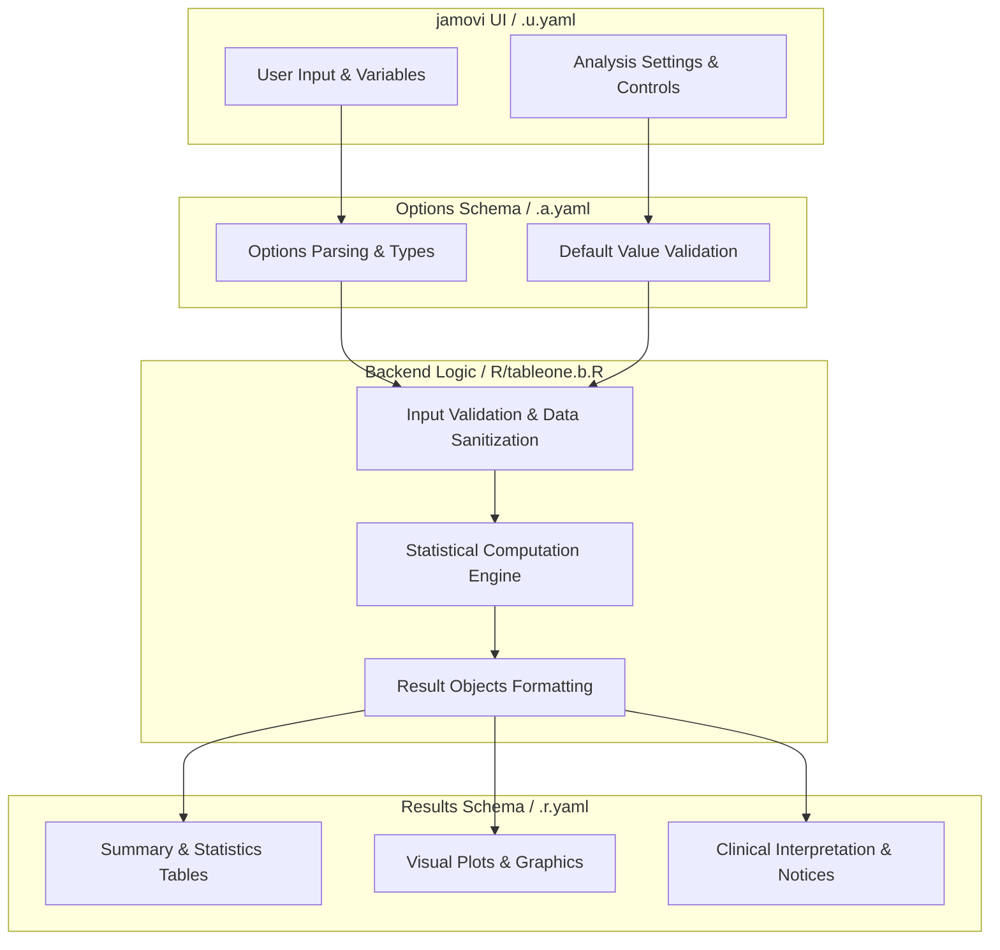
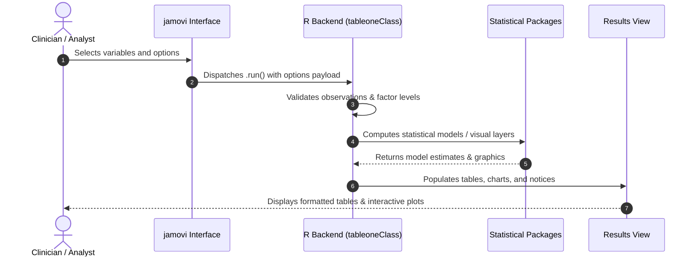

# Table One - Developer Documentation

## 1. Overview

- **Function**: `tableone`
- **Title**: Table One
- **Module**: `ExplorationT`
- **Files**:
  - `jamovi/tableone.u.yaml` - User Interface Definition
  - `jamovi/tableone.a.yaml` - Options & Schema Definition
  - `jamovi/tableone.r.yaml` - Results Layout & Tables
  - `R/tableone.b.R` - Backend Implementation
- **Summary**: This function generates a "Table One", a descriptive summary table frequently used in  clinicopathological research manuscripts. It supports multiple output styles for flexible formatting.

## 1a. Changelog

- **Date**: 2026-08-29
- **Summary**: Comprehensive documentation suite created & verified against active schemas and backend implementation.

## 2. Options Reference (`.a.yaml`)

| Option | Type | Default | Description |
| :--- | :--- | :--- | :--- |
| `data` | `Data` | `NULL` |  |
| `vars` | `Variables` | `NULL` | Variables |
| `sty` | `List` | `t1` | Table style |
| `excl` | `Bool` | `FALSE` | Missing-value exclusion (NA) |
| `showSummary` | `Bool` | `FALSE` | Analysis summary |
| `showAbout` | `Bool` | `FALSE` | About this analysis |
| `showReportSentence` | `Bool` | `FALSE` | Copy-ready report text |
| `nonnormal` | `Bool` | `FALSE` | Report continuous variables as median (Q1, Q3) |

## 3. Results Definition (`.r.yaml`)

| Output ID | Type | Title | Description |
| :--- | :--- | :--- | :--- |
| `todo` | `Html` | `Instructions` |  |
| `tablestyle1` | `Preformatted` | `Table One Output (tableone)` |  |
| `tablestyle2` | `Html` | `Summary Table (gtsummary)` |  |
| `tablestyle3` | `Html` | `Descriptive Table (arsenal)` |  |
| `tablestyle4` | `Html` | `Frequency Tables (janitor)` |  |
| `reportSentence` | `Html` | ` Copy to Manuscript` |  |
| `summary` | `Html` | `Summary` |  |
| `about` | `Html` | `About This Analysis` |  |
| `assumptions` | `Html` | `Data Quality & Assumptions` |  |

## 4. Architecture & Data Flow Diagram

```mermaid
flowchart TD
  subgraph UI[jamovi UI / .u.yaml]
    U1[User Input & Variables]
    U2[Analysis Settings & Controls]
  end

  subgraph Opts[Options Schema / .a.yaml]
    O1[Options Parsing & Types]
    O2[Default Value Validation]
  end

  subgraph Backend[Backend Logic / R/tableone.b.R]
    B1[Input Validation & Data Sanitization]
    B2[Statistical Computation Engine]
    B3[Result Objects Formatting]
  end

  subgraph Res[Results Schema / .r.yaml]
    R1[Summary & Statistics Tables]
    R2[Visual Plots & Graphics]
    R3[Clinical Interpretation & Notices]
  end

  U1 --> O1
  U2 --> O2
  O1 --> B1
  O2 --> B1
  B1 --> B2
  B2 --> B3
  B3 --> R1
  B3 --> R2
  B3 --> R3
```

## 5. Execution Sequence

```mermaid
sequenceDiagram
  autonumber
  actor User as Clinician / Analyst
  participant UI as jamovi Interface
  participant Backend as R Backend (tableoneClass)
  participant Engine as Statistical Packages
  participant Results as Results View

  User->>UI: Selects variables and options
  UI->>Backend: Dispatches .run() with options payload
  Backend->>Backend: Validates observations & factor levels
  Backend->>Engine: Computes statistical models / visual layers
  Engine-->>Backend: Returns model estimates & graphics
  Backend->>Results: Populates tables, charts, and notices
  Results-->>User: Displays formatted tables & interactive plots
```

## 6. Change Impact & Safety Guidelines

- **Data Filtering**: Ensure observations with missing values are handled gracefully according to analysis options.
- **Formula Conflicts**: Use isolated environment calls or base formula methods when interacting with `ggstatsplot` or formula parsers.
- **Safe Deparsing**: Use `deparse(val)` in syntax generation (`asSource()`) to escape column names with spaces or special symbols.

