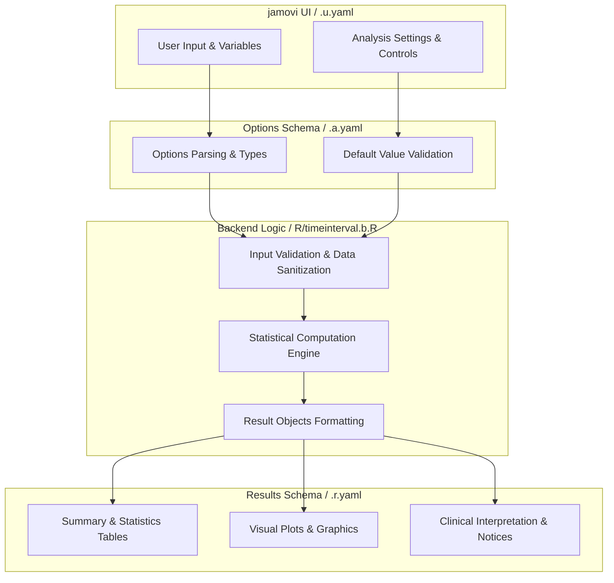
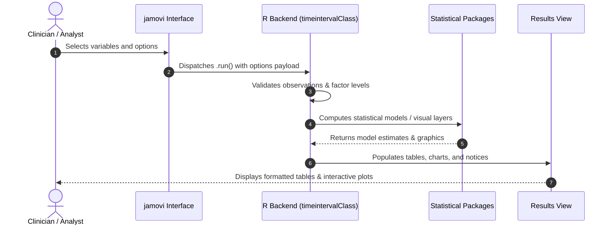

# Comprehensive Time Interval Calculator - Developer Documentation

## 1. Overview

- **Function**: `timeinterval`
- **Title**: Comprehensive Time Interval Calculator
- **Module**: `SurvivalT`
- **Files**:
  - `jamovi/timeinterval.u.yaml` - User Interface Definition
  - `jamovi/timeinterval.a.yaml` - Options & Schema Definition
  - `jamovi/timeinterval.r.yaml` - Results Layout & Tables
  - `R/timeinterval.b.R` - Backend Implementation
- **Summary**: Advanced time interval calculator designed for survival analysis, epidemiological studies,  and person-time analysis. Features intelligent date parsing, comprehensive data quality  assessment, landmark analysis, and robust statistical summaries. Time intervals form the  foundation of person-time follow-up calculations, capturing both participant counts and  observation duration for accurate incidence rate calculations.

## 1a. Changelog

- **Date**: 2026-08-29
- **Summary**: Comprehensive documentation suite created & verified against active schemas and backend implementation.

## 2. Options Reference (`.a.yaml`)

| Option | Type | Default | Description |
| :--- | :--- | :--- | :--- |
| `data` | `Data` | `NULL` |  |
| `dx_date` | `Variable` | `NULL` | Start Date Variable |
| `fu_date` | `Variable` | `NULL` | End Date Variable |
| `time_format` | `List` | `auto` | Date Format |
| `output_unit` | `List` | `months` | Time unit for results |
| `time_basis` | `List` | `standardized` | Time Basis |
| `use_landmark` | `Bool` | `FALSE` | Landmark analysis |
| `landmark_time` | `Number` | `6` | Landmark Time Point |
| `remove_negative` | `Bool` | `FALSE` | Remove negative intervals |
| `remove_extreme` | `Bool` | `FALSE` | Flag extreme values |
| `extreme_multiplier` | `Number` | `2` | Extreme threshold multiplier |
| `calculated_time` | `Output` | (n/a) | Add calculated times to dataset. A jamovi output variable driven by the Output control; not an argument of the R function. |
| `include_quality_metrics` | `Bool` | `FALSE` | Data quality assessment |
| `confidence_level` | `Number` | `95` | Confidence level (%) |
| `show_summary` | `Bool` | `FALSE` | Natural-language summary |
| `show_glossary` | `Bool` | `FALSE` | Glossary of terms |
| `timezone` | `List` | `system` | Timezone |

## 3. Results Definition (`.r.yaml`)

| Output ID | Type | Title | Description |
| :--- | :--- | :--- | :--- |
| `messages` | `Html` | `` |  |
| `todo` | `Html` | `Getting Started` |  |
| `aboutPanel` | `Html` | `About This Analysis` |  |
| `personTimeInfo` | `Html` | `Understanding Person-Time Analysis` |  |
| `qualityAssessment` | `Html` | `Data Quality Assessment` |  |
| `caveatsPanel` | `Html` | `Caveats & Assumptions` |  |
| `summary` | `Html` | `Statistical Summary & Person-Time Analysis` |  |
| `nlSummary` | `Html` | `Clinical Summary (Copy-Ready)` |  |
| `glossaryPanel` | `Html` | `Key Terms & Concepts` |  |
| `calculated_time` | `Output` | `Calculated Time Intervals` |  |

## 4. Architecture & Data Flow Diagram

## 5. Execution Sequence

## 6. Change Impact & Safety Guidelines

- **Data Filtering**: Ensure observations with missing values are handled gracefully according to analysis options.
- **Formula Conflicts**: Use isolated environment calls or base formula methods when interacting with `ggstatsplot` or formula parsers.
- **Safe Deparsing**: Use `deparse(val)` in syntax generation (`asSource()`) to escape column names with spaces or special symbols.

