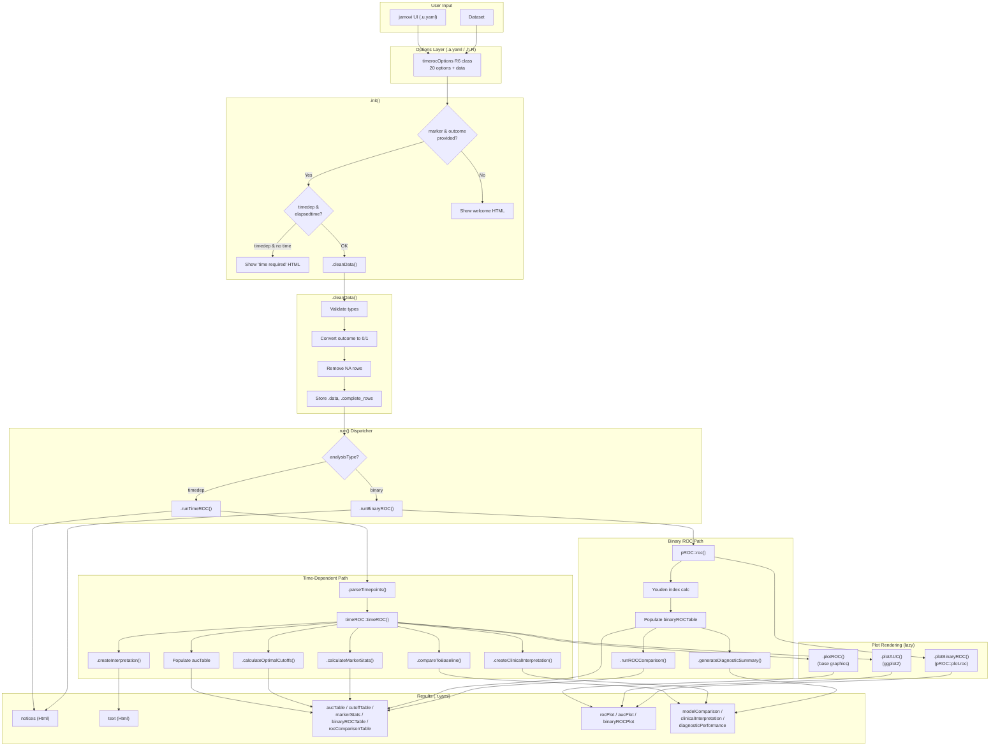
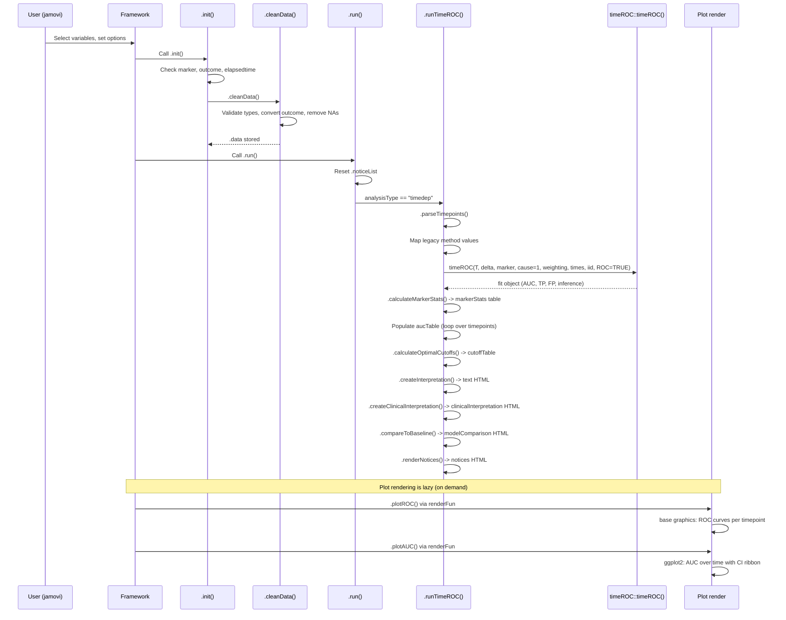
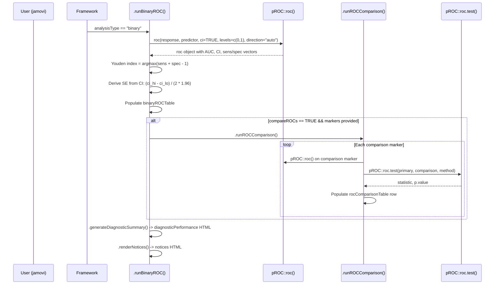
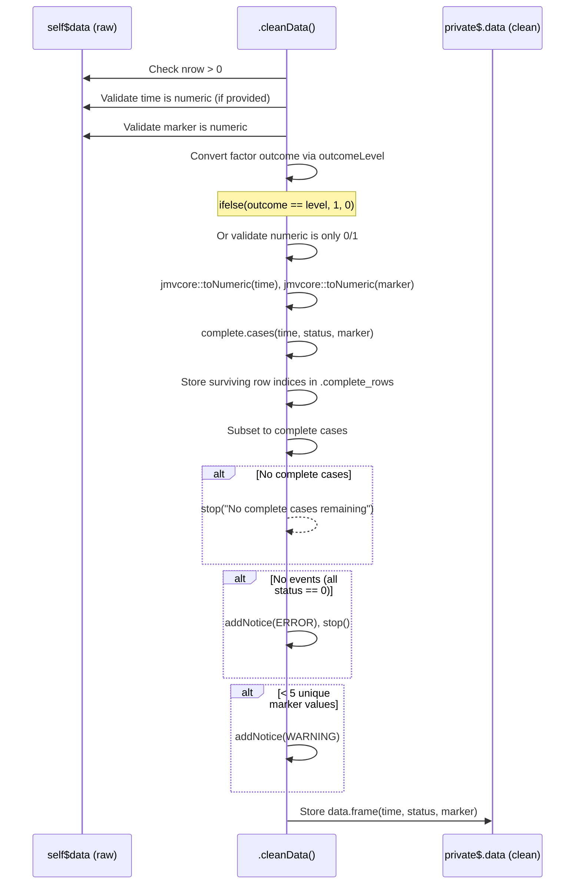

# timeroc -- Developer Documentation

> Enhanced ROC Analysis for Clinical Research (Time-Dependent and Binary)

**Module:** ClinicoPath \
**Menu:** SurvivalT > ClinicoPath Survival \
**Version:** 1.1.0 \
**Source files:**
- `jamovi/timeroc.a.yaml` -- analysis definition (options)
- `jamovi/timeroc.u.yaml` -- UI layout
- `jamovi/timeroc.r.yaml` -- results definition
- `R/timeroc.b.R` -- backend implementation
- `R/timeroc.h.R` -- auto-generated header (do not edit)
- `build/js/timeroc.src.js` -- auto-generated JS (do not edit)
- `tests/testthat/test-timeroc.R` -- test suite

---

## 1. Overview

`timeroc` evaluates how well a continuous biomarker discriminates events from non-events. It operates in two modes controlled by the `analysisType` option:

| Mode | Key package | What it computes |
|---|---|---|
| **Time-Dependent ROC** (`timedep`) | `timeROC` | Cumulative/dynamic AUC at user-specified timepoints using Inverse Probability of Censoring Weights (IPCW) |
| **Binary ROC** (`binary`) | `pROC` | Standard diagnostic ROC with DeLong CIs, optional multi-marker comparison |

Both modes produce AUC tables, ROC curve plots, optimal cutoff calculations (Youden index), and clinical interpretation narratives.

### Key dependencies

| Package | Role | Functions used |
|---|---|---|
| `timeROC` | Time-dependent AUC | `timeROC()` |
| `pROC` | Binary ROC, comparison tests | `roc()`, `auc()`, `ci.auc()`, `roc.test()`, `plot.roc()` |
| `ggplot2` | AUC-over-time plot | `ggplot()`, `geom_ribbon()`, `geom_smooth()` |
| `glue` | HTML generation | `glue()` |
| `scales` | Axis formatting | `number_format()` |

---

## 2. UI Controls to Options Map

The table below maps every UI control (from `.u.yaml`) to its `.a.yaml` option and the backend method that consumes it.

| UI Section | Control | Option name | Type | Default | Consumed by |
|---|---|---|---|---|---|
| *Variable panel* | Time Elapsed | `elapsedtime` | Variable | `null` | `.cleanData()`, `.runTimeROC()` |
| *Variable panel* | Outcome | `outcome` | Variable | `null` | `.cleanData()` |
| *Variable panel* | Event Level | `outcomeLevel` | Level (of `outcome`) | -- | `.cleanData()` |
| *Variable panel* | Marker Variable | `marker` | Variable | `null` | `.cleanData()`, all analysis methods |
| *Top-level* | Analysis Type | `analysisType` | List: `timedep` / `binary` | `timedep` | `.init()`, `.run()`, all visibility rules |
| Analysis Options | Evaluation Timepoints | `timepoints` | String | `"12, 36, 60"` | `.parseTimepoints()` |
| Analysis Options | IPCW Weighting Method | `method` | List: `marginal`/`cox`/`aalen` | `marginal` | `.runTimeROC()` |
| Analysis Options | Time Units | `timetypeoutput` | List: `days`/`weeks`/`months`/`years` | `months` | Interpretation text, axis labels |
| Analysis Options | Confidence Intervals | `bootstrapCI` | Bool | `false` | `.runTimeROC()` (iid param), `.compareToBaseline()` |
| Output Options | Plot ROC Curves | `plotROC` | Bool | `true` | `.plotROC()`, `.plotBinaryROC()` |
| Output Options | Plot AUC Over Time | `plotAUC` | Bool | `true` | `.plotAUC()` |
| Output Options | Smooth AUC Curve | `smoothAUC` | Bool | `false` | `.plotAUC()` (loess vs line) |
| Output Options | Show Optimal Cutoff | `showOptimalCutoff` | Bool | `true` | `.calculateOptimalCutoffs()` |
| Output Options | Show Marker Statistics | `showMarkerStats` | Bool | `true` | `.calculateMarkerStats()` |
| Output Options | Compare to Baseline | `compareBaseline` | Bool | `false` | `.compareToBaseline()` |
| Output Options | Calculate Youden Index | `youdenIndex` | Bool | `true` | `.runBinaryROC()` |
| ROC Comparison | Compare ROC Curves | `compareROCs` | Bool | `false` | `.runROCComparison()`, `.plotBinaryROC()` |
| ROC Comparison | Multiple Markers | `markers` | Variables | `[]` | `.runROCComparison()`, `.plotBinaryROC()` |
| ROC Comparison | ROC Comparison Method | `rocComparison` | List: `delong`/`bootstrap`/`venkatraman` | `delong` | `.runROCComparison()` |
| *(hidden)* | Number of Bootstrap Samples | `nboot` | Integer | `100` | Deprecated, kept for backward compatibility |

**UI enable rule:** `smoothAUC` is only enabled when `plotAUC` is checked (declared in `.u.yaml` via `enable: (plotAUC)`).

---

## 3. Options Reference with Downstream Effects

### Core variables

| Option | Required? | Validation in `.cleanData()` | Failure mode |
|---|---|---|---|
| `marker` | Always | Must be numeric | `stop("Marker variable must be numeric")` |
| `outcome` | Always | Factor -> 0/1 via `outcomeLevel`; numeric must be 0/1 only | `stop()` with descriptive message |
| `elapsedtime` | timedep only | Must be numeric when provided | `stop("Time variable must be numeric")` |
| `outcomeLevel` | When outcome is factor | Must be a valid level of the outcome factor | `stop("Please specify the event level...")` |

### Timepoints parsing (`timepoints`)

Parsed in `.parseTimepoints()`:
1. Split on commas, trim whitespace, convert to numeric.
2. Remove NAs, non-positive values; sort and deduplicate.
3. If all are empty or unparseable, fall back to `c(12, 36, 60)`.
4. If all parsed timepoints exceed `max(time)`, replace with time quartiles (25th, 50th, 75th percentile).
5. WARNING notice emitted when timepoints are adjusted.

### IPCW method (`method`)

| Value | `timeROC::timeROC(weighting=)` | Assumption |
|---|---|---|
| `marginal` | Kaplan-Meier IPCW | Censoring is independent of marker |
| `cox` | Cox PH IPCW | Covariate-dependent censoring |
| `aalen` | Aalen additive IPCW | Flexible non-proportional censoring |

**Legacy handling:** If `method` is one of `"incident"`, `"cumulative"`, `"static"` (from older saved analyses), it silently maps to `"marginal"` (line 492-494 in `.b.R`).

### Confidence intervals (`bootstrapCI`)

Despite the name, this does **not** use bootstrap. It passes `iid = TRUE` to `timeROC()`, which computes influence-function-based asymptotic standard errors. The `nboot` option is deprecated and hidden.

When enabled:
- `aucTable` SE and CI columns are populated.
- `modelComparison` can compute z-tests vs AUC=0.5.
- `aucPlot` CI ribbon is drawn.

When disabled:
- SE = `NaN`, CI columns = `NaN`.
- `modelComparison` shows a message asking the user to enable CIs.

---

## 4. Backend Usage -- Code Locations and Result Population

### Class structure

```
timerocClass (R6)
  inherits: timerocBase (auto-generated from .h.R)
  private fields:
    .data            -- cleaned data.frame with columns: time, status, marker
    .fit             -- timeROC::timeROC result object (timedep mode)
    .timepoints      -- parsed numeric vector of valid timepoints
    .primary_roc     -- pROC::roc result object (binary mode)
    .complete_rows   -- integer vector of row indices surviving NA removal
    .noticeList      -- list of {type, title, content} notice entries
```

### Method call graph

```
.init()
  |-> (no marker/outcome) -> show welcome HTML, return
  |-> (timedep + no time) -> show "time required" HTML, return
  |-> .cleanData()

.run()
  |-> (no data) -> return
  |-> reset .noticeList
  |-> dispatch:
       analysisType == "binary"  -> .runBinaryROC()
       analysisType == "timedep" -> .runTimeROC()

.runTimeROC()
  |-> .parseTimepoints()
  |-> timeROC::timeROC(T, delta, marker, cause=1, weighting, times, iid, ROC=TRUE)
  |-> .calculateMarkerStats()       -> markerStats table
  |-> populate aucTable              -> row per timepoint
  |-> .calculateOptimalCutoffs()     -> cutoffTable
  |-> .createInterpretation()        -> text (HTML)
  |-> .createClinicalInterpretation()-> clinicalInterpretation (HTML)
  |-> .compareToBaseline()           -> modelComparison (HTML, if enabled)
  |-> .renderNotices()               -> notices (HTML)

.runBinaryROC()
  |-> pROC::roc(response, predictor, ci=TRUE, levels=c(0,1), direction="auto")
  |-> Youden index calculation (if youdenIndex=TRUE)
  |-> populate binaryROCTable        -> single row for primary marker
  |-> .runROCComparison()            -> rocComparisonTable (if compareROCs=TRUE)
  |-> .generateDiagnosticSummary()   -> diagnosticPerformance (HTML)
  |-> .renderNotices()               -> notices (HTML)

.runROCComparison()
  |-> for each marker in self$options$markers (skipping primary):
       |-> pROC::roc() on comparison marker
       |-> pROC::roc.test(primary, comparison, method=rocComparison)
       |-> populate rocComparisonTable row

Plot render functions (called by jamovi framework):
  .plotROC(image, ggtheme, theme, ...)       -> base graphics, time-dep ROC curves
  .plotAUC(image, ggtheme, theme, ...)       -> ggplot2, AUC over time
  .plotBinaryROC(image, ggtheme, theme, ...) -> pROC::plot.roc with overlay
```

### How `.cleanData()` transforms the data

1. Validates column types (time=numeric, marker=numeric).
2. Converts factor outcome to 0/1 using `outcomeLevel`.
3. Applies `jmvcore::toNumeric()` to time and marker.
4. Removes rows with any NA in `(time, status, marker)`.
5. Stores surviving row indices in `.complete_rows` (used later by `.runROCComparison()` to align additional marker columns).
6. Stores cleaned 3-column data.frame in `.data`.

### How comparison markers are aligned

Additional markers from `self$options$markers` are fetched from the original `self$data` (not the cleaned subset). They are subset using `private$.complete_rows` to match the cleaned data rows. Then their own NAs are handled, requiring at least 10 complete cases to proceed.

---

## 5. Results Definition -- Column Schemas

### `aucTable` (Time-dependent AUC)

| Column | Type | Source |
|---|---|---|
| `timepoint` | integer | From parsed timepoints |
| `auc` | number | `fit$AUC[idx]` |
| `se` | number | `fit$inference$vect_sd_1[idx]` (NaN if `iid=FALSE`) |
| `ci_lower` | number | `max(0, auc - 1.96 * se)` |
| `ci_upper` | number | `min(1, auc + 1.96 * se)` |

### `cutoffTable` (Time-dependent optimal cutoffs)

| Column | Type | Source |
|---|---|---|
| `timepoint` | integer | Evaluation timepoint |
| `cutoff` | number | Marker value at max Youden index |
| `sensitivity` | number | TP rate at optimal cutoff |
| `specificity` | number | 1 - FP rate at optimal cutoff |
| `youden` | number | sensitivity + specificity - 1 |

### `markerStats` (Descriptive statistics)

| Column | Type | Rows |
|---|---|---|
| `statistic` | text | N, Mean, Median, SD, IQR, Min, Max, Events, Event Rate |
| `value` | text | Formatted numeric/percentage strings |

### `binaryROCTable` (Binary ROC)

| Column | Type | Source |
|---|---|---|
| `marker` | text | `self$options$marker` |
| `auc` | number | `pROC::auc()` |
| `se` | number | Derived from CI: `(ci_hi - ci_lo) / (2 * 1.96)` |
| `ci_lower` | number | `pROC::ci.auc()[1]` |
| `ci_upper` | number | `pROC::ci.auc()[3]` |
| `sensitivity` | number | At Youden-optimal threshold (NA if `youdenIndex=FALSE`) |
| `specificity` | number | At Youden-optimal threshold (NA if `youdenIndex=FALSE`) |
| `optimal_cutoff` | number | Marker threshold maximizing Youden (NA if disabled) |

### `rocComparisonTable` (Binary ROC comparison)

| Column | Type | Source |
|---|---|---|
| `comparison` | text | `"{primary} vs {other}"` |
| `method` | text | DeLong / Bootstrap / Venkatraman |
| `test_statistic` | number | `roc.test()$statistic` |
| `p_value` | number | `roc.test()$p.value` |
| `interpretation` | text | "Significantly different" or "Not significantly different" |

### HTML outputs

| Name | Mode | Content |
|---|---|---|
| `notices` | Both | Color-coded notice cards (ERROR/STRONG_WARNING/WARNING/INFO) |
| `text` | Both | Welcome message, or detailed interpretation with AUC per timepoint |
| `modelComparison` | timedep | z-test of each AUC vs 0.5 (requires `bootstrapCI=TRUE`) |
| `clinicalInterpretation` | timedep | Performance summary, trend, method explanation |
| `diagnosticPerformance` | binary | AUC interpretation scale, CI, clinical meaning |

### Image outputs

| Name | Mode | Render function | Engine |
|---|---|---|---|
| `rocPlot` | timedep | `.plotROC()` | Base graphics |
| `aucPlot` | timedep | `.plotAUC()` | ggplot2 |
| `binaryROCPlot` | binary | `.plotBinaryROC()` | `pROC::plot.roc()` (base) |

---

## 6. Data Flow Diagram



---

## 7. Execution Sequences

### 7a. Time-Dependent ROC -- Full Path



### 7b. Binary ROC -- Full Path



### 7c. Data Cleaning Sequence



---

## 8. Change Impact Guide

Use this table to understand which files and outputs you must touch when changing a specific aspect of the analysis.

### Adding a new option

| Step | File | What to do |
|---|---|---|
| 1 | `timeroc.a.yaml` | Add option definition under `options:` |
| 2 | `timeroc.u.yaml` | Add UI control in appropriate section |
| 3 | `timeroc.r.yaml` | Add to `clearWith` of any affected result items |
| 4 | `timeroc.b.R` | Consume `self$options$newOption` in relevant method |
| 5 | Run `jmvtools::prepare()` | Regenerates `.h.R` and `.src.js` |
| 6 | `test-timeroc.R` | Add test case |

### Adding a new result item

| Step | File | What to do |
|---|---|---|
| 1 | `timeroc.r.yaml` | Define new item under `items:` with type, visibility, clearWith, columns |
| 2 | `timeroc.b.R` | Populate via `self$results$newItem$addRow(...)` or `$setContent(...)` |
| 3 | Run `jmvtools::prepare()` | Regenerates `.h.R` |
| 4 | `test-timeroc.R` | Add to structure completeness test |

### Changing timeROC call parameters

| What changed | Files to update | Risk |
|---|---|---|
| `weighting` values | `.a.yaml` (method options), `.b.R` (switch logic) | Legacy method mapping in `.runTimeROC()` must be updated |
| `iid` behavior | `.b.R` only | Affects CI availability, modelComparison, aucPlot ribbon |
| `cause` parameter | `.b.R` only | Would enable competing risks (currently hardcoded to 1) |

### Changing the binary ROC comparison

| What changed | Files to update |
|---|---|
| New comparison method | `.a.yaml` (add to `rocComparison` options), `.b.R` (add case to `switch()` in `.runROCComparison()`) |
| New marker alignment logic | `.b.R` `.runROCComparison()` and `.plotBinaryROC()` -- both use `.complete_rows` |

### Visibility rule changes

All visibility is declared in `.r.yaml`. The grammar is:
- `(analysisType:timedep)` -- visible when option equals value
- `(plotROC && analysisType:timedep)` -- AND logic
- No OR logic is supported natively; use separate result items.

### clearWith dependencies (key patterns)

| Result item | Clears when these change |
|---|---|
| `aucTable` | `elapsedtime`, `outcome`, `outcomeLevel`, `marker`, `timepoints`, `method`, `bootstrapCI`, `nboot` |
| `rocPlot` | `elapsedtime`, `outcome`, `outcomeLevel`, `marker`, `timepoints`, `method`, `timetypeoutput` |
| `aucPlot` | Same as rocPlot + `bootstrapCI`, `smoothAUC` |
| `binaryROCTable` | `outcome`, `outcomeLevel`, `marker`, `youdenIndex` |
| `binaryROCPlot` | `outcome`, `outcomeLevel`, `marker`, `markers`, `compareROCs` |

**Rule of thumb:** If an option feeds into a computation, its result items must list it in `clearWith`.

---

## 9. Example Usage

### From R (wrapper function)

```r
# Time-dependent ROC
data(timeroc_test)
result <- timeroc(
    data = timeroc_test,
    elapsedtime = "FollowUpMonths",
    outcome = "Event",
    outcomeLevel = "1",
    marker = "Ki67",
    timepoints = "12, 36, 60",
    method = "marginal",
    bootstrapCI = TRUE,
    analysisType = "timedep",
    plotROC = FALSE,
    plotAUC = FALSE
)
result$aucTable$asDF
#>   timepoint   auc    se ci_lower ci_upper
#> 1        12 0.723 0.042    0.641    0.805
#> 2        36 0.681 0.038    0.607    0.755
#> 3        60 0.654 0.045    0.566    0.742

# Binary ROC
result_bin <- timeroc(
    data = timeroc_test,
    outcome = "Event",
    outcomeLevel = "1",
    marker = "Ki67",
    analysisType = "binary",
    youdenIndex = TRUE,
    plotROC = FALSE
)
result_bin$binaryROCTable$asDF
#>   marker   auc    se ci_lower ci_upper sensitivity specificity optimal_cutoff
#> 1   Ki67 0.712 0.035    0.643    0.781       0.682       0.651         18.250
```

### From R (R6 class, for testing)

```r
# Direct R6 instantiation (avoids jmvcore data-type overhead)
opts <- timerocOptions$new(
    elapsedtime = "time", outcome = "outcome", outcomeLevel = "1",
    marker = "marker1", timepoints = "10,30",
    analysisType = "timedep", plotROC = FALSE, plotAUC = FALSE,
    markers = character(0)
)
a <- timerocClass$new(options = opts, data = my_data)
a$run()
a$results$aucTable$asDF
```

### Test data

| Dataset | File | N | Markers | Use case |
|---|---|---|---|---|
| `timeroc_test` | `data/timeroc_test.rda` | 200 | Ki67, GeneScore, NoiseMarker | Primary test data (breast cancer simulation) |
| `timeroc_cancer_biomarker` | `data/timeroc_cancer_biomarker.rda` | -- | -- | Legacy test data |
| `timeroc_cardiovascular_risk` | `data/timeroc_cardiovascular_risk.rda` | -- | -- | Legacy test data |

---

## 10. Appendix

### A. Notice system

The function uses an HTML-based notice system (not `jmvcore::Notice` objects, which cause protobuf serialization errors). Notices are accumulated in `.noticeList` during execution and rendered to the `notices` HTML result item at the end of each analysis path.

Notice types and their visual styles:
| Type | Color | Use when |
|---|---|---|
| `ERROR` | Red (#dc2626) | Analysis cannot proceed |
| `STRONG_WARNING` | Orange (#ea580c) | AUC < 0.5, reversed marker direction |
| `WARNING` | Yellow (#ca8a04) | Few events, limited discrimination, adjusted timepoints |
| `INFO` | Blue (#2563eb) | Analysis complete summary |

### B. AUC interpretation scale

Used consistently in both modes:

| AUC range | Label |
|---|---|
| >= 0.90 | Excellent discrimination |
| 0.80 - 0.89 | Good discrimination |
| 0.70 - 0.79 | Fair discrimination |
| 0.60 - 0.69 | Poor discrimination |
| < 0.60 | No discrimination (random chance) |

### C. Known limitations and TODOs

1. **`TODO(m1)`** (line 121-123 in `.b.R`): Variable name escaping for columns with spaces/special characters is not implemented. Should use `jmvcore::composeTerm()`.
2. **`TODO(m2)`** (line 814 in `.b.R`): `.plotROC()` uses base graphics while `.plotAUC()` uses ggplot2. Consider migrating `.plotROC()` to ggplot2 for theme consistency.
3. **No competing risks support**: The `cause` parameter is hardcoded to `1` in `timeROC()`. Supporting `cause > 1` would require UI changes and additional result items.
4. **ROC comparison only in binary mode**: Multi-marker comparison via `pROC::roc.test()` only works in binary mode. Time-dependent multi-marker comparison is not implemented.
5. **`nboot` is deprecated but retained**: The hidden `nboot` option exists solely for backward compatibility with saved `.omv` files.
6. **SE derivation in binary mode**: Standard error is reverse-engineered from the 95% CI (`(ci_hi - ci_lo) / (2 * 1.96)`) rather than using `pROC::var()`, because the latter relies on S3 dispatch that can be fragile.

### D. File cross-reference

```
jamovi/timeroc.a.yaml  ──compile──>  R/timeroc.h.R (timerocOptions, timerocResults, timerocBase)
jamovi/timeroc.u.yaml  ──compile──>  build/js/timeroc.src.js
jamovi/timeroc.r.yaml  ──compile──>  R/timeroc.h.R (timerocResults)
R/timeroc.b.R          ──inherits──> timerocBase (from .h.R)
jamovi/0000.yaml       ──registers-> timeroc in menu: SurvivalT > ClinicoPath Survival
```

### E. Backward compatibility notes

- **Legacy method values** (`incident`, `cumulative`, `static`): Silently mapped to `marginal` in `.runTimeROC()`. This ensures `.omv` files saved with older versions still open.
- **`nboot` option**: Hidden but still accepted. Changing its value has no effect.
- **`direction = "auto"` in pROC**: The binary ROC analysis auto-detects whether higher or lower marker values indicate cases. This handles markers like albumin (lower = worse) without user intervention.
