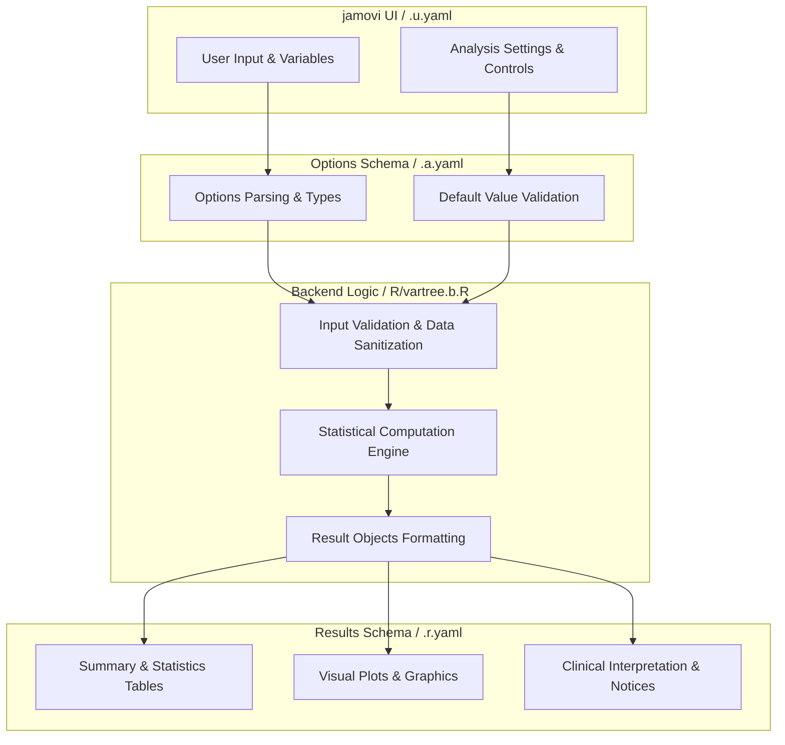
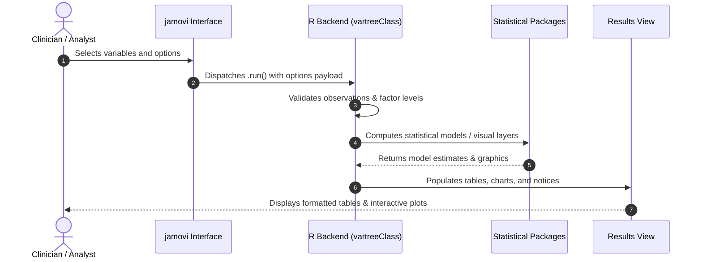

# Variable Tree - Developer Documentation

## 1. Overview

- **Function**: `vartree`
- **Title**: Variable Tree
- **Module**: `ExplorationT`
- **Files**:
  - `jamovi/vartree.u.yaml` - User Interface Definition
  - `jamovi/vartree.a.yaml` - Options & Schema Definition
  - `jamovi/vartree.r.yaml` - Results Layout & Tables
  - `R/vartree.b.R` - Backend Implementation
- **Summary**: Enhanced function for generating comprehensive tree summaries of variables. Supports current CRAN vtree package with advanced styling, statistical summaries, and interpretation features. Consolidates functionality from legacy versions with modern vtree capabilities.

## 1a. Changelog

- **Date**: 2026-08-29
- **Summary**: Comprehensive documentation suite created & verified against active schemas and backend implementation.

## 2. Options Reference (`.a.yaml`)

| Option | Type | Default | Description |
| :--- | :--- | :--- | :--- |
| `data` | `Data` | `NULL` |  |
| `vars` | `Variables` | `NULL` | Variables |
| `percvar` | `Variable` | `NULL` | Variable for percentage |
| `percvarLevel` | `Level` | `NULL` | Level |
| `summaryvar` | `Variable` | `NULL` | Continuous variable for summaries |
| `summarylocation` | `List` | `leafonly` | Summary location |
| `style` | `List` | `default` | Visual style |
| `prunebelow` | `Variable` | `NULL` | Prune below |
| `pruneLevel1` | `Level` | `NULL` | Level 1 |
| `pruneLevel2` | `Level` | `NULL` | Level 2 |
| `follow` | `Variable` | `NULL` | Follow below |
| `followLevel1` | `Level` | `NULL` | Level 1 |
| `followLevel2` | `Level` | `NULL` | Level 2 |
| `excl` | `Bool` | `FALSE` | Missing-value exclusion (NA) |
| `vp` | `Bool` | `TRUE` | Valid percentages |
| `horizontal` | `Bool` | `FALSE` | Horizontal layout |
| `sline` | `Bool` | `TRUE` | Same-line labels |
| `varnames` | `Bool` | `FALSE` | Variable names |
| `nodelabel` | `Bool` | `TRUE` | Node labels |
| `pct` | `Bool` | `FALSE` | Percentages |
| `showcount` | `Bool` | `TRUE` | Counts |
| `legend` | `Bool` | `FALSE` | Legend |
| `pattern` | `Bool` | `FALSE` | Pattern tree |
| `sequence` | `Bool` | `FALSE` | Sequence tree |
| `ptable` | `Bool` | `FALSE` | Pattern table |
| `mytitle` | `String` | `` | Root title |
| `useprunesmaller` | `Bool` | `FALSE` | Small-node pruning |
| `prunesmaller` | `Integer` | `5` | Prune counts < |
| `showInterpretation` | `Bool` | `TRUE` | Interpretation |
| `maxwidth` | `Integer` | `600` | Maximum width |

## 3. Results Definition (`.r.yaml`)

| Output ID | Type | Title | Description |
| :--- | :--- | :--- | :--- |
| `notices` | `Preformatted` | `Important Information` |  |
| `todo` | `Html` | `To Do` |  |
| `text1` | `Html` | `Variable Tree` |  |
| `text2` | `Preformatted` | `Pattern Table` |  |
| `reportSentence` | `Preformatted` | `Copy-Ready Report Sentence` |  |
| `interpretation` | `Html` | `Clinical Interpretation` |  |

## 4. Architecture & Data Flow Diagram

## 5. Execution Sequence

## 6. Change Impact & Safety Guidelines

- **Data Filtering**: Ensure observations with missing values are handled gracefully according to analysis options.
- **Formula Conflicts**: Use isolated environment calls or base formula methods when interacting with `ggstatsplot` or formula parsers.
- **Safe Deparsing**: Use `deparse(val)` in syntax generation (`asSource()`) to escape column names with spaces or special symbols.

