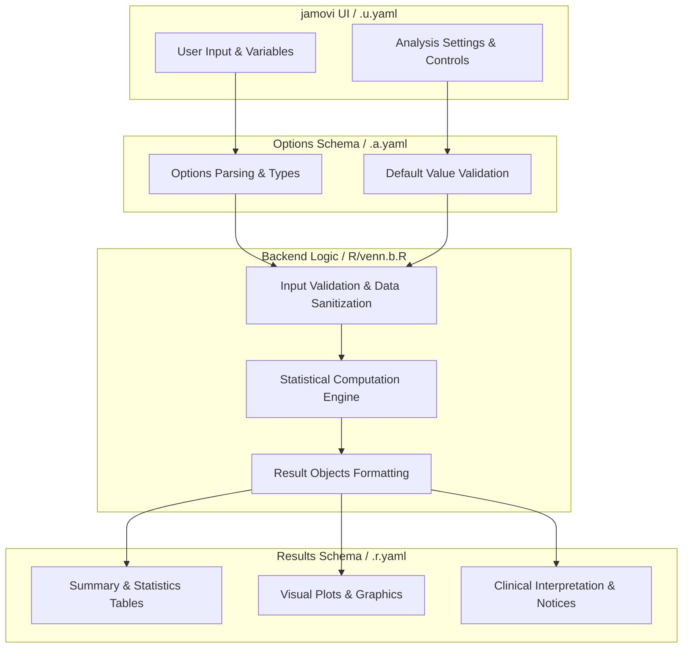
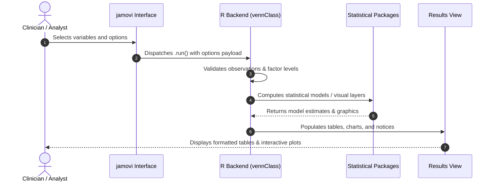

# Venn Diagram - Developer Documentation

## 1. Overview

- **Function**: `venn`
- **Title**: Venn Diagram
- **Module**: `ExplorationT`
- **Files**:
  - `jamovi/venn.u.yaml` - User Interface Definition
  - `jamovi/venn.a.yaml` - Options & Schema Definition
  - `jamovi/venn.r.yaml` - Results Layout & Tables
  - `R/venn.b.R` - Backend Implementation
- **Summary**: Analysis for Venn Diagram

## 1a. Changelog

- **Date**: 2026-08-29
- **Summary**: Comprehensive documentation suite created & verified against active schemas and backend implementation.

## 2. Options Reference (`.a.yaml`)

| Option | Type | Default | Description |
| :--- | :--- | :--- | :--- |
| `data` | `Data` | `NULL` |  |
| `var1` | `Variable` | `NULL` | Variable 1 (required) |
| `var1true` | `Level` | `NULL` | True level |
| `var2` | `Variable` | `NULL` | Variable 2 (required) |
| `var2true` | `Level` | `NULL` | True level |
| `var3` | `Variable` | `NULL` | Variable 3 (optional) |
| `var3true` | `Level` | `NULL` | True level |
| `var4` | `Variable` | `NULL` | Variable 4 (optional) |
| `var4true` | `Level` | `NULL` | True level |
| `var5` | `Variable` | `NULL` | Variable 5 (optional) |
| `var5true` | `Level` | `NULL` | True level |
| `var6` | `Variable` | `NULL` | Variable 6 (optional) |
| `var6true` | `Level` | `NULL` | True level |
| `var7` | `Variable` | `NULL` | Variable 7 (optional) |
| `var7true` | `Level` | `NULL` | True level |
| `show_upsetR` | `Bool` | `FALSE` | UpSetR plot |
| `show_complexUpset` | `Bool` | `FALSE` | ComplexUpset plot |
| `show_ggvenn` | `Bool` | `TRUE` | ggvenn plot |
| `show_ggVennDiagram` | `Bool` | `FALSE` | ggVennDiagram plot |
| `sortBy` | `List` | `freq` | Sort intersections by |
| `minSize` | `Integer` | `0` | Minimum intersection size |
| `showAnnotations` | `Bool` | `FALSE` | Percentage labels |
| `explanatory` | `Bool` | `FALSE` | All explanatory panels |
| `aboutAnalysis` | `Bool` | `FALSE` | About this analysis |
| `clinicalSummary` | `Bool` | `FALSE` | Clinical summary |
| `reportSentences` | `Bool` | `FALSE` | Report sentences |
| `assumptions` | `Bool` | `FALSE` | Assumptions |
| `shapeType` | `List` | `auto` | Venn diagram shape |
| `regionLabels` | `List` | `count` | Region labels |
| `labelGeometry` | `List` | `label` | Label style |
| `labelPrecisionDigits` | `Integer` | `1` | Percentage decimal places |
| `setNameSize` | `Number` | `5` | Set name size |
| `labelSize` | `Number` | `4` | Region label size |
| `edgeSize` | `Number` | `1` | Edge line width |
| `edgeColor` | `String` | `black` | Edge color |
| `edgeLineType` | `List` | `solid` | Edge line type |
| `edgeAlpha` | `Number` | `1` | Edge transparency |
| `fillAlpha` | `Number` | `0.5` | Fill transparency |
| `showSetLabels` | `Bool` | `TRUE` | Set names |
| `setLabelColor` | `String` | `black` | Set label color |
| `fillColorMapping` | `Bool` | `TRUE` | Fill color mapping |
| `colorPalette` | `List` | `default` | Color palette |
| `showSetCalculations` | `Bool` | `FALSE` | Set calculations |
| `calculateOverlap` | `Bool` | `FALSE` | Overlap calculations |
| `calculateDiscern` | `Bool` | `FALSE` | Unique member calculations |
| `calculateUnite` | `Bool` | `FALSE` | Union calculations |
| `showMembershipTable` | `Bool` | `FALSE` | Membership table |
| `membershipGroups` | `Output` | `NULL` | Add membership groups to data |
| `showGlossary` | `Bool` | `FALSE` | Statistical glossary |

## 3. Results Definition (`.r.yaml`)

| Output ID | Type | Title | Description |
| :--- | :--- | :--- | :--- |
| `notices` | `Preformatted` | `Important Information` |  |
| `welcome` | `Html` | `Welcome` |  |
| `todo` | `Html` | `To Do` |  |
| `summary` | `Table` | `Summary of True Counts` |  |
| `validationErrors` | `Html` | `Validation Errors` |  |
| `validationWarnings` | `Html` | `Important Warnings` |  |
| `analysisInfo` | `Html` | `Analysis Information` |  |
| `plotGgvenn` | `Image` | `ggvenn Plot` |  |
| `plotGgVennDiagram` | `Image` | `ggVennDiagram Plot` |  |
| `plotUpsetR` | `Image` | `UpSetR Plot` |  |
| `plotComplexUpset` | `Image` | `ComplexUpset Plot` |  |
| `aboutAnalysis` | `Html` | `About This Analysis` |  |
| `clinicalSummary` | `Html` | `Clinical Summary` |  |
| `reportSentences` | `Html` | `Copy-Ready Clinical Summary` |  |
| `assumptions` | `Html` | `Interpretation Guide & Assumptions` |  |
| `setCalculations` | `Html` | `Set Calculations` |  |
| `membershipTable` | `Table` | `Membership Table` |  |
| `membershipGroups` | `Output` | `Add Membership Groups to Data` |  |
| `glossary` | `Html` | `Statistical Glossary` |  |

## 4. Architecture & Data Flow Diagram

## 5. Execution Sequence

## 6. Change Impact & Safety Guidelines

- **Data Filtering**: Ensure observations with missing values are handled gracefully according to analysis options.
- **Formula Conflicts**: Use isolated environment calls or base formula methods when interacting with `ggstatsplot` or formula parsers.
- **Safe Deparsing**: Use `deparse(val)` in syntax generation (`asSource()`) to escape column names with spaces or special symbols.

