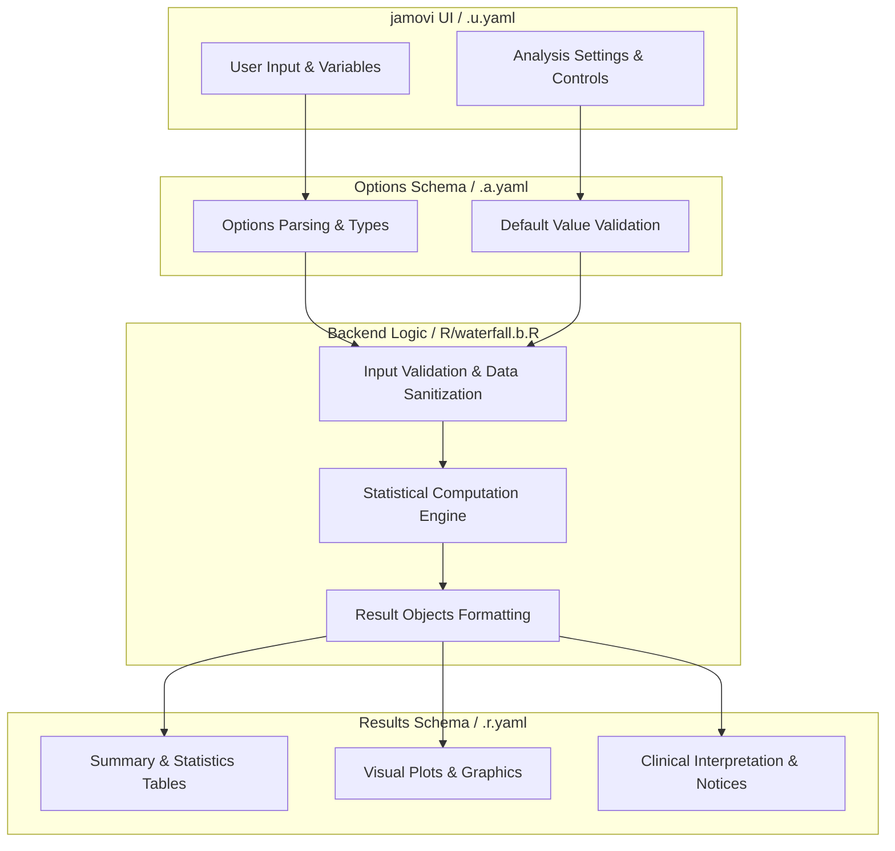
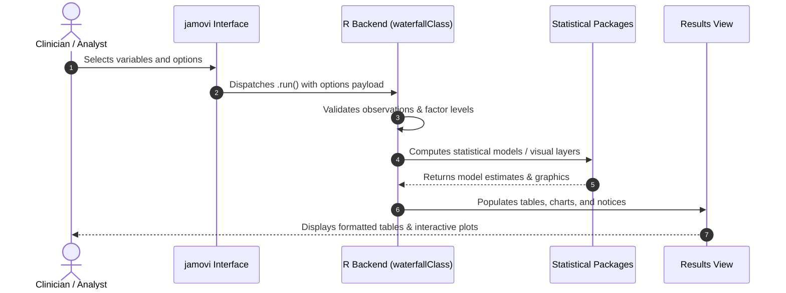

# Treatment Response: Patient-Level Burden - Developer Documentation

## 1. Overview

- **Function**: `waterfall`
- **Title**: Treatment Response: Patient-Level Burden
- **Module**: `OncoPath`
- **Files**:
  - `jamovi/waterfall.u.yaml` - User Interface Definition
  - `jamovi/waterfall.a.yaml` - Options & Schema Definition
  - `jamovi/waterfall.r.yaml` - Results Layout & Tables
  - `R/waterfall.b.R` - Backend Implementation
- **Summary**: Use this when you have one tumour burden number per patient: either a percent change from baseline you have already calculated (one row per patient), or a single measurement recorded at each visit (one row per patient per visit). It draws waterfall and spider plots, assigns each patient a best response from their largest shrinkage from baseline, and reports ORR and DCR with exact binomial confidence intervals, group comparison, time to response and duration of response. When a time variable is supplied, progression is measured against the patient's smallest recorded burden (nadir), not against baseline. Categories are named CR, PR, SD and PD and the thresholds are adapted from RECIST v1.1, but this is NOT a RECIST v1.1 implementation: because it never sees individual lesions it cannot sum target lesions, detect a new lesion, or judge non-target progression, and it cannot apply the 4-week confirmation rule itself (you may supply your own confirmation column). If your data list each lesion separately, use the lesion-level RECIST v1.1 analysis. It will be available in upcoming releases.

## 1a. Changelog

- **Date**: 2026-08-29
- **Summary**: Comprehensive documentation suite created & verified against active schemas and backend implementation.

## 2. Options Reference (`.a.yaml`)

| Option | Type | Default | Description |
| :--- | :--- | :--- | :--- |
| `data` | `Data` | `NULL` |  |
| `patientID` | `Variable` | `NULL` | Patient ID Variable |
| `responseVar` | `Variable` | `NULL` | Response Value (Raw or Percentage) |
| `timeVar` | `Variable` | `NULL` | Time Variable (Required for Spider Plot) |
| `groupVar` | `Variable` | `NULL` | Group Variable |
| `inputType` | `List` | `percentage` | Data Input Type |
| `sortBy` | `List` | `response` | Sort By |
| `sortDirection` | `List` | `conventional` | Sort Direction |
| `showBaseline` | `Bool` | `TRUE` | Baseline (Y = 0) line |
| `confirmationVar` | `Variable` | `NULL` | Confirmation Status (optional) |
| `ongoingVar` | `Variable` | `NULL` | On-Treatment / Ongoing (optional) |
| `responseCategoryVar` | `Variable` | `NULL` | Response Category Override (optional) |
| `showCategoryLabels` | `Bool` | `FALSE` | Response category above each bar |
| `showSpiderLabels` | `Bool` | `FALSE` | Patient ID labels on spider lines |
| `annotationVars` | `Variables` | `NULL` | Annotation Tracks (below the bars) |
| `showThresholds` | `Bool` | `TRUE` | RECIST thresholds |
| `labelOutliers` | `Bool` | `FALSE` | Label large changes |
| `showMedian` | `Bool` | `FALSE` | Median response |
| `showCI` | `Bool` | `FALSE` | Confidence interval |
| `minResponseForLabel` | `Number` | `50` | Minimum Response for Labels ( percent) |
| `colorBy` | `List` | `recist` | Color By |
| `colorScheme` | `List` | `jamovi` | Color Scheme |
| `barAlpha` | `Number` | `1` | Bar Transparency |
| `barWidth` | `Number` | `0.7` | Bar Width |
| `showWaterfallPlot` | `Bool` | `TRUE` | Waterfall plot |
| `showSpiderPlot` | `Bool` | `FALSE` | Spider plot |
| `spiderColorBy` | `List` | `response` | Spider Plot Color By |
| `spiderColorScheme` | `List` | `classic` | Spider Plot Color Scheme |
| `timeUnitLabel` | `List` | `generic` | Spider Plot Time Unit Label |
| `generateCopyReadyReport` | `Bool` | `FALSE` | Copy-ready report |
| `showClinicalSignificance` | `Bool` | `FALSE` | Clinical significance thresholds |
| `showConfidenceIntervals` | `Bool` | `TRUE` | Confidence intervals for clinical metrics |
| `enableGuidedMode` | `Bool` | `FALSE` | Guided analysis mode |
| `showExplanations` | `Bool` | `FALSE` | Analysis explanations |
| `showResponseDuration` | `Bool` | `FALSE` | Time-to-response & duration of response (KM) |
| `addResponseCategory` | `Output` | `NULL` | Add Response Category to Data |
| `seed` | `Integer` | `123` | Random seed |

## 3. Results Definition (`.r.yaml`)

| Output ID | Type | Title | Description |
| :--- | :--- | :--- | :--- |
| `guidedAnalysis` | `Html` | `Guided Analysis Steps` |  |
| `todo` | `Html` | `Treatment Response Analysis Guide` |  |
| `todo2` | `Html` | `Validation Messages` |  |
| `clinicalSummary` | `Html` | `Clinical Summary` |  |
| `aboutAnalysis` | `Html` | `About This Analysis` |  |
| `summaryTable` | `Table` | `Response Categories (threshold-based, not full RECIST v1.1)` |  |
| `personTimeTable` | `Table` | `Person-Time Analysis` |  |
| `clinicalMetrics` | `Table` | `Clinical Response Metrics` |  |
| `waterfallplot` | `Image` | `Waterfall Plot` |  |
| `copyReadyReport` | `Html` | `Copy-Ready Report Sentences` |  |
| `clinicalSignificance` | `Html` | `Clinical Significance Assessment` |  |
| `clinicalGlossary` | `Html` | `Clinical Terms & Definitions` |  |
| `enhancedClinicalMetrics` | `Table` | `Enhanced Clinical Response Metrics` |  |
| `groupComparisonTable` | `Table` | `Group Comparison Analysis` |  |
| `groupComparisonTest` | `Table` | `Group Comparison Statistical Test` |  |
| `spiderplot` | `Image` | `Spider Plot - Response Over Time` |  |
| `naturalLanguageSummary` | `Html` | `Treatment Response Summary` |  |
| `explanations` | `Html` | `Analysis Guide` |  |
| `responseDurationTable` | `Table` | `Time-to-Response & Duration of Response` |  |
| `addResponseCategory` | `Output` | `Add Response Category to Data` |  |
| `notices` | `Html` | `Important Information` |  |

## 4. Architecture & Data Flow Diagram

## 5. Execution Sequence

## 6. Change Impact & Safety Guidelines

- **Data Filtering**: Ensure observations with missing values are handled gracefully according to analysis options.
- **Formula Conflicts**: Use isolated environment calls or base formula methods when interacting with `ggstatsplot` or formula parsers.
- **Safe Deparsing**: Use `deparse(val)` in syntax generation (`asSource()`) to escape column names with spaces or special symbols.

